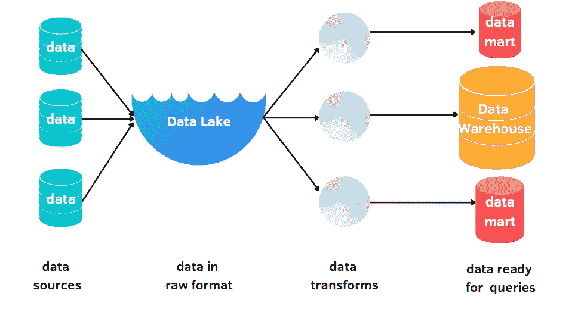
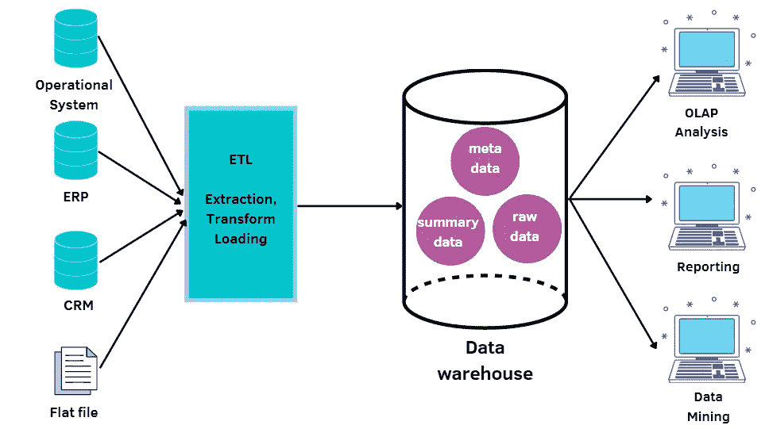
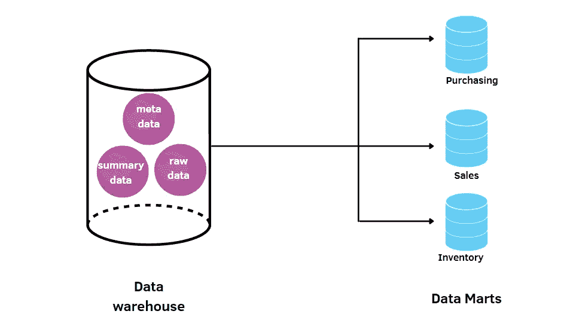
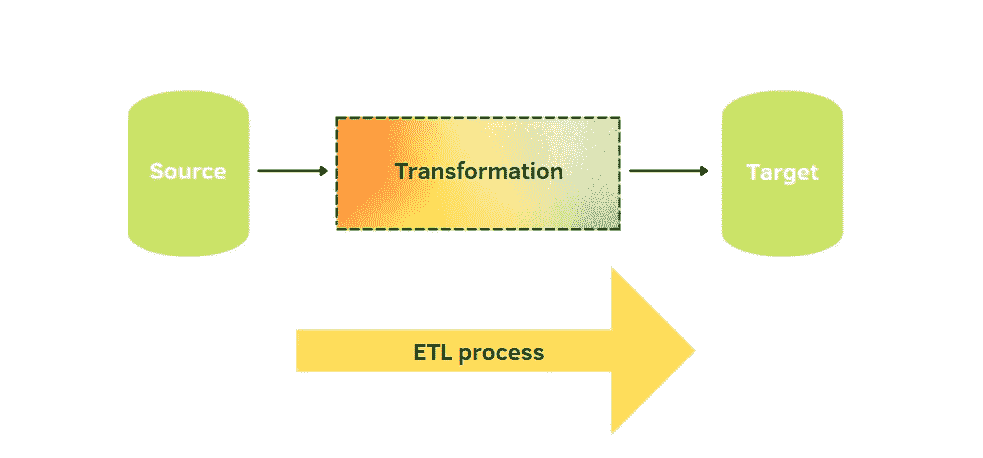
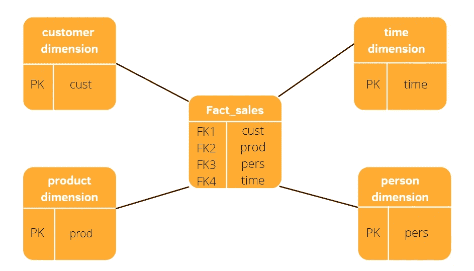
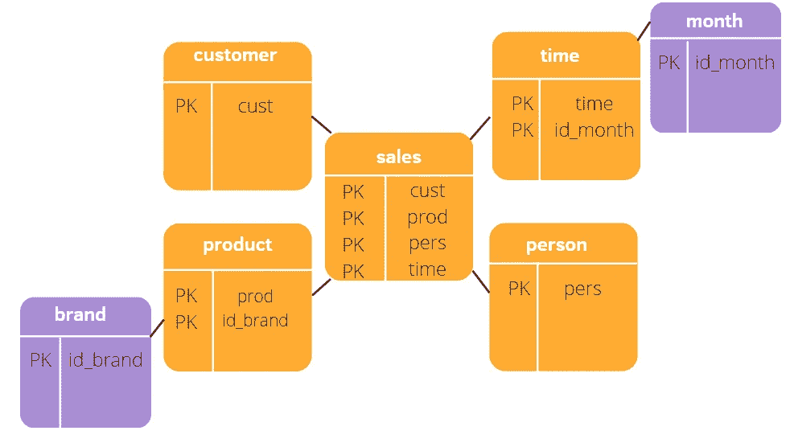
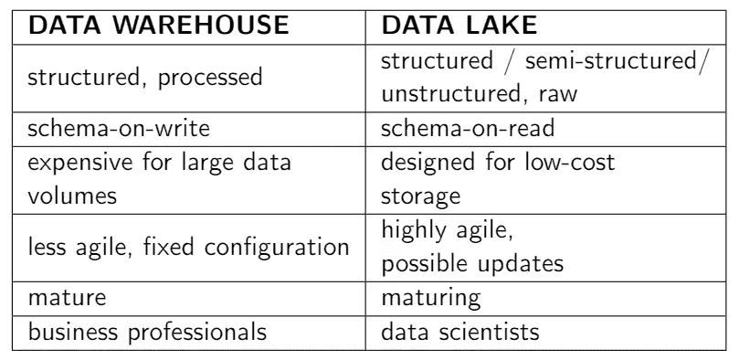
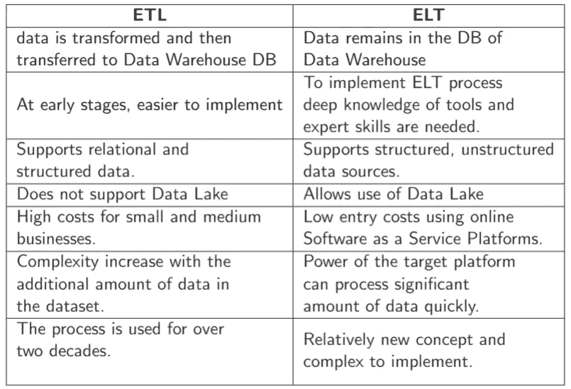

# 为什么商业智能对数据科学家有用？

> 原文：<https://pub.towardsai.net/why-is-business-intelligence-useful-for-a-data-scientist-2d9d21167e2f?source=collection_archive---------1----------------------->

## [商业智能](https://towardsai.net/p/category/business-intelligence)，[数据科学](https://towardsai.net/p/category/data-science)

## 理解数据仓库和数据湖的区别

作者插图

实际上，我在数据科学实习期间遇到了商业智能。但也不是第一次了。这种情况在之前的 ICT 公司另一类职位的实习中再次发生。在大学期间，我从来没有做过关于这个话题的课程，当互联网上有很多新概念和没有多少资源时，这并不容易理解。那么，什么是商业智能呢？为什么我们一般在上班的时候会遇到而不是在学习的时候？

**商业智能**是一门使用统计和机器学习等技术分析公司数据的学科，目的是提高竞争力。企业拥有海量的数据，需要从这些数据中提取有用的信息来提升竞争力。为此，他们投资研究，寻找能够提取这些信息的解决方案。例如，像亚马逊这样的大公司与商业智能有着密切的联系。它需要了解客户的偏好，对客户进行专门的治疗，并找到能够让客户满意的产品。

有许多自动和半自动工具来管理这种巨大的数据量。在讨论工具之前，我们需要区分需要分析的数据类型。第一种叫做**结构化**。它指的是容易从计算机中读取的数据。它们通常是数字数据，如房子的价格、人的年龄等。另一种更常见的数据类型被称为**非结构化数据**。它与计算机不能自动识别的数据有关。例如文本、图像和视频。大部分数据是非结构化的，需要进行预处理。

存储这些数据的最常见的存储库是**数据仓库**和**数据湖**。数据仓库只存储结构化数据，而数据湖同时提供两种类型的数据。在接下来的部分中，我将解释数据仓库和数据湖背后的基本概念。根据不同的目的，一个存储库比另一个更好。为了理解这些基础设施的意义，考虑这些方面是很重要的。

目录:

1.  **数据仓库**
2.  **数据集市**
3.  **OLTP vs OLAP**
4.  **ETL**
5.  **星形与雪花形模式**
6.  **数据湖**
7.  **从 ETL 到 ELT**
8.  **批处理 vs 流处理**

# 1.数据仓库

数据仓库架构。作者插图。

结构化和已经处理的数据存储在**数据仓库**【1】。数据仓库已经存在了 20 年，并在许多公司(如银行和金融公司)中构成了信息的中央存储库。这些类型的数据有一个预定义的模式。这允许进行简单的查询，但是由于某种原因需要更新以改变模式，这就变得复杂了。它使用一个过程命名的**提取转换负载** (ETL)。正如您可以从流程的名称推断的那样，它提取、转换数据，并将数据加载到存储库中。数据仓库存储三种类型的数据:

*   **元数据**是描述关于数据仓库的信息以及理解存储数据的细节的数据。
*   **汇总数据**是数据仓库的管理者生成的汇总/汇总数据。它有助于提高查询性能。
*   **原始数据**是存储在数据仓库中的未经处理的数据。

# 2.数据集市

数据仓库与数据集市。作者插图。

由于数据仓库非常大，而且构建速度不快，因此可以创建较小的存储库，称为**数据集市**。数据集市被设计成包含关于特定部门的信息，因此它们更加专门化。

# 2.OLTP 与 OLAP

**OLTP** (在线事务处理)对于管理大量事务非常有用，比如现有事务的插入、删除和更新操作。与 OLTP 不同的是， **OLAP** (在线分析处理)计划运行分析查询，从多维角度过滤和聚合数据。通常，OLTP 用于数据预处理，OLAP 用于数据分析。

# 3.抽取、转换、加载至目的端（extract-transform-load 的缩写）

ETL 过程。作者插图

正如我之前所说的，ETL 是一个允许构建数据仓库的聚合和处理过程。有三种主要操作:

*   **提取**:第一步是从各种来源提取数据，比如 CSV、JSON 和 XML 文件、非关系和关系数据库以及 API。
*   **转换:**它包括将数据转换成对查询和分析有用的格式。它包括一些操作，如清理、验证、连接、创建聚合和删除重复项。
*   **加载**:数据被保存到最终目的地，也就是数据仓库。它可能每分钟、每小时、每天或每周都会发生。加载的数据越多，分析就越精确。

# 4.星形与雪花形模式

数据仓库系统使用**多维模式** [2]保存数据。这种模式对于管理用于分析目的的大量数据非常有用。有两种广泛应用的模式。

星形模式。作者插图

第一个是星型模式。它之所以叫这个名字是因为它的结构像一颗星星。在中间，有一个**事实表**，而在其周围有**维度表**。事实表包含维度列和事实列。维度列构成了外键，这对于将事实表与维度表连接起来非常有用。这些外键是维度表的相应主键。因此，维度表和事实表之间的联接通过外键发生，而维度表不在它们之间的联接中。星型模式更容易理解，并且在存储空间方面更有效。

雪花模式。作者插图

第二种也是最后一种类型是雪花模式。它的结构类似雪花。这种方案的优点是它允许增加维度并使用较少的存储空间。但与此同时，添加更多的表会导致需要更多的查询，从而影响性能。由于这些原因，雪花模式需要更多的维护工作。

# 5.数据湖

数据仓库与数据湖的比较。作者插图。

与数据仓库不同，**数据湖**不太复杂，因为它存储所有类型的数据，原始数据、结构化数据和非结构化数据。它允许在没有模式的情况下保存数据。允许对过去、当前和未来的信息进行分析，因为数据永远不会被删除。数据湖是为低成本存储而设计的，从而消除了存储限制。

数据湖比数据仓库更新，不像数据仓库那样容易实现。每种技术都有不同的最终用户。数据湖由能够从数据中提取洞察力的数据科学家或资深专家使用，而数据仓库由业务分析师使用。此外，数据湖使用 **ELT** 过程，而不是使用 ETL 作为数据仓库[3]。

# 6.从 ETL 到 ELT

ETL 和 ELT 的比较。作者插图

**ELT** 进程代表提取、加载和转换。这是新的模式。首先，提取数据并存储在数据湖中，不做任何转换。需要时，将处理数据湖中的数据。

但是，以这种方式保存所有数据会导致内存问题和寻找有用信息的效率问题。这种方法通常应用于非 SQL 数据库，比如 MongoDB 和 Hadoop 集群。

# 7.批处理与流式处理

**批处理**是一次处理一组或一批大量数据。这些数据已经存储在过去。与批处理不同，**流式处理**对实时处理数据很有用。

批处理技术的例子有 **Azure Databricks** 和 **Azure Synapse Analytics** ，而流处理的例子有 **Apache Spark** 和 **Apache Kafka** 。当我们考虑机器学习上下文时，模型的训练通常“分批”进行。一旦 ML 模型由产品发布，它就预测流内模态。

# 最终想法:

恭喜你！现在，您已经对商业智能的主要概念有了一个概述。起初，你会看到所有这些新单词，你会担心。但是经过一些努力，你将能够澄清你的疑惑。你只需要耐心，集中注意力在基本概念上。

所有与公司数据分析有关的事情都与商业智能有关。可以使用机器学习算法从数据中提取数据信息来做出决策，这将对公司产生影响。我希望你喜欢这个指南。祝您愉快！

**参考文献:**

[1][https://panoply . io/data-warehouse-guide/3-ways-to-build-an-ETL-process/](https://panoply.io/data-warehouse-guide/3-ways-to-build-an-etl-process/)

[2][https://www.guru99.com/star-snowflake-data-warehousing.html](https://www.guru99.com/star-snowflake-data-warehousing.html)

[3][https://big 2 smart . com/data-lake-vs-data-warehouse-what-the-difference-and-the-best-data-architecture/](https://big2smart.com/data-lake-vs-data-warehouse-whats-the-difference-and-which-is-the-best-data-architecture/)

你喜欢我的文章吗？ [***成为会员***](https://eugenia-anello.medium.com/membership) ***每天无限获取数据科学新帖！这是一种间接的支持我的方式，不会给你带来任何额外的费用。如果您已经是会员，*** [***订阅***](https://eugenia-anello.medium.com/subscribe) ***每当我发布新的数据科学和 python 指南时，您都可以收到电子邮件！***