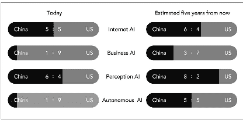

# 为什么日本的 AI 进展缓慢？

> 原文：<https://pub.towardsai.net/why-is-japanese-ai-progression-slow-2103d7e8c01f?source=collection_archive---------3----------------------->

## 日本的 AI 进展| [走向 AI](https://towardsai.net)

## 木已成舟…

人工智能和深度学习不仅仅是“流行语”。这些技术已经开始对现实世界产生影响，特别是在工业中，即自动化、预测、感知等等。

从全球角度来看，在人工智能领域取得进步的国家领导者是美国和中国，但下一只亚洲虎会是什么样的呢？日本正在努力将人工智能、机器学习和深度学习技术进步应用到商业世界。这是由日本传统的商业促销、雇佣和管理制度造成的。这种传统的系统阻碍了日本企业产生新的人工智能想法、实施等等。

本文将试图揭示日本人在商业世界接受人工智能技术进步的隐藏原因。

## AI 世界 Top 2；美国和中国——日本有可能吗？

“[人工智能超能力](https://aisuperpowers.com/)的作者李开复博士是世界上最受尊敬的人工智能专家之一。他有意义的工作源于他在中国的经历和在美国接受的教育。这本鼓舞人心的书告诉我们美国和中国的人工智能实现水平如下。

**图。美国对中国的人工智能，来源:人工智能超级大国，2018 年版，作者李开复**

在商业人工智能和自主人工智能方面，中国正在追随美国；然而，它无疑将在五年内对美国增长。更戏剧性的变化将发生在互联网人工智能、感知人工智能和自主人工智能方面，以赶上并击败美国。很长一段时间，中国一直是一个优秀的硬件生产基地，创造 IC 或[转换器](https://jp.rs-online.com/web/c/semiconductors/data-converters/general-purpose-adcs/)来支持日本 20 世纪 80 年代的制造业。然而，我们要说的一个对日本人来说令人悲伤的消息是，他们已经把人工智能领导者的地位拱手让给了中国。当然，越来越多的日本企业公司试图利用强大的人工智能/深度学习技术进行创新，其中大多数公司都在为此而努力。

[Yutaka Matsuo](http://ymatsuo.com/)博士是日本著名的学术人工智能研究人员之一，在东京大学( [UT](http://www.u-tokyo.ac.jp/index_e.html) 担任教授，在人工智能方面做出了贡献，尤其是在深度学习和数据挖掘方面。他明确提出了一个观点，在开复博士的书中，日本从来没有完全提到过，那就是日本的问题。这意味着日本在人工智能/深度学习在工业中的实际应用方面没有达到与美国和中国相同的阶段。尽管 Matsuo 博士认为日本未来将能够在感知人工智能和商业人工智能领域加快速度并变得更强，但这可能需要很长时间才能实现。

## 一个日本老时尚方案导致 AI 慢吗？

你听说过日本的**论资排辈** / **终身雇佣**或**大规模招聘应届毕业生**吗？这些不是基于个人的个性知识和技能，而是估计为“你为公司工作了多少年？”(意思是时间越长越好)和“你能对一个公司有忠诚度吗？”。这些旧计划自 20 世纪 60 年代以来一直存在。

这些传统规则用尖端技术扼杀了高世代。因此，2019 年 5 月，日本商业联合会会长平冈拓晃·中西宣布这些遗产应该在几年内改变。**终身雇佣**让很多保守以 AI /深度学习改变的管理人员在公司待的时间更长，也阻止了年轻的孵化器释放伟大的创意。如果日本的人力资源系统发生巨大变化，这将有助于管理者改变思维模式，并为技术敞开大门。

另一方面，日本已经发生了有希望的变化。伊藤忠商事株式会社是最大的传统贸易公司之一。巨头公司[宣布](https://www.itochu.co.jp/en/ir/news/2019/__icsFiles/afieldfile/2019/06/12/ITC190612_1_E.pdf)为孵化市场建立一个全新的小部门，仅由 40 名年轻员工组成。他们都雄心勃勃，不到 30 岁，有能力尝试创新项目。这被认为是伊藤忠获得了以市场为导向的新鲜空气，并更多地利用人工智能/深度学习等新技术。

许多强大的东亚国家围绕着日本。为了赶上他们并创造更多，除了回头看看日本组织的传统，以提出更好的战略来利用商业中的人工智能技术，别无选择。是的，已经决定了。

我们将密切关注日本的技术挑战和变化。

*本文原载于* [*向艾*](https://towardsai.net/p/machine-learning/why-is-japanese-ai-progression-slow/stanfordai/3402/) *。*