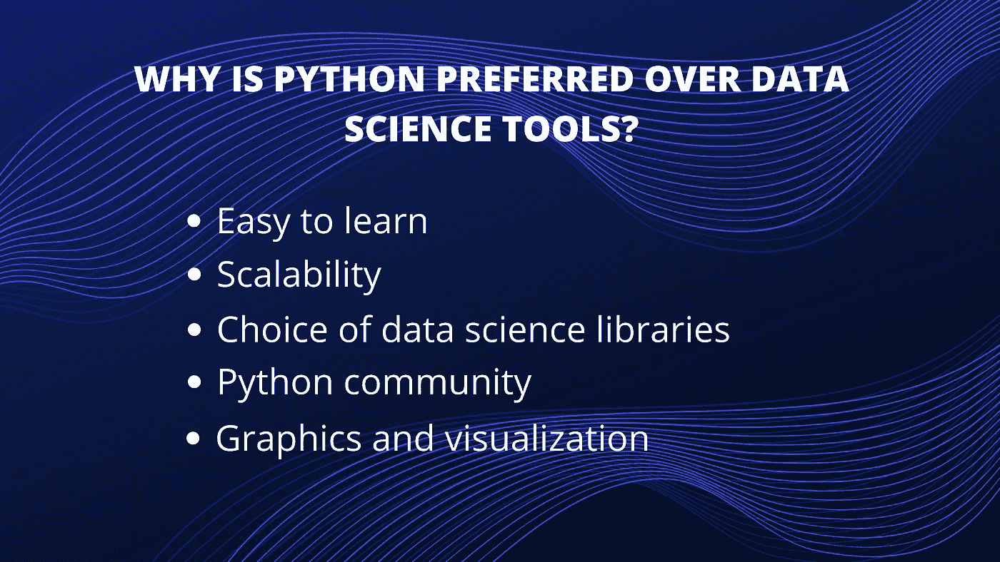

# 为什么 Python 在数据科学家中如此受欢迎？

> 原文：<https://pub.towardsai.net/why-is-python-so-popular-among-data-scientists-2b926742eebd?source=collection_archive---------2----------------------->

## [数据科学](https://towardsai.net/p/category/data-science)

## 您的组织的智能取决于您可以访问的数据。

> 从海量数据中提取洞察力的能力决定了您企业的成功。这是数据科学家和分析师解释数据并获得见解以帮助识别机会和做出战略决策的地方。

为了有效地分析数据，数据科学家需要配备最好的分析、报告和可视化工具。C、C++、Java、Javascript 等语言有助于理解数据。但是像 R 和 Python 这样的流行语言在成功完成*数据科学和机器学习*工作方面提供了无与伦比的价值。

# 数据科学中最流行的编程语言是哪一种？

那是一个很难回答的问题。随着越来越多的语言为执行数据科学工作提供了急需的选项，挑选一种特定的语言并不是一件容易的事情。但正是数据让我们得以一窥在数据科学领域取得进展的语言——没有什么比与 [**数据科学工具**](https://marutitech.com/data-science-useful-businesses/) 的比较相关的数据揭示结果更令人信服的了。根据 [KDnuggets](http://www.kdnuggets.com/2016/06/r-python-top-analytics-data-mining-data-science-software.html) 对顶级分析/数据科学工具的调查，R 仍然高居工具排行榜之首。但是与前一年相比，Python 所占份额的百分比变化尤为突出。

Python 在 2015 年的份额增长了 51%，证明了其作为流行的数据科学工具的影响力。

# Python 成为领导者

有抱负的数据科学家正在为选择最佳数据科学工具而争论不休。尽管有相当多的数据科学工具提供了急需的选项，但是两种流行语言——Python 和 r——之间的激烈竞争已经缩小了。

> 在 R 和 Python 之间，后者正在成为数据科学应用中使用较多的流行语言。

以科技巨头谷歌为例，它创建了一个名为 [TensorFlow](https://www.tensorflow.org/) 的深度学习框架——Python 是用于创建该框架的主要语言。在网飞倡导的环境中，它的足迹不断增加。脸书和可汗学院的制作工程师长期以来一直将英语作为他们环境中的一种重要语言。

Python 还有其他优势，可以加速它向数据科学工具顶端的上升。它可以与大多数云以及平台即服务提供商很好地集成。在支持并行计算的多处理方面，它带来了确保数据科学和机器学习的大规模性能的独特优势。Python 也可以用 C/C++编写的模块来扩展。

# Python 成为了完美的选择

在一些定制的情况下，它是工作的最佳数据科学工具。当数据分析任务涉及到与 web 应用程序的集成时，或者当需要将统计代码合并到生产数据库中时，它是完美的。Python 成熟的编程特性使它非常适合实现算法。

它的软件包植根于特定的数据科学工作。像 NumPy、SciPy 和 pandas 这样的软件包为数据分析工作提供了良好的结果。虽然需要图形，但 Python 的 matplotlib 是一个很好的包，对于机器学习任务，scikit-learn 成为理想的替代品。

# 为什么 Python 比其他数据科学工具更受青睐？

当代码以流畅和自然的风格编写时，它就是“Pythonic 式的”。除此之外，它还因其他吸引了数据科学界想象力的特性而闻名。

*   **简单易学**

Python 最吸引人的地方在于，任何渴望学习这种语言的人都可以轻松快速地学习它。与其他数据科学语言(如 R)相比，Python 促进了更短的学习曲线，并通过促进易于理解的语法而优于其他语言。

*   **可扩展性**

与 R 等其他语言相比，Python 作为一种可扩展的语言已经确立了领先地位，并且它比 Matlab 和 Stata 等其他语言更快。Python 的可伸缩性在于它提供了解决问题的灵活性，就像 YouTube 迁移到 Python 的例子一样。Python 在不同的行业中有不同的用途，也适合各种应用程序的快速开发。

*   **选择数据科学库**

推动 Python 发展的重要因素是面向有志之士的各种数据科学/ [*数据分析*](https://marutitech.com/trends-data-analytics-bi/) 库。Pandas、StatsModels、NumPy、SciPy 和 Scikit-Learn 是数据科学社区中众所周知的一些库。Python 并没有止步于此，因为库已经随着时间的推移而增长。一年前您认为是一个约束的问题将会被 Python 很好地解决，它提供了一个健壮的解决方案来解决特定性质的问题。

*   **Python 社区**

Python 的惊人崛起的原因之一要归功于它的生态系统。随着 Python 向数据科学社区延伸，越来越多的志愿者正在创建数据科学库。这反过来又引领了用 Python 创建最现代的工具和处理的方式。

广泛参与的社区促进了希望找到编码问题解决方案的有志之士的轻松访问。无论你需要什么样的查询，只需点击或谷歌搜索。爱好者也可以在 Codementor 和 Stack Overflow 上找到专业人士，为他们的疑问找到正确的答案。

*   **图形和可视化**

Python 提供了各种可视化选项。Matplotlib 提供了一个坚实的基础，围绕这个基础构建了其他库，如 Seaborn、pandas plotting 和 ggplot。可视化软件包可以帮助您更好地理解数据，创建图表、图形绘图，以及创建可用于 web 的交互式绘图。

# Python 是机器学习的“工具”吗？

就数据科学而言，机器学习是用来最大限度地发挥数据价值的重要元素之一。使用 Python 作为数据科学工具，探索机器学习的基础变得简单而有效。简而言之，机器学习更多的是关于统计、数学优化和概率。它已经成为最受欢迎的[机器学习工具](https://marutitech.com/machine-learning-predictive-analytics/)，因为它可以让有志之士轻松“做数学”。

> 另请阅读[2020 年影响移动应用开发的 12 大趋势](https://blog.goodaudience.com/top-12-trends-shaping-mobile-application-development-in-2020-85cdfaf81ffb)

说出任何一个数学函数，你就有了一个满足要求的 Python 包。有用于数值线性代数的 Numpy，用于凸优化的 CVXOPT，用于一般科学计算的 [Scipy](https://www.scipy.org/) ，用于符号代数的 [SymPy](https://www.sympy.org/en/index.html) ，用于统计建模的 PYMC3 和 Statsmodel。

通过掌握包括逻辑回归和线性回归在内的机器学习算法的[基础，它可以通过其 scikit-learn 库轻松实现用于预测的机器学习系统。利用包括 Keras、Theano 和 TensorFlow 在内的库，很容易为神经网络和深度学习进行定制。](https://marutitech.com/artificial-intelligence-and-machine-learning/)

数据科学领域正在快速变化，用于从数据科学中提取价值的工具也在不断增加。争夺头把交椅的两种最流行的语言是 R 和 Python。

两者都受到发烧友的崇敬，两者各有优缺点。但是随着谷歌这样的科技巨头展示使用 Python 的方法，以及学习曲线变得短而容易，它将成为数据科学世界中最受欢迎的语言。