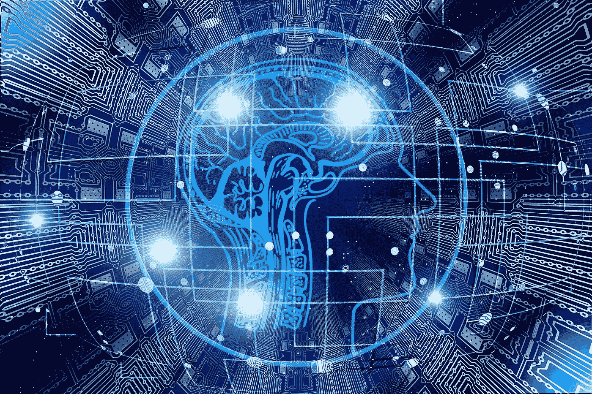

# 为什么 Python 是 AI 和数据科学的理想编程语言？

> 原文：<https://pub.towardsai.net/why-is-pythons-programming-language-ideal-for-ai-and-data-science-e3f75a5d0e2b?source=collection_archive---------0----------------------->

图片由[杰洛特](https://pixabay.com/users/geralt-9301/)在[皮克斯贝](https://pixabay.com/)拍摄

## Python 是当今 AI 和数据科学的首选编程语言吗？如果是，那么让我们学习这篇文章中的逻辑原因，以及为什么它是程序员的理想选择？

毫无疑问，自从计算机被发明以来，人工智能和数据科学是这个时代最先进的方法，并将各种行业推向更高的水平。

> 你有没有意识到这样一个事实，现在你的应用程序可以听到，看到并回应你的查询？这不正是你对基于人工智能和数据科学的项目的期望，以满足行业的未来需求吗？

如果你的答案是肯定的，那么你可能会面临两个关键问题:如何将这些技术集成到你的业务中，以及你需要为人工智能和数据科学考虑的最佳编程语言是什么？考虑用 Python 做 AI 和数据科学！

然而，你们中的许多人想知道，为什么我在这里爱上了 Python，并考虑将它用于人工智能和数据科学，而不是其他流行的编程语言，包括 PHP、Swift、JavaScript……？它与其他语言有什么不同？

**为了更深入地理解这个概念，这里为你列出了这篇博客已经涉及的要点:**

> Python 是什么？
> 
> Python 是人工智能和数据科学的领先语言
> 
> 为什么它被认为是当今最强大的编程语言？
> 
> Python、人工智能和数据科学的用例

著名的电气工程教授哈尔·阿伯尔森说:“一种强大的编程语言不仅仅是指导计算机执行任务的一种手段。语言也作为一个框架，在这个框架内我们组织我们关于过程的想法”。Python 编程语言也是如此！

> 让我们学习，如何？

## 了解 Python 的基础知识

Python 是一种简单易学、易于访问的面向对象编程语言，由 Python 之父 Guido Van Rossum 于 1989 年 12 月发布。

多年来，在选择编程语言方面，Python 一直统治着移动应用程序开发行业——易于使用、具有开源许可和简单的可访问性。此外，Python 被认为是一种流行的语言，因为它为社区和示例程序提供了出色的支持。

此外，Python 是一种独特的编程语言，许多 [**网络开发公司**](https://www.xicom.biz/offerings/web-development/) 广泛使用它来开发应用程序，从基于 GUI 的程序、人工智能到大数据科学系统。

此外，源代码中广泛标准库的可用性使程序员能够根据他们的业务需求定制应用程序。

> 然而，你知道是什么让程序员爱上 Python 的吗——它不断提高的生产力？

而编辑、测试和调试周期比其他语言快得多；因此，Python 被 web 开发公司认为是最有潜力的语言。

## Python 是数据科学和人工智能的完美语言吗？

图片由[杰洛特](https://pixabay.com/users/geralt-9301/)在 [Pixabay](https://pixabay.com/) 拍摄

最近，“数据”已经成为未来技术的强大工具，包括数据科学和人工智能。而且，通过牢记最新的市场趋势，现在企业的成功极大地取决于从复杂的数据结构中获取有意义的见解的能力。这就是数据科学发挥作用的地方，它简化事情，并帮助您从无与伦比的数据中提取正确的见解。

> 但是尾巴最大的转折出现在这里！

我们需要最好的工具来利用这种技术将原始数据转换成合适的可视化格式。有一些流行的编程语言，包括 PHP、JavaSCript、C++，可以用来解释数据的含义。然而，Python 的灵活性、简单性和多功能性是无与伦比的。今天，它在将数据科学和人工智能引入未来的应用程序开发项目中发挥着重要作用。

> [*根据《商业百老汇调查报告 2019*](https://businessoverbroadway.com/2019/01/13/programming-languages-most-used-and-recommended-by-data-scientists/) *，Python 已经成为执行数据科学和人工智能任务急需的编程语言。每 4 名数据专业人士中就有 3 人建议有志成为数据分析师的人首先学习 Python，以便将数据见解转化为报告格式。*

虽然数据科学和人工智能主要基于您用于任务的数据的质量和数量，因此，Python 成熟的编程特性使其非常适合将统计代码和算法合并到生产数据库中。

> Python 的包，包括 NumPy、SciPy 和 Pandas，已经成为为数据分析任务产生良好结果的最佳包。

# Python 作为人工智能的领先编程语言

好了，这就是我们读到的关于为什么 Python 在数据科学领域铺平道路的全部内容。现在让我们把 Python 理解为 AI 的领先编程语言…

有了编程语言库，你们可以开发基于人工智能的应用程序，你们中的许多人会惊讶地知道我为什么选择 Python。那么 Python 有什么大不了的？

Python 提供了大量的内置库，这些库影响了 Python 在人工智能领域迅速传播的事实。人工智能和机器学习的广泛框架和库，使其成为 [**人工智能开发公司**](https://www.xicom.biz/latest-thinking/artificial-intelligence/) 最首选的语言。一些流行的库是 Tensorflow、Pylearn2、Scikit learns，这个列表还在继续。

其次，Python 以其健壮、易于实现和庞大的社区而闻名。即使是有基础知识的程序员也能接触到这种语言并创造奇迹。

## 为什么 Python 突然变成了小菜一碟？

多年来，在多种语言中选择最佳编程语言是程序员之间当前争论的问题之一。然而，你的首选语言无疑是你最容易掌握的语言，它能让你高效地完成工作。Python 就是这样一种编程语言。

## Python 重要有用吗？

这种编程语言的简单性和多功能性使它成为初学者和专家的理想选择。其次，它的可读性使它成为一种杰出的编程语言，并允许你像程序员一样思考，而不是用复杂的语法把你弄糊涂。想象一下，你将如何用 Python 和 PHP 编写“早安”的代码。

> 还是不同意？让我们深入挖掘其中的原因:

## 1.简单易懂

Python 是初学者友好的语言，同时，让专家能够利用编写的简单性开发复杂的应用程序。如果你在寻找编程语言领域的敲门砖，那么 Python 是你理想的选择。因为这种语言与日常英语非常相似，尽管许多开发人员发现它很容易写、读和理解。而 Python 的代码比 Java 短 10 倍，所以基本任务可以用更少的代码完成。

## 2.Python 是动态的和广泛的

既然通俗易懂，使用简单，并不意味着仅限于简单的任务。这种语言的广泛性和多功能性允许您无缝地管理跨语言操作，没有任何障碍。从构建 API 到开发自动化消息传递机器人，你可以用 Python 做任何事情。

此外，最好的部分是 Python 会原谅你的错误，允许你运行你的程序，尽管是在修复问题区域。

## 3.兼容在所有平台上运行

图片由 [Kreatikr](https://pixabay.com/users/kreatikar-8562930/) 在 [Pixabay](https://pixabay.com/) 拍摄

你知道为什么很多公司更愿意 [**雇佣网络开发人员**](https://www.xicom.biz/offerings/hire-web-developers/) 来满足他们的开发需求吗？

此外，Python 是一种用户友好的语言，兼容所有平台，可以在任何地方运行。无论是 Windows、Unix 还是 Linux，您都可以在任何平台上无缝地访问这种语言。

## 4.Python 有活跃的支持性社区

无论您是刚刚步入编程世界，还是雇佣 Python 开发人员，您都将获得广大社区的支持。社区越大，你就能从社区获得越多的支持。它们可以帮助您开发有用的工具，并帮助您轻松管理开发过程。

不管你有多少年的开发经验，总会有需要帮助或支持的时候。而且 python 的开发者社区真的很活跃！有大量的教程、指南和文档为初学者和专家提供实时帮助。

## 5.Python 是高效的

> *每个人都熟悉这样一个事实，即最近的技术正朝着“大数据科学”方向急转直下。你们中的许多人想知道为什么我在这里提到这个术语。和 Python 有关系吗？*

是的，如今，它肯定会迅速成为许多数据科学家的主导语言。随着 Python 数字引擎(如 Panda 和 Numpy)的发布，各种事情的处理变得更加简单易懂。从一次获取一个源数据到将它传递到整个处理链，使用 Python 生成器似乎是一项简单的任务。

# Python、数据科学和人工智能的用例——改变世界

> 亚马逊、沃尔玛、阿里巴巴、易贝:用数据科学改变电子商务

从奠定基础的那一天起，这些顶级电子商务品牌就努力成为用户的一站式平台。那么，是什么让他们成为电子商务的主导领导者呢？

他们大量使用数据科学、数据挖掘和人工学习来理解和监控用户行为，包括购物偏好、产品选择和预算。所有这些收集的数据有助于他们做出真实的预测，他们进一步利用这些预测来维持库存，并提供类似的产品，以提供个性化的购物体验。

## 网飞、亚马逊 Prime、Vudu:电视的无声死亡

你有没有想象过，你可以使用这样的娱乐应用程序来取代你的电视？数据科学、机器学习、人工智能让你有了可能。有了网飞、Vudu、亚马逊 Prime 等应用，你可以在自己喜欢的时间，在自己选择的网络连接良好的设备上观看自己选择的视频。数据科学有助于网飞了解用户的观看模式、喜好和厌恶，并据此建议观看相关内容。

## 美国银行、HDFC、安讯士银行:用人工智能聊天机器人定制客户体验

世界领先的银行正在利用数据科学、人工智能和人工智能来增强用户体验，并为客户提供即时帮助。聊天机器人是各种业务中最具创新性和最先进的应用。有了有用的见解和公司数据，聊天机器人不仅可以立即回复您的查询，还可以防止信用卡、会计和保险方面的欺诈。

# 结尾注释

希望你能理解为什么 Python 被认为是数据科学和人工智能要求最高的语言。

由于 Python 附带了多个可视化选项并提供了广泛的库选择，这使得 [**软件开发公司**](https://www.xicom.biz/) 更容易从数据中获得最大价值。使用 Python 作为潜在的数据科学工具，探索数据科学和人工智能的基础变得更加容易。新手和专家都可以通过最小的学习曲线来访问这种数据科学和人工智能语言，并缩短计算时间。

在下面的评论中让我们知道你对这种用于人工智能和数据科学的编程语言的看法。