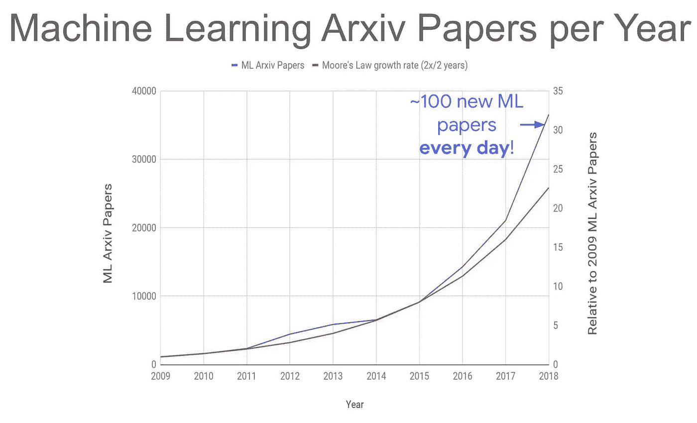

# 为什么做一个 ML 研究员或者开发者超级难？

> 原文：<https://pub.towardsai.net/why-its-super-hard-to-be-an-ml-researcher-or-developer-67fa62fc1971?source=collection_archive---------1----------------------->

## [职业](https://towardsai.net/p/category/careers)，[数据科学](https://towardsai.net/p/category/careers)，[机器学习](https://towardsai.net/p/category/machine-learning)

## 这一认识彻底改变了我的生活

来源:图片由作者提供(使用 Canva 制作)

听一听，读一读

根据统计数据，目前每年有 33，000 篇 ML 研究论文被发表。也就是说，每天大约有 90 多篇论文！几乎每一篇论文都介绍一些新的东西，没有例外。

来源:“深度学习解决挑战性问题”(谷歌 AI)

作为一名“人工智能爱好者”，我试图获得尽可能多的论文的简要(或粗略的想法)，以保持自己在行业中的更新。但说实话，感觉有点力不从心。

更糟糕的是，我最近听到了一个“故事”,它改变了我作为 ML/DL 开发人员的生活。

**警告:**我即将与你分享的内容可能会扰乱你作为一名 ML 研究者/开发者的职业生涯，或者让你深感焦虑。所以，听我的推理直到最后。

> 你可能喜欢它，也可能讨厌它，但你不能忽视它

在意识到我上面提到的事情后，我已经在想，“我是不是浪费了很多时间在 ML 研究上？我能做些更有用的事情吗？”。然后…

# 改变我生活的故事

几个月前，我看到了哈佛大学政治学教授 Gary King 的真实故事，他开始研究文档聚类问题，并把一份纪念一位学者的文集作为退休礼物送给了他的一位同事。

为此，他要求他的研究生利用所有发明的聚类算法。对于了解这些的人来说，聚类是机器学习和统计领域一个非常老的问题。因此，在文献中有大量的方法可以应用，他们发现了大约 250 种算法。

为了比较所有算法的效率，他们编写了一个 R 包，他们发现了什么？有没有绝对“最好”的算法？

没有。显然不是。

正如所料，每种方法都有不同的效果。他们无法决定哪种算法是最好的，最后，他们让用户选择他们自己认为有用的结果。

那么我学到了什么？

# 仔细听

在这里，我使用聚类描述了这种情况，但同样的论点可以用于任何问题——可能是强化学习、深度学习、监督学习、非监督学习或任何其他问题。

目前，我非常确定仅 SGD(随机梯度下降)就有一百多种变体，这是深度学习的一个组成部分。

这让我感到害怕(即使我在这个领域有一些经验)。

它让我提出了这样一个问题:*我是否应该把时间花在发明第 251 个聚类算法上？*

我们都知道 ***荣耀归于开拓者*** 。某样东西的每一个下一个版本得到的信任越来越少(比如一个[子模块集合函数](https://en.wikipedia.org/wiki/Submodular_set_function))；收益递减法则适用。

在 Ian Goodfellow 发明了 [GANs](https://en.wikipedia.org/wiki/Generative_adversarial_network) (生成对抗网络)之后，出现了一百多种 GAN 变体。每个人都被他们吸引并做出了贡献，但不幸的是，只有少数人得到了一些认可。伊恩·古德菲勒将永远是甘宇宙的中心。

所以我再问你一次，*发明第 251 个聚类算法或者第 101 个 SGD 变种真的值得吗？*

# 曼梯·里悲剧

来源:图片由作者提供(使用 Canva 制作)

我告诉过你，没有永远幸福的生活。

搜索与优化中有一套定理叫做，“ [**没有免费的午餐定理**](https://en.wikipedia.org/wiki/No_free_lunch_in_search_and_optimization) ”(说真的，不开玩笑)准确的描绘了我们的处境。让我引用维基百科上的话:

> 在计算复杂性和优化中,**没有免费的午餐定理**是一个结果，它表明对于某些类型的数学问题，找到一个解决方案的计算成本，平均到该类中的所有问题，对于任何解决方法都是相同的。**因此，没有任何解决方案能提供“捷径”。**这是在假设搜索空间是概率密度函数的情况下。它不适用于搜索空间具有比随机搜索更有效的潜在结构的情况，或者甚至具有根本不需要搜索就可以确定的封闭形式的解的情况。**对于这样的概率假设，解决特定类型问题的所有程序的输出在统计上是相同的**。大卫·沃伯特和威廉·g·麦克雷迪结合搜索和优化问题提出了一种描述这种情况的生动方式，即没有免费的午餐。Wolpert 之前已经推导出机器学习(统计推断)没有免费的午餐定理。在 Wolpert 的文章发表之前，Cullen Schaffer 独立地证明了 Wolpert 的一个定理的限制版本，并使用它来批判归纳问题的机器学习研究的当前状态[ [1](https://wikimili.com/en/No_free_lunch_in_search_and_optimization) ]。

简而言之，这个定理说，没有任何“最佳”的方法(或算法)可以适合所有的问题空间。

在对一个大的输入分布进行平均后，每种算法的性能或多或少是相同的。因此，没有最好的聚类算法，没有最好的 RL(强化学习)方法，没有最好的回归器，等等…这都是废话。

# 下一步是什么？

既然现在我把你放在我的位置上，你一定想知道你为什么要读这些？

因为**是**你可以做的事情！那就是**改变你的方法。**

作为一名 ML 开发人员，我能给你的最好建议是:不要专注于 ML 算法，而是专注于问题——**问题公式化必须是你的主要优先事项**。

> 给我六个小时砍树，我会用前四个小时磨利斧头——亚伯拉罕·林肯

不要从相反的方向来处理这个问题。我经历了惨痛的教训，但一旦我做到了，一切都变了。

 [## 我是如何用我独特的“非正式方法”赢得国家级 ML 比赛的

### 像数据科学黑客一样思考——你不需要遵守规则就能获胜

towardsdatascience.com](https://towardsdatascience.com/how-i-won-a-national-level-ml-competition-with-my-unique-informal-approach-e86fd95532fd) 

记住这一点，我相信你不会迷失(在这个算法丛林中)。我希望从现在开始你能更明智地使用你的时间。

如果你喜欢阅读这些故事，那么我相信你会喜欢成为一名中等付费会员。每月只需 5 美元，你就可以无限制地接触成千上万的故事和作家。你可以通过 [***注册使用此链接***](https://nishu-jain.medium.com/membership) ，*来支持我，我将赚取一点佣金，这将帮助我成长并出版更多像这样的故事。*

感谢您的阅读，祝您愉快！

**你可能喜欢的其他精彩文章—**

 [## 中等 API —文档

### 中型 API 入门

medium.com](https://medium.com/geekculture/medium-api-documentation-90a01549d8db)  [## 机器学习正在成为一个笑话

### 这个被过度宣传的职业令人不安的真相

medium.com](https://medium.com/datadriveninvestor/machine-learning-is-becoming-a-joke-automl-downsides-c7634ce0572c)  [## 值得了解的 10 个改变游戏规则的人工智能突破

### 过去几十年中引人入胜的想法和概念

medium.com](https://medium.com/towards-artificial-intelligence/10-game-changing-ai-breakthroughs-worth-knowing-about-b2076afc4930)  [## 现在，艾正在敲豪华酒店的门

### 人工智能如何影响旅游和酒店业

medium.com](https://medium.com/towards-artificial-intelligence/now-ai-is-knocking-on-the-doors-of-luxurious-hotels-2066b1102590)