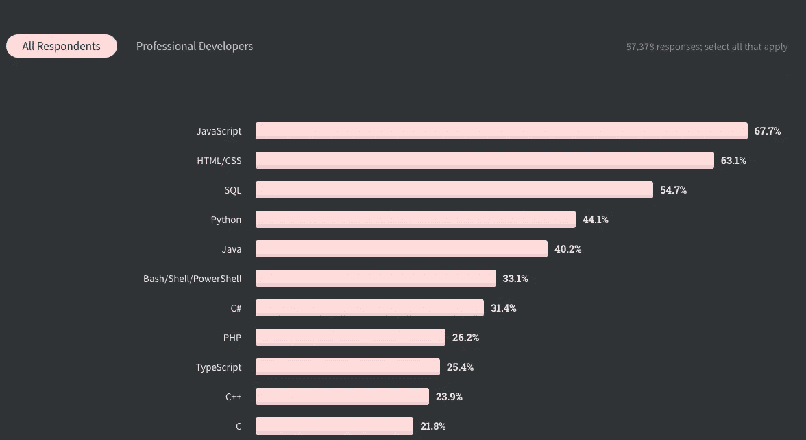
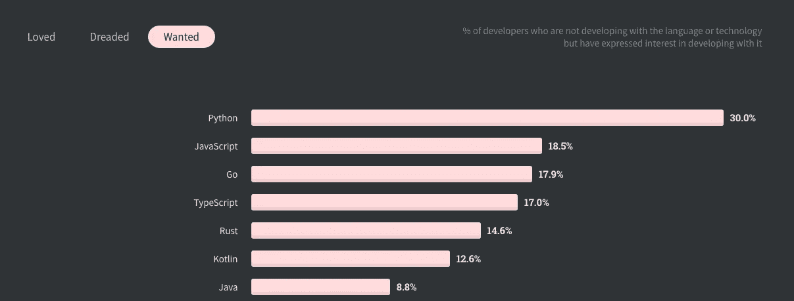
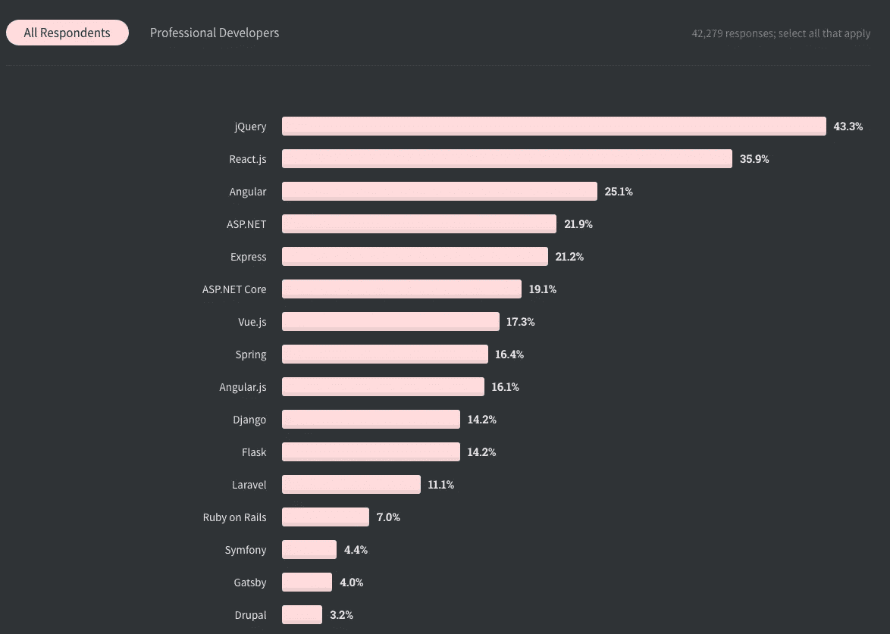
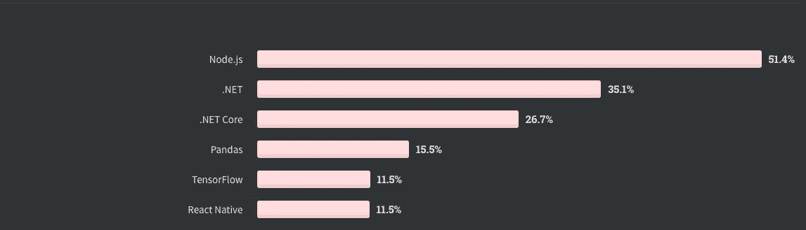

# 为什么 JavaScript 是初学者的好选择

> 原文：<https://pub.towardsai.net/why-javascript-is-a-good-choice-for-beginners-371ffe362b48?source=collection_archive---------1----------------------->

## [编程](https://towardsai.net/p/category/programming)

JavaScript 是 web 开发中事实上使用的语言，这是有充分理由的。它是一种通用的语言，易于开始，并且很受欢迎。因此，您可以:

*   构建所有类型的应用程序。例如，手机、智能手表和网络应用。
*   只使用你的浏览器开始用 JavaScript 编码。
*   快速方便地找到任何类型的教程。

# 多才多艺

JavaScript 最强大的特性之一是它的多功能性。使用 JavaScript，您可以超越 web 应用程序。如果你想建立服务器，你可以这样做。如果你打算开发游戏，你也可以这样做。你明白了。

此外，您可以从头到尾只使用一种编程语言来构建应用程序。JavaScript 允许您创建后端和前端来开发完整的应用程序。

因此，通过选择这种语言，你不会把自己局限在一个领域。例如，如果您有一个 web 应用程序，并且还想构建一个移动应用程序，那么您可以使用 React Native 来实现这一点。

JavaScript 是最通用的编程语言之一。

# 流行的

对于一些人来说，JavaScript 已经是最流行的编程语言的第一名。

*图一*

我从 Stackoverflow 2020 调查中提取了图 1。你可以看到 JavaScript 仍然是最受欢迎的编程语言。

*图二*

根据同一来源，图 2 显示 JavaScript 也是第二受欢迎的语言。

然而，这对你意味着什么呢？首先，如果你懂 JavaScript，这意味着有太多的工作机会。这适用于全球，而不仅仅是特定国家。

其次，网上有很多社区和教程。无论你想学什么，很可能有人已经解释了这个概念。另外，如果你想加入一个社区，那里有很多。

第三，JavaScript 不会很快消失。即使是这样，我们有如此多的遗留代码，将会有大量的工作来维护这些代码。

因此，通过学习 JavaScript，你可以获得很多工作机会。无论你选择 Node.js、React 还是 Vue，总有一份工作适合你。

# 易于开始

从 JavaScript 开始只需要一个浏览器。只要打开开发者工具，就可以写 JavaScript 代码了。不管你将来有多少经验，总会有在控制台中编写代码来测试/调试代码的时候。

当然，从长远来看这是不可行的，你也不可能在开发者工具中构建应用程序。但是，测试和调试代码非常方便。

# 走什么路线

现在你知道了为什么 JavaScript 是一种好的编程语言，让我们看看你可以选择什么样的道路。

我的建议是选择后端或前端。学习成为后端和前端本身就具有挑战性，更不用说试图同时学习两者了。两者都不会错。

让我们再来看看 Stackoverflow 调查。

*图 3*

查看图 3 中的调查，我们可以看到 JavaScript 框架正处于领先地位。jQuery、React、Angular、Express、Vue、Gatsby 都是 JavaScript 框架。

*图 4*

此外，查看图 4，我们可以看到 JavaScript (Node.js)仍然领先图表。如果你不熟悉 Node.js，它是一个允许我们构建服务器的 web 框架。

因此，您可以看到 JavaScript 是流行的技术，使用它不会出错。

# 从哪里开始

开始使用 JavaScript 的最佳资源之一是 FreeCodeCamp。他们拥有关于普通 JavaScript、算法以及 JavaScript、React 和 Node.js 的数据结构的资源。换句话说，他们涵盖了 JavaScript 全栈开发的全部内容。

除此之外，你可以通过他们的 YouTube 频道来补充你的学习。FreeCodeCamp 有一个 YouTube 频道，他们在那里发布各种免费教程。它们也是由专业开发人员录制的。

我认为 FreeCodeCamp 是想学习如何编程的人的最佳起点。他们有一个结构良好的课程，专业人员开发课程，他们有一个非常支持的社区。

如果你还想要更多的资源，另一个有用且优秀的网站是 Odin 项目。同样，它有一个课程，带你学习普通的 JavaScript、Node.js、React、Vue 和 Angular。

因此，如果你想编码，我推荐你:

*   [FreeCodeCamp 的网站](https://www.freecodecamp.org/)
*   [FreeCodeCamp 的 YouTube 频道](https://www.youtube.com/channel/UC8butISFwT-Wl7EV0hUK0BQ)
*   [奥丁计划](https://www.theodinproject.com/)

# 结论

希望这篇文章能够说服您，如果您刚刚开始学习编码或来自另一种语言，就从 JavaScript 开始吧。

简单来说，JavaScript 是:

*   一种多功能的语言——用它你几乎可以构建任何东西
*   易于开始—您只需要一个浏览器就可以开始编码
*   受欢迎—引领排行榜

*如果你对 JavaScript 教程感兴趣，我推荐* [*前端高手*](https://catalins.tech/frontend-masters-membership-is-it-worth-it) *！*

*如果你想用技术写作赚钱，就去看看那些付钱让你写* *技术文章的* [*网站吧！*](https://catalins.tech/websites-that-pay-you-to-write-technical-articles)

*如果你想学习 JavaScript，我推荐这些* [*5 资源作为初学者学习 JavaScript*](https://catalins.tech/5-best-resources-to-learn-javascript-as-a-beginner)*！*

*谈判你的薪水是必不可少的——学习* [*作为一名开发人员如何谈判你的薪水*](https://catalins.tech/how-to-negotiate-your-salary-as-a-developer) *！*

*用* [*加速你的开发 Git 别名*](https://catalins.tech/git-aliases-what-are-they-and-how-to-use-them) *。*

*如果你想以开发者的身份* [*开博客*](https://catalins.tech/how-to-start-your-blog-as-a-developer) *，我推荐阅读《* [*如何以开发者的身份开博客*](https://catalins.tech/how-to-start-your-blog-as-a-developer) *》一文！*

你是否很难跟上科技领域的最新消息？参见 [*作为开发者保持最新状态的一种方法*](https://catalins.tech/one-way-to-stay-up-to-date-as-developer) *！*

*学习* [*如何在 JavaScript*](https://catalins.tech/how-to-use-asyncawait-in-javascript) *中使用 Async/Await！*

GitHub 简介目前风靡一时。了解 [*如何创建 GitHub 个人资料页面*](https://catalins.tech/how-to-create-a-kickass-github-profile-page) *！*

*查看这 7 个* [*资源，帮你通过求职面试*](https://catalins.tech/7-github-repositories-to-help-you-crush-your-job-interviews) *！*

*查看*[*JavaScript ECMAScript 2021 es 2021*](https://catalins.tech/javascript-es2021-you-need-to-see-these-ecmascript-2021-features)*即将推出的新功能！*

你是初学程序员吗？查看这些 [*编程项目思路适合初学者*](https://catalins.tech/10-programming-project-ideas-for-beginners) *！*

*你是在学习编码还是打算去做？查看* [*免费学习编程的最佳地点*](https://catalins.tech/20-best-places-to-learn-programming-for-free) *！*

[*用这 9 个浏览器扩展提高你的开发者生产力*](https://catalins.tech/my-9-must-have-browser-extensions-for-increased-developer-productivity) *！*

*如果你是 Node.js 的开发者，我建议你查看 Node.js* *中的这些* [*4 种创造性的设计模式！*](https://catalins.tech/the-4-creational-design-patterns-in-nodejs-you-should-know)

*查看这些惊人的*[*JavaScript ECMAScript 2020 特性*](https://catalins.tech/javascript-es2020-the-features-you-should-know) *！*