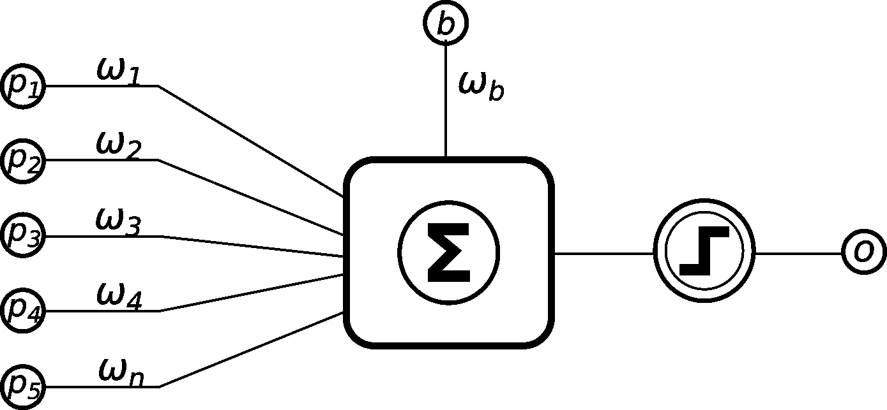
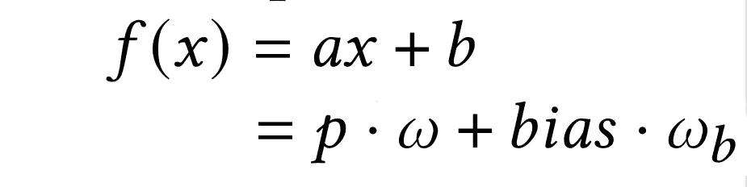
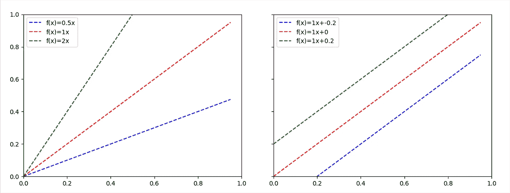
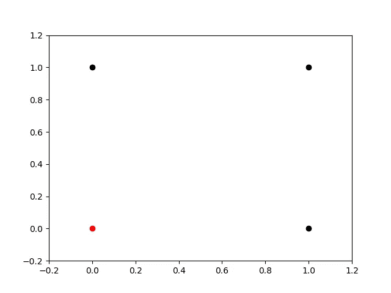
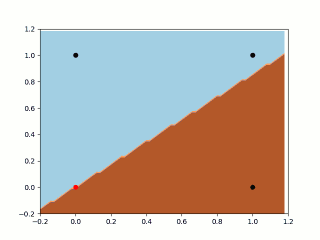
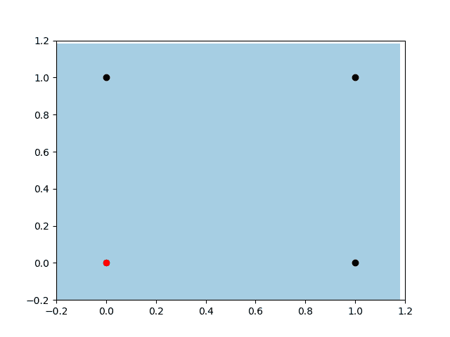
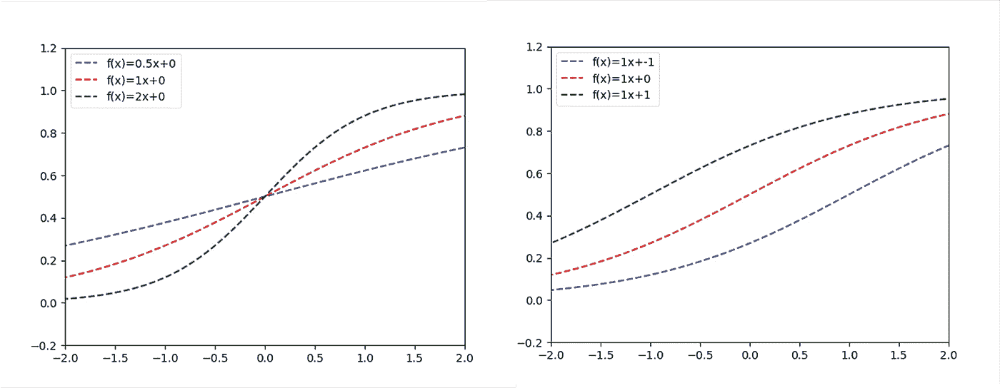

# 为什么感知器神经元需要偏置输入？

> 原文：<https://pub.towardsai.net/why-perceptron-neurons-need-bias-input-2144633bcad4?source=collection_archive---------0----------------------->


如何避免神经网络中的偏差输入？请不要。

大家都知道什么是神经网络*偏差*输入。自从第一个感知器实现以来，每个人都在使用它。但是**我们为什么要用**呢？你考虑过吗？就我自己而言，直到前一段时间我才知道。我和一个大学生讨论一些神经网络模型，不知何故，她把 ***偏差*输入**和**统计偏差**搞错了。我很容易地向她解释了这些概念，但我很难解释为什么我们使用*偏差*。过了一会儿，我决定尝试一些代码来进一步研究它。

先简单说一下背景。

感知器是多层感知器(MLP)人工神经网络的前身。这是一个众所周知的，受生物启发的算法来进行监督学习。正如我们在图中看到的，它是一个线性分类器:



一个简单的感知器图形描述。

下面我们可以看到这个模型的数学方程式:


其中: **f(x)** 为激活函数(一般为阶跃函数)。偏差是 **b** ，而 **p** 和 **w** 分别是输入和权重。

你可能会注意到与线性函数的标准形式的相似性。如果我们移除激活函数，这些公式将是相同的(为了清楚起见，这里我们只考虑一个输入):



在第一个例子中，bias=1。

比较这两个公式，很明显我们的 ***偏差*** 是一个线性函数的 ***b*** 分量。那么，现在的问题是:线性函数中的 ***b*** 分量的重要性是什么？如果你在过去的几年里没有上过任何线性代数课程(就像我一样)，可能很难记住。但这是一个简单的概念，很容易用图形来理解:



所以，我们很容易注意到，在 ***b=0，*** 的情况下，函数总是会经过原点**【0，0】**。而当我们引入值给*b 保持*a 固定时，新的函数将总是相互平行的。那么，我们能从中学到什么呢？**

> **我们可以说，a 分量决定了函数的角度，而 b 分量决定了函数与 x 轴相交的位置。**

**我想你已经注意到其中的问题了，对吗？没有 b 组件，我们会失去很多灵活性。对一些发行版进行分类可能有用，但不是对所有人都有用。测试一下怎么样，看看实际效果如何？让我们用一个简单的例子:OR 函数。我们来看看它的分布(其实就是真值表):**

**如果我们把它画在笛卡尔平面上:**

****

**我想你已经解决了这个问题。有两个点(**【0，0】**和**【1，0】**)经过原点，分类不同。一个过线投掷**【0，0】**是没有办法分割这两个种群的。感知器会怎么处理？有*偏置*和没有*偏置*会怎么样？让我们进入一些代码，看看事情将如何发生！感知器神经元有一个简单的 Python 实现:**

```
**class Perceptron():def __init__ (self, n_input, alpha=0.01, has_bias=True):
    self.has_bias = has_bias
    self.bias_weight = random.uniform(-1,1)
    self.alpha = alpha
    self.weights = []
    for i in range(n_input):
        self.weights.append(random.uniform(-1,1))def classify(self, input):
    summation = 0
    if(self.has_bias):
        summation += self.bias_weight * 1
    for i in range(len(self.weights)):
        summation += self.weights[i] * input[i]
    return self.activation(summation)def activation(self, value):
    if(value < 0):
        return 0
    else: 
        return 1

def train(self, input, target):
    guess = self.classify(input)
    error = target - guess
    if(self.has_bias):
        self.bias_weight += 1 * error * self.alpha
    for i in range(len(self.weights)):
        self.weights[i] += input[i] * error * self.alpha**
```

****

**感知器无偏差训练**

**先来看看没有*偏差*的训练。我们知道，分类规则(我们的函数，在这种情况下)总是会通过抛出点**【0，0】**。正如我们在下面可以注意到的，分类器将永远无法将类分开。在这种情况下，它非常接近 a do it，但它不能将**【0，0】**和**【1，0】**分开。**

****

**有偏差的感知器训练**

**现在让我们看看带有*偏置*输入的感知器。首先，注意分类器的自由度。正如我们之前所说，它有更大的灵活性来创建不同的规则。另外，我们可以注意到，它正在寻找与上一个例子相同的局部最小值，但现在他可以公开移动，并找到分割数据的最佳位置。**

**所以，我认为*偏差*输入的重要性现在已经很明显了。我知道，你可能在思考激活函数。我们在 python 的例子中使用了一个阶跃函数，如果我们使用一个 sigmoid 作为激活函数，它可能会在没有*偏差*的情况下工作得更好。相信我:不会的。让我们看看当我们将线性函数插入到 sigmoid 激活函数中时，函数是如何变化的(然后我们得到σ(f(x))):**

****

**σ(f(x))的不同曲线**

**你注意到了吗，这里的例子和线性函数很相似。sigmoid 函数改变了格式，但是我们还是有同样的问题:没有 *bias* ，所有的函数传递都抛出原点。当我们试图用一条曲线来拟合一个总体时，这仍然是一个不受欢迎的行为。如果您想尝试一下，看看它是如何工作的，您只需要对 python 代码做一些小小的修改。**

**我真诚地感谢你对这个问题的兴趣。如果你有什么建议，意见，或者只是想打个招呼，请留下评论！我将很高兴与你讨论它！**