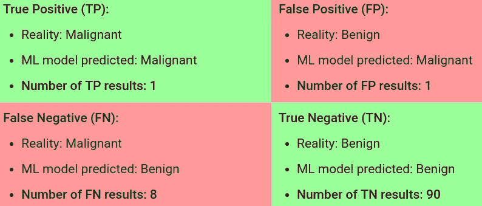
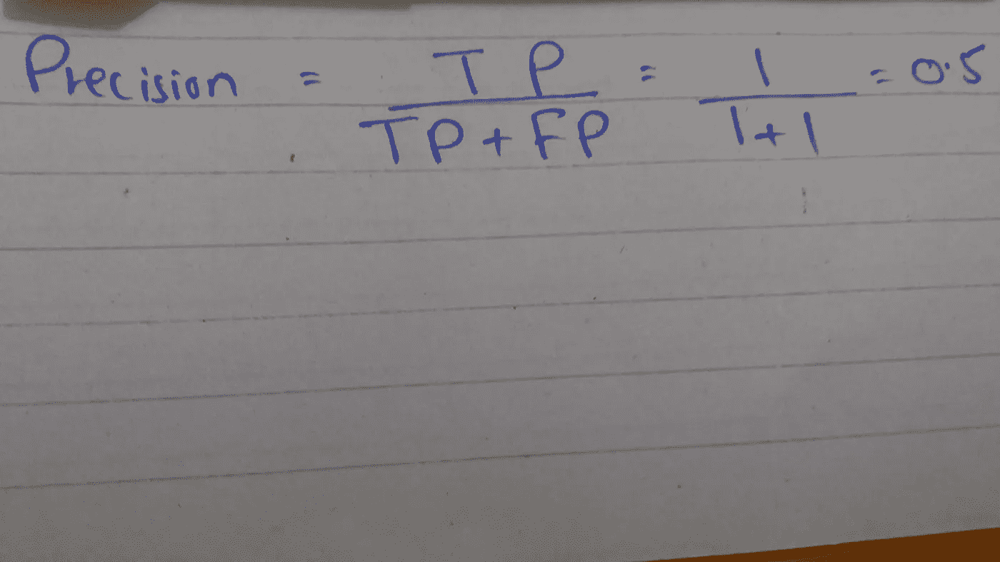
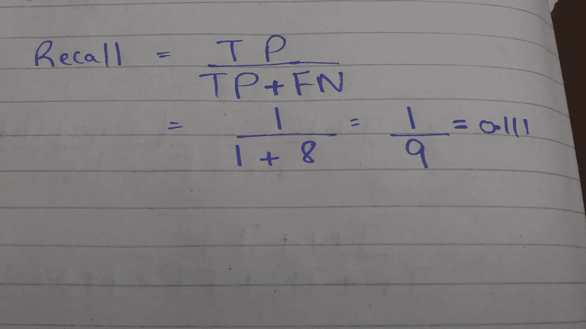

# 为什么要使用精确度和召回率指标？

> 原文：<https://pub.towardsai.net/why-precision-and-recall-metric-6e350f6b52aa?source=collection_archive---------1----------------------->

作者图片

在回答上面的问题之前，让我告诉你我在学习分类问题中学习算法的评价时的经历。

## **我的经历**

目前，我正在从 Andrew ng Coursera 课程学习 ML，我刚刚完成了我的第 6 周作业，这意味着一个多月了**哇。**

我很享受。所以还是回到正题吧。

在第 6 周，当我第一次观看分类问题的不同评估标准的视频时。我真的无法理解精确和回忆的概念。然后，我开始在互联网上搜索不同的平台，我发现了一个非常简单的解释这个话题。你可以在参考部分找到有用的链接。所以当我理解了精确和回忆的概念时，我想让我们发布教程博客:)

## **我是如何理解精确和召回的？**

我们知道，通过准确性度量，我们可以评估我们的分类问题学习算法，所以我问自己以下问题。

**为什么我们需要从准确转向精确/召回？**

因为**类不平衡数据集**，我们不能仅仅通过看准确性来判断我们的学习算法在类不平衡数据集上做得好。令人惊讶的是，你可以在测试集上获得 90%的准确率，但这不是一个决定你的学习算法健康程度的好指标。

所以让我们多了解一下上面这段话，以便更好地理解。

## 什么是类不平衡数据集？

类别不平衡数据集是指一个类别的数量在数据集中非常稀少，这意味着一个类别的数量大于另一个类别。

不平衡分类问题中的例子:

## 1)疾病检测任务

当疾病在公众中的发病率很低时，疾病检测中会出现不平衡分类问题。

## 2)恐怖分子探测任务

另一个不平衡的分类问题发生在恐怖分子检测任务中，当我们有两个类别时，我们需要识别**恐怖分子**和**而不是恐怖分子**，其中一个类别代表绝大多数数据点。

现在让我们借助一个真实世界的例子来理解

## 为什么 90%的准确率不能决定你学习算法的健康程度？

考虑疾病检测任务，我们希望检测癌性肿瘤，以便医生可以在危急情况发生前进行治疗。

在我们的数据集中，总共有 100 个肿瘤样本，根据类型**良性**和**恶性分类。**领域知识表明恶性肿瘤是癌性的，因此我们将肿瘤表示为

肿瘤表现。作者图片

## 注意

我们的主要任务是检测癌变的恶性肿瘤。

为了给数据集一些概念，它看起来像下面这样。这里我们只有两个特征，但是可以有很多

数据集可视化。作者图片

现在在我们的数据集中，100 个例子中有 91%是良性肿瘤，9%是恶性肿瘤。

假设您已经训练了您的分类器，比方说使用逻辑回归，并且您发现了以下正确结果:

正确的预测结果。作者图片

因此，我们的模型正确预测了 90%的良性肿瘤，只有 1%的恶性肿瘤，这是我们的主要目标。这意味着我们的模型在预测恶性肿瘤方面表现不佳。

让我们通过查看下图来做一些分析

来源:[来自谷歌开发者机器学习](https://developers.google.com/machine-learning/crash-course/classification/accuracy)

首先，计算这些结果的准确性:

计算精度。作者图片

我们得到了 91%的准确率，尽管我们的模型对恶性肿瘤的预测很差。这就是为什么准确度不是评估不平衡分类问题的好指标。那么如何才能解决这个问题呢？只需选择正确的度量标准。

选择正确的度量**精度**和**召回:**

在这里，我希望您将注意力集中在以下词语上，以便我们能够更好地理解这两个指标之间的差异。

在我们的问题中，恶性是正类(1)，良性是负类(0)。

## 什么是精准？

“无论何时您的模型预测到**正类**，它都是正确的**百分比**

如果你理解了上面的陈述，你就可以走了，如果你和我一样，那么让我们来计算精度，并理解它的含义。

计算精度。作者图片

精确度集中在阳性类别(恶性)上，我们得到了 50%的精确度。所以只要把上面的陈述换成恶性和 50%你就会对它的意思有更好的理解。

“每当你的模型预测到恶性肿瘤时，它有 50%的正确率”

让我们验证 50%的正确性。

## 我们的模型预测了多少恶性肿瘤？

作者图片

在 2 个预测中，我们的模型只得到 1 个正确的预测，因此验证了 50%

## 什么是召回？

召回是关于

“从**数据集**中的**实际正类**来看，您的模型的正类预测的**百分比**是正确的？”

计算召回:

计算召回。作者图片

召回率是 11%，这意味着

“模型预测的**恶性肿瘤**的 11% **百分比**与**数据集**中的**实际恶性肿瘤**一致”

我希望你明白这两个指标的区别，并且喜欢阅读这篇教程。

有关精度/召回的更多详细信息，请参考参考下的链接。

非常感谢:)

学习、创造、分享和重复

## 参考资料:

1.  [https://developers . Google . com/machine-learning/crash-course/classification/accuracy](https://developers.google.com/machine-learning/crash-course/classification/accuracy)
2.  [https://developers . Google . com/machine-learning/crash-course/class ification/precision-and-recall](https://developers.google.com/machine-learning/crash-course/classification/precision-and-recall)
3.  [https://towards data science . com/beyond-accuracy-precision-and-recall-3da 06 bea 9 f6c](https://towardsdatascience.com/beyond-accuracy-precision-and-recall-3da06bea9f6c)

**联系人**

Gmail:jalalmansoori19@gmail.com

github:[https://github.com/jalalmansoori19](https://github.com/jalalmansoori19)

推特:[https://twitter.com/JalalMansoori19](https://twitter.com/JalalMansoori19)