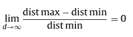
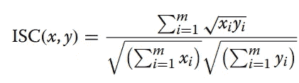
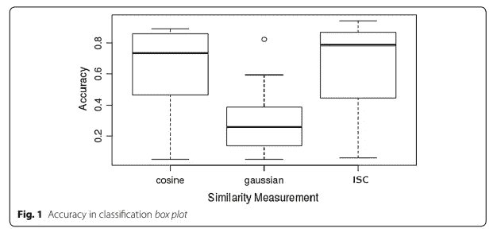
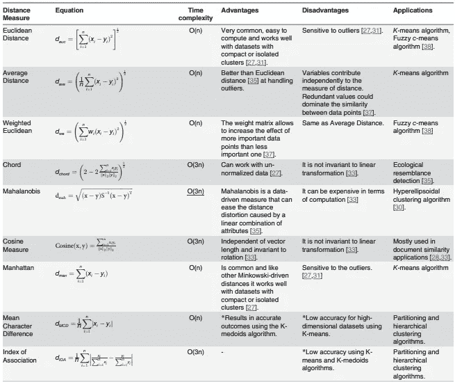

# 为什么欧几里德距离不应该是默认的距离度量？

> 原文：<https://pub.towardsai.net/why-should-euclidean-distance-not-be-the-default-distance-measure-e55d72bd16e2?source=collection_archive---------0----------------------->

技术、数据存储资源和计算资源的持续发展，导致数据量*呈指数级增长。通常，数据挖掘应用程序涉及到处理这种海量的高维数据。*

*数据挖掘中使用的主要技术依赖于从 ***欧几里德距离*** 中推导出的度量来评估对象之间的距离差异。然而，许多研究表明，由于被称为*“维数灾难”的现象，这些现有技术中的大多数不适用于高维数据。*当邻近、距离或最近邻等概念随着数据集维度的增加变得不那么有意义时，这种挖掘高维数据的诅咒就出现了。[研究](http://kops.uni-konstanz.de/bitstream/handle/123456789/5849/P506.pdf?sequence=1&isAllowed=y)表明**随着维度的增加，最远点和最近点之间的相对距离收敛到 0*d:****

**

*来源:高维空间中欧氏距离的有效性*

*换句话说，样本总体中最近邻和最远邻之间的区分在高维空间中变得相当弱。*

*此外，[关于高维空间中距离度量的令人惊讶的行为的论文](https://bib.dbvis.de/uploadedFiles/155.pdf)证明了欧几里德(L *2* 范数*(在此阅读更多关于向量范数***)*)对于高维数据挖掘应用来说通常不是一个理想的度量。对于种类繁多的距离函数，*由于距离在高维空间中的集中性，最近邻和最远邻到给定目标的距离之比几乎是 1*。因此，不同数据点之间的距离**没有变化。****

> **通常，大多数现实世界的问题在高维数据空间中操作，因此，欧几里德距离通常不是高维数据挖掘应用的理想度量。**

# ****对于高维数据有没有更好的距离度量？****

**前面提到的[论文](https://bib.dbvis.de/uploadedFiles/155.pdf)研究了高维空间中 L *k* 范数的行为。基于这些结果，**对于高维度的给定值 *d* ，使用较低值的 *k*** 可能更好。换句话说，对于高维应用来说， *L1 距离*比 L *2* 更有利。**

**Sohangir 和王在论文[中提出了一种**改进的 sqrt-cosine (ISC)** 相似性度量方法。ISC 表述如下:](https://journalofbigdata.springeropen.com/articles/10.1186/s40537-017-0083-6)**

****

**来源:[改进的 sqrt 余弦相似性度量](https://journalofbigdata.springeropen.com/articles/10.1186/s40537-017-0083-6)**

****ISC** 是[海灵格距离](https://en.wikipedia.org/wiki/Hellinger_distance)的延伸，属于 L *1* 范数(已经证明在高维数据中，L *1* 范数比 L *2* 范数效果更好)。在上面的等式中，我们没有使用 L *1* 范数，**而是使用 L1 范数的平方根。****

**本文认为余弦相似性是相似性度量的“最新发展”。*与余弦相似度和其他用于测量高维数据空间相似度的流行技术*相比，ISC 表现良好。**

****

**来源:[改进的 sqrt 余弦相似性度量](https://journalofbigdata.springeropen.com/articles/10.1186/s40537-017-0083-6)**

# **选择“最佳”距离测量的路标**

**我们必须明白，也许永远不会有“最佳”的距离度量，但总会有一个*“正确的】度量*。选择正确的距离度量取决于数据分布、数据维度、数据类型、我们追求的期望/目标等因素。例如，如果我们正在处理文本数据，我们知道*余弦相似度*往往工作得更好。类似地，具有较高噪声和异常值的数据可能不容易用欧几里德距离来处理。同样，欧几里德距离在二维数据上表现非常好，其目的是测量大小。**

**论文摘要[对连续数据聚类中相似性和相异性度量的比较研究](https://journals.plos.org/plosone/article/file?id=10.1371/journal.pone.0144059&type=printable)，为选择*“正确的”距离度量提供了相当多的指导。***

****

**来源:【https://journals.plos.org/plosone/article/file? id = 10.1371/journal . pone . 0144059&type = printable**

# **结论**

**通常，大多数现实世界的问题在高维数据空间中操作，这使得欧几里德距离不是最理想的度量。对于高维数据空间，**改进的 sqrt-cosine (ISC)** 已经被证明比大多数测度表现更好。然而，不可能有一种适合所有情况的距离度量。数据从业者必须仔细检查数据分布、数据维度、数据类型、噪音、我们追求的期望/目标等因素。，在选择‘右’度量和**之前，停止设置‘欧几里德距离为默认距离度量’。****

**最后，感谢你耐心阅读到最后，如果你觉得这篇文章有用，那么给我一两下掌声吧！如果没有，请回复你的评论和问题；我很乐意回答并连接到 Linkedin 上进行讨论。**

****参考文献:****

**[https://journals.plos.org/plosone/article/file?id = 10.1371/journal . pone . 0144059&type = printable](https://journals.plos.org/plosone/article/file?id=10.1371/journal.pone.0144059&type=printable)**

**b)[https://www . research gate . net/profile/Jonathan-Goldstein-8/publication/2845566 _ When _ Is _ Nearest _ Neighbor _ Meaningful/links/09e 4150 B3 EB 298 BF 21000000/When-Is-Nearest-Neighbor-Meaningful . pdf](https://www.researchgate.net/profile/Jonathan-Goldstein-8/publication/2845566_When_Is_Nearest_Neighbor_Meaningful/links/09e4150b3eb298bf21000000/When-Is-Nearest-Neighbor-Meaningful.pdf)**

**c)[http://kops . uni-Konstanz . de/bitstream/handle/123456789/5849/p506 . pdf？sequence=1 & isAllowed=y](http://kops.uni-konstanz.de/bitstream/handle/123456789/5849/P506.pdf?sequence=1&isAllowed=y)**

**https://bib.dbvis.de/uploadedFiles/155.pdf**

**e) [https://journalofbigdata.springeropen.com/articles/10.1186/s40537-017-0083-6](https://journalofbigdata.springeropen.com/articles/10.1186/s40537-017-0083-6)**