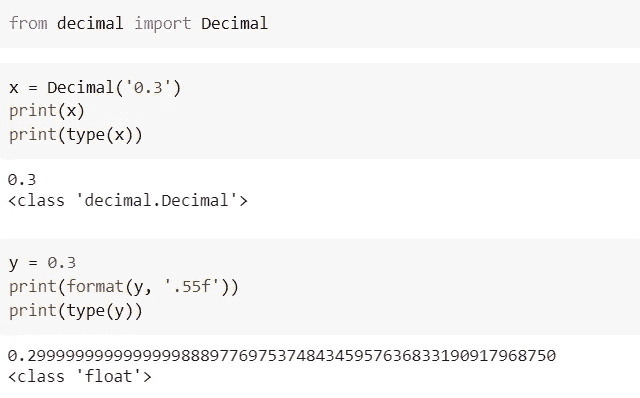
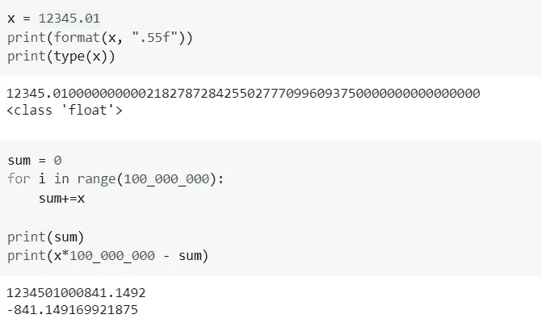
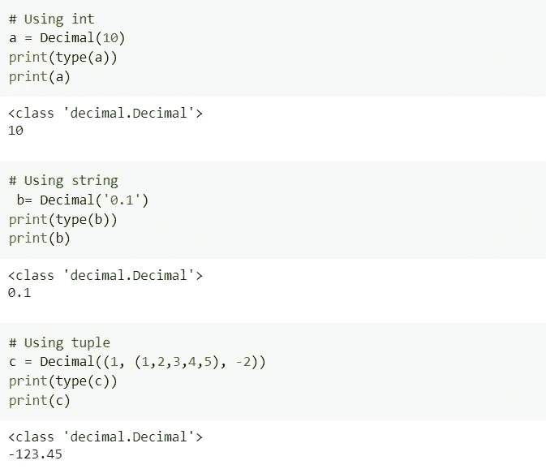
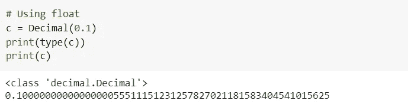
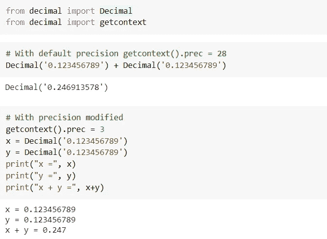
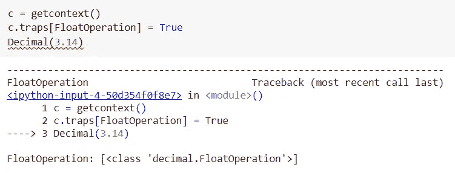
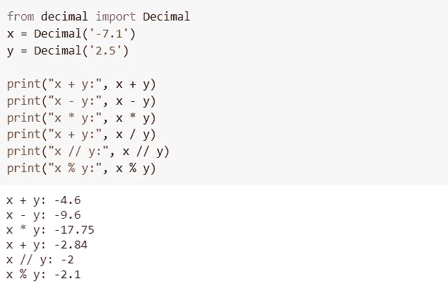
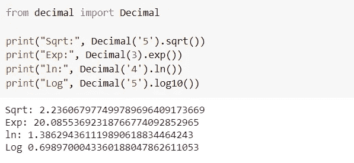
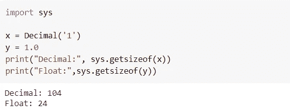
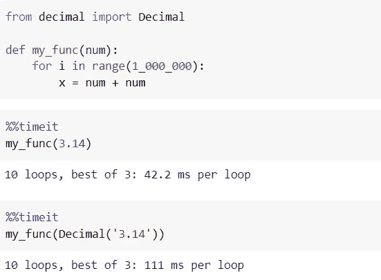

# 作为 Python 开发人员，为什么要理解十进制数据类型？

> 原文：<https://pub.towardsai.net/why-should-you-understand-decimal-data-type-as-a-python-developer-1bf078c97ab7?source=collection_archive---------3----------------------->

## [编程](https://towardsai.net/p/category/programming)， [Python](https://towardsai.net/p/category/programming/python)

## 用于定点和浮点运算的十进制模块


来源: [Unsplash](https://unsplash.com/photos/8xAA0f9yQnE)

我们都熟悉浮点数据类型。你知道还有另一种叫做 **decimal** 的数据类型可以用来表示实值(浮点)数字吗？正如我们在 [**上一篇文章**](https://medium.com/towards-artificial-intelligence/6-interesting-facts-you-are-less-familiar-with-python-float-data-type-ce118727016b) 中看到的，一些浮点数在二进制中没有精确的表示。这种不精确会导致舍入误差。decimal 数据类型试图通过提供一种使用固定精度表示浮点数的方法来解决这个问题。

我强烈建议您通读下面的文章，了解浮点数的固定(有限)表示和近似(无限)表示及其含义。

[](https://medium.com/towards-artificial-intelligence/6-interesting-facts-you-are-less-familiar-with-python-float-data-type-ce118727016b) [## 6 个有趣的事实你不太熟悉 Python 浮点数据类型

### 在上一篇文章中，我们介绍了 Python int 数据类型鲜为人知的特性。让我们穿过…

medium.com](https://medium.com/towards-artificial-intelligence/6-interesting-facts-you-are-less-familiar-with-python-float-data-type-ce118727016b) 

# 为什么要懂小数？

当我们已经有了表示浮点数的 float 数据类型时，为什么还要理解 decimal 数据类型呢？你可以在官方文档[中找到一个解释](https://docs.python.org/3/library/decimal.html#module-decimal) — *“十进制是基于浮点模型的，这种模型是以人为本设计的，并且必然有一个最高的指导原则——计算机必须提供一种算法，这种算法的工作方式与人们在学校学习的算法相同。”* —摘自十进制算术规范。

十进制模块主要在涉及货币计算的会计/金融相关领域发挥着至关重要的作用。如前所述，decimal 类型用于表示使用固定精度的浮点数，它没有精确的(或有限的)二进制表示。

因此，在涉及货币计算的情况下，如果您将它们存储为固定精度以避免舍入问题，会更好。

**看下面的例子** — 0.3 有精确的十进制表示，即 0.3 本身，但在浮点版本中，它不是精确的 0.3，尽管它非常接近 0.3。浮点类型存储那些没有精确/有限二进制表示的近似值。



作者图片

**那么，它会对你产生什么影响？**参考下面的例子。想象一下，你必须对`$12345.01`值求和 1 亿次。实际结果是`$1234501000000.0`，但是你得到的是`$1234501000841.1492`的值。正如您所注意到的，这里有一个`$841.149169921875`的差异。即使它可能不是一个非常大的数字，如果你盲目地使用 float 并且不知道它是如何工作的，这将会给你带来噩梦。想象一下，如果浮点计算的数量变得更大，数量会有多大的差异。因此，在这种情况下，使用 decimal 模块而不是 float 类型是有意义的。



作者图片

现在你已经理解了小数模块的重要性，让我们把重点放在如何构造小数以及它们的用法上。

# 十进制模块

您需要理解十进制模块中的三个概念——十进制数、算术上下文和信号。

## a)十进制数

像 int、float 和 string 一样，decimal 也是一个不可变的对象。它由符号、系数数字和指数组成。十进制数还包括+无穷大、-无穷大和 NaN。

你可以用整型、浮点型、字符串型、元组型等来构造十进制对象。让我们看看如何构造十进制对象的例子。



作者图片

创建小数时不建议使用 float，因为它将存储近似值而不是固定精度值。从下面的例子中，你可以看到当你尝试`decimal(0.1)`时，它将存储近似值 0.1，而不是 0.1 本身。



作者图片

## b)算术的上下文

算术上下文提供了指定/修改精度、舍入、指数、启用陷阱、标志等规则的选项。

我们可以使用如下所示的`getcontext()`获得默认上下文。它给出了指数、标志和陷阱等的精度、舍入、最小值和最大值的默认值。请参考官方文档 [**PEP 327**](https://www.python.org/dev/peps/pep-0327/#rounding-algorithms) 了解不同舍入选项和其他参数的更多详情。对于新手来说，可以主要看一下`prec`和`rounding`。

```
from decimal import getcontext
print(getcontext())>>> Context(prec=28, rounding=ROUND_HALF_EVEN, Emin=-999999, Emax=999999, capitals=1, clamp=0, flags=[FloatOperation], traps=[InvalidOperation, DivisionByZero, Overflow])
```

**让我们试着理解如何使用上下文:**当处理实值(浮点)数字时，您可以修改(或设置上下文)精度、舍入等的默认值。全球根据您的需要。这样，您可以高效地处理浮点数，而不用担心舍入误差。

修改默认上下文的一种方法是使用点符号访问`getcontext()`的属性，并分配一个新值。例如，`getcontext().prec = 3`覆盖默认精度值，从 28 到 3。

下面的例子显示了我们如何使用`getcontext().prec`来修改精度。也可以尝试修改舍入、Emins、Emax 等。



作者图片

从上面的例子可以明显看出，精度和舍入只在算术运算中起作用。即使精度设置为 3，x 和 y 也有 9 个精度，但是只有在算术运算之后，精度才会降低到 3。

关于 context 及其参数的高级用法，可以参考 [**本**](https://docs.python.org/3/library/decimal.html#context-objects) 。

## c)信号

这些信号是在十进制数学运算中出现的异常情况。十进制模块中列出的信号有-箝位、无效运算、除法运算、不精确、舍入、低于正常值、上溢、下溢和浮点运算。

例如，如果您不想在应用程序中使用十进制模块的浮点运算，那么您可以像下面这样捕获浮点运算。所以，当你试图用 float 构造 decimal 时，它会抛出一个异常。



作者图片

# 数学运算

Decimal 支持基本的算术运算—加法(+)、减法(-)、乘法(*)、除法(/)、除法模(//)、模(%)。

这里有一个关键的区别你需要注意。在整数运算的情况下，Div mod (//)返回 floored 商`floor(a/b)`，但是在小数类型的情况下，它返回 truncated 商`trunc(a/b)`。对任意给定的两个数 a & b，以这样的方式定义地板除法和模运算符，使得它们总是满足下面的条件

```
a = b * (a // b) + (a % b)
```



作者图片

小数也支持 sqrt，min，max，power 等。参考下面的例子。您可以得到多达 28 个精度的结果，因为它是在`getcontext()`中定义的默认值。对于十进制中不包含的数学运算，可以探索`math`模块。



作者图片

# 浮点与十进制

*   Decimal 类型比 float 数据类型更有效地处理**精度**和**舍入**。
*   由于有效地处理了精度和舍入，在涉及**货币计算**的情况下，强烈推荐使用小数类型。
*   十进制类型比浮点型消耗更多的内存。另一方面，float 占用更少的内存**。**如你所见，使用十进制类型会额外增加 80 字节的开销。



作者图片

*   浮点数的**性能**比十进制好。如果您的应用程序较小，并且涉及的操作不多，您可能不会注意到性能上的差异，但是当您的应用程序变大，十进制操作的数量增加时，您将开始看到这种差异。如下面的示例代码所示，浮点运算比小数运算快。



作者图片

# 结论

在本文中，您已经理解了 decimal 数据类型是 float 类型的替代，用于表示浮点(实值)数。浮点型和小数型各有利弊。虽然使用浮点还是小数取决于用例，但是在选择浮点还是小数时，您也必须考虑其利弊。

*原载于 2021 年 1 月 18 日 Pythonsimplified.com*****。****

**阅读更多关于 Python 和数据科学的有趣文章，* [***订阅***](https://pythonsimplified.com/home/) *到我的博客*[***pythonsimplified.com******。*** 你也可以在](http://www.pythonsimplified.com/)[**LinkedIn**](https://www.linkedin.com/in/chetanambi/)**上联系我。***

*我希望你喜欢阅读这篇文章。如果你喜欢我的文章并想订阅 Medium，你可以在这里这样做:*

*[](https://chetanambi.medium.com) [## Chetan Ambi -介质

### 阅读 Chetan Ambi 在媒体上的文章。数据科学|机器学习| Python。参观 https://pythonsimplified.com/…

chetanambi.medium.com](https://chetanambi.medium.com)* 

# *参考*

*[1].[https://docs.python.org/3/library/decimal.html](https://docs.python.org/3/library/decimal.html)*

*[2].[https://www.python.org/dev/peps/pep-0327/](https://www.python.org/dev/peps/pep-0327/)*