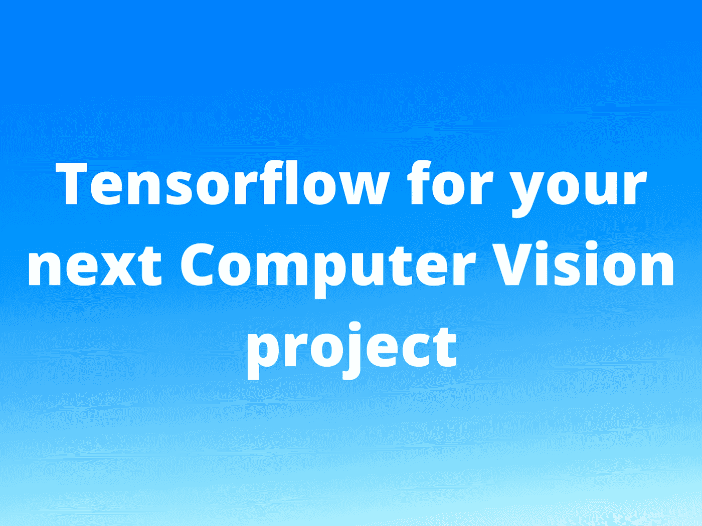
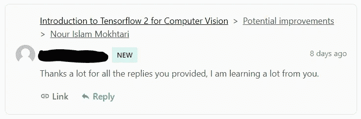

# 为什么 Tensorflow 是构建计算机视觉项目的绝佳选择

> 原文：<https://pub.towardsai.net/why-tensorflow-is-a-great-choice-for-building-projects-powered-by-computer-vision-9fda02dcc035?source=collection_archive---------7----------------------->

## [深度学习](https://towardsai.net/p/category/machine-learning/deep-learning)

由从事计算机视觉应用的人工智能工程师解释

> 加入我的 [***每周简讯***](https://nourislam.ck.page/dc3e8b7e12) 的数百名订阅者，如果你对学习感兴趣，并关注机器学习领域正在发生的事情。*以我作为机器学习工程师的经历为特色*:)

由作者制作

# 计算机视觉应用

图片来自 Unsplash

没有一个星期不听说计算机视觉的新应用。如果你看看机器学习的就业市场，你会注意到有这么多公司使用计算机视觉来做各种各样很酷的事情。

> 这都是拜深度学习所赐！

我见过一些手机应用程序，它们利用计算机视觉，从你盘子的照片上告诉你食物中有多少卡路里。

我见过用计算机视觉检测停靠在港口的船只的产品。

我见过使用计算机视觉来跟踪太阳能电池板质量的无人机。

我个人从事用于检查大型飞机引擎和底盘的计算机视觉解决方案。我还研究过 OCR(光学字符识别)问题，该问题使用计算机视觉来理解文档上的书写，以自动化不同的过程。

这些应用大部分在深度学习时代之前是不可能的！

深度学习是一个数学密集型领域，在神经网络如何工作的背后有许多数学概念。如果没有封装这些困难的数学概念，我们可能不会在现实世界中看到计算机视觉与深度学习相结合的这么多应用。

这就是深度学习工具如 Tensorflow 和 PyTorch 的用武之地！

这两个工具是框架，允许为包括计算机视觉应用在内的若干应用“容易地”构建和使用神经网络。在这篇文章中，我将主要谈论 Tensorflow。

# 为什么是 Tensorflow？

如果你在网上搜索，你会发现很多对比 Tensorflow 和 Pytorch 的文章和报告。他们陈述了两个框架的不同优点和缺点。我不会在这里做比较。相反，我将提到 Tensorflow 的优点，这些优点使它成为任何希望构建由深度学习驱动的计算机视觉应用程序的人的杀手级工具。

Tensorflow 是构建深度神经网络的绝佳工具，您应该出于以下原因使用它:

1.  它是由谷歌创建和支持的。这意味着你有世界上最好的工程师来开发和维护它。也意味着有不断的改进和特性。
2.  它是开源的。这意味着您可以自己查看代码，如果您愿意，甚至可以为代码库做出贡献。
3.  有很多(我是说很多！)科学论文中描述的不同深度学习技术的实现。这是我个人最喜欢的。
4.  您有许多部署选项。如果你想在边缘设备上部署你的模型，有 TFLite。如果您想在浏览器上部署它们，您可以使用 Tensorflow.js。如果您想将其作为 C++应用程序的一部分进行部署，您可以使用 Tensorflow C++ API。如果你想在云上部署你的模型，有 Tensorflow 服务。

# Tensorflow 如何帮助您构建计算机视觉产品

图片来自 Unsplash

你可以从头开始构建神经网络来解决特定的问题。你只需要列出你想要解决的具体任务。

有时你需要做图像分类，有时你想使用对象检测或图像分割，有时你想使用其他技术。基于这种选择，你可以建立神经网络，并从头开始训练它们，以达到你的目标。

Tensorflow 还提供了各种 API，可以方便地使用不同类型的深度学习模型。例如，如果您的问题可以使用对象检测来解决，那么您可以使用 Tensorflow 的对象检测 API。你有几个预训练的模型，你可以从中选择，你可以利用迁移学习的力量来训练强大的对象检测模型，即使只有有限的数据量。

关于如何使用 Tensorflow 构建计算机视觉产品，另一个非常有说服力的观点是，开源社区使用 Tensorflow 构建了很多项目。这意味着您可以获取这些项目，并进行必要的更改，使它们与您自己的产品一起工作。同时尊重许可条款！

对于部署您的模型，根据您的用例，您有几种选择。如果您不熟悉术语部署，那么这里有一个简短的解释。

> 部署是指将最终训练好的模型放入生产环境中。例如，将您的模型与移动应用程序集成，或者作为 C++桌面应用程序的一部分。

正如我前面提到的，Tensorflow 提供了许多选项来部署您的深度学习模型。如果您想将您的模型部署为移动应用程序的一部分，那么您可以使用 TFLite。如果您想使用 Javascript 部署您的模型，例如作为 Chrome 扩展的一部分，那么您可以使用 Tensorflow.js。

如果您想在服务器上部署您的模型(例如在云上)，那么您可以使用 Tensorflow 服务。

# 开始学习 Tensorflow 的免费资源

图片来自 Unsplash

网上有很多资源可以开始学习 Tensorflow。第一个将是官方的 Tensorflow 网站。在那里，您会找到大量关于 Tensorflow 中实现的不同方法的教程和文档。这是一个资源，即使你成为一个专家，Tensorflow 开发者，你也会用到它。Google 已经创建了关于这个框架的非常好的和全面的文档。

另一个可以找到免费资源学习 Tensorflow 的地方是 YouTube。您可以使用大量教程视频来了解使用 Tensorflow 可以做的不同事情。

前面提到的资源中可能缺少的一点是反馈。即使你发布了评论，也很难从在 YouTube 上发布视频的人那里获得反馈。我完全理解为什么。当一个视频上有成百上千的评论时，很难让你的评论被注意到。

这就是为什么我创建了一个 [***免费张量流课程***](https://aifee.teachable.com/p/introduction-to-tensorflow-2-for-computer-vision) ，作为如何使用这个框架建立神经网络的介绍，特别是针对计算机视觉应用。这是一门 **4 小时的课程**，一步一步地讲述如何使用 Tensorflow 构建神经网络。它还讲述了如何使用 Tensorflow 的类和方法为训练准备数据集。

在这个过程中，你可以问我任何你喜欢的问题，我会尽我所能回答你所有的问题。在下图中，您将看到一名学生的评论，该学生在该课程中提出了几个问题。

一名学生的评论(图片由作者提供)

# 结论

在这篇文章中，我概述了一些令人信服的观点，说明如果您打算构建由深度学习支持的计算机视觉产品，为什么应该学习 Tensorflow。我还概述了一些免费资源，您可以使用它们来学习如何使用这个强大的框架。

由作者制作

我是一名机器学习工程师，致力于解决具有挑战性的计算机视觉问题。我每天在 [**LinkedIn**](https://www.linkedin.com/in/nour-islam-mokhtari-07b521a5/) 和 [**Twitter**](https://twitter.com/NourIslamMo) 上写一些关于 ML 的小帖子，以帮助我的追随者了解我们这个领域的最新动态。