# 为什么使用基于策略的算法而不是深度 Q 学习？

> 原文：<https://pub.towardsai.net/why-using-a-policy-based-algorithm-instead-of-deep-q-learning-ee6d8b9f0bb0?source=collection_archive---------2----------------------->

## [人工智能](https://towardsai.net/p/category/artificial-intelligence)

## 关于政策梯度的超简单解释。

由[拍摄的](https://unsplash.com/@gradienta?utm_source=medium&utm_medium=referral)在[的](https://unsplash.com?utm_source=medium&utm_medium=referral)上的坡度

我假设你熟悉 Q 学习和深度 Q 学习的概念。在最后一种方法中，我们发现 Q 值是给定一个状态和行为的预期奖励总和。因此，我们可以使用表格方法来存储所有的 Q(s，a ),或者训练一个类似神经网络的近似器，用于将状态和动作映射到 Q 值。在给定的状态下，为了选择采取哪种行动，我们采取 Q 值最高的行动(我在每个状态下将获得的最大预期未来回报)。

这么深的 Q-learning 太酷了！为什么我们需要另一种方法？科学家们试图找到另一种方法来解决 RL 问题，称之为基于政策。在这种方法中，他们试图找到环境中的最佳策略，而不是找到 Q 值，然后表现得贪婪。

基于策略的方法具有更好的收敛特性。它们只是沿着梯度寻找最佳参数，因此我们保证收敛于局部最大值(最坏情况)或全局最大值(最好情况)。此外，政策梯度比表格方法更有效。当政策总结行动时，表格方法应该计算所有行动的 Q 值。想象一下你有连续的行动或者这么多选择。

第三个优势是政策梯度可以学习随机政策，而价值函数不能。这意味着您可以使用分布在动作之间进行选择。选择 a1 占 40%，a2 占 20%，还有…所以你有更大的政策空间去搜索。随意阅读随机政策相对于确定性政策的好处。比如，想象一下这个小环境。在灰色区域，你要么往右走，要么往左走。当你有一个决定性的政策，我们的代理人卡住了。但是在随机分布中，代理人可以在分布中选择右或左。所以不会卡死，会大概率到达目标状态。

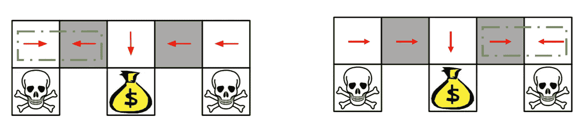

代理陷入灰色块(来自大卫·西尔弗讲座[https://www.davidsilver.uk/teaching/](https://www.davidsilver.uk/teaching/))

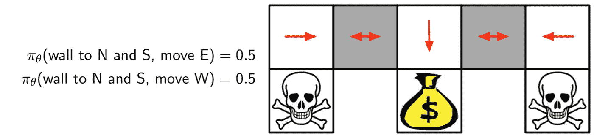

使用随机策略，当你从一个分布中选择行动时，你可能不会被卡住。(摘自大卫·西尔弗讲座[https://www.davidsilver.uk/teaching/](https://www.davidsilver.uk/teaching/))

到目前为止，我们了解另一种类型的算法，它比深度 Q 学习有一些好处，称为策略梯度，它遵循梯度规则来寻找参数，将状态映射到最佳行动。

那么我们应该如何在政策空间中搜索呢？如果我们的选择能最大化预期的回报，那么它就是好的。

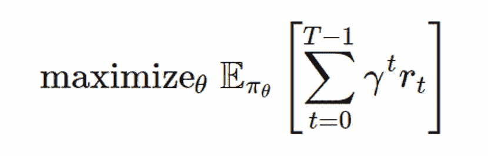

所以在偶发环境中，奖励的贴现总额意味着从起点返回。假设你总是从 s0 开始，那么使用该策略从 s0 得到的期望回报就是你的 j。你可以将上面的公式改写为:

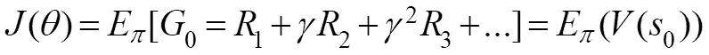

如果你不能依靠一个特定的开始状态，那么你可以使用平均值。您可以对不同的 V(s)进行加权平均，其中权重是从该状态开始的概率(或相应状态出现的概率)。)

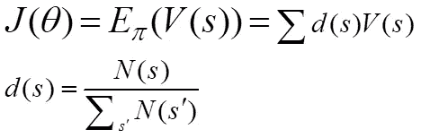

现在你可以将 V(s)改写为期望回报的加权平均值，其中权重是选择特定行动的概率。

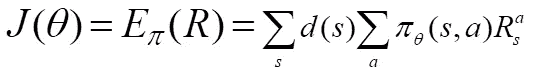

现在我们有了目标函数，我们应该使用梯度上升(与梯度下降相反)来最大化 j。

这里我们首先需要两个引理。

**引理 1** :

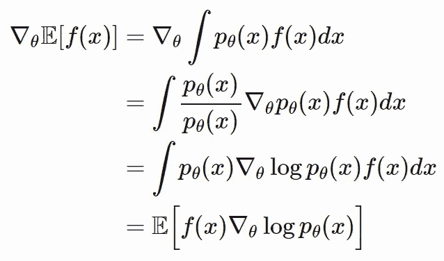

**引理 2** :

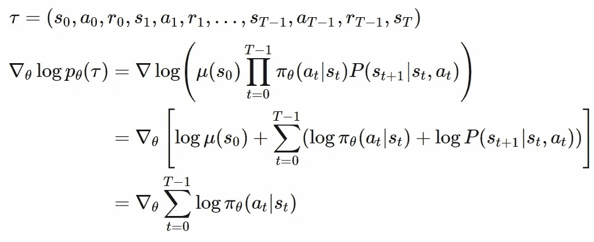

将这两个引理与我们的目标函数相结合，我们可以计算 j 的梯度。因此，现在梯度仅应用我们的策略，该策略可以使用神经网络来建模。

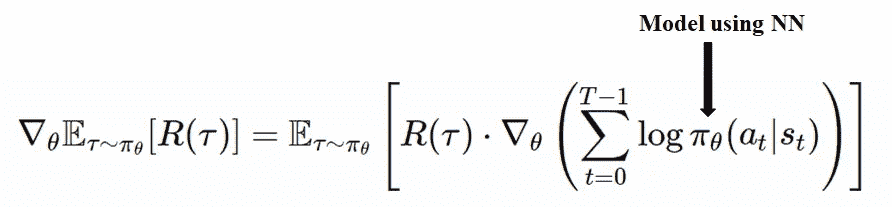

把它写成一个简单的等式我们最后的梯度政策方法叫做**加强**。

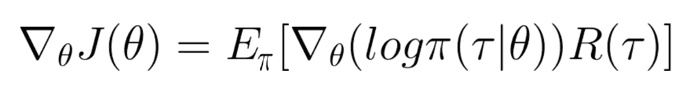

你觉得这里有什么问题吗？！

这是政策梯度法的全部公式！作为总结，我把萨顿书中的算法:

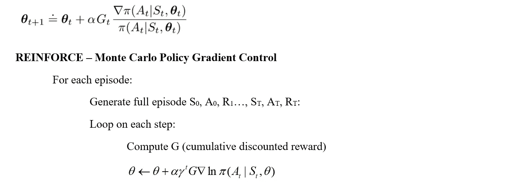

加固方法

但是有一个小问题。我们在目标中使用 R，所以我们应该知道在一集结束时的累积奖励。这有点遵守蒙特卡洛规则。等待代理完成剧集，然后更改参数并更新策略。为什么这很重要？如果你在一集中间做了一个错误的动作，但是这一集总体上取得了成功，那么你认为所有的动作都足够好了。这意味着当你看到整体效果时，你不能意识到一个行为是否对情节产生了负面影响。所以也许你可以用你可能从那个状态和行动中得到的预期回报来代替 R。

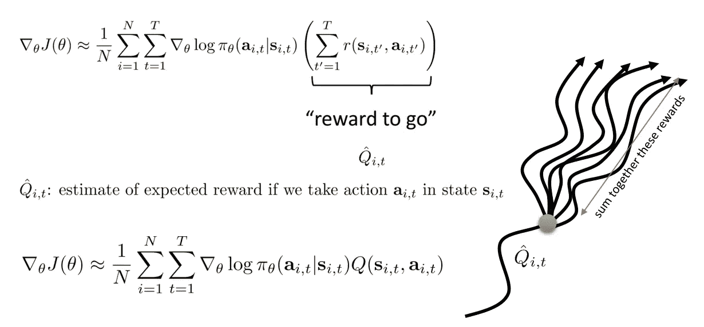

在这个变化之后，你现在也应该估计 Q 值了。这是第二种叫**演员批评**的方法。我们将在另一个故事中讨论这个话题。请务必理解我们一步一步走过的路。