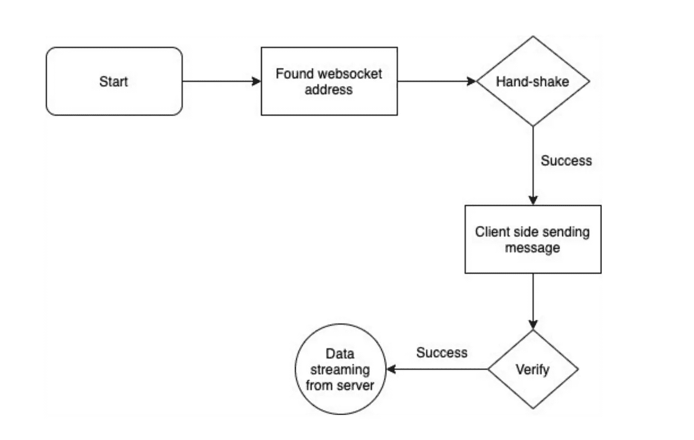
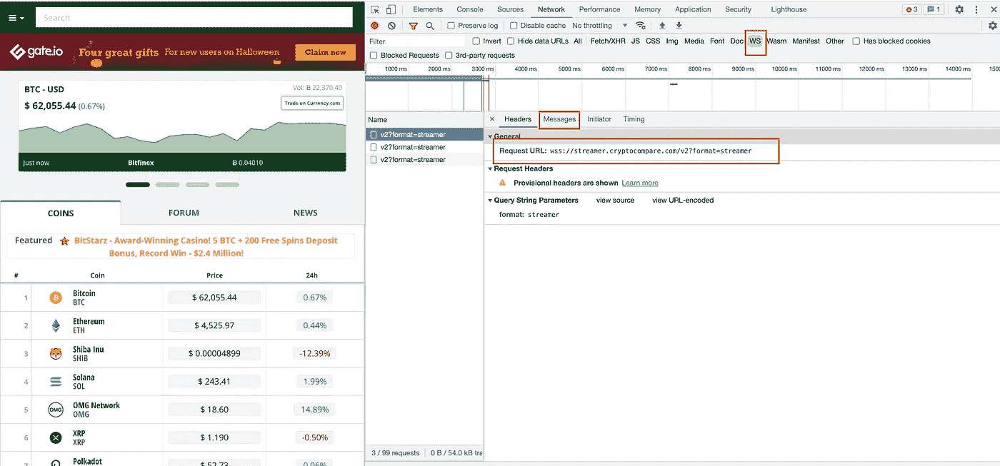
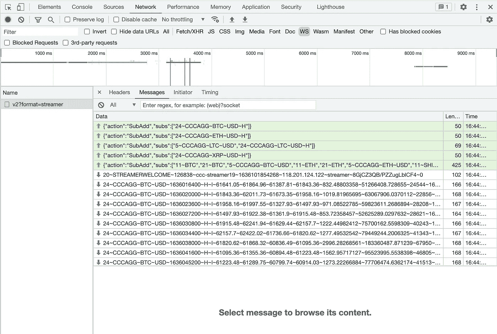
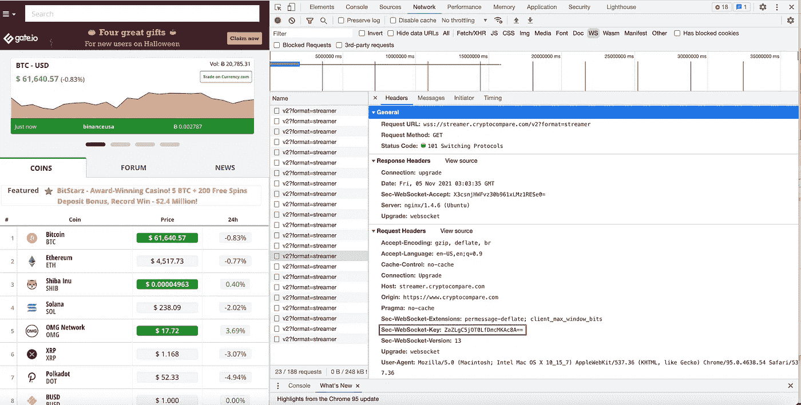
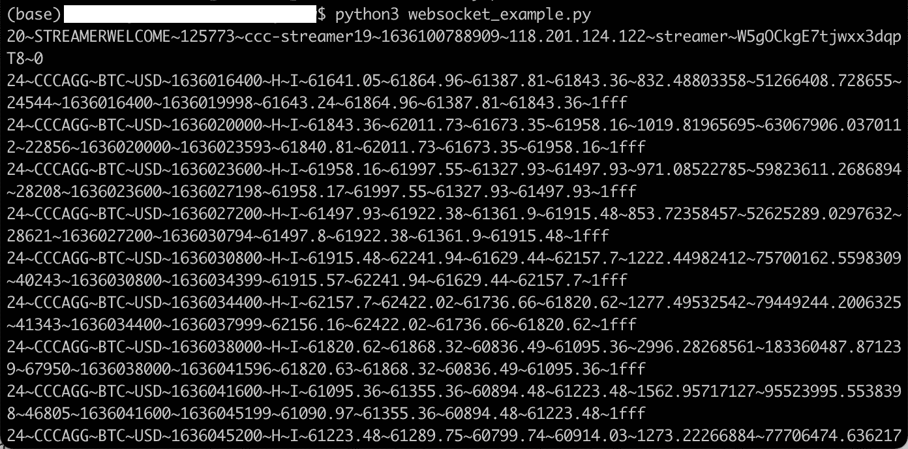

# 为什么应该使用 WebSocket 来检索实时加密数据

> 原文：<https://pub.towardsai.net/why-you-should-use-websocket-to-retrieve-live-crypto-data-27d3b29f210c?source=collection_archive---------0----------------------->

## [网页抓取](https://towardsai.net/p/category/web-scraping)

**获取千变万化数据的救命妙招！**

由[绝对视觉](https://unsplash.com/@freegraphictoday?utm_source=unsplash&utm_medium=referral&utm_content=creditCopyText)在 [Unsplash](https://unsplash.com/s/photos/ideas?utm_source=unsplash&utm_medium=referral&utm_content=creditCopyText) 上拍摄

自动化从网站检索数据过程的最好方法之一是构建一个网络爬虫来处理这项工作。您可以创建一个网络爬虫，用各种方法抓取数据。例如，如果您希望每隔几个小时或每周从网站检索一次数据，您可以编写一个程序来自动发送 HTTP 请求或打开浏览器来这样做，因为这样做的频率较低。但是，如果您想在几秒钟内抓取数据，最好还是通过 web 套接字连接。

在讨论 web scraper 编码的实际部分之前，让我们简单地讨论一下它是什么，以及通常什么时候你会使用它。

让我把它放在现实生活中…

一天，你告诉你的朋友，你将打电话给她讨论一个你不理解的概念。所以，当你打电话给你的朋友(握手)时，你的朋友会检查谁在打电话，然后决定是否接听电话(验证)。在您的朋友完成验证并接听您的电话后，他将向您解释这个概念，并为您的来电查询(来自服务器的数据流)保持线路畅通。

解释 web 套接字过程的流程图

通常，您应该考虑使用 web 套接字来检索加密货币、实时股票价格、实时博彩、实时消息传递、交易平台等数据。

了解这些概念后，让我们描绘一个真实的场景，并从那里开始工作。例如，如果你想建立一个实时交易机器人来交易加密货币，并且你已经有了一套规则来击败市场。

> 下一步是什么？

你需要有一个网站，你可以检索实时数据。您遇到了一些 API，但是担心这些 API 会失败，最终可能导致损失金钱。因此，你决定找一个提供实时加密价格的网站。让我们挑选 [**Cryptocompare**](https://www.cryptocompare.com/) (全球加密货币市场数据提供商)来举例说明。

# **探索**

当您使用 chrome 导航到该网站时，右键单击并单击 inspect，然后单击 WS 选项卡。现在，您应该可以看到与上面的截图类似的视图。您会注意到这个 web 套接字的请求 url 是 WSS://streamer . crypto compare . com/v2？格式=流。

接下来，让我们导航到 message 选项卡，获取需要发送到服务器的消息，以便完成验证。

现在，你会看到有两种类型的箭头-

1.  绿色箭头后面的消息表示您的浏览器正在向服务器发送的传出消息。
2.  红色箭头后面的消息是您的浏览器从服务器接收的传入数据。

到目前为止，您只需要通过右键单击邮件并选择“复制邮件”来复制绿色箭头的邮件。在编码部分，您将需要这 5 个绿色箭头消息。

# **编码**

我附上了一个代码片段供您尝试。您需要注意的是将 WebSocket 密钥(*“Sec-web socket-Key”*)更改为您可以从浏览器的“Headers”选项卡下获得的密钥。下面的例子:

寻找你的“*Sec-web socket-Key”*

下面总结了上面代码片段的作用:

1.  使用请求 url 创建连接

2.向服务器发送 5 条外发消息

3.坐下来，放松地等待收到的信息，通常是在几秒钟内。

# 结果

将代码片段保存到 python 文件并运行它。您应该会看到类似的输出。

# 你可能面临的问题

这里有一些你可能会面临的问题，以及你如何解决它。

1.  错误消息:连接已经关闭

如果你看到这个消息，通常意味着服务器正试图阻止你连接，解决这个问题的最快方法是改变你的代理或 VPN。

2.HTTP 状态代码:401(未授权)

401 响应意味着服务器不接受您的连接请求。如果服务器工作正常，那么您的连接请求有问题。简而言之，通常这意味着您使用了错误的凭证。要解决这个问题，请检查请求头并相应地修改它们。

3.HTTP 状态代码:403(禁止)

类似于 401，但在这种情况下，重新认证不会有任何影响。这可能意味着原始的应用程序逻辑发生了变化，例如握手过程发生了变化。因此，为了确保它平稳运行，请检查您的请求头和需要发送到服务器的消息。

# 最终想法

照片由[马太·亨利](https://unsplash.com/@matthewhenry?utm_source=unsplash&utm_medium=referral&utm_content=creditCopyText)在 [Unsplash](https://unsplash.com/?utm_source=unsplash&utm_medium=referral&utm_content=creditCopyText) 上拍摄

写这篇文章是因为以前的旧代码片段不起作用了。因此，我综合了读者提出的所有错误和问题，并做出了相应的回答。

如果你发现这个代码在将来不能工作，请在下面自由评论，我会相应地回答他们。

谢谢你一直读到最后。下期帖子再见！

# 关于作者

 [## ●伟鸿-中等

### 利用数据做出明智的决定与 2019 年 8 月相比，Airbnb 的总收入增长了 21%……

medium.com](https://medium.com/@lowweihong) 

[Low 魏宏](https://www.linkedin.com/in/lowweihong/?source=post_page---------------------------)是 Shopee 的数据科学家。他的经验更多地涉及抓取网站，创建数据管道，以及实现机器学习模型来解决业务问题。

他提供爬行服务，可以为你提供你需要的准确和干净的数据。你可以访问[这个网站](https://www.thedataknight.com/)查看他的作品集，也可以联系他获取**的抓取服务**。

你可以在 [LinkedIn](https://www.linkedin.com/in/lowweihong/?source=post_page---------------------------) 和 [Medium](https://medium.com/@lowweihong?source=post_page---------------------------) 上和他联系。