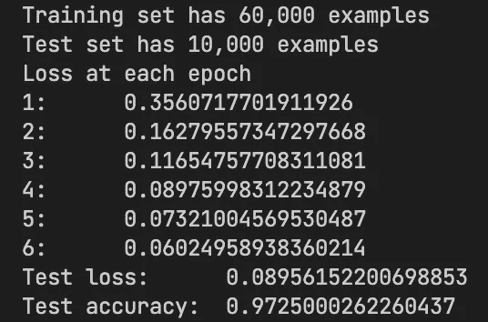
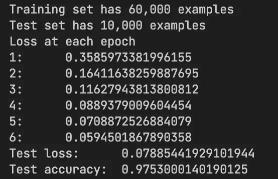
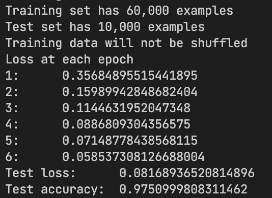
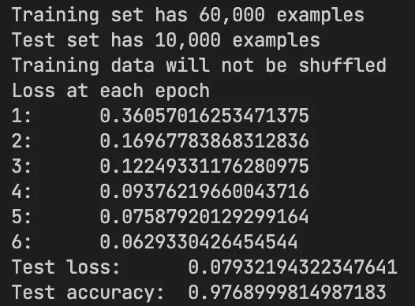
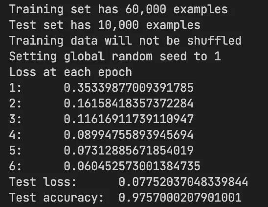
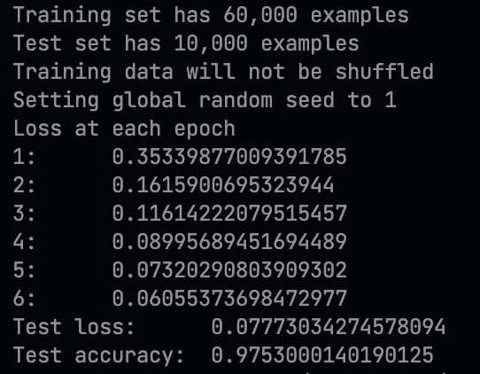
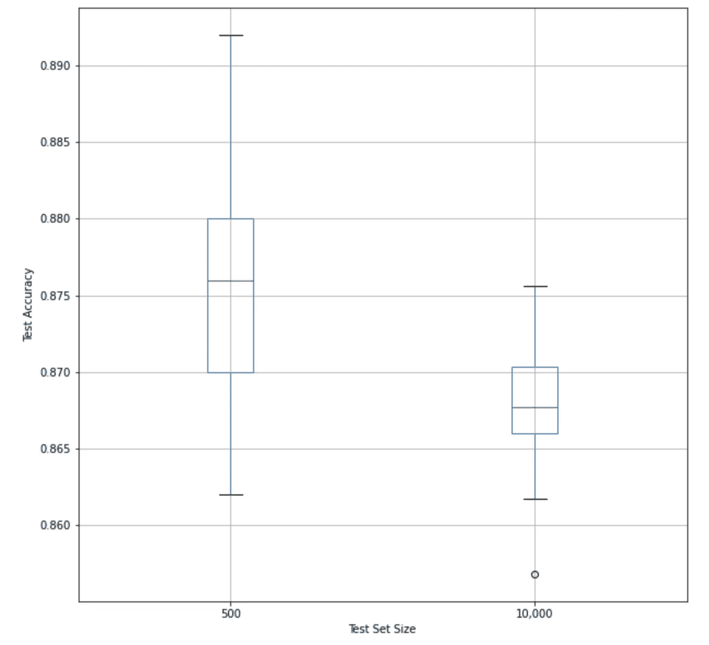

# 为什么你的构建管道总是让你的机器学习模型失败

> 原文：<https://pub.towardsai.net/why-your-build-pipelines-always-fail-your-machine-learning-model-a09484d551f6?source=collection_archive---------4----------------------->

## [机器学习](https://towardsai.net/p/category/machine-learning)

## 机器学习代码不确定的 3 种方式

由[马库斯·斯皮斯克](https://unsplash.com/@markusspiske?utm_source=medium&utm_medium=referral)在 [Unsplash](https://unsplash.com?utm_source=medium&utm_medium=referral) 上拍摄的照片

# 介绍

想象你在做一个机器学习模型(不管任务是什么)。在花费数周时间在您的本地机器上开发它之后，您终于能够让它在您的测试集上体面地执行了。现在，您发现当通过您的构建管道进行部署时，模型总是失败。这个模型是在您在本地开发时使用的同一个测试集上测试的，那么结果如何呢？

本文将解释这种奇怪现象的原因，并在最后给出一个关于如何检测真正的模型回归的建议。

重现这里描述的结果的代码可以在这个[报告](https://github.com/hsm207/why_models_fail)中找到。

# 一个故事

让我们从局部发展阶段开始。

## 本地模型

为简单起见，我们假设您正在构建一个模型来对 MNIST 数据集进行分类。你的目标是建立一个在测试集上至少 95%准确的分类器。

经过几次尝试后，你终于做到了:

图 1:第一个超过 95%准确率的模型

然而，运行训练和评估逻辑再次产生不同的结果:

图 2:运行相同的模型训练和测试代码会产生不同的结果

结果略有不同，但这足以让你想知道变化的原因。完全相同的代码运行多次应该会产生相同的结果，不是吗？

然后你想起来你在训练的时候打开了数据洗牌。这是建立机器学习模型时的一种常见做法(参见[此处](https://datascience.stackexchange.com/questions/24511/why-should-the-data-be-shuffled-for-machine-learning-tasks)的解释)。也许如果你在训练中禁用了随机洗牌，那么在不同的跑步中，结果会保持不变？

以下是在训练期间禁用随机洗牌后的首次运行结果:

图 3:在训练期间关闭数据随机播放后的第一次运行

这是第二次运行的结果:

图 4:训练期间关闭数据随机播放后的第二次运行

结果还是不一样！但至少现在差别变小了…

然后，您记得您的模型在训练开始时随机初始化其参数！所以，[修复随机种子](https://github.com/tensorflow/tensorflow/blob/c256c071bb26e1e13b4666d1b3e229e110bc914a/tensorflow/python/framework/random_seed.py#L215-L216)就一定能修复这个问题，不是吗？

当您将随机种子设置为 1:

图 5:在训练期间修复随机种子并禁用数据混洗后的第一次运行

第二轮，我们有:

图 6:在训练期间修复随机种子并禁用数据混洗后的第二次运行

太好了！结果是相同的，我们可以继续构建一个管道来训练和部署模型到生产中。

## 管道模型

从构建管道中读取日志时，您会注意到:

图 7:来自构建管道的培训和测试日志

随机种子已被固定为 1，训练数据洗牌已被禁用，就像你在本地机器上所做的一样。但是为什么结果不一样呢？

注意到管道和本地模型之间的差异非常小，您怀疑这可能是硬件浮点运算实现中的一个错误。

好消息是，这个“bug”已经在互联网上被讨论了很多(例如，见这里的、这里的和这里的)。坏消息是，这不是一个错误。简而言之，机器之间的差异是由于浮点规范的定义方式和硬件供应商实现它们的方式造成的。

因此，你将不得不忍受这种差异。

# 实际例子

值得注意的是，故事中使用的数据集是 MNIST 数据集。它有 60，000 个训练样本和 10，000 个测试样本。考虑到问题的复杂性，这足以确保机器学习模型能够在每次运行时收敛。

但是实际上，你不太可能从这么大的数据集开始。

让我们考虑数据集大小对同一台机器上运行的变化的影响。

如果我们只有 1，000 个训练示例和 500 个测试示例，则变化如下:

图 8:假设有 1000 个训练样本，测试准确度的变化

由于只有 1，000 个训练示例，我们预计该模型相对于在整个训练集上训练时表现不佳。图 8 证实了这一点(在整个测试集上进行测试时，中值测试准确度介于 86.5 %和 87.0 %之间，相比之下，在整个训练集上进行训练时，中值测试准确度为 97 %)。

图 8 还显示，当只对 500 个测试实例进行评估时，测试精度的变化明显高于对整个测试集的评估。

有了正确的数据集、固定的随机种子，并且没有数据重排，您可以在 500 个样本的测试集上获得 89%的测试准确性，这并不是模型真实性能的真实反映。因此，来自随机种子和数据洗牌的随机性不应该被关闭，以便您可以估计您的模型性能的不确定性。

但是，如何确保模型的后续工作(例如，添加新特性、超参数调整)不会意外地引入回归呢？

# 如何检查模型回归

上一节已经表明，在小数据集上训练和测试的模型在它们的评估指标上可以有很多变化。因此，如果您有一个准确率为 90%的模型，下一次运行可能会偶然返回 88%的准确率，这使得设置检测回归的最小阈值变得困难。

人们可能会试图寻找一个随机种子，使本地模型和管道模型的结果差异尽可能小，但我不认为这是对时间的最佳利用。

相反，我建议在管道中运行几次训练和测试作业，并计算运行中评估指标的平均值和标准偏差。这些数字在机器之间是稳定的，因此可以用来可靠地确定是否引入了回归。

# 结论

本文描述了机器学习模型每次在同一数据集上训练时会产生不同结果的 3 个原因，即:

1.  输入:将训练数据成批输入模型的方式很重要
2.  模型架构:随机权重初始化、随机采样和丢弃等技术会通过设计将随机性引入模型的输出
3.  硬件:不同的硬件可以不同地实现浮点运算

本文还推荐使用通过一系列训练和测试运行计算的评估指标的平均值和标准偏差作为检测模型回归的方法。

我希望这对您有所帮助。