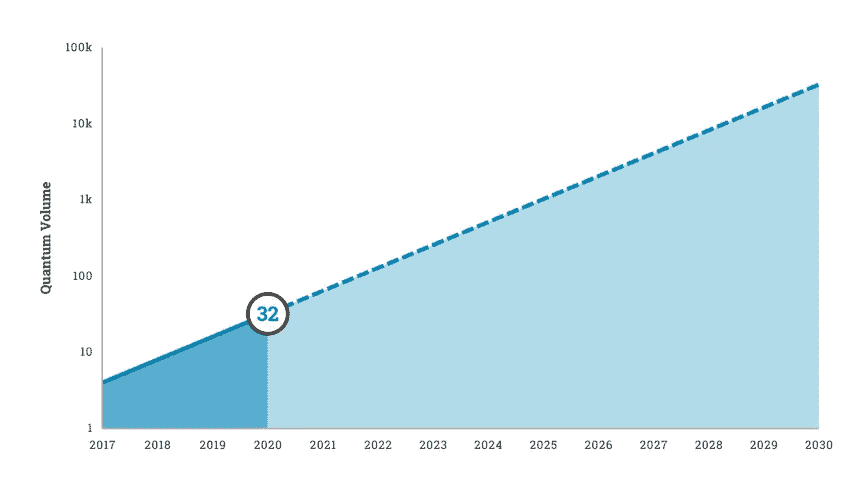
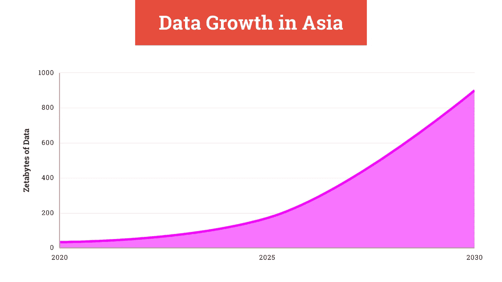

# 下一个 AI 会是超智能的吗？

> 原文：<https://pub.towardsai.net/will-the-next-ai-be-superintelligent-32e8ece7ec0b?source=collection_archive---------4----------------------->

## [人工智能](https://towardsai.net/p/category/artificial-intelligence)，[观点](https://towardsai.net/p/category/opinion)

## 人工智能已经可以编码了，下一个大的人工智能将会更好*。*

亚历山大·安德鲁斯在 [Unsplash](https://unsplash.com?utm_source=medium&utm_medium=referral) 上的照片

2005 年，雷·库兹韦尔说，“奇点临近了。”现在，人工智能可以用任何语言编写代码，我们正在向更好的人工智能迈进。超级智能就快到了。

GPT-3 通过对大量数据进行训练获得了“令人难以置信”的结果:基本上是整个互联网。它不需要针对您的特定用例进行训练(零射击学习)。它能骗过 88%的人，我们还在婴儿阶段。👶

我将阐述为什么我们不会达到超智能的三个常见论点: **(1)** 我们将触及数据和处理极限， **(2)** 我们不理解意识， **(3)** 人工智能现在是愚蠢的，所以它将永远是。

# “我们将达到数据和处理极限”

拥有 1750 亿个参数的 GPT 3 号是 GPT 2 号的 117 倍，是 GPT 的 10 倍。每个版本都比上一个版本使用更多的计算。

最先进的语言模型每年至少增加 10 倍。大脑有超过 100 万亿个突触。GPT 3 号需要增长三个数量级才能达到这个尺寸。我们可以估计达到大脑大小的人工智能模型大约需要 3 年时间。

批评家们说我们正在接近摩尔定律的极限。然而，在这种压力下，新的计算模式正在出现。特别是，TPU 实现大大提高了 GPU 的效率，而[量子](https://medium.com/towards-artificial-intelligence/the-limits-of-deep-learning-96511b36087b)计算范式提供了持续指数增长的潜力。

按作者。

一种范式的死亡导致一种新的范式已经发生了很多次:“从电磁计算器到基于继电器的计算机到真空管到分立晶体管到集成电路，”正如库兹韦尔在 2005 年写道。

此外，6G 有望将数据速率提高 50 倍，将延迟减少 10 倍，并将能效提高一倍——使用太赫兹频率和新型天线等技术——从而实现更大的人工智能。

 [## 6G 及其对人工智能的影响

### 探索三星的 6G 白皮书。

medium.com](https://medium.com/towards-artificial-intelligence/6g-and-its-implications-for-ai-288d403cec0c) 

随着计算和网络速度的指数级增长，我们也将看到数据爆炸。光是亚洲就有 [33](https://news.microsoft.com/en-hk/2020/01/02/2020-2030-the-data-decade/) ZB 的数据。到 2025 年，将会有 175 个 ZB，到 2030 年，亚洲可能会达到万亿字节。

按作者。

# “我们不了解意识”

这个论点的另一个版本是，我们简单地说*不能*数字化复制意识，因此我们不能拥有超级智慧。

部分原因是拒绝接受威胁我们世界观的观点。任何认为*智人*是特殊的，比其他任何人都优越的人，都会感到被超级智慧的想法所威胁。同样，哥白尼和达尔文的观点在当时也遭到了抵制。

此外，我们不需要理解意识的“规则”来制造人类级别的智能，因为它不是关于编写数十亿行代码，而是关于创建一个学习、自组织和受生物启发的神经网络。神经网络通过从数据中学习变得聪明，而不是通过一些知识的“注入”。

还出现了新的神经网络架构，以更接近地模拟大脑。

 [## BrainOS——最像大脑的人工智能

### 应用神经科学实现更高效、更智能的人工智能。

towardsdatascience.com](https://towardsdatascience.com/brainos-the-most-brain-like-ai-61b334c7658b) 

在很多方面，机器已经很优越了。

计算机硬件和软件可以很容易地升级——不像我们自己的大脑大多是固定的架构。脑细胞需要[秒](https://www.livescience.com/14735-neuron-synapse-speed-clocked.html)才能相互交流，而顶级超级计算机可以运行[415.53](https://www.bbc.com/news/world-asia-53147684#:~:text=The%20newly%20crowned%20world's%20fastest,IBM%20machine%20in%20the%20US.)petaflops——或每秒 4155.3 亿次运算。此外，我们大脑中可以容纳的神经元连接数量有限，而神经网络的规模将在未来几年中增长得更大。

# “人工智能现在是愚蠢的，所以它将永远是”

外行人提出了一个非常普遍的论点，大意是“我从这个人工智能得到了一个看起来很傻的结果，这意味着人工智能是愚蠢的。”

这类似于批评最初的 iPhone、早期的区块链或任何其他新兴技术。正如我们所探索的，数据、计算和速度正在变得越来越好。

此外，许多批评者只是错误地使用了这项技术。

来自 [Pexels](https://www.pexels.com/photo/cheerful-senior-mother-and-adult-daughter-using-smartphone-together-3791664/?utm_content=attributionCopyText&utm_medium=referral&utm_source=pexels) 的 Andrea Piacquadio 的照片

为了获得更好的效果，你需要按照说明去做。例如，GPT-3 *不需要任何额外的训练就可以工作*，所以你可以告诉它写 Python、诗歌、说唱或者其他任何东西。

然而，通过“少量学习”，或者用少量训练数据将模型微调到您的用例，它的准确性会大大提高。如果你要判断 GPT-3，你应该使用高质量数据的少量学习。

最后，有太多我们看不到和不知道的东西。

批评者看到了“冰山一角”——关于 GPT-3 的病毒式推特，也许是 TechCrunch 或 Wired 的文章，然后就收工了。极少数人会费心去测试它，只有非常非常少的人使用少量的学习来看看它真正的能力。这只是 GPT 3 号。每天都有 AI 研究论文出来，连一小部分都没办法过。

他们正在寻找一个微小的、有偏见的人工智能子集，以便在该领域进行广泛的研究。

# 结论

人工智能不断取得突破，我们将继续看到数据爆炸、量子计算和 6G 等技术以及架构创新带来的指数级改进。批评家倾向于忽略这些事情，嘲笑人工智能的现状，忽视未来。

关于人工智能未来的更多信息，请了解[无代码分析](https://towardsdatascience.com/towards-no-code-analytics-making-everyone-a-data-scientist-f7693bd0abfd)和 [AutoML](https://towardsdatascience.com/will-automl-be-the-end-of-data-scientists-9af3e63990e0) 。像 [Apteo](http://apteo.co/) 这样的工具结合了这些趋势，所以任何人都可以不用编码就能构建 AI。