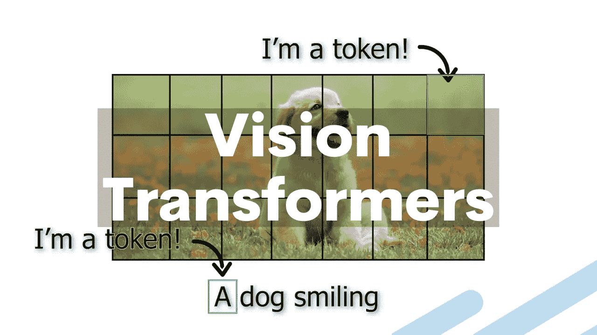
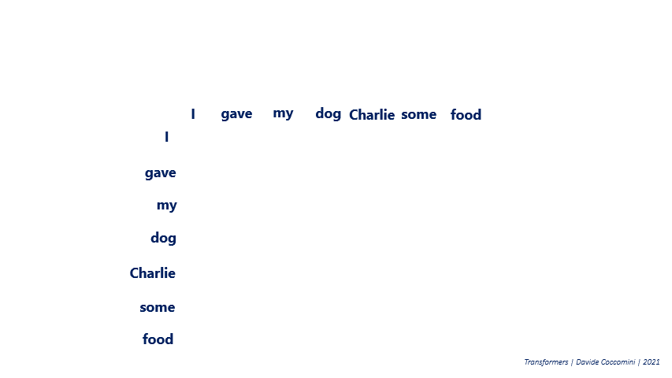
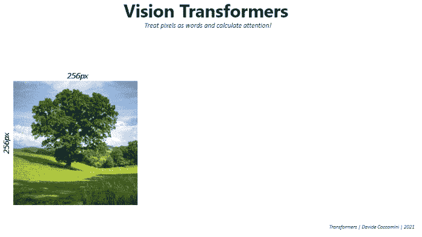
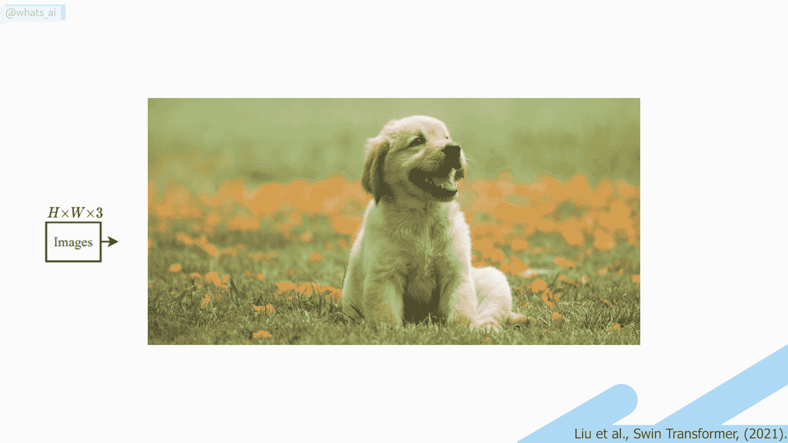
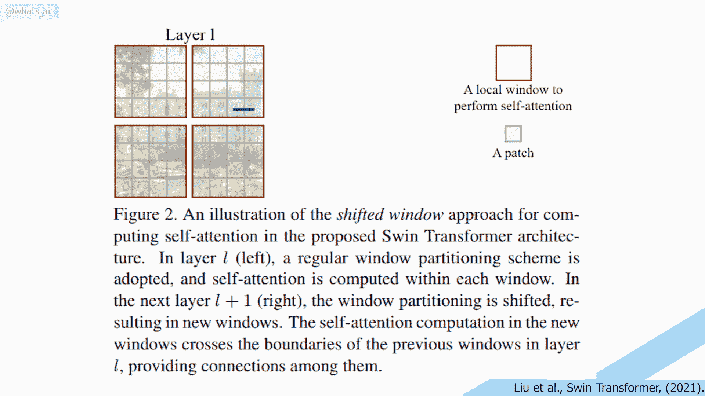
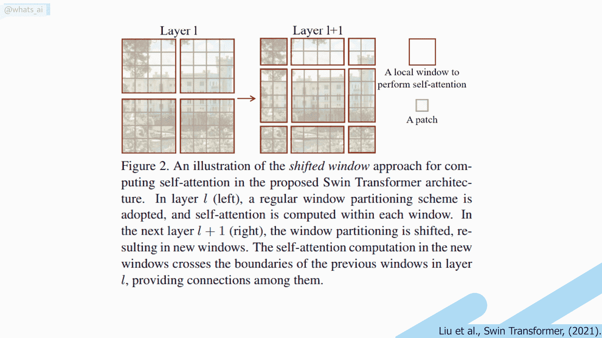

# 变形金刚会取代计算机视觉中的 CNN 吗？

> 原文：<https://pub.towardsai.net/will-transformers-replace-cnns-in-computer-vision-55657a196833?source=collection_archive---------0----------------------->

## [计算机视觉](https://towardsai.net/p/category/computer-vision)

## 在不到 5 分钟的时间内，您将通过一篇名为 Swin transformer 的新论文了解如何将 Transformer 架构应用于计算机视觉

> 原载于 [louisbouchard.ai](https://www.louisbouchard.ai/will-transformers-replace-cnns-for-vision/) ，前两天在[我的博客](https://www.louisbouchard.ai/tag/artificial-intelligence/)上看到的！

图片由作者提供。

这篇文章很可能是关于所有计算机视觉应用的下一代神经网络:transformer 架构。你肯定已经听说过自然语言处理(NLP)领域的这种架构，主要是在 2020 年制造了很多噪音的 GPT3。变压器可以用作许多不同应用的通用主干，而不仅仅是 NLP。几分钟后，你就会知道如何将变压器架构应用于计算机视觉，这是微软研究院的泽·莉雅等人发表的一篇名为 Swin Transformer 的新论文[1]。

这篇文章可能没有通常的那么华丽，因为它并没有真正展示一个精确应用的实际结果。相反，研究人员[1]展示了如何将变形金刚的架构从文本输入调整为图像，超越了计算机视觉最先进的卷积神经网络，在我看来，这比精确度的轻微提高更令人兴奋。当然，他们会提供代码让你自己实现！链接在下面的参考资料中。

## 为什么用变形金刚而不用 CNN？

但是，为什么我们要尝试在计算机视觉应用中取代卷积神经网络呢？这是因为变压器可以有效地使用更多的内存，并且在处理复杂任务时更加强大。这当然是根据你有数据训练它的事实。变形金刚还使用了 2017 年论文[中介绍的注意力机制](https://arxiv.org/abs/1706.03762)【3】。注意力允许 transformer 架构以并行方式进行计算。

自然语言处理中的自我注意过程。图片由 [Davide Coccomini](https://towardsdatascience.com/transformers-an-exciting-revolution-from-text-to-videos-dc70a15e617b) 经许可转贴。

与 CNN 相比，它可以同时从输入及其相互关系中提取我们需要的所有信息。CNN 更加本地化，使用小过滤器将信息压缩成一个通用的答案。虽然这种体系结构对于一般的分类任务来说是强大的，但是它不具有许多任务(例如实例识别)所必需的空间信息。这是因为卷积不考虑距离像素关系。

NLP(左)和计算机视觉(右)的变形金刚中的自我关注示例。图片由作者提供。

在 NLP 中，典型的输入类型是计算机视觉案例中的一个句子和一幅图像。为了快速介绍注意力的概念，让我们举一个简单的 NLP 例子，发送一个句子，将其翻译成 transformer 网络。在这种情况下，注意力基本上是测量输入句子中的每个单词如何与输出翻译句子中的每个单词相关联。同样，也有我们所谓的自我关注，它可以被看作是对同一个句子中一个特定单词对所有其他单词的影响的测量。这个相同的过程可以应用于图像，计算图像块的注意力和它们彼此之间的关系，我们将在文章中进一步讨论。

## 计算机视觉中的变形金刚

现在我们知道变形金刚非常有趣，但在计算机视觉应用方面还有一个问题。事实上，就像流行的说法“一张图片胜过千言万语”，图片包含的信息比句子多得多，因此我们必须调整基本 transformer 的架构，以有效地处理图像。这就是本文的内容。

视觉变形金刚的复杂性。图片由[大卫·考科米尼](https://towardsdatascience.com/transformers-an-exciting-revolution-from-text-to-videos-dc70a15e617b)经许可转贴。

这是由于其自我关注的计算复杂度与图像大小成二次关系。从而增加了计算时间和内存需求。相反，研究人员用图像大小的线性计算复杂度代替了这种二次计算复杂度。

Swin Transformer 架构的第一步，图像标记化。图片由作者提供。

## Swin 变压器[1] [2]

实现这一点的过程非常简单。首先，像大多数计算机视觉任务一样，一幅 RGB 图像被发送到网络。该图像被分割成小块，每个小块被视为一个令牌。这些记号的特征是像素本身的 RGB 值。与 NLP 相比，您可以将此视为整体图像是句子，每个补丁是该句子的单词。自我关注被应用在每个补丁上，这里被称为窗口。然后，窗口被移动，导致新的窗口配置来再次应用自我注意。这允许在窗口之间创建连接，同时保持这种窗口结构的计算效率。与卷积神经网络相比，这是非常有趣的，因为它允许出现长距离像素关系。

自我关注在 windows 上的应用。图片由作者提供。

这只是第一阶段。第二阶段非常类似，但是将每组两个相邻面片的特征连接起来，将分辨率下采样为原来的两倍。这个过程在阶段 3 和 4 中重复两次，产生与典型卷积网络(如雷斯网和 VGG)相同的特征映射分辨率。

你可能会说这与卷积架构和使用点积的滤波器非常相似。嗯，是也不是。

卷积过程与自我注意。图片由作者提供。

卷积的强大之处在于，滤波器全局使用固定权重，从而实现了卷积的平移不变性，使其成为一种强大的广义卷积。在自我关注中，权重不是全局固定的。相反，它们依赖于当地环境本身。因此，自我关注考虑了每个像素，也考虑了它与其他像素的关系。

移位窗长程关系问题。图片由作者提供。

此外，他们的移位窗口技术允许出现长距离像素关系。不幸的是，这些长程关系只出现在相邻的窗口中。因此，失去了非常长距离的关系，表明当涉及到计算机视觉时，变压器架构仍有改进的空间。

## 结论

正如他们在论文中所说:

> 我们相信，跨计算机视觉和自然语言处理的统一架构可以使这两个领域受益，因为它将促进视觉和文本信号的联合建模，并且来自这两个领域的建模知识可以更深入地共享。[1]第 2 页

我完全同意。我认为为自然语言处理和计算机视觉使用相似的架构可以大大加快研究进程。当然，变形金刚仍然高度依赖数据，没有人能说它是否会是 NLP 或计算机视觉的未来。尽管如此，这无疑是这两个领域向前迈出的重要一步！

我希望这篇文章能给你一个很好的介绍变形金刚，以及如何将它们应用到计算机视觉应用中。

感谢您的阅读！在[我的博客](https://www.louisbouchard.me/ganverse3d/)上找到更多像这样的文章，在它们被分享到媒体上之前阅读它们！

如果你喜欢我的工作，并想与人工智能保持同步，你绝对应该关注我的其他社交媒体账户( [LinkedIn](https://www.linkedin.com/in/whats-ai/) 、 [Twitter](https://twitter.com/Whats_AI) )，并订阅我的每周人工智能 [**简讯**](http://eepurl.com/huGLT5) ！

## 支持我:

*   支持我的最好方式是在 [**媒体**](https://medium.com/@whats-ai) 上关注我，或者如果你喜欢视频格式，在[**YouTube**](https://www.youtube.com/channel/UCUzGQrN-lyyc0BWTYoJM_Sg)**上订阅我的频道。**
*   **支持我在 [**上的工作**](https://www.patreon.com/whatsai)**
*   **加入我们的 [**Discord 社区:** **一起学 AI**](https://discord.gg/learnaitogether)和*分享你的项目、论文、最佳课程、寻找 Kaggle 队友等等！***

## **参考**

**[1]刘，z .等，2021， [Swin Transformer:使用移位窗口的分级视觉 Transformer](https://arxiv.org/abs/2103.14030v1)， *arXiv 预印本* [，](https://www.youtube.com/redirect?q=https%3A%2F%2Farxiv.org%2Fabs%2F2103.14030v1&redir_token=QUFFLUhqbWs5elJBa2FkM0lmaHl5dTg1c0hQeVJTMFZPQXxBQ3Jtc0trMXRsUVpya2Qtb01vazY4NnktMWVldTZYRXQxaHZqamNpcGhDNzFrdTk1SGlzQzNsNnBuYXh2Y1J3dUJsSjZKY2lnQWhHU3RKcEpGSGV1VEV2TUM5N0s4Ni1JSXZuRUlSNm81dC1kcXZ4Z1FQakJwdw%3D%3D&event=comments&stzid=UgxsfplcSCH4gNnmBx14AaABAg)**

**[2] [Swin Transformer](https://github.com/microsoft/Swin-Transformer) 、莉雅、z 等人、GitHub code、【https://github.com/microsoft/Swin-Transformer】T2**

**[3]瓦斯瓦尼，a .等人，2017 年。【https://arxiv.org/abs/1706.03762， *arXiv 预印本[，](https://arxiv.org/abs/1706.03762)。***