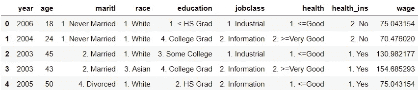
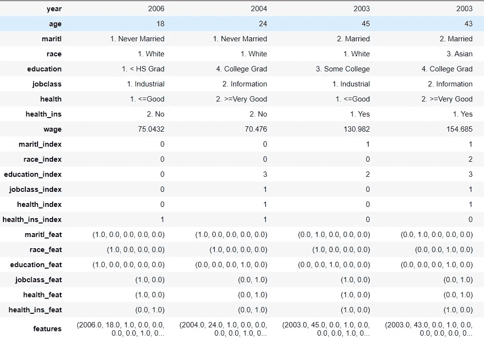
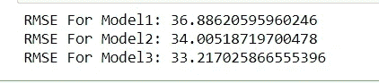
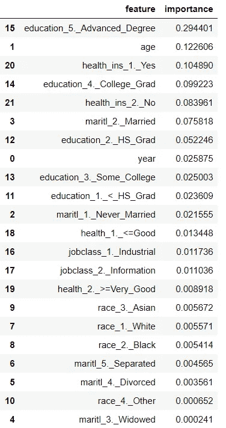

# 你的教育会给你带来丰厚的报酬吗？

> 原文：<https://pub.towardsai.net/will-your-education-pay-you-well-d6aeb44248fa?source=collection_archive---------0----------------------->

[https://pix abay . com/photos/woman-大人-人-钱-3261425/](https://pixabay.com/photos/woman-adult-people-money-3261425/)

## 使用随机森林的工资分析

工资分析是根据员工的属性对工资进行比较的过程。当然，有几个因素，比如公司、地点，对工资有影响。然而，我们将分析大西洋中部的工资数据，可在[这里](https://rdrr.io/cran/ISLR/man/Wage.html)获得。

出于执行原因，我使用了 PySpark 和 Apache Spark Docker Jupyter Notebook，您也可以使用 python 和 scikit 或其他一些包。

我们应该仔细阅读我们的信息并理解它的样子:

# 特征工程

我们有许多分类变量，如婚姻、种族、教育、工作类别、健康和健康信息，所以我们需要将它们转换为整数，因为 ML 模型不能处理分类特征。因此，我们使用 [StringIndexer](https://spark.apache.org/docs/latest/ml-features#stringindexer) 将一个列转换为索引列。我们还使用 [One-hot 编码](http://en.wikipedia.org/wiki/One-hot)，它将一个分类特征(表示为标签索引)映射到一个二进制向量，该向量最多具有一个单值，指示所有特征值集合中特定特征值的存在。最后，我们使用 vector assembler，合并所有变量，并将它们存储在 features 列中。我们创建一个管道来组织预处理代码。具体来说，一个[管道](https://www.kaggle.com/alexisbcook/pipelines)捆绑了预处理和建模步骤，因此我们可以使用整个捆绑包，就像它是一个单独的步骤一样。

特征工程的结果

# 建模—随机森林

现在，我们创建三个管道，包含三个不同的随机森林回归，这些回归接受来自`**wage_df**`的所有特征来预测`**wage**`

# 估价

我们将利用 **RMSE** 检查我们模型的展示。我们在**验证**数据上注册 RMSE，然后，我们将最佳管道归入变量 best_model。最后，我们利用 **best_model** 流水线来计算**测试数据**上的 RMSE。

3 种不同型号的性能

我们看到 **pipe_rf3** 在验证数据上执行**最好**，所以我们将使用它来检查测试数据上的性能。

测试数据上最佳模型的性能

# 推理

我们用这些列的特征和重要性制作一个 pandas 数据框 **feature_importance** 。我们将利用**最佳模型**来决定特征的重要性

在这里，我们希望给出适当的名称，以便有人可以直接推断并理解整个模型。

好吧，这是一个非常愚蠢的获得像 **maritl_1 这样的名字的方法。_ 未婚**！如果有人能想到一个很好的作品，请平我！尽管如此，我们还是得到了我们所需要的

特征重要性

兰登森林令人钦佩地降低了每个组件的重要性。拥有*高级学位*和*年长*会带来高收入，这是个好兆头。此外，*婚姻状况*和*种族*被赋予最小的宽松度

## 参考:

[https://www . data camp . com/community/tutorials/categorial-data # spark](https://www.datacamp.com/community/tutorials/categorical-data#spark)