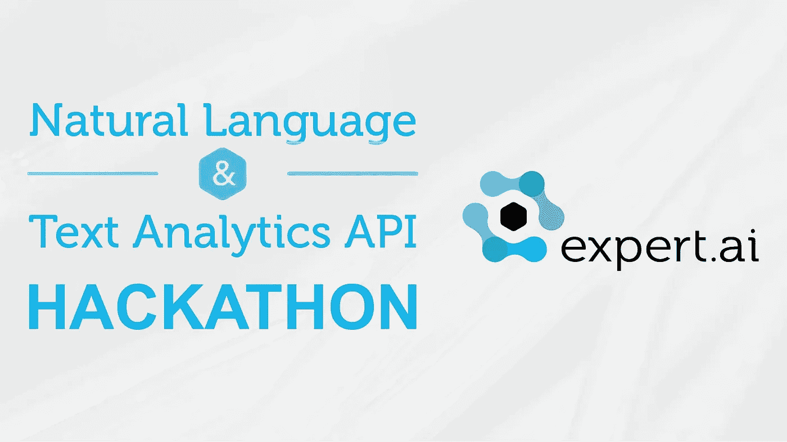
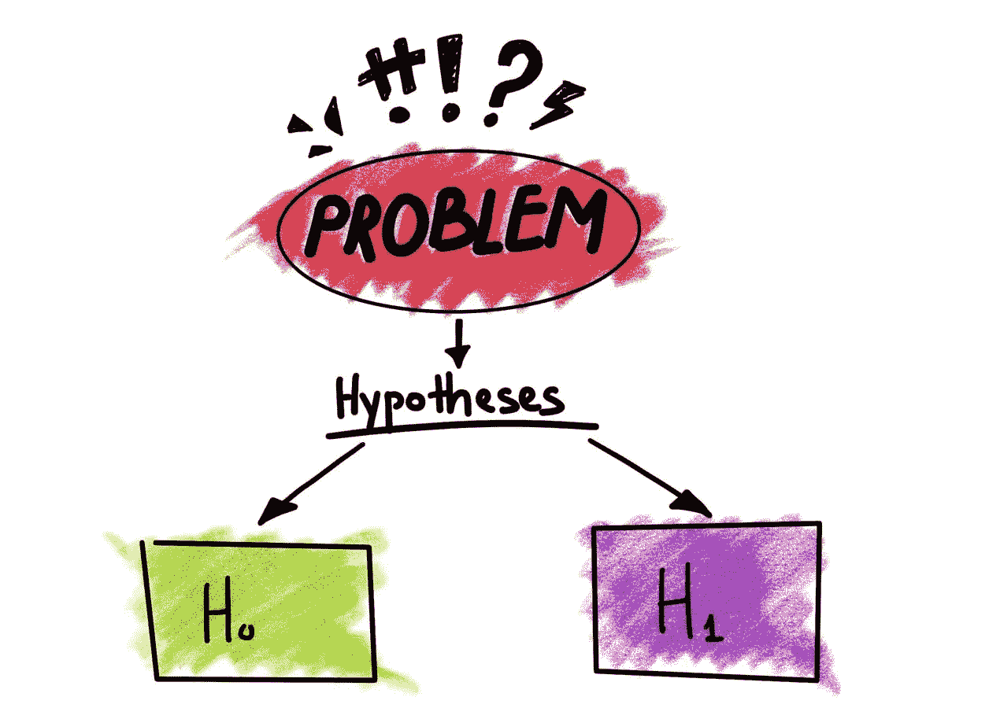

# 在这次黑客马拉松中赢得 10，000.00 美元！

> 原文：<https://pub.towardsai.net/win-10-000-00-in-this-hackathon-bdf33c25c8fe?source=collection_archive---------3----------------------->

## [新闻](https://towardsai.net/p/category/news)，[快讯](https://towardsai.net/p/category/newsletter)

## 人工智能世界有什么新鲜事，一场激动人心的[黑客马拉松](https://mktg.best/g3xr5)，超过 5000 美元的奖金，[我们官方社区的发布](https://mktg.best/7e186)，以及我们每月的编辑精选。

***如果你阅读这封邮件有困难，请在*** [***网络浏览器***](https://mktg.best/z9bxv) ***上查看。***

各位，星期一快乐！我们真诚地希望你和你心爱的人度过一个愉快的假期，并祝新年快乐。在本期每月简讯中，我们将呈现:

**Expert.ai 自然语言和文本分析 API Hackathon:** 通过嵌入深度自然语言处理、词义和情感分析来创建或增强现有的 app。Expert.ai 通过对复杂语言的深度理解，赋能组织将数据转化为知识和洞察力。expert.ai 自然语言 API 是一个基于云的软件服务，它基于 expert.ai 技术提供了一套全面的自然语言理解能力。测试您的开发技能，构建(或更新)一个使用 expert.ai API 的功能应用程序。一等奖是 5000 美元。|【[**详见规则**](https://mktg.best/3krwp)

****[**加入黑客马拉松**](https://mktg.best/g3xr5) **！】******

****其他消息，我们推出了官方社区**——我们对此感到非常兴奋。我们将尽可能多地添加我们能够获得的免费高质量资源。我们已经开始与我们的新成员在一个项目上合作，我们非常感谢那些支持我们的人。如果您感兴趣，请查看我们的 [**常见问题解答**](https://mktg.best/7vczq) —有关我们如何改进的反馈，请 [**让我们知道**](mailto:pub@towardsai.net) 。******

****接下来， [**D2l.ai**](https://mktg.best/s365m) 在他们的【潜入深度学习】 [**互动教材**](https://mktg.best/s365m) 上发布了关于注意力机制的新篇章。这本书是 PyTorch 和 ApacheMXNet 中的免费资源，通过 Jupyter 笔记本、HTML 或 PDF 提供。****

****如果你对机器学习感兴趣，我们推荐你看看 Paul Liang 和合作者创建的关于 [**多模态机器学习**](https://mktg.best/v5xvl) 的优秀论文列表。****

****现在，如果你正在做边 ML 项目，需要一些托管资源，看看 [**Zenodo**](https://mktg.best/s7lb0) 。在欧洲 OpenAIRE 计划下开发并由 CERN 运营的开源通用存储库。它提供版本控制，50GB 的免费托管，带宽，DOI，并提供长期保存。****

****如果你是 GANS 的读者，可以看看弗朗索瓦·乔莱(Franç ois Chollet)在 Keras 中的这个很酷的深度卷积生成对抗网络(DCGAN) [**实现**](https://mktg.best/xmvfg) ，它具有从心理模型到实现的精确映射。****

****最后，别忘了#ICML2021 的 [**截止日期是 1 月 28 日，论文摘要截止日期是 2 月 4 日。**](https://mktg.best/skefw)****

****现在进入月度精选！我们根据读者、粉丝和某篇文章的浏览量来挑选这些文章。我们希望你和我们一样喜欢阅读它们。此外，我们开始做一些新的东西！我们将挑选出表现最好的文章，我们的编辑将选择一到两篇表现不突出的文章，但由于它们的质量，它们进入了当月的名单。****

****如果可以，请将我们的 [**订阅链接**](https://towardsai.net/subscribe) 分享给你的朋友、同事、熟人。我们承诺不会向他们的收件箱发送垃圾邮件。如果您对我们的时事通讯有任何反馈，请随时给我们发送 [**电子邮件**](mailto:pub@towardsai.net) 。****

# ****📚编辑选择每月精选文章↓📚****

********

## ****[充满惊人人工智能论文的一年——路易斯·布沙尔](https://mktg.best/55u52)[的评论](https://medium.com/u/f34bfe2bbaec?source=post_page-----bdf33c25c8fe--------------------------------)****

****尽管今年世界上发生了这么多事情，我们仍然有机会看到许多惊人的研究成果，尤其是在人工智能领域。2020 年强调了许多重要方面，如伦理方面、重要的偏见等等。人工智能和我们对人脑及其与人工智能的联系的理解正在不断发展，在不久的将来显示出有前途的应用…****

******[**阅读更多**](https://mktg.best/55u52)******

************

## ******[用 Python 进行情感分析(观点挖掘)——NLP 教程](https://mktg.best/8bvtd)由[走向 AI 团队](https://medium.com/u/aea8a19ea239?source=post_page-----bdf33c25c8fe--------------------------------)******

******“情绪”通常是观点的二元对立，并以情绪、态度、观点等形式表达感受。它可以表达很多观点。例如，“喜欢”或“不喜欢”，“好”或“坏”，“赞成”或“反对”，以及其他。通过使用 [**机器学习**](https://mld.ai/mldcmu) 方法和 [**自然语言处理**](https://towardsai.net/p/nlp/natural-language-processing-nlp-with-python-tutorial-for-beginners-1f54e610a1a0) ，我们可以提取文档的个人信息，并尝试根据其极性对其进行分类，例如积极、中性或消极，从而使情感分析有助于确定对定义目标的总体看法，例如，销售项目或预测给定公司的股票市场…******

******[**阅读更多**](https://mktg.best/8bvtd)******

************

## ******[我为什么要关心人类是怎么想的](https://mktg.best/hmw3e)？作者:马蒂厄·阿奎恩博士。******

******在以前的一篇文章中，我认为人工智能有两个方面:高级认知功能的符号方面和当前流行的低级生物启发的连接主义版本。首先看看象征性的认知方面，从历史上看，这是模仿人类智力更明显的地方。许多人仍然把图灵测试称为机器智能测试。然而，作为一项涉及假装人类的测试，为了成功，机器很可能会犯错误。它必须表明它不是一台冷酷的计算机器。也许在某些情况下不是这样，但在大多数情况下，我会认为一台冷酷的计算机器(或者至少是一台不会出错的机器)是我们想要的人工智能…******

********[**阅读更多**](https://mktg.best/hmw3e)********

************

## ******KNN(最近的邻居)死了！作者[玛丽·斯蒂芬·利奥](https://medium.com/u/954c0bee6530?source=post_page-----bdf33c25c8fe--------------------------------)******

******在机器学习社区中，找到“K”个与任何给定项目相似的项目被广泛称为“相似性”搜索或“最近邻”(NN)搜索。最广为人知的神经网络搜索算法是 K-最近邻(KNN)算法。在 KNN，给定一组对象，如手机的电子商务目录，我们可以从整个目录中为任何新的搜索查询找到少量(K 个)最近邻。例如，在下面的示例中，如果您设置 K = 3，那么每个“iPhone”的 3 个最近邻居就是另一个“iPhone”同样，每个“三星”最近的 3 个邻居都是三星…******

********[**阅读更多**](https://mktg.best/l4aq9)********

************

## ******[迈向自动驾驶汽车 2021](https://mktg.best/5m2e8) 作者[斯蒂芬·阿迪萨普特拉](https://medium.com/u/dbb072e73e14?source=post_page-----bdf33c25c8fe--------------------------------)******

******人类想要便利；更快、更容易、更安全的运输。自动驾驶汽车目前比以往任何时候都更热门，2021 年将是新发布的一年。传统汽车制造商面临一场自主革命——主要由科技行业驱动。“汽车正在演变成轮子上的计算机，”他们说…******

********[**阅读更多**](https://mktg.best/5m2e8)********

************

## ******[麻省理工学院的免费在线课程学习朱莉娅——冉冉升起的明星](https://mktg.best/s82nm)作者[弗雷德里克·巴斯勒](https://medium.com/u/16c852692647?source=post_page-----bdf33c25c8fe--------------------------------)******

******Python 是人工智能编程语言中无可争议的领导者，被 87%的数据科学家使用。也就是说，Python 的未来没有保证，因为语言总是来来去去——COBOL、ALGOL、BASIC，墓地语言的列表还在继续。事实上，人工智能专家、Kaggle 前总裁杰瑞米·霍华德表示，“Python 不是机器学习的未来。不可能的。”简而言之，原生 Python 太慢，开销太大…******

********[**阅读更多**](https://mktg.best/s82nm)********

************

## ******[Amit Chauhan](https://mktg.best/cg6yi)用 Python 完整解释了线性回归******

******简单线性回归用于预测分析和做出推断。在这种类型中，有一个自变量和一个因变量。每当建模中出现因果关系时，我们就会进行回归分析。当我们使用因子分析技术时，性能在实时分析中更精确。监督机器学习中的回归分析基础。需要注意的三件重要事情…******

********[**阅读更多**](https://mktg.best/cg6yi)********

************

## ******[用 SciPy](https://mktg.best/lv-3p) 对假设进行测试 [Sujan Shirol](https://medium.com/u/92b9872c24de?source=post_page-----bdf33c25c8fe--------------------------------)******

******随着数据科学领域的大肆宣传，我们大多数人都直接跳入机器学习模型和算法来做出商业决策。所有可用的在线课程都没有教授决策的最基本知识。假设检验是决策的基本组成部分之一，也是最古老的。最早使用假设检验是在 18 世纪，由约翰·阿巴斯诺特用来检验男性和女性生育的可能性是否相等…******

********[**阅读更多**](https://mktg.best/lv-3p)********

************

## ******[面向初学者的 20 个核心数据科学概念](https://mktg.best/gxjlf)作者 [Benjamin Obi Tayo 博士](https://medium.com/u/3a025d440e6b?source=post_page-----bdf33c25c8fe--------------------------------)******

******数据科学有如此多的东西要学，有如此多的进步要跟进，一套核心的基本概念仍然是必不可少的。这里强调了其中的 20 个想法，它们是准备工作面试或更新你对基础知识的理解的关键******

********[**阅读更多**](https://mktg.best/gxjlf)********

************

## ******[数据科学家应该知道的 3 大 NLP 用例](https://mktg.best/o-wa3)作者[亚历山大·泽诺诺斯博士](https://medium.com/u/62e27ccbee04?source=post_page-----bdf33c25c8fe--------------------------------)******

******本文探讨了数据科学家在处理自然语言处理(NLP)时面临的最常见的用例。设置场景，我们假设您是 NLP 新手，但不一定是数据科学新手。作为数据科学家，我们经常不得不与 **un** 结构化数据打交道。如果您不熟悉这个术语，那么可以将结构化数据想象成 Excel 或实际数据库中的一个表，其中每一列都是一个特征或属性。因此，与之相反的(非结构化)是我们没有这种格式。通常，这意味着我们必须处理图像或文本。NLP 处理文本的计算，它是关于让计算机理解我们的书面语言。如果你愿意，我们的总体目标或通用目标是创建理解文本的模型，就像人类理解文本一样。我们还没有做到这一点，但我们可以创建在不同环境中有用的模型。通常，作为数据科学家，我们面临三个与文本相关的常见任务…******

## ****【[阅读更多](https://mktg.best/o-wa3)****

********

## ****[由](https://mktg.best/o2pf7) [anuragbisht](https://medium.com/u/97bc9eb0b784?source=post_page-----bdf33c25c8fe--------------------------------) 在 Google Cloud 的平台上构建产品推荐引擎****

****在我的上一篇文章中，我讨论了如何使用 Amazon Sagemaker 轻松创建一个端到端的推荐引擎。
今天，我们将利用 Google 云平台和 Apache Spark 创建一个推荐引擎，您可以轻松地将其与数据工程管道集成。可以用同样的机制，部署在 AI 平台笔记本上…****

******[**阅读更多**](https://mktg.best/o2pf7)******

************

## ******[2021 年掌握 Python 的 3 大资源](https://mktg.best/i251d) by [Chetan Ambi](https://medium.com/u/e21a9c4ed934?source=post_page-----bdf33c25c8fe--------------------------------)******

******人们喜欢 Python 的原因有上百种。最常见的原因似乎是——可读性、简单性、易用性、庞大的社区(快速增长)、第三方库(如 Pandas、Numpy、Scikit-learn 等)。).你可以做系统编程，图形用户界面，数字和科学编程。它可以用于自然语言分析、可视化、图像处理、机器学习。唉！清单是无穷无尽的…******

********[**阅读更多**](https://mktg.best/i251d)********

************

## ******[大规模卫星数据处理](https://mktg.best/a81pv)由 [Husna](https://medium.com/u/15780a1fe600?source=post_page-----bdf33c25c8fe--------------------------------)******

******空间数据或地理空间数据可以被认为是包含地球表面位置信息的任何数据。空间数据存在于任何领域或行业，尤其是在当今“实时”数据驱动的世界。有一些常用术语可以更好地解释空间数据的语言…******

********[**阅读更多**](https://mktg.best/a81pv)********

************

## ******改善条形图的 5 个技巧:Matplotlib 作者[曼莫汉·辛格](https://medium.com/u/5bee6bf707b0?source=post_page-----bdf33c25c8fe--------------------------------)******

******条形图是数据科学中广泛使用的图表。图表帮助您将数据与利益相关者、经理或受众联系起来。图表讲述了你的结果。你的图表不应该看起来杂乱无章。它应该清晰可见，易于理解。条形图通常表示有多个类别的数据。以这样一种方式创建一个条形图，它在你的观众的头脑中创建一个有意义的数据图…******

********[**阅读更多**](https://mktg.best/k9idg)********

************

## ******[使用 Seaborn](https://mktg.best/dmatp) 的数据可视化由 [Indhumathy Chelliah](https://medium.com/u/720e3a4ac60c?source=post_page-----bdf33c25c8fe--------------------------------)******

******Seaborn 用于数据可视化，它基于 matplotlib。它提供了一个高层次的界面来绘制有吸引力的和信息丰富的统计图形。数据可视化用于从数据中发现重要的见解。它用于可视化数据的分布，两个变量之间的关系。当数据被适当地可视化时，人类视觉系统可以看到指示关系的趋势和模式…******

********[**阅读更多**](https://mktg.best/dmatp)********

********🙏感谢您成为** [**订阅者**](https://towardsai.net/subscribe) **与** [**一起走向 AI**](https://towardsai.net/) **！🙏********

*****跟着走向艾↓*****