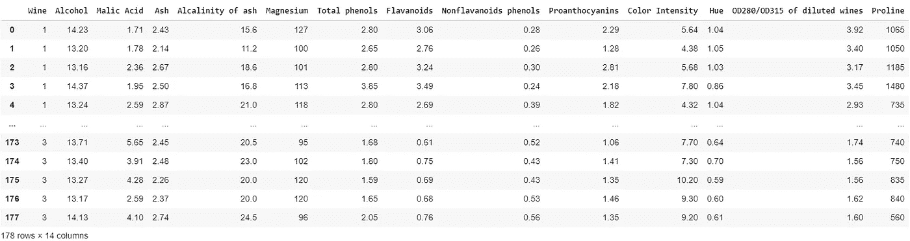
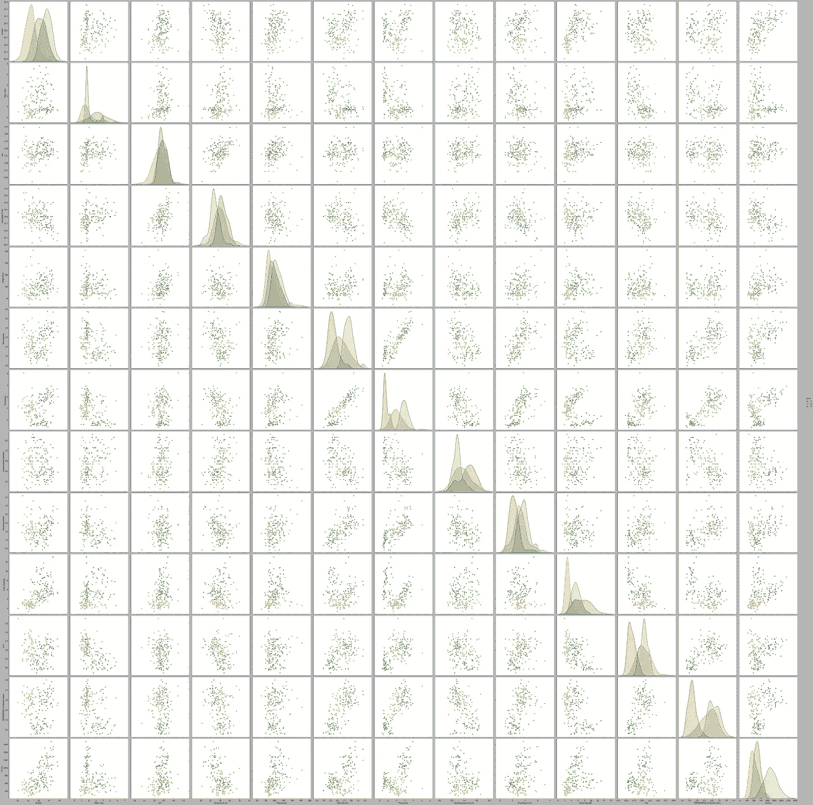
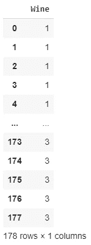

# 使用监督学习的葡萄酒分类器，准确率为 98%

> 原文：<https://pub.towardsai.net/wine-classifier-using-supervised-learning-with-98-accuracy-5f2e173e967e?source=collection_archive---------3----------------------->

## 实用人工智能

## 监督学习指南

今天，我将创建一个分类器，能够以 98%的准确率识别不同种类的葡萄酒。数据集可以从 [data.world](https://data.world/uci/wine) 下载。


由[特里·维里斯迪斯](https://unsplash.com/@vlisidis?utm_source=medium&utm_medium=referral)在 [Unsplash](https://unsplash.com?utm_source=medium&utm_medium=referral) 上拍摄的照片

[我的 Github 存储库中有完整的代码。](https://github.com/arditoibryan/Projects/tree/master/20200528_Wine_Classifier)

# 步伐

1.  导入模块
2.  导入数据集
3.  看着这些数据
4.  预处理
5.  剧烈的
6.  机器学习模型
7.  估价

# 1.导入模块

为了加快我的工作，我将使用我个人的预处理库，名为 [tf_dataset_extractor v1.2](https://github.com/arditoibryan/General) 。如果你不想使用我创建的模块，我会详细解释创建这个人工智能的每个步骤，这样你就可以选择你的方法。

```
import sys
sys.path.append('/content/drive/My Drive/Colab Notebooks/TensorFlow 2.0/modules')
import pandas as pd
import tf_dataset_extractor as e
#import grapher_v1_1 as g
#import LSTM_creator_v1_0 as l
v = e.v
g = e.g
l = e.l
```

# 2.导入数据集

```
import pandas as pd
#importing dataset
e.X = pd.read_csv('/content/drive/My Drive/Colab Notebooks/Projects/20200528_Wine_Classifier/wine_data.csv')
e.K = v.upload.make_backup()
e.X
```



葡萄酒数据集的示例

对我们来说不幸的是，葡萄酒的名称在原始数据集中不存在。而是将三种酒分别标为 1、2、3。这就够了。

# 3.看着这些数据

在处理模型之前，一个非常好的做法是查看数据。我将使用我最喜欢的工具来评估我的分类器的性能:pairplot。我将使用 e.X 数据集，使用“Wine”作为标签。在 pairplot 函数中，我将把它作为“色调”输入:

```
#correlogram
# library & dataset
import seaborn as sns
import matplotlib.pyplot as plt

# Basic correlogram
sns.pairplot(e.X, hue='Wine', height=5)
plt.show()
```

从这些数据中我可以立即看到的是，这些特征是:

*   正态分布
*   他们明显地彼此分开

关于 pairplot 告诉我们什么的更多信息，我建议你阅读我以前的一篇关于这个主题的文章。



有了我刚刚从图中获得的信息，我已经有了我将要使用的分类器的想法:朴素贝叶斯分类器。这个机器学习分类器在正态分布的数据上表现得非常好(不要相信嘲笑它的开发者！).如果分布彼此远离，甚至更好，那么在三个不同的类之间进行区分将容易得多。

# 4.预处理

鉴于这是一个非常简单的数据集，并且数据已经是数字形式，我个人认为我不需要做任何预处理。如果您是初学者，知道当您必须为您的模型准备数据时，您需要预处理数据(例如，将分类数据转换为编码数据)。

## 提取标签

我要做的唯一一件事是从数据集中提取标签，这样我就可以将它提供给模型。

```
v.upload.retrieve_backup(e.K)
v.extract.labels(['Wine'])
e.y
```



标签样本

# 5.剧烈的

我现在将 X(特征)和 y(标签)分成训练和测试。默认情况下，我将对测试端使用 0.2 的比例。

```
X_train, X_test, y_train, y_test = v.split(0.2)
print(X_train.shape, X_test.shape, y_train.shape, y_test.shape)
```

# 6.机器学习模型

现在是时候创建我的人工智能了:

## 创建模型

我将使用 scikit-learn 库，这是最好的开源机器学习库之一。

```
from sklearn.naive_bayes import GaussianNB
clf = GaussianNB()
```

## 训练模型

我会用我的训练样本找出把 X 和 y 联系起来的规则，然后，我会在 X_test 上做一个估计，并和模型没见过的实际结果进行比较:y_test。

```
clf = clf.fit(X_train, y_train)
y_predict = clf.predict(X_test)
from sklearn.metrics import accuracy_score
print(accuracy_score(y_test, y_predict))
1.0
```

100%!惊人的结果！

# 7.估价

我只拆分过一次数据集，但是，为了提高模型的有效性，我可以使用交叉验证算法在 10 次不同的拆分中测试模型，每次拆分都使用从数据集获取的不同数据。

```
v.statistics.cross_validation(clf, X_train, y_train, 10)Accuracy: 0.96 (+/- 0.09)
[1.00, 
1.00, 
1.00, 
0.92, 
0.92,         
1.00, 
0.85, 
0.92, 
0.92, 
1.00        
]
```

根据由分割确定的训练和测试中的数据，准确度的范围从 85%到 100%，平均为 96%。结果可能会有所不同，在几次尝试后，我获得的最高值是 98%。