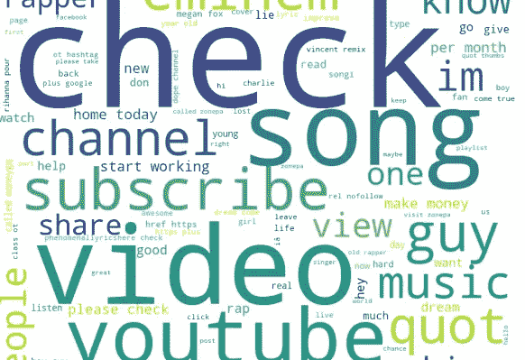
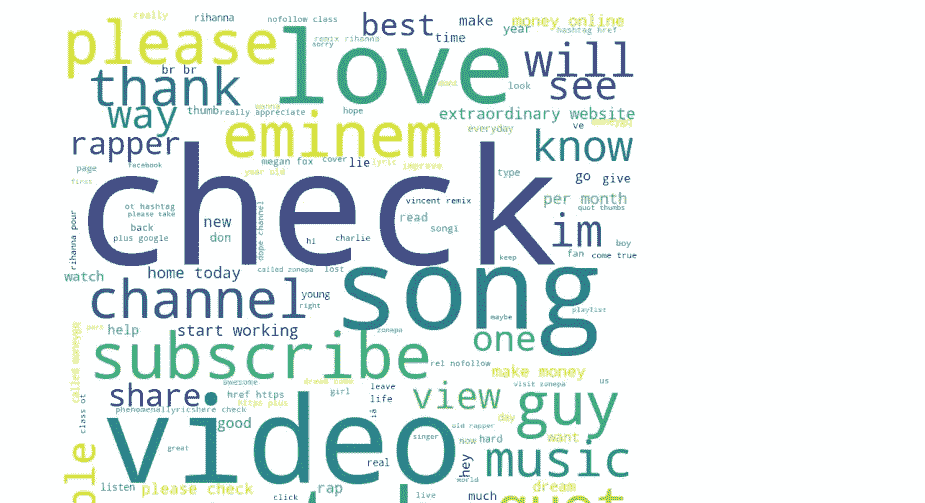

# 使用 Python 的词云

> 原文：<https://pub.towardsai.net/word-cloud-with-python-82e833d8c636?source=collection_archive---------2----------------------->

## [自然语言处理](https://towardsai.net/p/category/nlp)

## 文本注释转换为词云可视化。



这篇文章是关于用 python 制作 word-cloud，将我们的文本数据可视化成一些更可见的文本。单词的大小取决于它在记录中出现的次数。

[](https://medium.com/towards-artificial-intelligence/nlp-zero-to-hero-with-python-2df6fcebff6e) [## NLP——使用 Python 从零到英雄

### 学习自然语言处理基本概念的手册

medium.com](https://medium.com/towards-artificial-intelligence/nlp-zero-to-hero-with-python-2df6fcebff6e) 

首先，我们需要导入必要的库。

```
from wordcloud import WordCloud, STOPWORDS 
import matplotlib.pyplot as plt 
import pandas as pd
```

现在阅读 youtube 评论 CSV 文件。

```
# Reads 'youtube_comments.csv' file  
df = pd.read_csv(r"youtube_comments.csv", encoding ="latin-1") 

comment_words = '' 
stopwords = set(STOPWORDS)
```

停用词用于删除文本中一些对我们的信息不重要的特殊字符。

```
#to see the data up to 5 rows
df.head()
```


文本数据视图。作者照片

为了查看数据的信息，我们使用 info。

```
df.info
```

为了拆分和降低文件中的文本，我们这样做是为了使所有文本完全一致。

```
# iterate through the csv file 
for val in df.CONTENT: 

    # typecast each val to string 
    val = str(val) 

    # split the value 
    tokens = val.split() 

    # Converts each token into lowercase 
    for i in range(len(tokens)): 
        tokens[i] = tokens[i].lower() 

    comment_words += " ".join(tokens)+" "
```

现在我们用词云函数来得到 visualize。

```
wordcloud = WordCloud(width = 800, height = 800, 
                background_color ='white', 
                stopwords = stopwords, 
                min_font_size = 10).generate(comment_words)
```

现在我们绘制单词 cloud。

```
# plot the WordCloud image                        
plt.figure(figsize = (8, 8), facecolor = None) 
plt.imshow(wordcloud) 
plt.axis("off") 
plt.tight_layout(pad = 0) 

plt.show()
```



# 结论:

这些概念对学习者来说非常好，可以对云这个词有个大概的了解。

我希望你喜欢这篇文章。通过我的 [LinkedIn](https://www.linkedin.com/in/data-scientist-95040a1ab/) 和 [twitter](https://twitter.com/amitprius) 联系我。

# 推荐文章

1.  [NLP —用 Python 从零到英雄](https://medium.com/towards-artificial-intelligence/nlp-zero-to-hero-with-python-2df6fcebff6e?sk=2231d868766e96b13d1e9d7db6064df1)

2. [Python 数据结构数据类型和对象](https://medium.com/towards-artificial-intelligence/python-data-structures-data-types-and-objects-244d0a86c3cf?sk=42f4b462499f3fc3a160b21e2c94dba6)