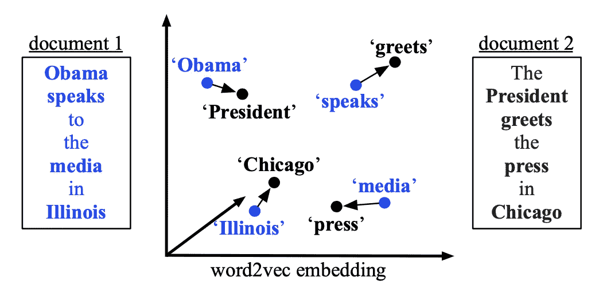
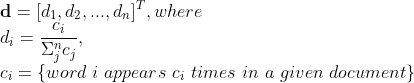
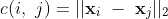
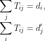
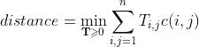

# 词移动距离解释:一种有效的文档分类方法

> 原文：<https://pub.towardsai.net/word-movers-distance-wmd-explained-an-effective-method-of-document-classification-89cb258401f4?source=collection_archive---------0----------------------->

来源:*图片来自[原文](http://proceedings.mlr.press/v37/kusnerb15.pdf)

## [自然语言处理](https://towardsai.net/p/category/nlp)

## [阅读]从单词嵌入到文档距离

文档分类和文档检索已经显示出广泛的应用。文档分类的一个基本部分是正确地生成文档表示。 [Matt J. Kusner](http://mkusner.github.io/) 等人在 2015 年提出了单词移动器距离(WMD) [1]，其中单词嵌入被纳入计算两个文档之间的距离。利用给定的预先训练的单词嵌入，通过计算“一个文档的嵌入单词需要‘行进’以到达另一个文档的嵌入单词的最小距离量”，可以用语义来测量文档之间的不同。

在接下来的章节中，我们将讨论 WMD 的原理，约束和近似，WMD 的预取和修剪，WMD 的性能。

# 大规模杀伤性武器原理

如前所述，WMD 试图测量两个文档的语义距离，语义测量是由 word2vec 嵌入带来的。具体来说，在他们的实验中使用了跳格词 2vec。一旦获得单词嵌入，文档之间的语义距离由以下三部分定义:文档表示、相似性度量和(稀疏)流矩阵。

## 文本文档表示

文本文档被表示为向量 **d** ，其中每个元素表示一个单词在文档中的归一化频率，即

注意，文档表示 **d** 是高维空间中的稀疏向量。

## 语义相似性度量定义

两个给定单词**x _**I 和**x _**j 在嵌入空间中的欧几里德距离定义如下:

WMD 中， **x_** *i* 和 **x_** *j* 来自不同的单据， *c(i，j)* 是 word **x_** *i* 到 **x_** *j.* 的“差旅费”

## 流动矩阵定义

假设有一个源文档 A 和一个目标文档 b，定义一个流矩阵 **T** 。流矩阵中的每个元素， **T** _{ *ij}* ，表示单词 *i* (在文档 A 中)转换为单词 *j* (在文档 B 中)的次数，然后用词汇表中的总字数对值进行归一化。也就是说，

因此，语义距离定义如下:

通过调整 **T** 中的值，可以得到两个文档之间的语义距离。距离也是将所有单词从一个文档移动到另一个文档所需的最小累积成本。

## 约束和下限近似

最小累积成本有两个限制，即

对于文档 A 中的任何单词 I，文档 B 中的任何单词 j

总的来说，约束最小累积成本的计算复杂度是 *O(p logp)，*其中 *p* 是文档中唯一单词的数量。也就是说，WMD 可能不适用于大型文档，或者具有大量独特单词的文档。本文提出了两种加速 WMD 计算的方法。两种加速方法都导致实际 WMD 值的近似值。

**字质心距离(WCD)**

通过使用三角形不等式，可以证明累积成本总是大于或等于由单词嵌入的平均值加权的文档向量之间的欧几里德距离。这样计算复杂度降到了 *O(dp)* (此处*，d* 表示文档向量的维数 **d** 。)

**放宽大规模杀伤性武器(RWMD)**

目标中有两个约束。如果去除一个约束，累积成本的最佳解决方案是对于一个文档中的每个单词，将其所有概率质量移动到另一个文档中最相似的单词。这意味着成本最小化问题转化为寻找嵌入空间中两个字嵌入的最小欧几里德距离。所以去掉一个约束，保留另一个，就有了两个近似的下界:姑且称之为 *l1* (保留对 *i* 的约束)和 *l2* (保留对 *j* 的约束)。更接近的近似值 *l* 可以定义为:

*l=max(l1，l2)。*

有了这个近似的累积成本，作者称之为宽松的 WMD (RWMD)，计算复杂度降低到 O(p)。

# 预取和修剪

为了高效地找到查询文档的 k 个最近邻，可以利用 WCD 和 RWMD 来降低计算成本。

1.  使用 WCD 估计每个文档到查询文档之间的距离。
2.  按升序对估计的距离进行排序，然后使用 WMD 计算到这些文档的第一个 *k* 的精确距离。
3.  遍历剩余的文档(不在上一步的第一个 *k* 中)，计算 RWMD 下界。
4.  如果一个文档(到查询文档)的 RWMD 近似大于到第一个 *k 个*文档的所有计算的 WMD 距离(在步骤 2 中)，这意味着该文档一定不在查询文档的 k 个最近邻中，因此它可以被剪除。否则，精确的 WMD 距离被计算并更新到 *k* 最近的邻居。

# 大规模杀伤性武器的性能

作者在八个文档数据集上评估了在 *k* NN 背景下的 WMD 性能，并与 BOW、TFIDF、BM25 LSI、LDA、mSDA、CCG 进行了性能比较。他们的实验表明，WMD 在 8 个数据集的 6 个上表现最好。对于其余 2 个数据集，即使 WMD 不是性能最好的，错误率也非常接近性能最好的。

一个有趣的实验结果是，作者进行了一个实验来评估如果下界用于最近邻检索，下界的紧密性和 kNN 错误率之间的关系。这表明紧密性并不直接转化为检索的准确性。在作者的陈述中，一次只接受一个约束的 RWMDs(命名为 RWMD_c1 和 RWMD_c2)的紧密性明显高于 WCD，然而 RWMD_c1 和 RWMD_c2 在 *k* NN 精度方面的表现都不如 WCD。我的新观点是，这可能是由于 RWMD_c1 和 RWMD_c2 的不对称约束造成的。因为只有剩余的一个约束导出到距离度量的非严格定义，并且 RWMD_c1 和 RWMD_c2 都不是严格的距离近似。

# 工作的潜在扩展

WMD 的性能在文档分类任务中大放异彩。在我看来，对于大规模杀伤性武器的进一步探索，有几件事可以尝试。

作者利用不同的数据集进行单词嵌入生成，但是嵌入方法坚持使用 *word2vec* 和 *skip-gram* 。通过将 word2vet 改为其他方法(如 GloVe ),可以看到嵌入方法对 WMD 的意义，这将是很有趣的。

请注意，WMD 不能处理词汇外(OOV)数据，当在距离计算中遇到 OOV 单词时，它会直接将其丢弃。这可能是 WMD 的性能在所有数据集上不如其他方法的原因。OOV 词的嵌入可以基于上下文信息来构建。例如，BiLSTM 语言模型可以帮助生成 OOV 单词嵌入[2]。此外，字节对编码(BPE)也可以构建 OOV 字嵌入。

# 参考

[1]原文：<http://proceedings.mlr.press/v37/kusnerb15.pdf>

[2][https://www . researchgate . net/publication/335757797 _ Language _ modeling _ for _ Handling _ Out-of-Vocabulary _ Words _ in _ Natural _ Language _ Processing？show full text = 1&linkId = 5d 7a 26 a 04585151 E4 AFB 0 c 5](https://www.researchgate.net/publication/335757797_Language_Modelling_for_Handling_Out-of-Vocabulary_Words_in_Natural_Language_Processing?showFulltext=1&linkId=5d7a26a04585151ee4afb0c5)

[3]大规模杀伤性武器[代号](https://github.com/mkusner/wmd)