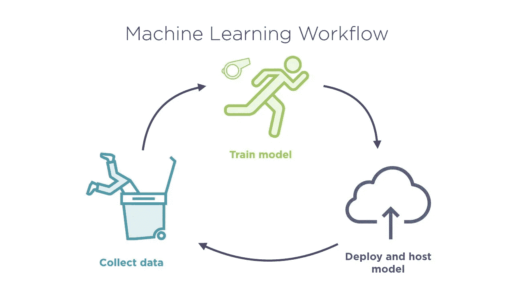

# 机器学习项目的工作流程

> 原文：<https://pub.towardsai.net/workflow-of-a-machine-learning-project-95b588f4528?source=collection_archive---------2----------------------->

## [机器学习](https://towardsai.net/p/category/machine-learning)

机器学习算法可以学习从 A 到 B 或者输入到输出的映射。如果我们以一个语音识别软件为例，如亚马逊 Echo/Alexa、谷歌 Home、苹果 Siri，这些软件在我们的家中很容易找到，那么就出现了一个问题，当我们说 Alexa、嘿谷歌或 Siri 时，它们是如何识别的？

**语音识别设备**

所以我们来过一遍机器学习项目的关键步骤。如果我们想要建立一个机器学习系统，那么主要需要遵循三个步骤(这里使用语音识别系统进行解释):

**1。收集数据:**
收集数据是构建任何机器学习项目的初始步骤。对于语音识别系统，我们应该让人们说嘿，Alexa 或其他相关的东西，这样我们就可以为项目录制音频。通过这种方式，我们可以为我们的项目收集大量数据，这将使我们的项目更加高效和准确。

**2。训练数据:**
在这个阶段，现在我们将借助各种机器学习算法对机器学习模型进行训练。通过使用该算法，我们将训练该模型来学习输入到输出或 A 到 B 的映射。在这里，当我们谈论语音识别时，系统将被训练通过收集的音频来学习和识别用户是说你好 Alexa 还是嘿。每当一个人工智能团队开始训练模型时，大多数情况下，第一次尝试都不会成功。AI 团队应该多次训练模型，或者在 AI 中，据说要迭代多次，直到模型开始正确执行。

**3。部署模型:** 这是机器学习系统的最后一步，也是非常关键的一步。在这一步中，我们将部署模型并将其放入设备中。之后会发货给一小群测试用户或者一大群用户。模型用大量不同的数据训练得越多，表现越好的机会就越多。
如果我们以一个语音识别系统为例，该系统使用美国口音进行训练，然后运送到英国，则该模型将无法识别用户的音频，因为它没有使用该系统进行训练。

**机器学习的工作流程**

这是一个机器学习项目的工作流程，对每一种类型的项目都有帮助。这些是在开始一个新的机器学习项目之前总是需要考虑的关键点。