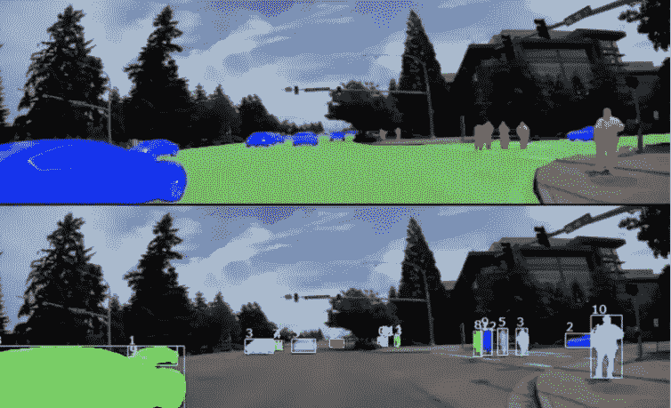
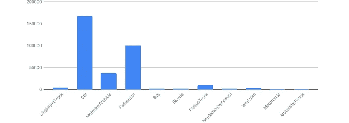
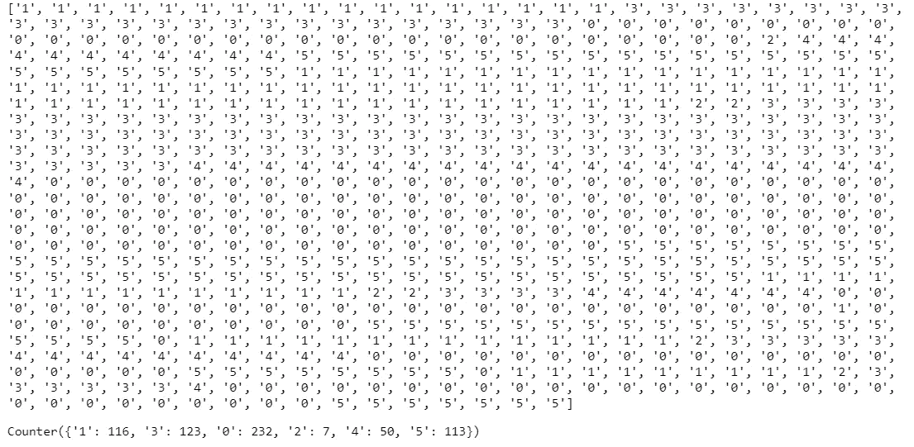
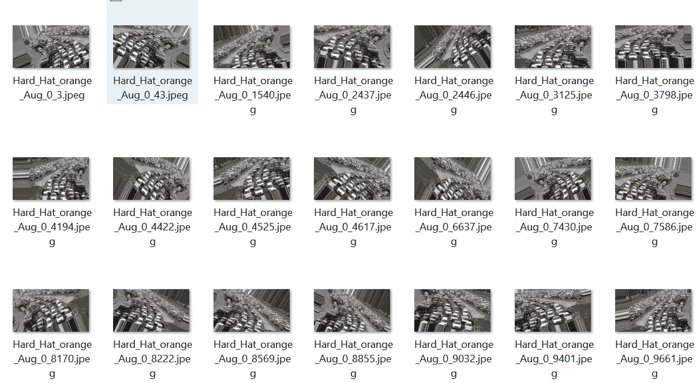
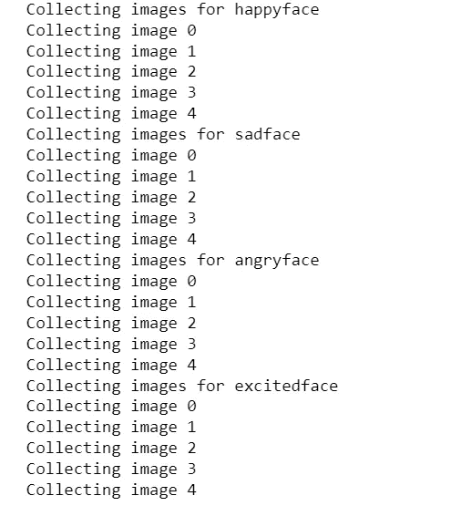

# 从事计算机视觉项目？这些代码块将帮助您！！！

> 原文：<https://pub.towardsai.net/working-on-a-computer-vision-project-these-code-chunks-will-help-you-45756bbe7e65?source=collection_archive---------1----------------------->

## 介绍计算机视觉项目中的几种“习惯”方法



计算机视觉项目[ [来源](https://blogs.nvidia.com/blog/2019/10/23/drive-labs-panoptic-segmentation/) ]

> "虚拟现实和增强现实最终将会融合，智能眼镜将会接管我们的数字互动."― **卡洛斯·洛佩斯(方正@奥瑞斯)**

在计算机视觉和机器学习领域工作的惊人之处在于，每隔几年，就会有人发明一些疯狂的东西，让你彻底重新考虑什么是可能的！！！

自计算机视觉算法出现以来，世界获得了一种新的视角&一种新的思维和跟踪物体的方式。从基于区域的卷积神经网络[RCNN]到 YOLO V7、detectron-2、segformer 和分类架构，计算机视觉发生了巨大的变化，以实现更高的检测效率和更高的延迟，同时对时间和计算费用的要求更低。

计算机视觉项目是许多事情的组合，从数据收集到成功部署。了解数据以及正确的处理和培训是成功的关键。下面是一些代码块，以及对它们工作的描述，将会让你在项目中的工作更轻松。

# 1.了解数据集的实例

对于对象检测或分割项目，我们借助外部标注工具对数据集进行标注，如 [makesense.ai](https://www.makesense.ai/) 、 [VGG 标注器](https://www.robots.ox.ac.uk/~vgg/software/via/via_demo.html)、 [LableIMG](https://github.com/heartexlabs/labelImg) 等。



物体检测中的不平衡数据集示例[图像[源](https://www.semanticscholar.org/paper/Frame-Augmentation-for-Imbalanced-Object-Detection-Elasal-Swart/f183c02ef708ef6e7c49a3720947599d54014ccb) ]

我们知道图像的确切数量，但很难知道每个类有多少实例。了解类的实例将告诉您数据集是否不平衡。如果你的例子不均衡，将会对学习模式产生深远的影响。因此，在下载带注释的数据集及其注释文件后，您可以使用下面的代码块来查看类平衡状态。

```
import os
#Give path of folder in which you stored images and annotations 
path = r"Your dataset *folder* location" 
# Change the directory to path 
os.chdir(path)
x=[]
# Spinning through all files 
for file in os.listdir():
# Checking for text annotation file 
    if file.endswith(".txt"):
        file_path = f"{path}\{file}"
        with open(file_path, 'r') as f:
            for line in f:
                a=line[0]
                x.append(a)
print(x)
#to count instances 
from collections import Counter
Counter(x)
```



作者形象

最后，您可以看到计数器给出了每个类的实例值，然后根据您的模型标准，您可以决定数据集是否需要进一步平衡。

# 2.图像预处理

在我们的图像数据集中，除了类实例，我们还有许多其他对象/事物。如果我们把它作为模型的学习目的，那么这些其他的项目都可以归为噪音。有许多用例声称，消除这些噪声，然后将其发送到模型进行训练，可以提高模型的性能。那么如何对图像进行预处理呢？参见下面的代码。

```
#Writing a function to create mouse masking 
#We are using mouse click events here
import numpy as np
import cv2 as cv
drawing = False # true if mouse is pressed
mode = True # if True, draw rectangle. Press 'm' to toggle to curve
ix,iy = -1,-1
# mouse callback function
def draw_circle(event,x,y,flags,param):
    global ix,iy,drawing,mode
    if event == cv.EVENT_LBUTTONDOWN:
        drawing = True
        ix,iy = x,y
    elif event == cv.EVENT_MOUSEMOVE:
        if drawing == True:
            if mode == True:
                cv.rectangle(img,(ix,iy),(x,y),(255,255,255),-1)
                #(255,255,255) represents white color but you can give any.
                # -1 represents filled box and 1 represents hollow box 
            else:
                cv.circle(img,(x,y),5,(0,0,255),-1)
    elif event == cv.EVENT_LBUTTONUP:
        drawing = False
        if mode == True:
            cv.rectangle(img,(ix,iy),(x,y),(255,255,255),-1)
        else:
            cv.circle(img,(x,y),5,(0,0,255),-1)

#storing final output        

    cv2.imwrite("new_img.jpg",img)
```

```
#Calling function and using it on input image 
import cv2 
img = cv2.imread(r"Your image path",1)
#resizing to fit on screen
img = cv2.resize(img,(1200,800))
cv.namedWindow('image')
cv.setMouseCallback('image',draw_circle)
while(1):
    cv.imshow('image',img)
    k = cv.waitKey(1) & 0xFF
    if k == ord('m'):
        mode = not mode
    elif k == 27:
        break
cv.destroyAllWindows()
```

如果您运行上面的代码，那么您的训练图像将出现在您的面前，您的鼠标将充当面具制作人。点击并悬停鼠标在一个不必要的对象上会直接创建一个对象上的面具。出于用例目的，我选择了白色，但是您可以根据您的问题选择任何颜色。你可以训练一个单独的物体检测模型来检测噪声，在它下面，你可以附上这段代码。首先，该模型将检测噪声，然后该代码将使用您想要的颜色来遮盖该边界框。


噪声对象的掩蔽[图片由作者提供]

对于图像预处理，你可以做很多事情，比如裁剪，模糊/对比等等。你可以阅读我的博客了解更多的图像预处理技术。

[](https://medium.com/nerd-for-tech/do-you-know-these-basic-image-processing-operations-2bac0e3363e8) [## 你知道这些基本的图像处理操作吗？

### Python 中的图像处理基础

medium.com](https://medium.com/nerd-for-tech/do-you-know-these-basic-image-processing-operations-2bac0e3363e8) 

# 3.数据扩充

在每个计算机视觉项目中，您都希望扩大数据集，使其更大，从而使模型的工作更容易。有很多开源软件可以为你做增强，比如 [Roboflow](https://app.roboflow.com/) 。但是很多时候，数据的安全性和保密性会有问题。因此，您可以在 python 编辑器上进行自己的数据集扩充。TensorFlow 有一个名为“[***imagedata generator***](https://www.tensorflow.org/api_docs/python/tf/keras/preprocessing/image/ImageDataGenerator)的库，可以帮助你做到这一点。参见下面的代码。

```
# FOR COMPLETE FOLDER ANNOTATION
#imports 
import tensorflow
import keras
import numpy as np
import os
from PIL import Image
from skimage import io
SIZE = 128
dataset = []
image_directory = 'Image folder address/'
from keras.preprocessing.image import ImageDataGenerator, array_to_img, img_to_array, load_img
# Gving required augmentations to image 
#ImageDataGenerator has many Augmentations, choose those who are good for your condition
datagen = ImageDataGenerator(
        rotation_range=40,
        width_shift_range=0.2,
        height_shift_range=0.2,
        shear_range=0.2,
        zoom_range=0.2,
        horizontal_flip=True,
        fill_mode='nearest')

my_images = os.listdir(image_directory)
for i, image_name in enumerate(my_images):
    if (image_name.split('.')[1] == 'jpg'):
        image = io.imread(image_directory + image_name)
        image = Image.fromarray(image,'RGB')
        image = image.resize((SIZE,SIZE))
        dataset.append(np.array(image))  
x = np.array(dataset)
i = 0
for batch in datagen.flow(x, batch_size=20,
                          save_to_dir='preview', save_prefix='Hard_Hat', save_format='jpeg'):
    i += 1
    if i > 200:
        break 
```

```
#FOR SINGLE IMAGE ANNOTATION

import tensorflow
import keras
from keras.preprocessing.image import ImageDataGenerator, array_to_img, img_to_array, load_img
#Adress of image
img = load_img('Image address [should end with .jpg or .png]')  
#Required augmentations 
datagen = ImageDataGenerator(
        rotation_range=40,
        width_shift_range=0.2,
        height_shift_range=0.2,
        shear_range=0.2,
        zoom_range=0.2,
        horizontal_flip=True,
        fill_mode='nearest')

x = img_to_array(img) 
x = x.reshape((1,) + x.shape)  

i = 0
for batch in datagen.flow(x, batch_size=1,
                          save_to_dir='preview/green_Aug', save_prefix='Hard_Hat_orange_Aug', save_format='jpeg'):
    i += 1
    if i > 20:     #20 is the output images that we will get. you can set any limit according to project
        break 
```

第一段代码是用于图像文件夹的。你可以用它来做质量增强。第二个块用于单个图像。根据您的使用情况，您可以使用以上任何一种。最后一个“ **i** ”是你要创建的合成图像的数量。选择一个合适的数字并增加它。



通过代码增强图像[图片由作者提供]

# 4.数据集创建

很多时候，您需要来自网络摄像头的图像。但是很难点开保存在带标签的文件夹里进行分类或者物体检测。它还涉及大量的手动任务。下面的代码是点击特定标签的图像，它会直接将它们存储在适当的位置。

> 提及你的标签和每节课你想要多少张图片。然后指定存储路径。在每一个 **time.sleep(5)** 之后，它将点击图像，直到创建数据。

```
# Importing modules 
import cv2 
import uuid
import os
import time

#Classes that you want to use
labels = ['happyface', 'sadface', 'angryface', 'excitedface']
# How many images you want for each class
number_imgs = 5
#Image path 
IMAGES_PATH = os.path.join('Tensorflow', 'workspace', 'images', 'collectedimages')
```

```
if not os.path.exists(IMAGES_PATH):
    if os.name == 'posix':
        !mkdir -p {IMAGES_PATH}
    if os.name == 'nt':
         !mkdir {IMAGES_PATH}
for label in labels:
    path = os.path.join(IMAGES_PATH, label)
    if not os.path.exists(path):
        !mkdir {path}
```

```
# This will open your Webcam and start clicking images and save it in .jpg format
for label in labels:
    cap = cv2.VideoCapture(0)
    print('Collecting images for {}'.format(label))
    time.sleep(5)
    for imgnum in range(number_imgs):
        print('Collecting image {}'.format(imgnum))
        ret, frame = cap.read()
        imgname = os.path.join(IMAGES_PATH,label,label+'.'+'{}.jpg'.format(str(uuid.uuid1())))
        cv2.imwrite(imgname, frame)
        cv2.imshow('frame', frame)           
        time.sleep(2)
        if cv2.waitKey(1) & 0xFF == ord('q'):         
            break
cap.release()
cv2.destroyAllWindows()
```

运行代码块后，您会得到下面的结果。图像将存储在指定的位置。



作者图片

# 5.从图像中提取区域

这是最有用的事情，不仅是检测或分割对象，而且提取它们的区域。我们使用许多技术，如像素测量等。但问题是，你必须在提取区域之前进行校准，以匹配原始尺寸及其在图像中的表示和它们的比例。因此，对于校准，人们使用内置比率和参考对象方案，但我尝试了一种新的方法来计算校准系数。你只需要画一条线来进行校准。我在下面的博客中提到了如何做到这一点。

[](https://medium.com/@BH_Chinmay/calibration-in-image-processing-c4c164870f21) [## 图像处理中的校准

### 很多时候在图像处理和物体检测问题中，我们都要从图像中测量物体的大小。在…

medium.com](https://medium.com/@BH_Chinmay/calibration-in-image-processing-c4c164870f21) 

这是一些能帮助你构建和贡献你的项目的小块。有很多事情我想涵盖，但仍然，这是足够的这个博客部分。

# 如果你觉得这篇文章很有见地

如果你觉得这篇文章很有见地，请关注我的 [**Linkedin**](https://www.linkedin.com/in/chinmay-bhalerao-6b5284137/) 和 [**medium**](https://medium.com/@BH_Chinmay) 。你也可以 [**订阅**](https://medium.com/@BH_Chinmay) 在我发表文章的时候得到通知。让我们创建一个社区！感谢您的支持！

# 如果你想支持我:

作为你的关注和鼓掌是最重要的事情，但你也可以通过买咖啡来支持我。 [**咖啡**](https://www.buymeacoffee.com/chinmaybhalerao) **。**

## 你可以阅读我的其他博客，涉及:

[](https://medium.com/mlearning-ai/feature-selection-techniques-for-data-57f0eacd8fa8) [## 数据的特征选择技术

### 启发式和进化特征选择技术

medium.com](https://medium.com/mlearning-ai/feature-selection-techniques-for-data-57f0eacd8fa8) [](https://medium.com/geekculture/simultaneous-localization-and-mapping-slam-systems-44d4369fcb46) [## 同步定位和绘图系统

### 超越 DROID-SLAM 系统简介

medium.com](https://medium.com/geekculture/simultaneous-localization-and-mapping-slam-systems-44d4369fcb46) [](/genetic-algorithm-optimization-8299856949d3) [## 遗传算法优化

### 进化和自然启发优化算法的详细解释

pub.towardsai.net](/genetic-algorithm-optimization-8299856949d3) [](/ant-colony-optimization-an-overview-4bf7cb909b80) [## 蚁群优化:综述

### 基于种群的元启发式自然优化算法

pub.towardsai.net](/ant-colony-optimization-an-overview-4bf7cb909b80) 

结束，

钦迈·巴勒劳