# 机器学习中的分类世界

> 原文：<https://pub.towardsai.net/world-of-classification-in-machine-learning-a3c1f008b1fc?source=collection_archive---------2----------------------->

## 监督机器学习—第 1 部分

## 1.分类:

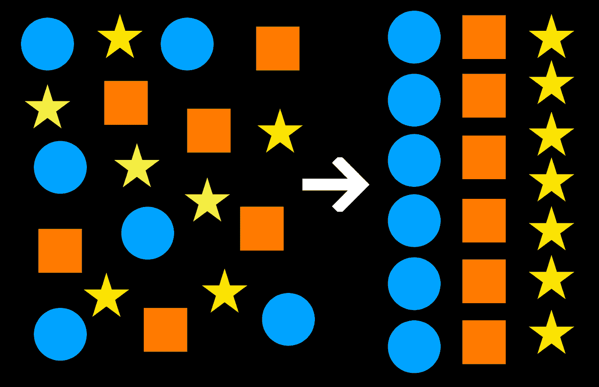

来源:图片由作者提供。

顾名思义，分类是对事物进行分类的行为。更形象地说，分类是将数据归类以更好地理解数据的过程。分类是一种监督学习方法，可应用于结构化和非结构化数据。

因此，我们真正要做的是，使用分类来预测给定数据点的未来结果，方法是基于它们属于哪一类别的可能性和概率！

老实说，现在唯一的问题是，如何做才能更精确地对数据进行分类，以便能够更好地理解它？

**我们来举一个简单的网恋的例子！**

根据 2022 年的研究，全球有超过 8000 个约会应用和网站，拥有 3.23 亿用户。是不是很大？与此同时，这款应用向 3.23 亿用户承诺，根据他们的共同特质，为他们找到合适的生活伴侣，用户期待一个完美的未来伴侣，组建家庭，生儿育女，快乐生活，享受乐趣。

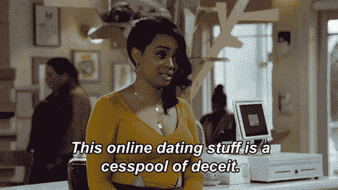

来源:https://media.giphy.com/media/KxIHVGDXllQNdVhc2v/giphy.gif

首先，所有这些约会应用程序都使用人工智能和机器学习的惊人组合来生成个性化的匹配，但应用程序如何知道这些匹配有哪些共同特征？答案很可能是分类。

如果你是这 3.23 亿人中的一员，你一定熟悉这个交友应用，但对于那些不熟悉的人来说，这里有一个很好的例子:

例如，想象一个有一堆人的用户界面，现在如果你喜欢屏幕上的人，你向右滑动，如果你不喜欢，向左滑动。从心理学上来说，每个好奇的人都不会因为只在一个人身上滑动而停止，所以当你在滑动的过程中:

1.  假设你正在浏览那些提到“办公室”的个人资料，这是他们最喜欢的节目
2.  现在，应用程序所做的是，它将从堆栈中对那些将“办公室”作为他们最喜欢的节目(许多特征之一)的人进行分类
3.  而且，在几秒钟内，你将能够看到提到“办公室”是他们最喜欢的节目的最大配置文件。

因此，机器学习是根据他们认为你更喜欢的特质对你的建议进行分类，但在现实中，这甚至都不重要！分类就是这样工作的；它可以基于多种特征；正如我们所说的，以上只是提供背景的一般示例。

## 机器学习中使用的分类技术类型:

## 逻辑回归:

让我们来看一些可以用逻辑回归找到解决方案的问题。

1.  增加 Instagram 上的覆盖面、关注者、喜欢和评论
2.  预测未来股票价格的变动。
3.  预测病人是否会得糖尿病。
4.  将邮件分类为垃圾邮件或非垃圾邮件。

## 让我们来看看案例研究:

**案例研究 1:]** 假设根据收入水平，我想预测或分类一个人是否会购买我的产品。

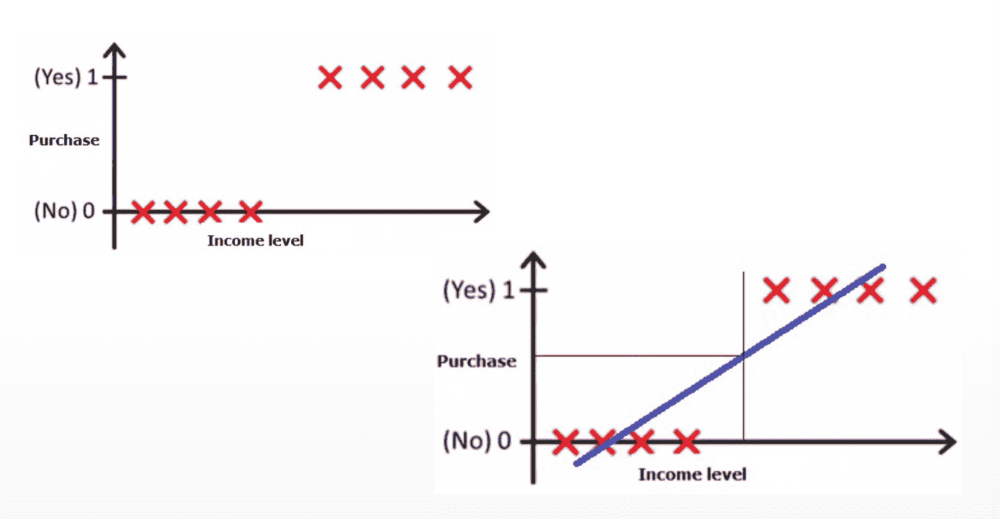

来源:吴恩达提供图片+PS

**小描述更好理解事情:**

1.  左图描绘了购买该产品的人数为 1。
2.  在右图中，因收入原因而不会购买该产品的人群表示为 0。
3.  现在，我们可以在右图中看到，在购买上画了一条线，我们可以将其视为阈值。
4.  所以门槛值仅仅意味着线内的人收入低，买不起产品，而线外的人收入高，买得起产品。

**案例研究 2:]** 我们想绘制一张人们每月购物的平均次数和每次购物花费的图表:

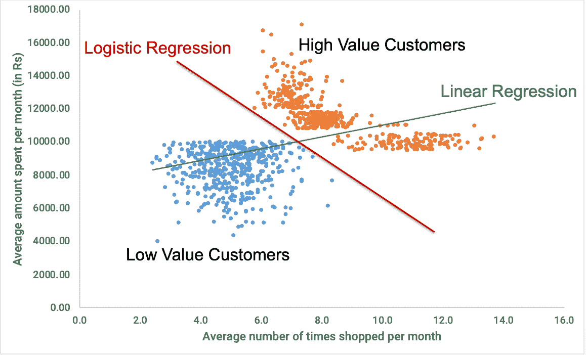

来源:图片由作者提供。

**小描述更好理解事情:**

1.  因此，我们可以看到，线性回归无法区分高价值和低价值的客户。
2.  线性回归输出值始终在[-∞，∞ ]范围内，而这种情况下的实际值(即二元分类)限于 0 和 1。
3.  这对于这种分类任务是不够的；我们还需要一个可以输出 0 到 1 之间的值的函数。
4.  这是通过 sigmoid 或逻辑函数实现的，因此命名为逻辑回归。

## 朴素贝叶斯分类器:

**让我们来看一些多类的分类问题:**

1.  给定一篇文章，预测报纸的体裁(例如，时事、国际、艺术、体育、时尚等。)它应该会在。
2.  给出一张汽车牌照的照片，识别它属于哪个国家。
3.  给定歌曲的音频片段，识别歌曲的类型。
4.  给定一封电子邮件，预测该电子邮件是否是欺诈邮件。

## 从数学角度来说:

**问题**:

给定某个证据 X，它来自类 Yi 的概率是多少，即 P(Yi|X)

**解决方案:**

朴素贝叶斯在估计 X 和 Y 的联合概率分布(即 P(X 和 Y))后，使用贝叶斯定理进行预测-P(Yi | X)

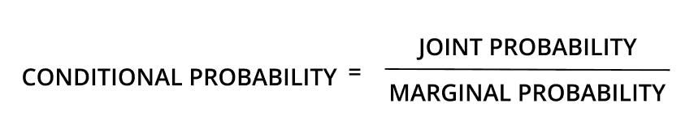

来源:图片由作者提供。

## k-最近邻(KNN 分类器)

为了更好地理解 KNN 算法的作用，请考虑以下实际应用:

1.KNN 是推荐系统中使用的一个漂亮的算法。

1.KNN 是推荐系统中使用的一个漂亮的算法。

3.KNN 可以搜索两个文档之间的相似之处，被称为向量。

这让我再次想起约会应用程序，它们使用推荐引擎来分析个人资料、用户喜欢、不喜欢和行为，并提供推荐以找到他们的完美匹配。

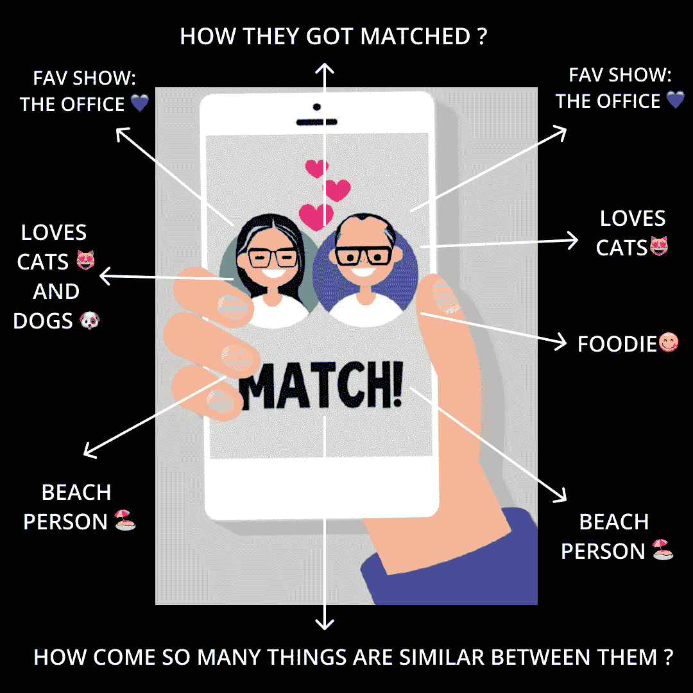

来源:图片由作者提供。

以 Tinder 为例:TINDER 采用了一种 VecTec，这是一种机器学习和人工智能混合算法，可以协助用户生成个性化的推荐。据 Tinder 的首席科学家 Steve Liu 介绍，Tinder 的用户分为刷机用户和刷机用户。

也就是说，用户的每一次刷卡都被标记在嵌入的向量上，并被假设为用户的许多特征之一。(比如最喜欢的系列、食物、教育背景、爱好、活动、度假目的地等等)

当推荐算法检测到两个内置向量(两个具有相似特质的用户)之间的相似性时，就会向对方推荐。(形容是绝配！)

*   k 近邻是实例学习的最基本形式之一

## 培训方法包括:

*   保存训练示例。

## 在预测时间:

*   找到与测试示例 x 最接近的“k”个训练示例(x1，y1)和…(xk，YK)。预测这些 yi 中最频繁出现的类。

我从网上找到了这个惊人的例子，作者用最基本的方式解释了 KNN 算法，也就是说，如果它像鸭子一样走路，像鸭子一样嘎嘎叫，那么它可能就是一只鸭子。

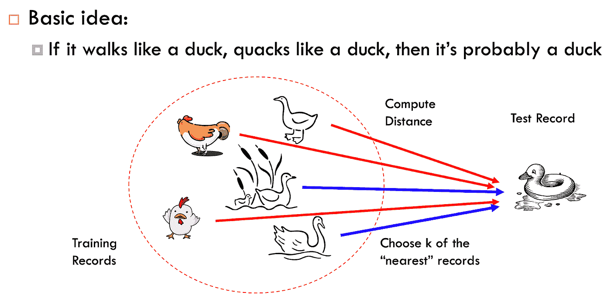

来源:[*https://ysu 1989 . github . io/courses/sp20/CSE 5243/Classification-advanced . pdf*](https://ysu1989.github.io/courses/sp20/cse5243/Classification-Advanced.pdf)

## KNN 进一步分为 3 种类型:

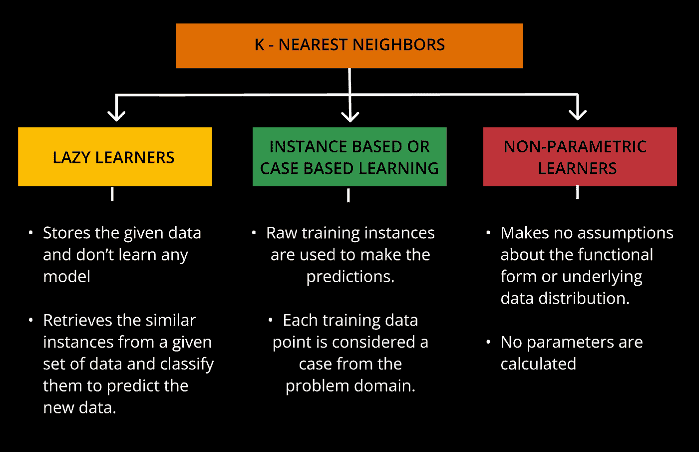

来源:图片由作者提供。

## 决策树:

决策树是预测和分类领域的一种改变游戏规则的算法。它是一个树状流程图，其中每个内部节点代表一个属性测试，每个分支代表测试结果，每个叶节点持有一个类标签。

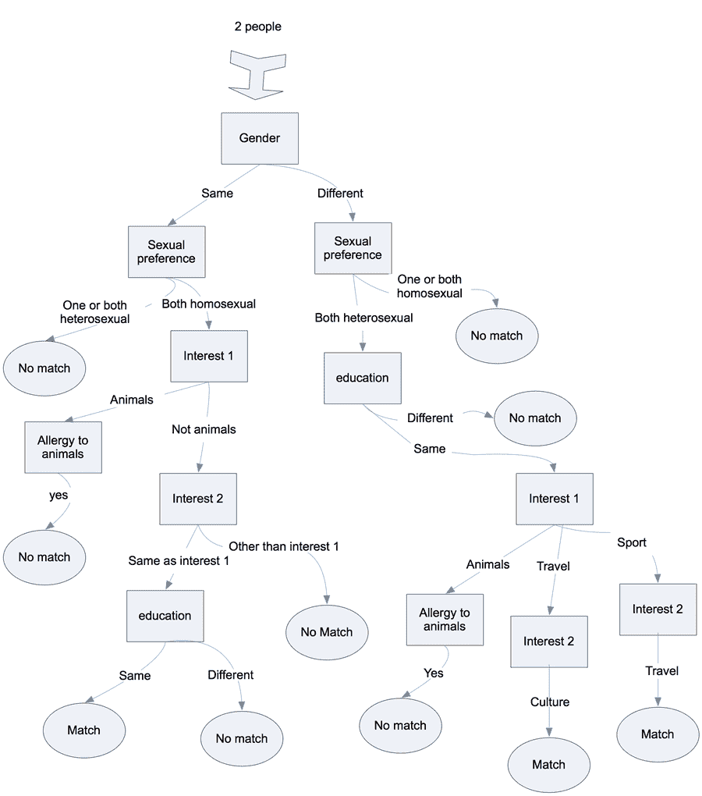

来源:https://www.brcommunity.com/images/articles/b624-1.htm

## 决策树术语有助于更好地理解事物:

## 根节点:

→决策树从根节点开始。它代表整个数据集，然后被分成两个或更多同类的集合。

在我们的例子中，根节点是两个人

## 叶节点:

→叶节点是树的最终输出节点，获得一个叶节点后树就不能再分了。

在我们的例子中，叶节点以匹配或不匹配结束

## 拆分:

→在分裂中，我们将根节点分成更进一步的子节点，即对根节点进行分类。

在我们的例子中，分裂子节点是像性别、动物、旅行、运动、文化等特征。

## 子树:

→通过分裂另一棵树创建的树

在我们的例子中，子树是性偏好、对动物过敏或教育。

## 修剪:

→修剪是除去树上不需要的树枝。

## 父/子节点:

→树的根节点称为父节点，其他节点称为子节点。

在我们的示例中，这两个人被视为根节点，其他子节点被视为子节点。

来源:图片由作者提供。

## 支持向量机:

SVM 算法的目标是找到对 n 维空间进行分类的最佳线或决策边界，以便我们将来可以轻松地将新数据点放在正确的类别中。超平面是最佳决策边界。

SVM 选择了例外的 pts，这将有助于创造更高维度的空间。这些极端情况被称为支持向量，该算法被称为支持向量机。

**让我们取 SVM 参数— C**

1.  控制训练误差。
2.  它用于防止过度拟合。
3.  我们来玩 c 吧。

图片由[支持向量机的 C 参数——GCB 535](https://www.youtube.com/watch?v=5oVQBF_p6kY)+Photoshop 处理

## 计算分类模型性能的方法:

来源:https://media.giphy.com/media/AXorq76Tg3Vte/giphy.gif

## 混淆矩阵法；

**让我们通过一个有趣的类比来理解它**

在深入研究混淆矩阵的工作原理之前，让我们先从定义开始:

混淆矩阵帮助我们确定给定测试数据的分类模型的性能。这个名字很容易混淆，因为当系统混淆这两个类时，它让我们很容易看出来。

来源:[https://media.giphy.com/media/SAAMcPRfQpgyI/giphy.gif](https://media.giphy.com/media/SAAMcPRfQpgyI/giphy.gif)

**快速简单的例子:**

假设，

**X** =来检查的女士的测试数据。

**P** =测试呈阳性的女士集合，即她们怀孕了。

测试结果为阴性的女性，即她们没有怀孕。

**设 x** =从给定的一组测试数据 x 中选择怀孕的女士。

**案例 1:】**如何计算有多少女士有阳性结果，即 P :

P = { x ∈ X: x 怀孕了}

**CASE2:]** **如何计算有多少女士结果为阴性，即 NP :**

NP = { x ∈ X: x 没怀孕}

## 上述案例研究的可能性:

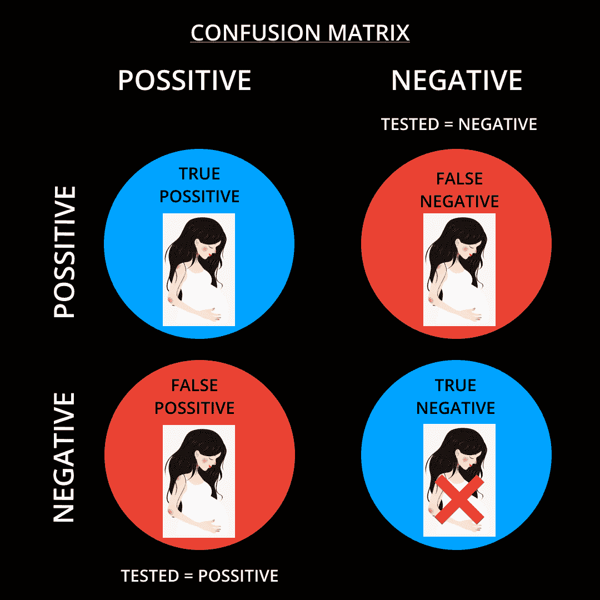

来源:图片由作者提供。

一位世卫组织女士怀孕了，她的测试也呈阳性。

女士“A”在集合“X”中，她怀孕测试呈阳性，并且怀孕了→这就是我们所说的真阳性

一位世卫组织女士没有怀孕，她的测试也是阴性的。

女士“A”在集合“X”中，她的怀孕测试结果为阴性，并且没有怀孕→这就是我们所说的真阴性

**一位世卫组织女士怀孕了，但她的检测呈阴性。**

女士“A”在集合“X”中，她怀孕测试为阴性，但她确实怀孕了→这就是我们所说的假阴性

**一位世卫组织女士没有怀孕，但她的检测呈阳性。**

女士“A”在集合“X”中，她怀孕测试呈阳性，但她没有怀孕→这就是我们所说的假阳性

**现在，这是混乱矩阵进入的情况:**

混淆矩阵将在分类算法中工作并分析上述情况。

混淆矩阵的好处在于，它可以帮助您理解您的分类模型，并可以准确预测结果，如果结果准确与否，添加混淆矩阵还有助于找出模型产生的错误

## 精确度和召回方法:

我们举一个简单的例子来理解这个方法。相信我，这超级简单又刺激。

来源:[https://media.giphy.com/media/5wWf7H89PisM6An8UAU/giphy.gif](https://media.giphy.com/media/5wWf7H89PisM6An8UAU/giphy.gif)

**案例研究 1:]** 假设有两种类型的恶意软件，分为间谍软件和广告软件。现在，我们已经创建了一个模型，可以检测各种商业软件中的恶意软件。为此，我们必须检查我们的机器学习模型的预测。

**模型 1:真阳性= 80，真阴性= 30，假阳性= 0，假阴性= 20**

**模型 2:真阳性= 90，真阴性= 10，假阳性= 30，假阴性= 0**

正如我们所看到的，模型 1 中的假阳性率为零，因为我们不希望我们的模型检测到错误类型的恶意软件，并导致两组恶意软件之间的混淆。正如我们所见，模型 1 具有更高的精度值，所以让我们从这里开始。

**精度=真阳性/真阳性+假阳性**

接下来，在一场极端的网络战争中，我们希望尽快检测到恶意软件，同时将它们的组分开，我们可以看到模型 2 的假阴性为 0，这意味着我们可以处理模型不需要将其分为两组恶意软件的情况，而只需检测它，这样我们就可以尽快结束网络战争。这也称为召回法。

**召回方法=真阳性/真阳性+假阴性**

## F -1 分数:

假设你已经开了一家造纸公司，由于是新公司，它刚开始赚的钱比较少。然而，你已经有了大量的纸张，需要一个合适的地方来存放这些纸张，还需要一个办公室来雇佣销售团队来增加你的销售额。既然我们不知道完成销售需要多少天、几周或几个月。那么如何预测截止日期呢？

来源:https://media.giphy.com/media/krlCPTKzMbbzi/giphy.gif

我们需要创建一个具有更高 F-1 分数的模型，该分数是基于可以为我们预测的召回和精度值来计算的。

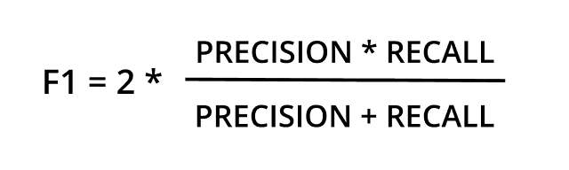

来源:图片由作者提供。

**F-1 得分越高，模型越好**

**关注我们，享受学习数据科学博客和文章的乐趣:💙**

**领英:**[https://www.linkedin.com/company/dsmcs/](https://www.linkedin.com/company/dsmcs/)

**insta gram**:[https://www.instagram.com/datasciencemeetscybersecurity/?hl=en](https://www.instagram.com/datasciencemeetscybersecurity/?hl=en)

**GITHUB:**[https://github.com/Vidhi1290](https://github.com/Vidhi1290)

**推特:**https://twitter.com/VidhiWaghela

**中等:**https://medium.com/@datasciencemeetscybersecurity-

**网址:**[https://datasciencemeetscybersecurity.blogspot.com/](https://datasciencemeetscybersecurity.blogspot.com/)

-团队数据科学与网络安全❤️相遇