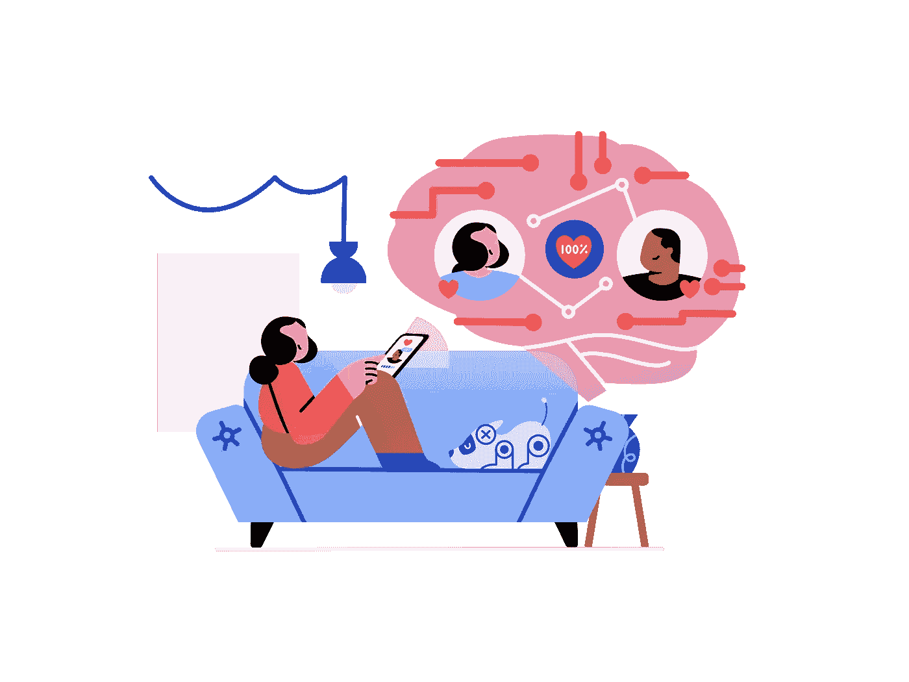
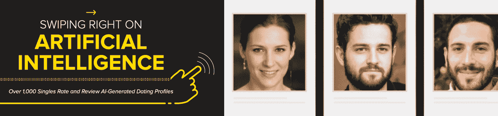
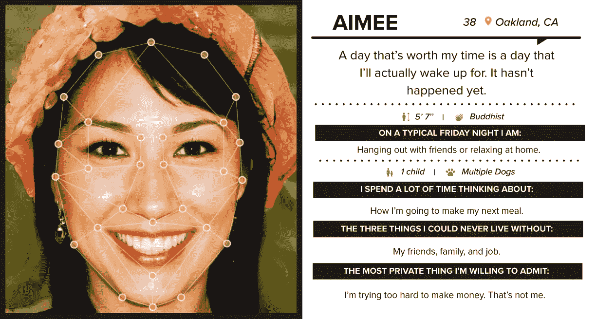
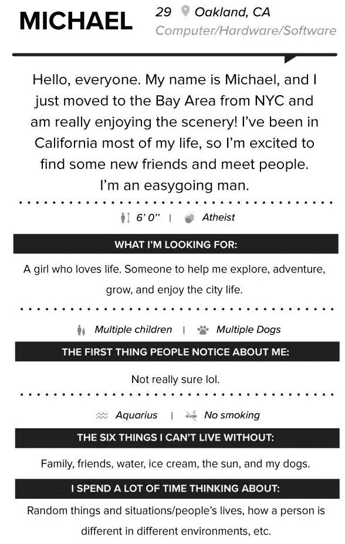
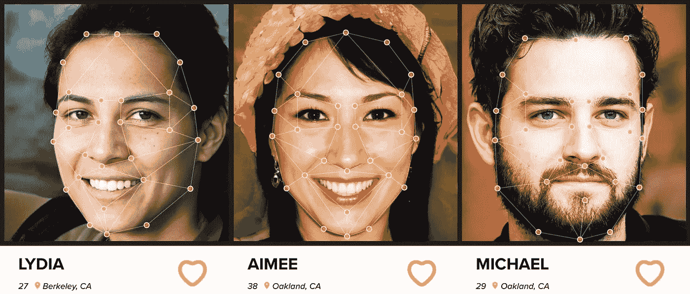

# 你会在人工智能档案上向右滑动吗？

> 原文：<https://pub.towardsai.net/would-you-swipe-right-on-an-ai-profile-98dc8a4451ec?source=collection_archive---------1----------------------->

## [人工智能](https://towardsai.net/p/category/artificial-intelligence)

## 你能区分真人和机器吗？这就是这项研究揭示的在约会应用程序上使用人工智能创造的人

图片由[设计条纹](https://www.designstripe.com/)。经允许重新发布。

正如我们在[之前的帖子](/can-an-ai-understand-what-beauty-is-to-us-f109640fd6ea)中所讨论的，现在可以训练人工智能(AI)来塑造美女。几年之内，“情人眼里出西施”这句名言可能会变成“情人眼里出西施”

的确，美是相当复杂和主观的东西。在最近的一项研究中，研究人员表明，分析你的品味和兴趣的人工智能可以生成个人魅力的面孔。

我想你会同意，当你看着某人，发现这个人很有魅力，你真的无法解释为什么。这个决定可能有很多原因。另外，其中一些原因甚至可能与人的体质没有直接关系。看起来这些原因可能都是你大脑中的电信号和化学混合物，让你有这种感觉。如果是这样的话，强大的计算机器可以比我们自己更有效地处理和理解这些数据。当然，这只是**可能的**考虑到超级智能机器能够**实时访问**我们所有的个人数据。这样的机器会比你自己更了解你，能够比你更好地解释它的决策过程，给出这个人吸引你的确切原因，并找到你的完美匹配。它将使用你甚至无法访问的数据，因为它也已经了解了对方，不会受到你的感觉引起的暂时偏见的影响。

这种由谷歌驱动的机器可能会在未来存在，正如尤瓦尔·诺亚·哈拉里在他令人惊叹的书《T2·德乌斯人》中所说。这种想法一开始可能听起来非常怪异甚至可怕，但你必须考虑到我们的社会将不得不改变许多事情来实现这一点，我们甚至没有谈论我们首先需要面对的这种技术带来的信任问题。不管怎样，这是件好事吗？我们希望人工智能告诉我们喜欢什么，甚至告诉我们我们错了，并告诉我们什么是我们真正喜欢的**？我不知道我的任何亲戚会喜欢跟随超级智能机器，即使它被证明比我们更了解我们。**

例如，这样的机器可以不断地分析你，包括当你和某人约会时，它会向你提供你对约会的真实感受。因此，利用概率、统计和大量数据，它可以判断你之前的两次约会，并得出最适合你的约会。现在，知道了考虑到所有因素，这肯定是对你最好的决定，问题是:你会盲目地跟随它吗？

与此同时，研究人员正在分析人工智能如何才能像人一样。我们大多数人都相信我们能够区分真正的人和机器，但事实真的如此吗？这就是这项研究揭示的在约会应用程序上使用人工智能化妆的人。事实上，这就像图灵测试一样，只不过是在约会应用上！

图片来自 UNSW 悉尼的研究博客。经允许重新发布。

悉尼 UNSW 大学的桑德拉·布莱恩特和她的团队利用人工智能生成了虚拟人，以精确测量“你在一个人的约会资料上看到的有多少是你认为‘真实’的。”

## 主要发现

在深入这项令人兴奋的研究的细节之前，让我们先来看一下他们的发现，这可能会引起你的兴趣！

以下是这项研究对 1008 名受访单身人士的两个关键发现:他们发现，62%的单身人士会在人工智能生成的约会简介上向右滑动，43%的受访者说这些简介看起来很真实。这意味着大约一半的人无法根据*人*的长相和简短描述来区分人工智能和真人。

*当然，请注意，这项调查只代表了一小部分人，只有 1 008 名单身人士使用约会应用程序，这并不能正确代表整体人口。*

## 什么是人工智能制造的人？

在他们的实验中，一个人工智能虚构的人看起来像这样:

图片来自 [UNSW 悉尼的研究博客【2】](https://studyonline.unsw.edu.au/blog/ai-generated-dating-profile)。经允许重新发布。

当然，在测试过程中，它的脸上没有这些点，这使它变得非常明显，但你会明白的。如你所见，Aimee 看起来像一个真实的人。我说的不仅仅是她的外表，就连她的“存在”也似乎是真实的。正如他们提到的，“从他们的脸到他们的话语和身份，一切都是由人工智能构建的”。事实上，Aimee 有一个完全虚假的身份，使用简短和原创的描述，并真诚地回答约会应用程序提出的一般问题。它甚至使用了幽默和想象力，这两样东西我们不会怀疑一台机器很快就会拥有。如果你觉得这个简介很真实，我邀请你去看看[他们制作的其他简介](https://studyonline.unsw.edu.au/blog/ai-generated-dating-profile)。这是相当惊人的！

为了创建这种*人性化的*假档案，他们必须实现两个主要目标:

*   创建真实的个人资料图片
*   创建新身份

对于前者，该团队使用了[thispersondoesnotexist.com](https://thispersondoesnotexist.com/)，一个当你访问或刷新它时会随机生成“不存在的人”的网站。这个系统使用了一种叫做 StyleGAN2 [3]的方法，发表于 2019 年末。

StyleGAN2 及其最近的变体，" [StyleGAN2 ADA](https://youtu.be/9fVNtVr_luc) " [4]，是最先进的生成式对抗网络(GAN)。GAN 是一种神经网络架构，能够按照其接受训练的图像的*风格*生成完全人工的图像。因此，就其本质而言，它可以复制它在训练中看到的东西，以生成甚至不存在的新图像，就像这种情况下的人脸一样！在这里，图像的风格可以有不同的解释。它不仅可以被调整以复制图像的整体风格，这些图像是人脸的图片，而且还可以学习诸如鼻子、眼睛、头发等局部特征的风格。然后，在生成过程中，可以控制甚至随机化这些特征。这是可能的，因为 GAN 架构的能力，它通过直观地比较生成的图像和它“应该”生成的图像之间的结果来学习。这种“假定的”或预期的图像是在训练数据中找到的图像。

在深入研究这些伪造身份的第二部分之前，我想让你们中最专业的人参考一下以前解释 GANs 的一篇文章。这段 5 分钟的简短阅读将帮助您理解它是如何使用一个很棒的“卡通化”示例来处理更多技术细节的:

 [## 这种人工智能将人脸转换成迪士尼动画电影角色(卡通)

### 这个人工智能可以将你的任何照片转换成迪士尼动画电影角色的精确表现…

pub.towardsai.net](/this-ai-transform-faces-into-disney-animated-movie-characters-toonify-5225f04da588) 

然后使用 OpenAI 在 2019 年开发的文本生成模型 GPT-2 [5]让这些档案变得“活”起来。你一定听说过他的哥哥 GPT-3！嗯，用 GPT-2 的好处就是 [**开放接入**](https://colab.research.google.com/drive/1VLG8e7YSEwypxU-noRNhsv5dW4NfTGce#forceEdit=true&sandboxMode=true&scrollTo=aeXshJM-Cuaf) 而且相当强大。事实上，你可以不使用强大的计算机或图形卡自己尝试，只需运行[这款 Google Colab 笔记本](https://colab.research.google.com/drive/1VLG8e7YSEwypxU-noRNhsv5dW4NfTGce#forceEdit=true&sandboxMode=true&scrollTo=aeXshJM-Cuaf)中的几行代码，并为你有数据训练的任何任务生成文本！更好的是，如果你没有任何数据，你可以使用[预训练模型](https://huggingface.co/transformers/pretrained_models.html)，这是已经训练好的模型，你可以上传并立即运行！

简单地解释一下，GPT-2 通过查看你选择的成千上万的文本示例来自行生成一个全新的文本，再次遵循与训练数据相同的风格。在这种情况下，训练数据是文本，样式是“约会简档”类型的文本。这个模型的有趣之处在于它非常直观。我们可以说，GPT-2 通过查看所有其他约会简档来寻找“获胜”模式，然后试图在一个全新的约会简档中复制它们，这是以前从未存在过的。由于它强大的记忆力，它在更大的范围内就像我们一样。

来认识一下迈克尔，一个不存在的喜欢冒险的 29 岁奥克兰程序员:

图片来自 UNSW 悉尼的研究博客。经允许重新发布。

请记住，这项研究是关于在约会应用程序上使用这些虚假的个人资料来研究“现实生活中的单身人士如何在虚假图像上刷卡，以及他们对人工智能生成的匹配的整体看法”！在进入下一部分之前，这里有一个我制作的关于 GPT-2 的哥哥 GPT-3 的视频，供你们中最好奇的人看。展示一些令人印象深刻的应用程序并解释其工作原理，因为 GPT-3 几乎是其前身的升级版，所以它非常相似。它只是有更大的“记忆”

## 这是你的选择:和[莉迪亚](https://studyonline.unsw.edu.au/sites/default/files/4_lydia_Compressed.jpg)一起出去玩，和[艾米](https://studyonline.unsw.edu.au/sites/default/files/8_aimee.png)一起闲逛，或者和[迈克尔](https://studyonline.unsw.edu.au/sites/default/files/10_michael_Compressed.jpg)一起去冒险！

图片来自 UNSW 悉尼的研究博客。经允许重新发布。

对于我们刚刚看到的[迈克尔](https://studyonline.unsw.edu.au/sites/default/files/a1_michael_Compressed.jpg)，44%的**受访者表示他看起来**真实**，82%的**受访者表示他**极具魅力**，主观评分超过 7 分(满分 10 分)！考虑到这一点， **73.6%** 的人表示，看到这个简介，他们会**向右滑动**。****

同样，对于本文开头所示的[Aimee](https://studyonline.unsw.edu.au/sites/default/files/8_aimee.png),**86%的受访者表示她非常有魅力，主观评分也超过了 7 分(满分 10 分)。 **69.8%** 表示会**向右滑动**。同样， **44%** 表示这个简介看起来**真实**。**

***他们在* [*他们的研究*](https://studyonline.unsw.edu.au/blog/ai-generated-dating-profile) *中展示了其他几个简介的统计结果，如果你想看更多像这样的***的假简介，我邀请你去看看。你不会失望的！****

***他们在实验中测试的所有个人资料的结果都非常相似，得出的结论是，大约一半的受访者无法区分假货和真人。此外，这一半人认为他们非常有吸引力！***

***当然，网上约会并不是真实的世界，我很有信心 44%的受访者不会在第一次约会见到对方时被欺骗。但是，这项研究表明，“和你说话的人可能并不总是他们所说的那个人，”[1]我想补充的是，他可能根本就不是一个人。在这里，我将要求你在使用约会应用程序时要小心，并通过要求他们在与你见面之前进行视频电话通话来验证你正在与你认为的那个人交谈。到目前为止，您应该已经习惯了使用 Zoom 调用，所以这应该不会太可怕！正如我们所说，当事情好得不像真的时，它很可能就是真的，所以要小心，享受认识新朋友的乐趣！***

***从更积极的角度来说，人工智能的进步令人难以置信。研究人员在这项研究中使用了以前最先进的技术，这意味着我们刚刚看到的这些生成模型现在要好得多，可以创建更真实的人脸和文本。我们可以想象几年后它会有怎样的表现！***

***正如卡罗利·佐尔奈-费希尔博士所说的那样***

*****多么美好的时光啊**！***

***如果你喜欢我的工作，并想与人工智能保持同步，你绝对应该在我的其他社交媒体账户( [LinkedIn](https://www.linkedin.com/in/whats-ai/) 、 [Twitter](https://twitter.com/Whats_AI) )上关注我，并订阅我的每周人工智能 [**简讯**](http://eepurl.com/huGLT5) ！***

## ***支持我:***

*   ***支持我的最好方式是在 [**媒体**](https://medium.com/@whats-ai) 上关注我，或者如果你喜欢视频格式，在[**YouTube**](https://www.youtube.com/channel/UCUzGQrN-lyyc0BWTYoJM_Sg)**上订阅我的频道。*****
*   *****支持我在 [**Patreon**](https://www.patreon.com/whatsai) 上的工作*****
*   *****加入我们的 [**Discord 社区:** **一起学习 AI**](https://discord.gg/learnaitogether)和*分享你的项目、论文、最佳课程、寻找 Kaggle 队友等等！******

## *****参考*****

*****[1] M. Spape，K. Davis，L. Kangassalo，N. Ravaja，Z. Sovijarvi-Spape 和 T. Ruotsalo，“用于生成个人魅力图像的脑机接口”，载于 IEEE 情感计算汇刊，doi:[10.1109/taf fc . 2021 . 3059043](https://ieeexplore.ieee.org/document/9353984)。*****

*****[2] Sandra Bryant 等人，“[我们要求人工智能创建约会档案。你能向右滑动吗？](https://studyonline.unsw.edu.au/blog/ai-generated-dating-profile)”(2021)，UNSW·悉尼博客。*****

*****[3] Tero Karras 和 Samuli Laine 和 Miika Aittala 和 Janne Hellsten 以及 Jaakko Lehtinen 和 Timo Aila，“[分析和改善 StyleGAN](https://github.com/NVlabs/stylegan2) 的图像质量”，(2019)，由英伟达在 CVPR 出版。*****

*****[4] Tero Karras 和 Samuli Laine 和 Miika Aittala 和 Janne Hellsten 以及 Jaakko Lehtinen 和 Timo Aila，“[利用有限数据](https://github.com/NVlabs/stylegan2-ada-pytorch)训练生成性对抗网络”，(2020)，由 NVIDIA 在 NeurIPS 出版。*****

*****[5]，Alec 和 Wu，Jeff 和 Child，Rewon 和 Luan，David 和 Amodei，Dario 和 Sutskever，Ilya，“[语言模型是无监督的多任务学习器](https://github.com/openai/gpt-2)”, open ai(2019)。*****

*****[6] Tom B. Brown 等人，“[语言模型是很少出手的学习者](https://arxiv.org/abs/2005.14165)”，(2020)，arXiv，作者 OpenAI。*****