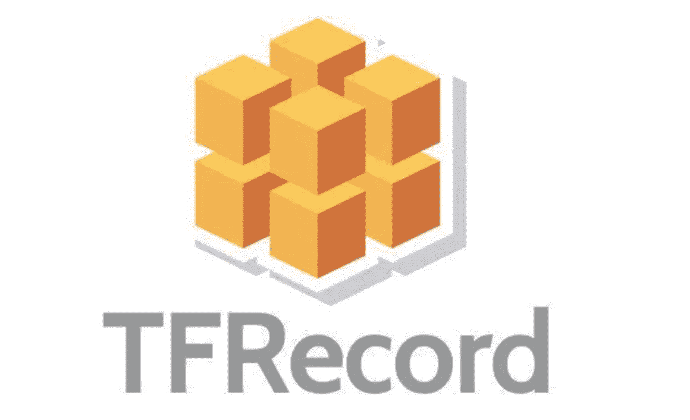
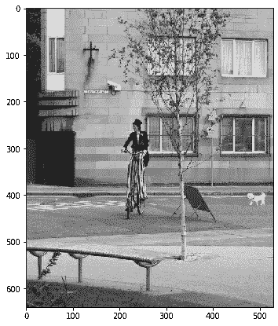

# 以正确的方式编写 TFRecord 文件

> 原文：<https://pub.towardsai.net/writing-tfrecord-files-the-right-way-7c3cee3d7b12?source=collection_archive---------2----------------------->

## [机器学习](https://towardsai.net/p/category/machine-learning)

## 如何正确地从数据集生成 TFRecord 文件



TFRecord 格式是一种用于存储二进制记录序列的简单格式。

> 在这篇文章中，你将了解为什么以及何时应该使用 TFRecords 格式，以及使用它所必需的代码。
> 
> 这篇文章是我为官方 Keras.io 代码示例页面写的教程的更详细版本。

将您的数据转换为 TFRecord 有许多优点，例如:

*   **更高效的存储**:TF record 数据可以比原始数据占用更少的空间；它也可以被分割成多个文件。
*   **快速 I/O**:TF record 格式可以通过并行 I/O 操作读取，这对于[TPU](https://www.tensorflow.org/guide/tpu)或多个主机很有用。
*   **自包含文件**:TF record 数据可以从单一来源读取——例如， [COCO2017](https://cocodataset.org/) 数据集最初将数据存储在两个文件夹中(“图像”和“注释”)。

TFRecord 数据格式的一个重要用例是 TPU 上的培训。首先，TPU 足够快，可以从优化的 I/O 操作中受益。此外，TPU 需要远程存储数据(例如在谷歌云存储上)，使用 TFRecord 格式可以更容易地加载数据，而无需批量下载。

如果您还将 TFRecord 格式与 [tf.data](https://www.tensorflow.org/guide/data) API 一起使用，那么使用 TF record 格式的性能可以得到进一步提高。

在这里，您将学习如何将不同类型的数据(图像、文本和数字)转换成 TFRecord。

## COCO 2017 数据集

我们将使用 [COCO2017](https://cocodataset.org/) 数据集，因为它有许多不同类型的特性，包括图像、浮点数据和列表。它将作为一个很好的例子，说明如何将不同的特性编码成 TFRecord 格式。

该数据集有两组字段:**图像**和**注释元数据**。

这些图像是 JPG 文件的集合，元数据存储在一个 JSON 文件中，根据[官方网站](https://cocodataset.org/#format-data)，该文件包含以下属性:

```
id: int,
image_id: int,
category_id: int,
segmentation: RLE or [polygon], object segmentation mask
bbox: [x,y,width,height], object bounding box coordinates
area: float, area of the bounding box
iscrowd: 0 or 1, is single object or a collection
```

## 让我们看看数据集中的一个样本

```
{'area': 367.89710000000014,
 'bbox': [265.67, 222.31, 26.48, 14.71],
 'category_id': 72,
 'id': 34096,
 'image_id': 525083,
 'iscrowd': 0,
 'segmentation': [[267.51,
                   222.31,
                   292.15,
                   222.31,
                   291.05,
                   237.02,
                   265.67,
                   237.02]]}
```

# 开始数据转换

要开始数据转换过程，首先，我们需要定义几个函数。
从原始数据到张量流类型的转换开始:

```
def image_feature(value):
    """Returns a bytes_list from a string / byte."""
    return tf.train.Feature(
        bytes_list=tf.train.BytesList(value=[tf.io.encode_jpeg(value).numpy()])
    )

def bytes_feature(value):
    """Returns a bytes_list from a string / byte."""
    return tf.train.Feature(bytes_list=tf.train.BytesList(value=[value.encode()]))

def float_feature(value):
    """Returns a float_list from a float / double."""
    return tf.train.Feature(float_list=tf.train.FloatList(value=[value]))

def int64_feature(value):
    """Returns an int64_list from a bool / enum / int / uint."""
    return tf.train.Feature(int64_list=tf.train.Int64List(value=[value]))

def float_feature_list(value):
    """Returns a list of float_list from a float / double."""
    return tf.train.Feature(float_list=tf.train.FloatList(value=value))def create_example(image, path, example):
    feature = {
        "image": image_feature(image),
        "path": bytes_feature(path),
        "area": float_feature(example["area"]),
        "bbox": float_feature_list(example["bbox"]),
        "category_id": int64_feature(example["category_id"]),
        "id": int64_feature(example["id"]),
        "image_id": int64_feature(example["image_id"]),
    }
    return tf.train.Example(features=tf.train.Features(feature=feature))
```

这些函数非常直观，但让我们更好地理解它们的用法。

基本函数是`bytes_feature`、`float_feature`和`int64_feature`，它们将把基本数据如字符串和数字数据(整数和浮点数)转换成等价的 TensorFlow 数据类型，`float_feature`和`float_feature_list`的区别在于`float_feature_list`用于转换一列浮点数，而不仅仅是单个值。
接下来，我们将使用`image_feature`来转换图像，也可以使用常规字符串或浮动列表来转换图像，但是使用像`encode_jpeg`这样的函数更有效。
最后，我们有`create_example`将所有这些集合在一起，它接收所有必要的数据，并将其转换为适当的 TensorFlow 格式，创建一个字典，后者将被序列化并写成 TFRecord 文件。

现在，我们可以定义一些参数来启动这个过程。

`num_samples`是每个 TFRecord 文件上的数据样本数。

`num_tfrecods`是我们将要创建的 TFRecord 文件的总数。

```
root_dir = "datasets" # input data root folder
tfrecords_dir = "tfrecords" # output data folder
images_dir = os.path.join(root_dir, "val2017") # input images folder# input annotations folder and filepath
annotations_dir = os.path.join(root_dir, "annotations") 
annotation_file = os.path.join(annotations_dir, "instances_val2017.json")num_samples = 4096
num_tfrecods = len(annotations) // num_sampleswith open(annotation_file, "r") as f: # load annotation data as list
    annotations = json.load(f)["annotations"]

if not os.path.exists(tfrecords_dir):
    os.makedirs(tfrecords_dir)  # creating TFRecords output folder
```

## 生成 TFRecord 格式的数据

现在我们可以迭代 COCO2017 数据并创建 TFRecord 文件。文件名格式将是`file_{number}.tfrec`(这是可选的，但是在文件名中包含数字序列可以使计数更容易)。

```
for tfrec_num in range(num_tfrecods):
    samples = annotations[(tfrec_num * num_samples) : 
                          ((tfrec_num + 1) * num_samples)]

    with tf.io.TFRecordWriter(
        tfrecords_dir+"/file_%.2i-%i.tfrec"%(tfrec_num,len(samples))
    ) as writer:
        for sample in samples:
            image_path=f"{images_dir}/{sample['image_id']:012d}.jpg"
            image = tf.io.decode_jpeg(tf.io.read_file(image_path))
            example = create_example(image, image_path, sample)
            writer.write(example.SerializeToString())
```

下面是这个循环中发生的情况:

首先，我们对注释列表进行切片，只获取将在该迭代中写入的样本，切片大小基于我们之前为每个 TFRecord 文件定义的样本数量`num_samples`。

接下来，我们使用`tf.io.TFRecordWriter`来创建将要写入的 TFRecord 文件，并且我们使用另一个循环来迭代第一步中切片的样本。

对于最后一个循环，我们首先构建图像文件路径，并使用它通过`tf.io.decode_jpeg`读取图像，然后我们可以使用这些属性调用`create_example` 函数，该函数将返回一个 TensorFlow 示例，我们将使用`example.SerializeToString()`序列化该示例，最后，将该示例写入第二步中创建的 TFRecord 文件。

# 从生成的 TFRecord 中探索一个样本

要打开新创建的 TFRecord 文件，我们需要一个 parse 函数，该函数会将二进制记录序列转换回适当的 TensorFlow 数据类型。

```
def parse_tfrecord_fn(example):
    feature_description = {
        "image": tf.io.FixedLenFeature([], tf.string),
        "path": tf.io.FixedLenFeature([], tf.string),
        "area": tf.io.FixedLenFeature([], tf.float32),
        "bbox": tf.io.VarLenFeature(tf.float32),
        "category_id": tf.io.FixedLenFeature([], tf.int64),
        "id": tf.io.FixedLenFeature([], tf.int64),
        "image_id": tf.io.FixedLenFeature([], tf.int64),
    }
    example = tf.io.parse_single_example(example, feature_description)
    example["image"] = tf.io.decode_jpeg(example["image"], channels=3)
    example["bbox"] = tf.sparse.to_dense(example["bbox"])
    return example
```

读取图像并显示

```
raw_dataset = tf.data.TFRecordDataset(f"{tfrecords_dir}/file_00-{num_samples}.tfrec")
parsed_dataset = raw_dataset.map(parse_tfrecord_fn)

for features in parsed_dataset.take(1):
    for key in features.keys():
        if key != "image":
            print(f"{key}: {features[key]}")

    print(f"Image shape: {features['image'].shape}")
    plt.figure(figsize=(7, 7))
    plt.imshow(features["image"].numpy())
    plt.show()
```

*输出:*

```
bbox: [473.07 395.93  38.65  28.67]
area: 702.1057739257812
category_id: 18
id: 1768
image_id: 289343
path: b'datasets/val2017/000000289343.jpg'
Image shape: (640, 529, 3)
```



TFRecord 的另一个优点是，您可以向它添加许多功能，以后只使用其中的一部分，在这种情况下。

现在你可以使用新生成的 TFRecord 文件训练一个模型，查看我写的 [Keras.io 教程](https://keras.io/examples/keras_recipes/creating_tfrecords/)中的例子。

# 结论

本文演示了使用 TFRecord，您可以从单一来源获得数据，而不是从不同来源读取图像和注释。这个过程可以使存储和读取数据更简单、更高效。更多信息可以去 [TFRecord 和 tf.train.Example](https://www.tensorflow.org/tutorials/load_data/tfrecord) 教程。

## 参考

- [TFRecord 和 TF . train . example](https://www.tensorflow.org/tutorials/load_data/tfrecord)(tensor flow)
-[创建 TF records](https://keras.io/examples/keras_recipes/creating_tfrecords/)(keras . io)
-[TF records 基础](https://www.kaggle.com/ryanholbrook/tfrecords-basics) (Kaggle)