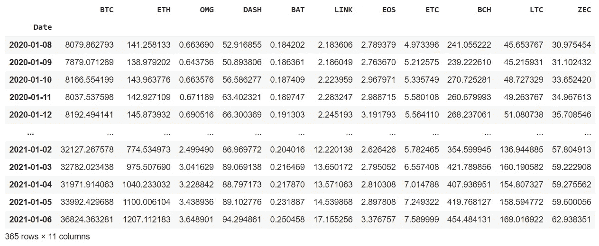
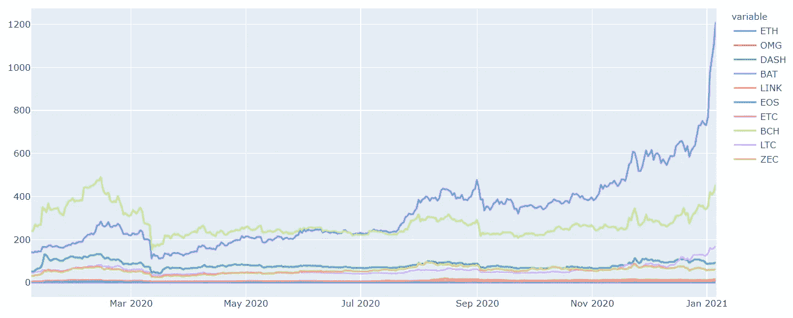
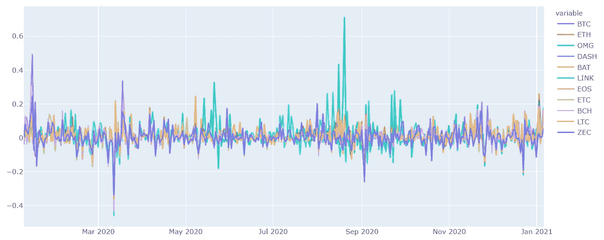
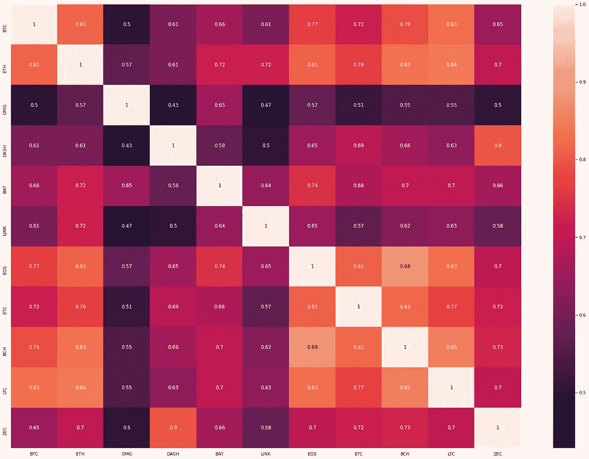
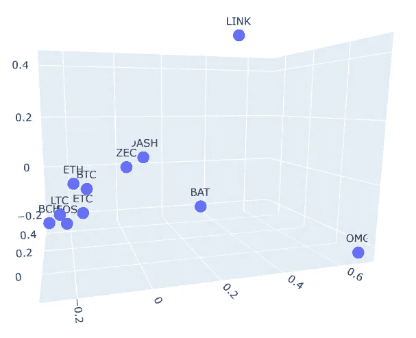
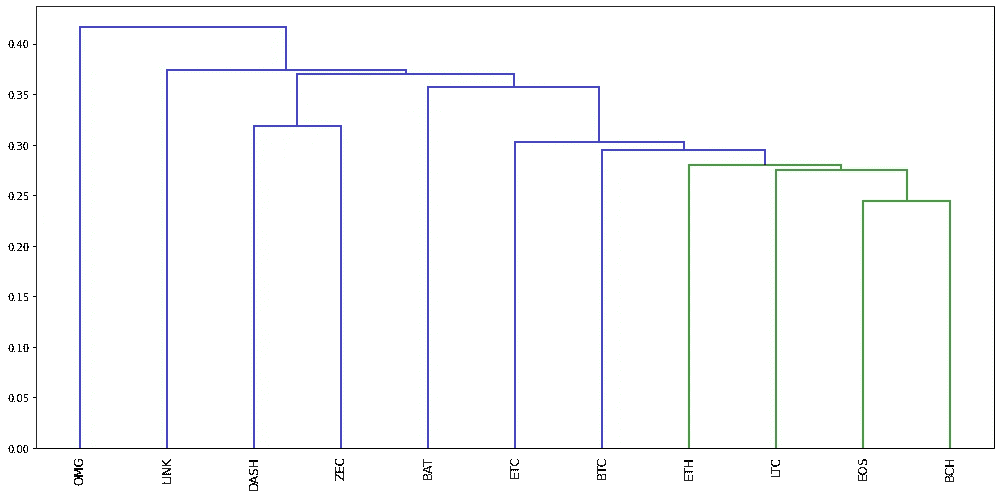

# Yeetum 每周定量报告

> 原文：<https://pub.towardsai.net/yeetum-weekly-quant-report-c20700d629ff?source=collection_archive---------3----------------------->

## 加密货币

## 从量化金融角度看加密货币的最新消息

使用 python 语言进行分析，扩展使用 matplotlib、seaborn、plotly、pyportfolioopt 和 sklearn。

我们将每周出版一份市场分析报告。有关我们和我们的分析师团队的更多信息，请访问 [Yeetum](https://www.yeetum.com/) 。


www.yeetum.com

# 定性报告

比特币的炒作似乎已经达到了顶峰，至少在这个周期是如此。在周期调整之后，投资者将会对比特币的未来繁荣**平均下跌**。

我们现在目睹的只是比特币生命周期的又一步。过去几年，比特币的市场交易量大幅增加，这让投资者能够进行一次永久的价格发现。比特币作为自己的资产类别将越来越有吸引力，其价格将不断修正，直到其波动性达到稳定水平。

加密货币是不稳定和高度相关的资产，这使得从投资组合优化的角度来看，正确管理它们非常具有挑战性。传统的金融技术，如均值-方差分配方法，在应用于加密货币时是无效的:需要更复杂的数学工具来处理这种复杂程度。

在加密货币的世界里，简单的买入并持有并不是明智的策略。鉴于比特币的下跌，以及将传播到其他加密货币的明显看跌效应，如果投资者不希望终止当前头寸，对冲这一不可避免的风险是明智的。

因为比特币阶段的下一步似乎是可以预见的，这是其当前周期的结束，在适当谨慎的情况下，做空可以作为比特币和相关加密货币的短期策略。

# 定量报告

我们的数据是从比特币基地用 python 代码下载的。它已被进一步分析，以提供一个可理解的报告。

该数据包括我们当前投资组合中总共 12 种不同的密码:BTC、瑞士联邦理工学院、OMG、DAHS、英美烟草、LINK、EOS 等、BCH、LTC、ZEC。



原始加密货币数据集的屏幕截图



BTC 被省略了，太高会使其他线条看不见

从上面的图表中我们可以看到，所有的密码很可能会一起移动，因为它们的相关系数很高。他们的回报遵循同样的逻辑:



每种加密货币的回报，BTC 包括在内，因为其他行将保持可见

如前所述，所有加密货币都非常不稳定，这使它们成为一种非常危险的资产，如果被忽视或管理不当，可能会很危险:然而，如果管理得当，**非常有利可图**。

# 皮尔逊相关

密码之间的皮尔逊相关性的热图表示显示所有资产彼此高度相关(> . 5 相关性)。这意味着，传统的多样化方法，如有效边界，是无效的，因为他们不能正确操作给定这种类型的数据。因此，需要使用更先进和不太正统的多样化方法，为投资者提供安全网。



相关矩阵的热图

在压缩 12 个维度(我们正在分析的密码数量)后，我们可以在笛卡尔平面中可视化相关矩阵:每个点代表一个不同的资产，而点之间的距离代表它们关系的强度。正如我们所看到的，BTC 和 ETH 的相关性非常高，而 LINK 和 OMG 等密码的相关性最低，可以提供多样化的机会。



三维相关矩阵

# 投资组合分配

本周我们一直在选择两种主要的分配方法:HRP，一种叫做分级风险平价的机器学习投资组合优化方法，以及共同有效前沿。

## 效率限界

有效边界是最小化风险，同时最大化利润的传统方法。

```
BTC, 0.08
ETH, 0.20
OMG, 0.08
DASH, 0.08
BAT, 0.08
LINK, 0.08
EOS, 0.08
ETC, 0.08
BCH, 0.08
LTC, 0.08
ZEC, 0.08Expected annual return: 157.5%
Annual volatility: 74.8%
Sharpe Ratio: 2.08
```

## 医院资源规划（Hospital Resource Planning 的缩写）

该算法考虑资产的相关矩阵中的聚类，然后相应地对它们进行分组。



聚类机器学习分配方法

```
BAT, 0.08
BCH, 0.05
BTC, 0.13
DASH, 0.10
EOS, 0.06
ETC, 0.12
ETH, 0.07
LINK, 0.10
LTC, 0.11
OMG, 0.06
ZEC, 0.06Expected annual return: 116.1%
Annual volatility: 73.3%
Sharpe Ratio: 1.56
```

# 结论

数据中提到，随着比特币的下跌，其他所有加密货币都在跟风。与比特币最接近的加密技术以太坊(Ethereum)也走上了同样的道路。

鉴于比特币与 BTC 生命周期前一阶段的相似性，至少在不远的将来，我们不太可能看到比特币价格的回升。然而，鉴于比特币的市值一直在增加，而且没有迹象表明它将停止这样做，从长期来看，比特币仍有潜力实现更高的表现。