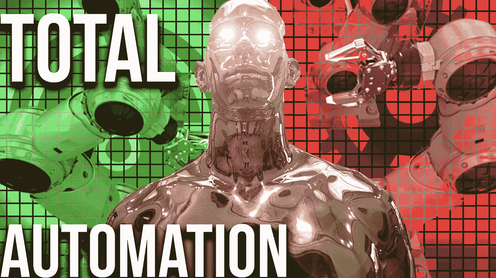
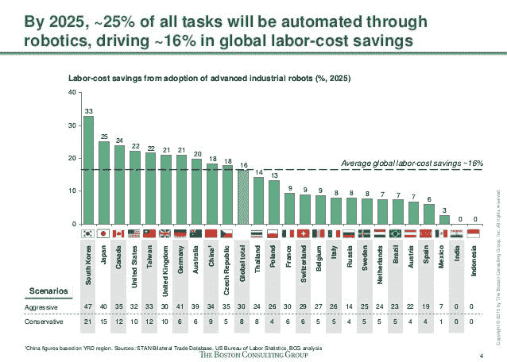
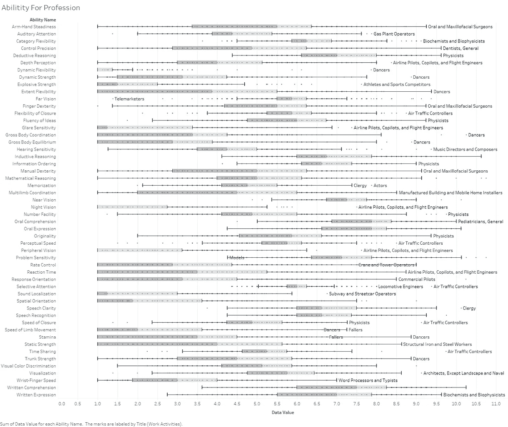
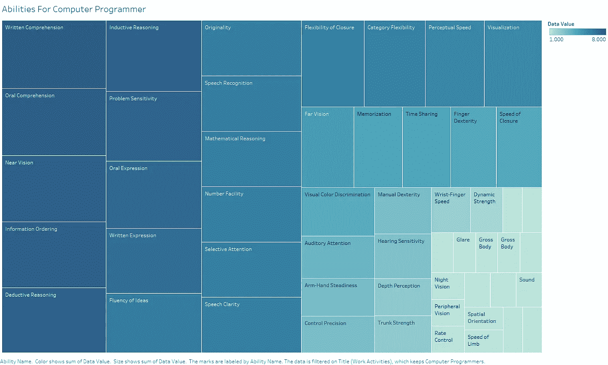
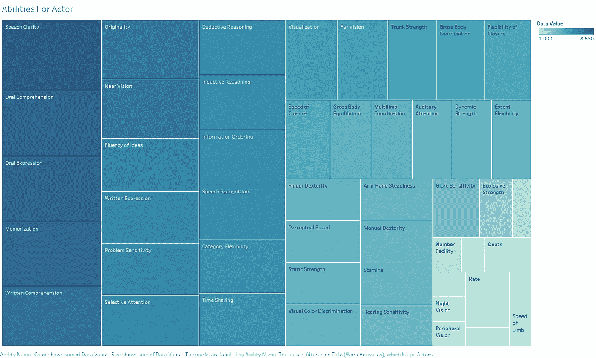
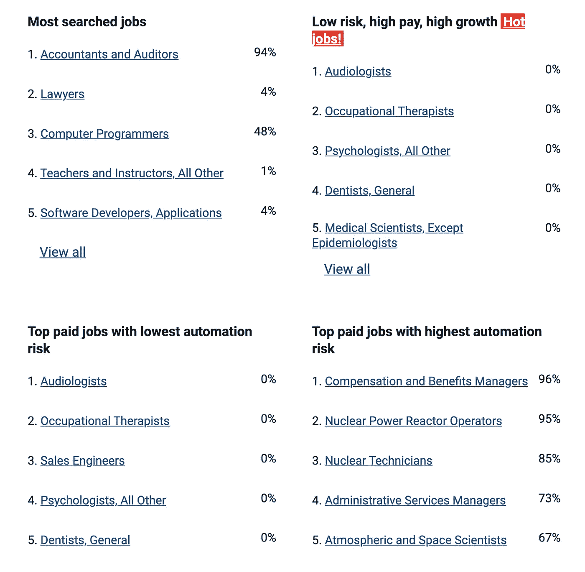

# 是的，机器人将取代你

> 原文：<https://pub.towardsai.net/yes-robots-will-replace-you-9e38a5e9a0cf?source=collection_archive---------4----------------------->

## [未来](https://towardsai.net/p/category/future)，[意见](https://towardsai.net/p/category/opinion)

## 但是你的工作自动化的可能性有多大？

图像由作者创建，中央机器人由[阿图尔·图马斯扬](https://unsplash.com/@arturtumasjan?utm_source=unsplash&utm_medium=referral&utm_content=creditCopyText)在 [Unsplash](https://unsplash.com/s/photos/robot?utm_source=unsplash&utm_medium=referral&utm_content=creditCopyText) 上制作。作者通过 [Envato elements](https://elements.envato.com/photos) 持有的其他图形许可

我们都看到了机器学习和机器人自动化任务的快速发展，而这在几年前还被认为是不可能的。许多专家认为这一趋势将继续，甚至会加速。

> 未来是现在的老人——流行模因

而约翰·梅纳德·凯恩斯早在 1929 年就已经做出了类似的悲观预测。正如他著名的预测，自动化技术的快速传播将在不久的将来带来“技术失业”。虽然这没有发生在他的生活可能是一个完全不同的故事。

# 为什么要来？

机器人不是在那里决定他们想要接管什么任务和工作。相反，工程师根据这些因素决定

1.  可行性
2.  收益性
3.  规程

换句话说，如果某件事在技术上可行、有利可图，而且合法，就会有人去做。由于人力是许多行业的驱动成本因素，这意味着一旦获得技术能力，就会发生剧烈的社会和经济变化。

据波士顿咨询集团估计，在韩国等国家，自动化可以节省高达 47%的劳动力成本，而在美国等国家，这一数字仍然高达 32%。当比较 2015 年和 2025 年的预测时。

截图来自 [SlideShare](https://www.slideshare.net/TheBostonConsultingGroup/robotics-in-manufacturing) ，2015 年的估计值

此外，在许多行业，减少对工作时间的实际需求也是必要的，尤其是在老龄化国家。这样做既是为了保持目前的服务水平，也是为了在一个需要更多护理的时代支持他们的公民。我们不仅要考虑医疗保健，还要考虑食品、辅助生活、家政和交通等领域。

虽然自动化的潜在收益是相当明显的，但我们在哪些领域实际上能够获得自动化所需的技术还不完全清楚。我们现在将研究一个优秀的框架，如何评估你的工作自动化的可能性。

# 就业的未来

在他们的报告中，[就业的未来](https://www.sciencedirect.com/science/article/pii/S0040162516302244?casa_token=6XFiZ2ww2LYAAAAA:lXNqarNhLwWqjrvzqeUb2eg0BrDlcBUaUI_BB3JRULRzG5AKSGU3xQDsXKS2VMVjd6Xuydu0LVw) (2017，被 [7885](https://scholar.google.com/scholar?cites=8817314921922525274&as_sdt=2005&sciodt=0,5&hl=en) 引用)弗雷和奥斯本给出了这样一个模型。除了一个非常有趣的研究问题之外，他们还提供了许多关于你必须寻找什么的关键见解。他们发现任务自动化的可能性主要由 3 个关键的工程瓶颈驱动。换句话说，自动化 it 所需的技术有可能在不远的将来实现。

## 1.感知和操作任务

机器仍然无法匹配人类和许多动物的视觉识别能力。虽然基本的几何识别已经相当成熟，但对于更复杂的感知任务，如在混乱的视野中识别物体及其属性，仍然存在重大挑战。此外，当它们部分隐藏在另一个物体后面或不规则因素如雨或雾进入游戏时，它们的准确性会受到影响。

## 2.创造性智力任务

创造力尤其难以定义，但我们只能说，创造力是提出新的有价值的想法和艺术品的能力。思想包括概念、音乐作品，也包括科学理论。其中人工制品是诸如绘画、雕塑和机器本身之类的物体。

> 关于这个我推荐:[使用人工智能自动生成音乐](https://towardsdatascience.com/automatic-music-generation-using-ai-64e3c1f0b488)

虽然基于机器学习的绘画和音乐作品有其吸引力，但这张图片的售价为 [$432，500](https://edition.cnn.com/style/article/obvious-ai-art-christies-auction-smart-creativity/index.html) 。我会说这不是一个杰作，但这只是一个人的意见。当观察音乐/电影/文学领域的实验时，我们可以更清楚地看到所需的技术能力还没有达到。

[《爱德蒙·德·贝拉米》](https://edition.cnn.com/style/article/obvious-ai-art-christies-auction-smart-creativity/index.html)

## 3.社会智能任务

人类的社会智力在许多任务中都很重要，如谈判、说服、照顾和教学。目前，这也是最难解决的问题之一。虽然我们有聊天机器人可以让你在几分钟内相信它们是人类，但这并不是真正的社交智能。此外，当看到许多公司对技术支持的巨大需求时，我们可以清楚地看到这一领域的自动化仍然具有挑战性。

需要这些智能的复杂变化的职业更难自动化，并且很可能会存在更长的时间。如果你处于这样的位置，你可以毫不畏惧地展望未来，享受没有机器人的工作环境。

# 数据

总之，我们可以假设一个预测你的工作被自动化的概率的模型必须是这三个特征的函数。但是我们如何测量呢？我们可以用代理变量来描述它们。O * NET 提供了这样一个机会，这是一个为美国劳工部开发的在线服务。

该数据集包含从手指灵巧性到独创性的各种特征。由于原始报告缺乏对可用变量的良好概述，我在 Tableau 中为您生成了一个概述。

作者根据数据生成的 O∫NET 图中的变量概述

实际上，他们在第一部作品中只使用了其中的一部分。为了直观地理解这一点，让我们看看两个案例研究职业，程序员和演员，以及他们各自的技能。

O∫NET 中程序员能力重要性概述，作者根据数据生成的图

显然，理解对程序员的工作非常重要，缺乏远视和夜视等技能也最终解释了为什么我们都戴眼镜；)对于演员来说，我们看到成功的职业生涯需要一套非常不同的技能。

O∫NET 中演员的能力重要性概述，作者根据数据生成的情节

# 机器学习

为了将这些数据用于机器学习，拥有一些标签是至关重要的。这实际上意味着

> 如果不希望作业自动化，则为 0
> 
> 1 如果预期作业是自动化的

为了做到这一点，他们主观标记了数据集中 700 多个职业中的 70 个。这在我看来是这部作品最大的弱点之一。然而，他们是在牛津大学的一个工程研讨会上做的，这可能是最好的了。

给定这些训练示例，他们的模型学会了如何根据执行某个职业所需的技能来预测该职业是否会自动化。他们评估了几个模型，并选择了一个高斯过程分类器来估计每个数据点在[0，1]之间的值，这是我们每个职业自动化的概率。

# 结果呢

虽然该模型及其报告存在一些弱点，即小数据集和主观标注，但这些问题源于问题本身。现在让我们来看看你的职业是否经得起时间的考验。为了展示一个有趣的结果子集，有人甚至实现了一个网站*(链接到最后的完整结果)*

截图来自 https://willrobotstakemyjob.com/rankings

# 结论

正如我们所见，需要大量社会智能的职业不太可能实现自动化。该列表还显示，虽然程序员有 48%的自动化风险，但软件开发人员只有 4%的自动化风险。作为一名软件工程师，我会说这很奇怪，因为它们经常互换使用。两个加上我自己的两美分，如果我们可以自动化的机器人，我们有一个完全自动化的道路。

虽然我们不知道目前的工作会持续多久，但我们可以明确地说，某些技能会比其他技能持续更长时间。

如果你喜欢这篇文章，我会很高兴在 [Twitter](https://twitter.com/san_sluck) 或 [LinkedIn](https://www.linkedin.com/in/sandro-luck-b9293a181/) 上联系你。

一定要看看我的 [YouTube](https://www.youtube.com/channel/UCHD5o0P16usdF00-ZQVcFog?view_as=subscriber) 频道，我每周都会在那里发布新视频。

# 完整的结果

你可以在[原著](https://www.oxfordmartin.ox.ac.uk/downloads/academic/future-of-employment.pdf)的末尾或者这个[便捷的网站](https://willrobotstakemyjob.com/rankings)上找到完整的列表。