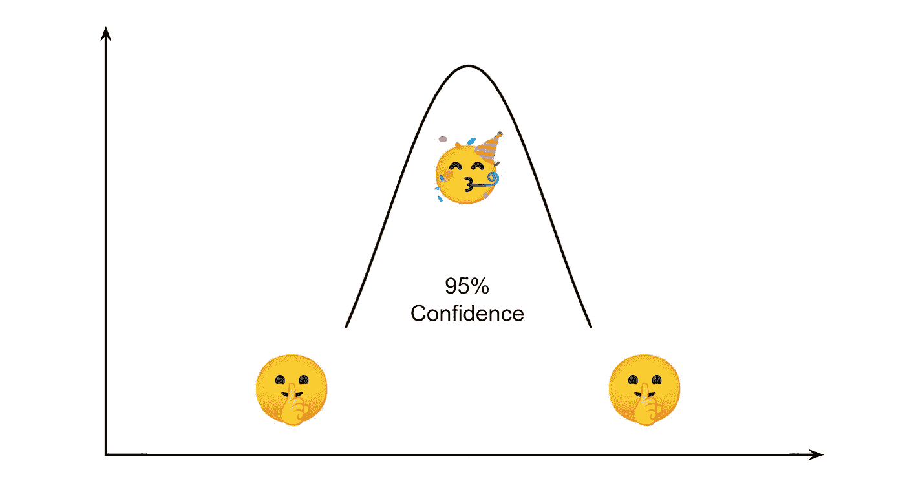
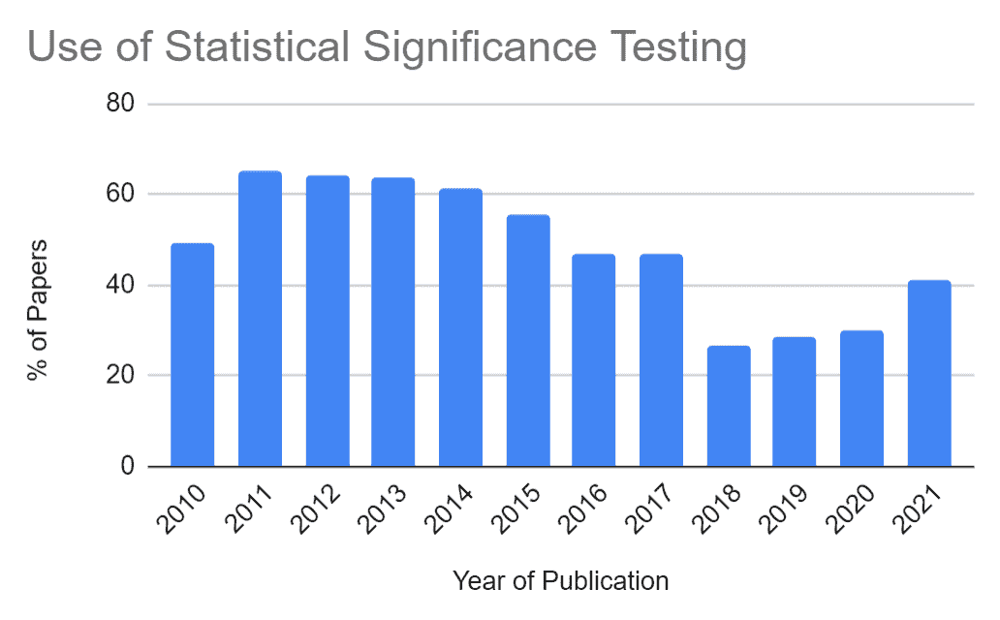
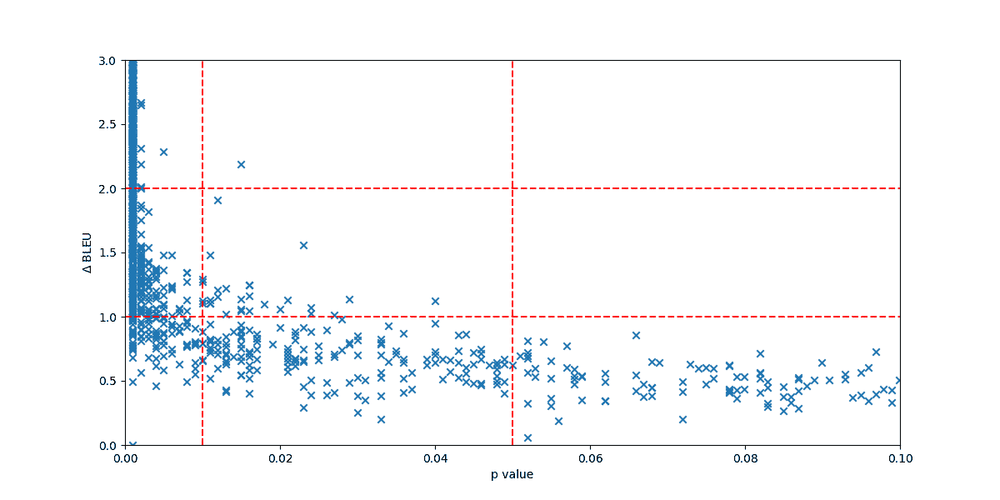
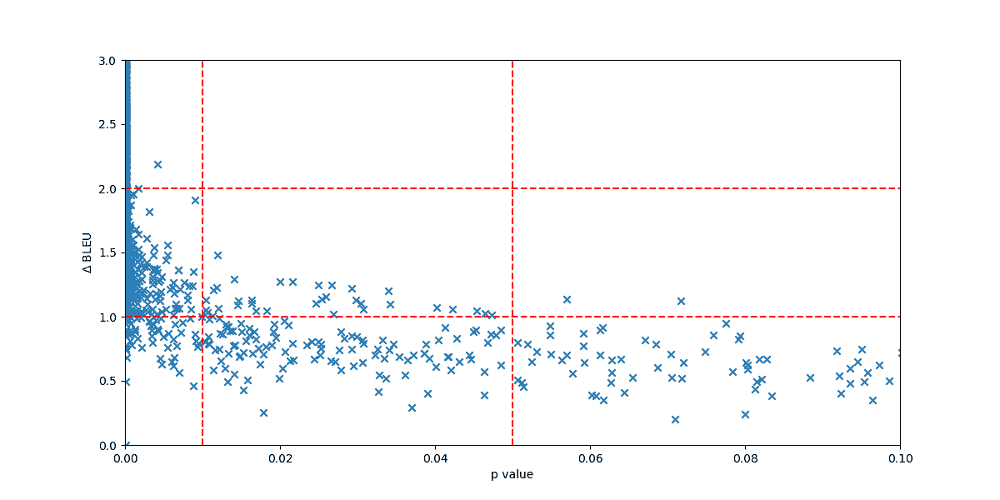
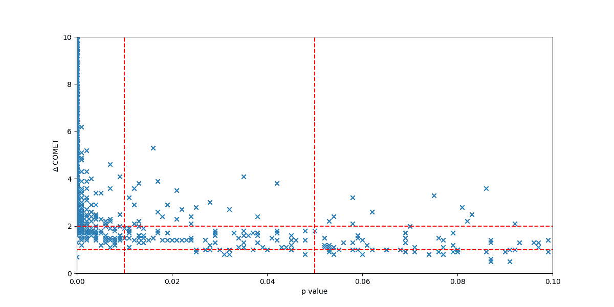

# 是的，我们需要统计显著性检验

> 原文：<https://pub.towardsai.net/yes-we-need-statistical-significance-testing-927a8d21f9f0?source=collection_archive---------0----------------------->

## 经验法则可能会产生正确的结果，但在科学上是不可信的。

作者插图。

拿任何介绍人工智能新方法的研究论文或博客帖子来说，你很可能会发现类似这样的陈述:

> 与以前的工作相比，这是一个重大的进步。

如果这是一种应用于语言生成任务的方法(自动摘要、释义、机器翻译、对话式人工智能……)，那么“改进”几乎总是一些评估指标分数的增加。例如，它可以是蓝色、红色、蓝色或红色。

*但是这些改进真的意义重大吗？我们真的比以前的工作有进步吗？不仅仅是运气吗？*

为了回答这些问题，我们可以进行统计显著性检验。统计显著性测试是一个标准的统计工具，旨在确保实验结果不是**巧合**。在自然语言处理(NLP)，甚至一般的人工智能中，这通常意味着检查一个被提议的系统 A 是否比一个基线系统 b 好**。**

 [## 最常见的误解:假设检验，置信区间，P 值

### 如何正确解释统计推断的再认识

towardsdatascience.com](https://towardsdatascience.com/the-most-common-misinterpretations-hypothesis-testing-confidence-interval-p-value-4548a10a5b72) 

统计学显著性测试在科学中的有用性经常被争论(例如，参见: [Wasserstein 等人(2019)](https://www.tandfonline.com/doi/full/10.1080/00031305.2019.1583913) )。尽管如此，在 NLP 中，有证据表明它有助于在系统之间做出更可信的声明和更有见地的比较(例如，参见: [Koehn (2004)](https://aclanthology.org/W04-3250.pdf) 、 [Riezler 和 Maxwell (2005)](https://aclanthology.org/W05-0908.pdf) 、 [Dror 等人(2018)](https://aclanthology.org/P18-1128/) 、 [Kocmi 等人(2021)](https://aclanthology.org/2021.wmt-1.57.pdf) )。

首先，让我们看看在统计显著性测试的支持下，NLP 研究中的声明有多频繁。

# 统计显著性检验的衰落

[Dror 等人(2018)](https://aclanthology.org/P18-1128/) 的工作是关于在 NLP 中使用统计显著性测试的最新和被引用的研究之一。他们的一个主要观察结果是 NLP 研究人员非常强调经验结果，并从中得出结论，而不检查它们的统计意义。在分析了 ACL 和 TACL 2017 年发表的 213 篇论文的样本后，他们发现其中只有 36.6% (78 篇论文)的人声称他们进行了统计显著性检验，这意味着 63.4%的人没有检查他们的观察结果是否一致。

我将这一分析延伸到过去 12 年，重点关注在 ACL 组织的会议上发表的机器翻译研究(我的专业领域)论文。总共，我手动[注释了 913 篇论文](https://docs.google.com/spreadsheets/d/1l9OL1HbUfZ6woawTAapqe-ASEn2DWw8FB64o1NO-K_U/edit?usp=sharing)。在所有带注释的论文中，作者使用一些自动评估指标(如 BLEU)来比较机器翻译系统。

作者插图。

我们清楚地看到，在机器翻译中，统计显著性测试的使用在 10 多年前达到高峰，在 2011 年，然后下降，直到 2018 年，最后似乎慢慢反弹。去年，只有 41%的出版物进行了统计显著性测试。

*如果大多数机器翻译的研究都没有进行统计显著性测试，他们怎么能声称比以前的工作有重大改进呢？*

简单地基于经验法则，即 *X* BLEU 改善点总是显著的，其中 X 通常是大于 0.5 的值。

为了评估我们是否可以根据经验法则“猜测”一个系统明显优于另一个系统，我对机器翻译中的统计显著性测试进行了第一次大规模的实证研究。

# 统计显著性检验的实证研究

以下实验的目的是根据经验评估两个系统之间在 BLEU 方面的差异何时显著。我将特别检查 0.5 BLEU 点或以上的改善是否可以被认为是显著的，正如现在研究论文中普遍假设的那样。

由于我希望我的观察尽可能地通用和可复制，我选择对提交给 [WMT21](https://github.com/wmt-conference/wmt21-news-systems/tree/main/txt) 和 [WMT22](https://github.com/wmt-conference/wmt22-news-systems/tree/main/txt) 主翻译任务的所有翻译输出进行实验。这些任务共收到 486 份提交材料。它产生了 2，706 个可能的系统对，我们可以测试其差异的统计显著性。

我使用 [SacreBLEU](https://github.com/mjpost/sacrebleu) 和默认参数，通过[成对自助重采样](https://aclanthology.org/W04-3250.pdf)和[近似随机化](https://aclanthology.org/W05-0908.pdf)进行显著性测试。

下图给出了每个系统对的每个 BLEU 得分差异的 p 值。p 值越低，差异越显著。请注意，此处并未列出所有系统对。为了提高可读性，我放大了图表，只显示感兴趣的区域。虚线表示讨论的有趣阈值。

针对每个系统对的 BLEU 差异，使用成对 bootstrap 重采样计算 p 值。*注意:使用成对引导重采样，SacreBLEU 对 p 值执行 0 附近的奇数近似。这就是为什么没有任何 p 值为 0.0 的 delta BLEU。* —作者插图。

对每个系统对的 BLEU 差异进行近似随机化计算的 p 值。—作者的插图。

在 NLP 中，p 值的常用阈值用于决定改善是否显著:0.001、0.01 和 0.05。作者任意决定阈值，在该阈值下他们将认为他们的结果具有统计学意义。对于这些阈值中的每一个，我们可以进行以下观察:

*   **p 值< 0.001** :高于 2.7 的 BLEU 在 WMT21/22 时总是显著的。只有几个点在 2.0 以上不重要。这些观察结果类似于两种类型的统计显著性检验。在 p 值的这个阈值处，根据成对自助重采样和近似随机化，1.0 和 2.0 之间的 35.0%和 36.1%的 BLEU 分别不显著。**为了宣称 p 值< 0.001 的显著改善，对于低于 2.0 BLEU 点的差异，似乎有必要进行统计显著性检验。**
*   **p 值< 0.01** :除了成对 bootstrap 重采样的 3 个点，高于 1.5 的 delta BLEU 是显著的。在 p 值的这个阈值处，根据成对的 bootstrap 重采样和近似随机化，1.0 和 1.5 之间的 10.0%和 13.9%的 BLEU 分别被认为是不显著的。**为了声称 p 值<为 0.01 的显著改善，对于低于 1.5 BLEU 点的差异，似乎有必要进行统计显著性检验。**
*   **p 值<0.05**:wmt 21/22 除 2 点近似随机化外，BLEU 高于 1.0 有显著性。在 p 值的这个阈值，根据成对的 bootstrap 重采样和近似随机化，分别有 20.4%和 42.0%的 BLEU 在 0.5 和 1.0 之间被认为是不显著的。**为了宣称 p 值< 0.05 的显著改善，对于低于 1.0 BLEU 点的差异，似乎有必要进行统计显著性检验。**

换句话说，似乎有一些明确的阈值，我们可以用它们来宣称显著的差异，甚至不需要进行统计显著性检验。要声称比以前在 BLEU 中的工作有显著改进，差异应该大于 1.0 BLEU 点。如果我们假设“非常显著”是“p 值< 0.001,” then the improvement should be 2.0 BLEU points or greater.

Of course, this is just an empirical experiment, and there will be rare situations where these thresholds lead to wrong conclusions. I could extend these experiments to all WMT and WAT campaigns to get many more points, but I think for the purpose of this article, this is already convincing enough.

All of these observations are useful, but only if we are very happy with BLEU and want to continue to use it in AI research papers… Given its poor correlation with humans, we may want to use other metrics.

## But what happens if we change the metric?

For instance, since 1.0 BLEU points difference appears significant, does it mean that a 1.0 points difference with another metric is also significant?

Obviously, no. But let’s draw another chart to check it, this time using COMET, a state-of-the-art metric for machine translation. The same WMT21/22 systems are considered, but only with paired bootstrap resampling. *注:我用*[*comet-compare*](https://github.com/Unbabel/COMET)*用 COMET 进行统计显著性检验，用的模型是 wmt20-comet-da。*

针对每个系统对的彗星差异，使用成对 bootstrap 重采样计算 p 值。—作者的插图。

我们在这里清楚地看到，1.0 彗星点的改善往往是微不足道的。即使是 4.0 彗星点的差异可能也不显著。COMET 分数不在 0 到 100 之间。WMT21/22 系统可以到达数百个绝对彗星点。这将根据所使用的彗星模型而有很大的不同。wmt21-comet-da 模型通常给系统的分数低于 10，例如，用 wmt20-comet-da 模型可以得到 100 个彗星点。在我以前的一篇文章中，我更广泛地讨论了 COMET 的这个特性。

 [## 机器翻译的大规模自动评估

### 在 WMT22 的 21 个翻译方向上评估了 185 个系统

towardsdatascience.com](https://towardsdatascience.com/a-large-scale-automatic-evaluation-of-machine-translation-b700df93d4c0) 

这些观察表明，我们不应该对这两个系统之间的差异的重要性做任何假设。我们不能只是猜测两个系统之间的差异是否显著，尤其是在新的指标下。

我们应该始终应用统计显著性检验。目前，大多数研究论文没有。

# 那么，为什么大多数研究论文不做统计显著性检验呢？

由于多种原因，统计显著性检验在 NLP 研究中没有被广泛使用。以下是其中的一些。

它通常被认为是无用的，假设对于一些任务，例如机器翻译，一个改进总是被发现在统计上是显著的。从经验上来说，我们在前面的章节中看到，这只适用于某些阈值，而这些阈值是不可推广的。

目前，在 NLP 中，两个指标得分之间的“大”差异足以在顶级会议和期刊上发表。所以，如果我们在以前的工作上取得了 X 点的进步，如果没有人要求的话，我们为什么要试图证明它在统计学上不显著呢？如果 NLP 研究不那么关注积极的结果，这就不是问题了。如果论文的其余部分对研究团体来说是正确的和有见地的，那么具有高 p 值的实证结果应该被接受。

最后，在许多论文中，统计显著性检验在技术上无法进行。人工智能研究的一个常见趋势是简单地复制以前发表的论文的分数。在这种情况下，没有所有被比较系统的输出，统计显著性测试是不可能的。这是我反对复制和比较以前发表的分数的众多原因之一。实现统计显著性测试需要更好的评估实践*。*

 [## 比较不可比较的事物来宣称最先进的状态:一个值得关注的趋势

### 发现 GPT-3、PaLM 和 AlexaTM 中的评估错误和投机性索赔。

medium.com](https://medium.com/@bnjmn_marie/comparing-the-uncomparable-to-claim-the-state-of-the-art-a-concerning-trend-3d864522a0ba) 

为了与这篇文章形成对比，我邀请你阅读 Mathias Müller 在[发表的这篇博客文章中的一些观点。](https://bricksdont.github.io/posts/2020/12/statistical-significance-testing/)

如果你想支持这项工作，[请在 Medium](https://medium.com/@bnjmn_marie) 上跟随我。