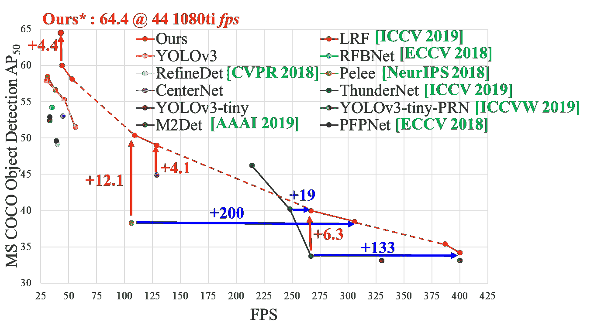

# YOLO V5——已解释和非神秘化

> 原文：<https://pub.towardsai.net/yolo-v5-explained-and-demystified-4e4719891d69?source=collection_archive---------1----------------------->

## [计算机视觉](https://towardsai.net/p/category/computer-vision)

## YOLO V5 —模型架构和技术细节说明


来源:https://pixabay.com/

F 从我上一篇关于 [YOLOv5](https://towardsdatascience.com/yolo-v5-is-here-b668ce2a4908) 的文章中，我收到了许多关于 YOLOv5 有何不同的信息和疑问，以及其他相关的技术疑问。

所以，我决定再写一篇文章，解释一下 YOLOv5 中用到的一些技术细节。

由于 YOLO v5 总共有 4 个版本，我将涵盖' s '版本。但是如果你仔细查阅，你会发现在其他版本中，除了模型层/架构和一些参数之外，没有什么大的变化。

在本文中，我将涵盖以下 YOLOv5 实现中使用的最重要的细节和方面。

*   YOLO v5 模型架构
*   激活功能
*   优化功能
*   成本函数或损失函数
*   权重、偏差、参数、梯度和最终模型总结

> 注意:由于 YOLO v5 仍处于开发阶段，我们经常收到来自 [ultralytics](https://www.ultralytics.com/) 的更新，未来开发者可能会改变某些方面。所以本文只针对 YOLOv5 的初始版本。不过，我也会尝试为后续版本更新/添加文章。

让我们转到技术讨论。

## YOLO v5 模型架构

由于 YOLO v5 是一个单级物体探测器，它像任何其他单级物体探测器一样有三个重要部分。

1.  模型主干
2.  模特脖子
3.  模型头

模型主干主要用于从给定的输入图像中提取重要特征。在 YOLO v5 中，[CSP——跨级局部网络](https://arxiv.org/abs/1911.11929)被用作主干，以从输入图像中提取丰富的信息特征。

CSPNet 在处理深度更深的网络时显示出显著的改进。参考下图，有关 CSPNet 的更多信息，请访问 [Github repo](https://github.com/WongKinYiu/CrossStagePartialNetworks) 。



来源:[https://github . com/WongKinYiu/CrossStagePartialNetworks/blob/master/fig/CMP 3 . png](https://github.com/WongKinYiu/CrossStagePartialNetworks/blob/master/fig/cmp3.png)

模型颈部主要用于生成特征金字塔。特征金字塔有助于模型更好地概括对象缩放。它有助于识别不同大小和比例的同一物体。

要素金字塔非常有用，有助于模型更好地处理看不见的数据。还有其他模型使用不同类型的特征金字塔技术，如 [FPN](https://arxiv.org/abs/1708.02002) 、[比夫恩](https://arxiv.org/abs/1911.09070)、[帕内特](https://arxiv.org/abs/1803.01534)等。

在 YOLO v5 [面板](https://arxiv.org/abs/1803.01534)被用作颈部以获得特征金字塔。有关要素金字塔的详细信息，请参考以下链接。

[](https://medium.com/@jonathan_hui/understanding-feature-pyramid-networks-for-object-detection-fpn-45b227b9106c) [## 理解用于目标检测的特征金字塔网络(FPN)

### 检测不同尺度的物体是具有挑战性的，尤其是对于小物体。我们可以用同样的金字塔…

medium.com](https://medium.com/@jonathan_hui/understanding-feature-pyramid-networks-for-object-detection-fpn-45b227b9106c) 

模型头主要用于执行最终检测部分。它在特征上应用锚框，并生成具有类别概率、客观分数和边界框的最终输出向量。

在 YOLO，v5 模型的头部与之前的 YOLO V3 和 V4 版本相同。

此外，我附上 YOLO v5 的最终模型架构-一个小版本。你可以在这里找到[。](https://gist.github.com/mihir135/2e5113265515450c8da934e15d97fc6b)

## 激活功能

在任何深度神经网络中，激活函数的选择都是最关键的。最近推出了许多激活功能，如 [Leaky ReLU](https://arxiv.org/abs/1505.00853) 、 [mish](https://arxiv.org/abs/1908.08681) 、 [swish](https://www.researchgate.net/publication/320464797_Swish_a_Self-Gated_Activation_Function) 等。

YOLO v5 的作者决定使用泄漏 ReLU 和 [Sigmoid](https://en.wikipedia.org/wiki/Sigmoid_function) 激活函数。

在 YOLO v5 中，泄漏 ReLU 激活函数用于中间/隐藏层，而 sigmoid 激活函数用于最终检测层。你可以在这里验证一下[。](https://gist.github.com/mihir135/2e5113265515450c8da934e15d97fc6b)

## 优化功能

对于 YOLO v5 中的优化功能，我们有两个选项

1.  新币
2.  [亚当](https://arxiv.org/abs/1412.6980)

在 YOLO v5 中，用于训练的默认优化函数是 SGD。

但是，您可以使用“*———Adam*”命令行参数将其更改为 Adam。

## 成本函数或损失函数

在 YOLO 家族中，有一种复合损失是基于对象得分、类概率得分和包围盒回归得分来计算的。

Ultralytics 使用 PyTorch 的[二进制交叉熵和 Logits Loss](https://pytorch.org/docs/master/generated/torch.nn.BCEWithLogitsLoss.html) 函数来计算类别概率和对象分数的损失。

我们也可以选择[聚焦损失](https://arxiv.org/abs/1708.02002)函数来计算损失。您可以选择使用 fl_gamma 超参数进行失焦训练。

## 权重、偏差、参数、梯度和最终模型总结

要仔细查看 YOLOv5-small 模型中各层的权重、偏差、形状和参数，请参考以下信息。

来源:[https://gist . github . com/mihir 135/969d 78149 b 724 b 7684 e 327 a 1672 da 667](https://gist.github.com/mihir135/969d78149b724b7684e327a1672da667)

另外，你也可以参考下面对 YOLO V5——小车型的简要总结。

```
Model Summary: 191 layers, 7.46816e+06 parameters, 7.46816e+06 gradients
```

希望这能帮助你更好地理解 YOLO v5。在结尾的笔记里，感谢大家的阅读。

如有任何疑问/疑问/建议，请随时联系我。

**参考文献:**

[1][https://github.com/ultralytics/yolov5](https://github.com/ultralytics/yolov5)

[2][https://github.com/WongKinYiu/CrossStagePartialNetworks](https://github.com/WongKinYiu/CrossStagePartialNetworks)

**投稿:**

马约·帕特尔

**随意连接:**

> *领英:*https://www.linkedin.com/in/mihir-rajput/
> 
> *insta gram:*[https://www.instagram.com/ai_dev_/](https://www.instagram.com/ai_dev_/)
> 
> *Github:*https://github.com/mihir135/
> 
> 谢谢，干杯！