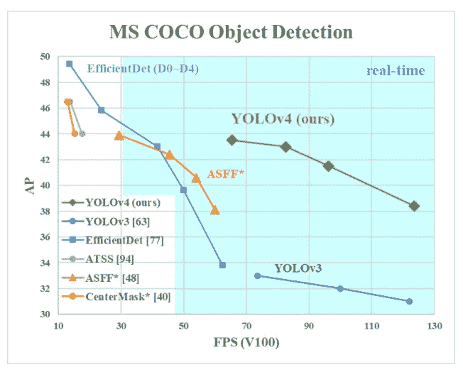
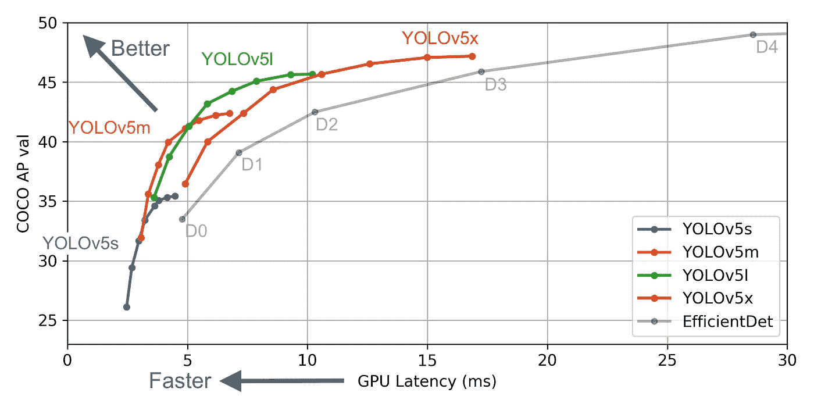
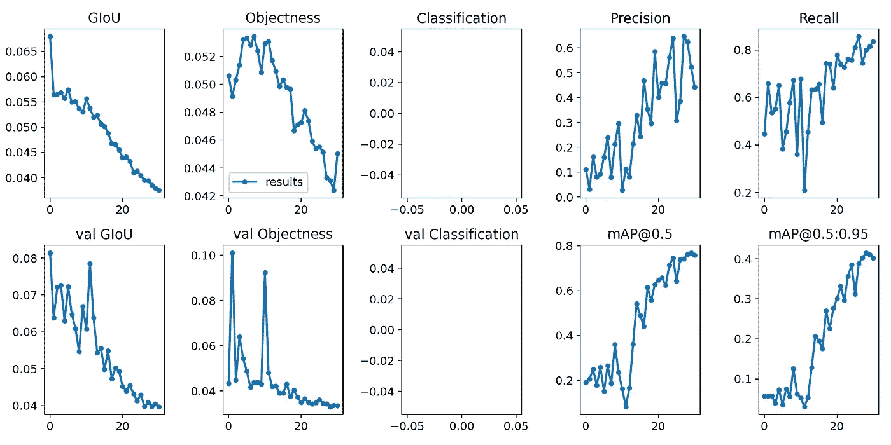
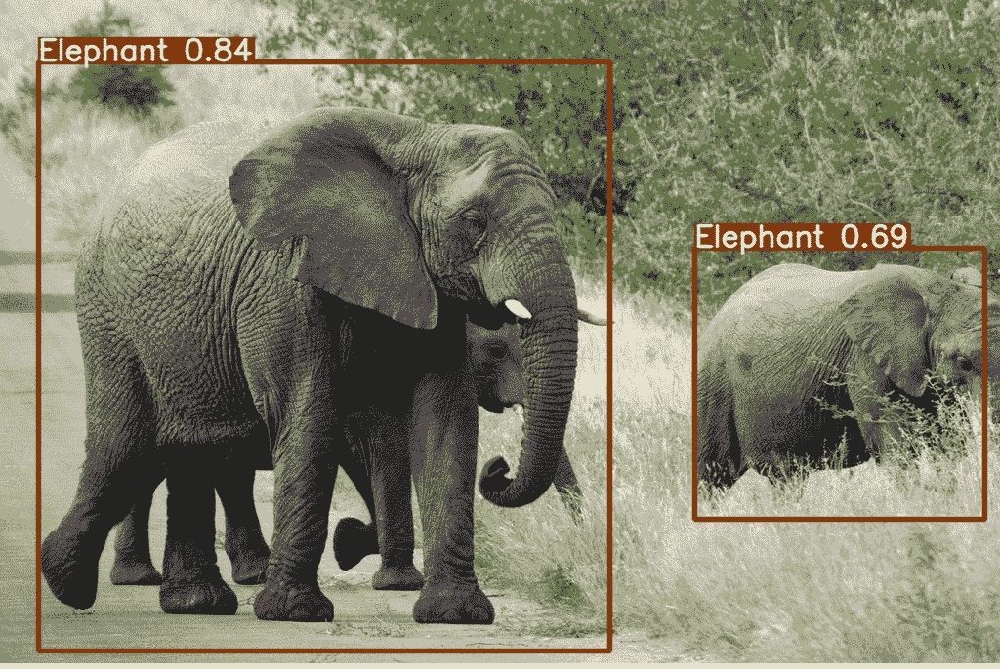

# YOLO V5 来了！使用 YOLO V5 的自定义对象检测教程

> 原文：<https://pub.towardsai.net/yolo-v5-is-here-custom-object-detection-tutorial-with-yolo-v5-12666ee1774e?source=collection_archive---------0----------------------->

## [数据科学](https://towardsai.net/p/category/data-science)


来源:https://pjreddie.com/

YOLO**你只看一次**是人工智能工程师最流行、最喜欢的算法之一。它一直是实时对象检测的首选。

YOLO 出现至今，因为它的第一个版本。让我们简单讨论一下 YOLO 的早期版本，然后我们将直接进入训练部分。

# 以前的 YOLO 版本

YOLO v1 于 2016 年 5 月由 Joseph Redmon 以论文“[你只看一次:统一、实时的对象检测](https://arxiv.org/pdf/1506.02640.pdf)”推出这是实时物体检测领域最大的进步之一。

2017 年 12 月，约瑟夫用纸推出了另一个版本的 YOLO“[yolo 9000:更好、更快、更强](https://arxiv.org/pdf/1506.02640.pdf)”它也被称为 YOLO 9000。

一年后的 2018 年 4 月，最受欢迎和稳定的 YOLO 版本推出。约瑟夫这次有了一个合作伙伴，他们用纸“ [YOLOv3:增量改进](https://arxiv.org/pdf/1804.02767.pdf)”发布了 YOLOv3。

最后，在 2020 年 4 月，Alexey Bochkovskiy 用论文介绍了 yolov 4 "[yolov 4:物体检测的最佳速度和精度](https://arxiv.org/abs/2004.10934) " Alexey 不是以前版本的 YOLO 的官方作者，但 Joseph 和 Ali 从 YOLO 后退了一步，必须有人来处理这个时代。

YOLOv4 引入了一些令人震惊的新东西，它以很高的利润超过了 YOLOv3，而且与 EfficientDet 系列相比，它的平均精度也很高。



来源: [YOLOv4 论文](https://arxiv.org/pdf/2004.10934.pdf)。

几天后的 2020 年 6 月 9 日，仅仅四天前，另一位非官方作者 Glenn Jocher 发布了 YOLOv5。关于“YOLOv5”这个名字和其他东西的选择有很多争议。格伦推出了基于 PyTorch 的 YOLOv5 版本，并进行了出色的改进。因此，他还没有发布任何官方文件。

这个版本是相当惊人的，在 COCO AP 方面超过了所有以前的版本，并以更高的 FPS 接近 EfficientDet AP。你可以注意到下图。



来源:https://github.com/ultralytics/yolov5

如需进一步比较，请访问 https://blog.roboflow.ai/yolov4-versus-yolov5/的。

# 在自定义数据集上训练 YOLOv5

该部分包括如下所列的多个步骤，

1.  准备数据集
2.  环境设置
3.  配置/修改文件和目录结构
4.  培养
5.  推理
6.  结果

本教程的代码可以在[的这个](https://github.com/mihir135/yolov5) GitHub 资源库中找到。

## 准备数据集

一旦获得了 YOLO 格式的标注数据集，就可以开始工作了。

在本教程中，我们将使用来自[开放图像数据集](https://storage.googleapis.com/openimages/web/index.html)的大象检测数据集。

要获得带标签的数据集，你可以搜索开源数据集，或者你可以从网上抓取图片，并使用像 [LabelImg](https://github.com/tzutalin/labelImg) 这样的工具对其进行注释。

> 注意:你的注释格式应该是 YOLO 格式。

确保您将注释和图像保存在同一个目录中。

然后生成训练、测试和验证 txt 文件，为此只需复制图像文件并将路径粘贴到 txt 文件中。最佳实践是将 70%的数据保存在定型集中，20%保存在验证集中，10 %保存在测试集中。

对于本教程，我将使用这个[训练](https://github.com/mihir135/yolov5/blob/master/data/train_elephant.txt)、[测试](https://github.com/mihir135/yolov5/blob/master/data/test_elephant.txt)和[验证](https://github.com/mihir135/yolov5/blob/master/data/val_elephant.txt) txt 文件。

此外，我还添加了一个带标签的数据集[，这里是](https://github.com/mihir135/yolov5/tree/master/data)，images 目录包含所有图像，txt 目录包含所有注释。

## 环境设置

需要注意的重要一点是，您将需要 PyTorch 版本≥ 1.5、Python 版本 3.7 和 CUDA 版本 10.2。

使用 pip 或 [requirement.txt](https://github.com/mihir135/yolov5/blob/master/requirements.txt) 文件可以很容易地安装下面其余的依赖项。

```
numpy==1.17
scipy==1.4.1
cudatoolkit==10.2.89
opencv-python
torch==1.5
torchvision==0.6.0
matplotlib
pycocotools
tqdm
pillow
tensorboard
pyyaml
```

> 注:本教程我用的是 ubuntu 16.04。

一旦成功安装了所有的依赖项，就可以继续前进了。

## 配置/修改文件和目录结构

要训练 YOLOv5 模型，您需要执行一些步骤。

首先，从 YOLOv5 的克隆存储库开始。如果你遵循这个教程，你可以从[这里](https://github.com/mihir135/yolov5)克隆。你可以从官方回购克隆，也可以在这里形成。

第二，修改你需要添加的 YAML 文件来描述你的数据集参数。请参考以下 YAML 文件，并根据您的需要进行相应的修改。

```
# here you need to specify the files train, test and validation txt # files created in step 1.
train: /self/elephant_dataset/train_elephant.txt
val: /self/elephant_dataset/val_elephant.txt
test: /self/elephant_dataset/test_elephant.txt# number of classes in your dataset
nc: 1# class names
names: ['Elephant']
```

我们稍后将使用该文件来训练模型。

## 培养

为了训练约洛夫 5，格伦提出了 4 个版本。

1.  yolov5-s 这是一个小版本
2.  yolov5-m 这是一个中等版本
3.  yolov5-l 这是一个大版本
4.  yolov5-x 是一个特大号版本

你可以在这里看到他们的对比。

在训练时，你可以通过 YAML 文件来选择这些模型中的任何一个。所有 YAML 的文件都在这里。

现在一切都配置好了，我们准备训练我们的 YOLOv5 模型！

转到目录，使用下面的命令开始训练。

```
python train.py --img 640 --batch 8 --epochs 30 --data ./data/elephant.yaml --cfg ./models/yolov5s.yaml --weights '' --device 0
```

*   — img:输入图像的大小
*   —批次:批次大小
*   -时期:时期的数量
*   —数据:在步骤 3 中创建的 YAML 文件
*   cfg:模型选择 YAML 文件。我在本教程中选择了“s”。
*   —权重:应用迁移学习的权重文件，您可以在此处找到它们[。](https://drive.google.com/drive/folders/1Drs_Aiu7xx6S-ix95f9kNsA6ueKRpN2J)
*   —设备:选择训练设备，“0”代表 GPU，“cpu”代表 CPU。

该命令将立即开始模型训练。我已经决定训练 30 个纪元的模型。

训练完成后，模型将保存在您的“权重”目录中，生成的矩阵图如下。



来源:[https://github.com/mihir135](https://github.com/mihir135)

正如我们所看到的，这个模型被训练得非常好，mAP@0.5 几乎是 0.78，非常好！

## 推理

现在模型已经训练好了，让我们在一些图像上测试它的性能。

要运行模型推理，请使用以下命令。

```
python detect.py --source sample_img/  --weights weights/best.pt --conf 0.4
```

*   —来源:输入图像目录或单个图像路径或视频路径
*   -权重:训练模型路径
*   — conf:置信度阈值

这将处理输入并将输出存储在您的推理目录中。

## 结果

在这里，我附上一些来自训练有素的模型推理输出图像。



来源:https://github.com/mihir135/yolov5

很棒吧！

你可以在这里找到训练有素的大象探测器。

你可以从[这里](https://github.com/mihir135/yolov5)下载并探索本教程的代码。

如果您有任何疑问，可以在回复部分发表评论。

我的 [GitHub](https://github.com/mihir135) 或者 [LinkedIn](https://www.linkedin.com/in/mihir-rajput/) 。

特别感谢 [Mayur Patel](https://medium.com/u/52e4be8e717a?source=post_page-----6adeca4f2b24----------------------) 的贡献与合作。

任何反馈或建议将不胜感激。