# 自定义数据集上的 Yolo-V5 对象检测

> 原文：<https://pub.towardsai.net/yolo-v5-object-detection-on-a-custom-dataset-61d478bc08f9?source=collection_archive---------0----------------------->

## [计算机视觉](https://towardsai.net/p/category/computer-vision)

逐步指导训练 Yolo-v5 和 do 推断(来自 [ultralytics](https://www.ultralytics.com/) )对血细胞进行计数和定位。

我清楚地记得，我试图使用 Yolo v3-v4 制作一个对象检测模型，以计数显微血液涂抹图像上的 RBC、WBC 和血小板，但我无法获得我想要的精确度，并且该模型从未投入生产。

最近我看到了 Ultralytics 发布的 Yolo-v5 模型，它是使用 PyTorch 构建的。由于我以前的失败，我开始有点怀疑，但在阅读了他们 Github repo 中的手册后，我这次非常有信心，我想尝试一下。

而且效果很好，Yolo-v5 很容易训练，也很容易推断。

所以这篇文章总结了我在血细胞计数数据集上使用 Yolo-v5 模型的实践经验。让我们开始吧。

Ultralytics 最近推出了 Yolo-v5。暂时来说，Yolo 的前三个版本是由 Joseph Redmon 创作的。但是新版本比其他版本具有更高的平均精度和更快的推理时间。除此之外，它建立在 PyTorch 之上，使得训练和推理过程非常快，结果非常好。

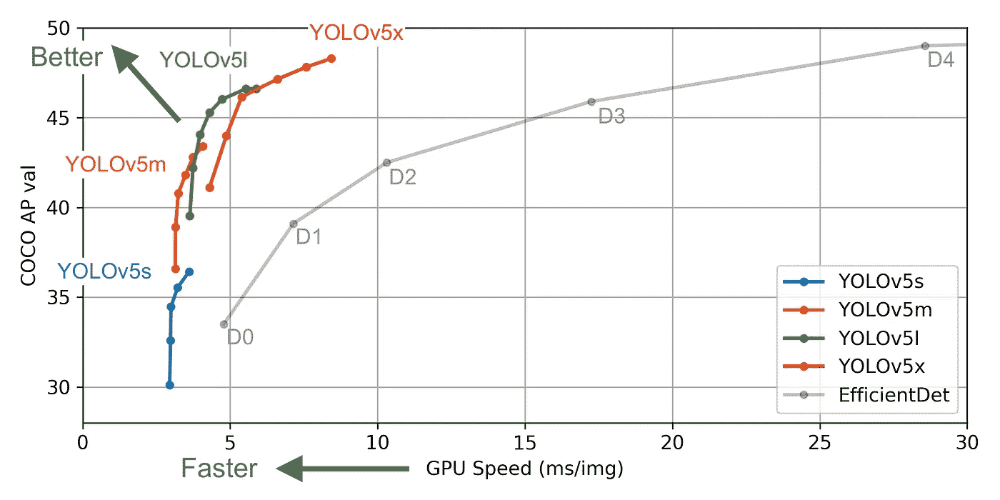

来源:Ultralytics

所以让我们来分解一下我们训练过程中的步骤。

1.  **数据—预处理(兼容 Yolo-V5)**
2.  **模型—培训**
3.  **推论**

如果你想同时跟进，打开这些笔记本，

Google Colab 笔记本—训练和验证: [**链接**](https://colab.research.google.com/github/bala-codes/Yolo-v5_Object_Detection_Blood_Cell_Count_and_Detection/blob/master/codes/1.%20Yolo-V5%20BCC%20Training%20%26%20Testing.ipynb)

Google Colab 笔记本—推理: [**链接**](https://colab.research.google.com/github/bala-codes/Yolo-v5_Object_Detection_Blood_Cell_Count/blob/master/codes/2.%20Yolo-v5%20BCC%20Inference.ipynb)

# 1.数据—预处理(兼容 Yolo-v5)

我使用了在 Github[中可用的数据集 BCCD 数据集，该数据集具有血液涂抹的显微图像，其相应的边界框注释在 XML 文件中可用。](https://github.com/Shenggan/BCCD_Dataset)

```
**Dataset Structure:**- BCCD
  - Annotations
    - [BloodImage_00000.xml](https://github.com/Shenggan/BCCD_Dataset/blob/master/BCCD/Annotations/BloodImage_00000.xml)
    - [BloodImage_00001.xml](https://github.com/Shenggan/BCCD_Dataset/blob/master/BCCD/Annotations/BloodImage_00001.xml)
    ...- JpegImages
    - [BloodImage_00001.](https://github.com/Shenggan/BCCD_Dataset/blob/master/BCCD/Annotations/BloodImage_00001.xml)jpg
    - [BloodImage_00001.jpg](https://github.com/Shenggan/BCCD_Dataset/blob/master/BCCD/JPEGImages/BloodImage_00001.jpg)
    ...
```

样本图像及其注释:

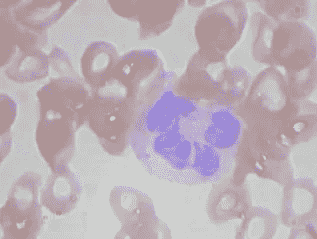

样本输入图像

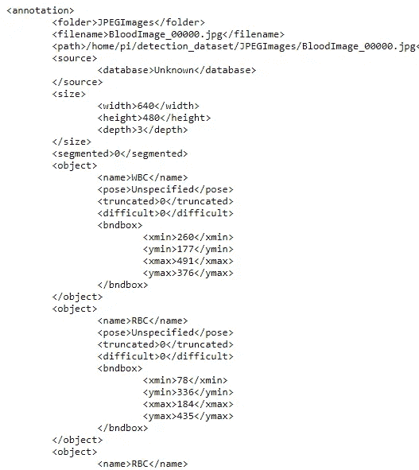

中的标签。XML 文件

当将注释值映射为图像中的边界框时，

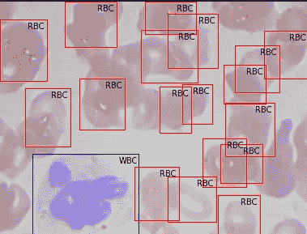

但是为了训练 Yolo-v5 模型，我们需要组织我们的数据集结构，并且它需要图像(。jpg/。png 等。，)及其在中的对应标签。txt 格式。

```
**Yolo-v5 Dataset Structure:**- BCCD
  - Images
    - Train (.jpg files)
    - Valid (.jpg files)- Labels
     - Train (.txt files)
     - Valid (.txt files)
```

然后是。txt 文件应该是:

的结构。txt 文件:

-每个对象一行。

-每一行都是 x_center y_center 宽度高度类格式。

-框坐标必须是标准化的 xywh 格式(从 0 到 1)。如果你的框是以像素为单位，用 x 中心和宽度除以图像宽度，用 y 中心和高度除以图像高度。

-类号是零索引的(从 0 开始)。

具有类别 1 (RBC)和类别 2 (WBC)以及它们的 x_center、y_center、width、height(全部归一化为 0-1)的标签示例如下所示。

```
# class x_center y_center width height #
  1     0.718    0.829    0.143 0.193
  2     0.318    0.256    0.150 0.180
  ...
```

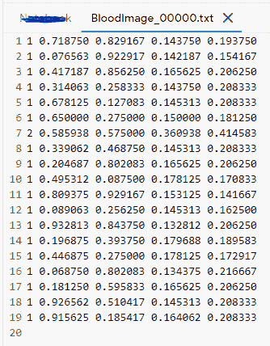

labels.txt 示例

因此，让我们看看如何在上面指定的结构中预处理我们的数据。

我们的第一步应该是解析所有 XML 文件中的数据，并将它们存储在数据框架中以供进一步处理。因此，我们运行下面的代码来完成它。

数据帧应该是这样的，

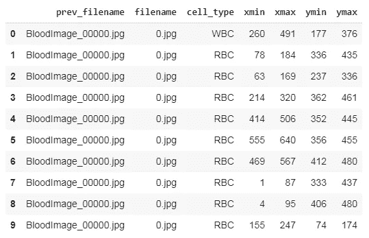

保存这个文件后，我们需要进行修改，将它们转换成 Yolo-v5 兼容的格式。

```
**REQUIRED DATAFRAME STRUCTURE**- filename : contains the name of the image- cell_type: denotes the type of the cell- xmin: x-coordinate of the bottom left part of the image- xmax: x-coordinate of the top right part of the image- ymin: y-coordinate of the bottom left part of the image- ymax: y-coordinate of the top right part of the image- labels : Encoded cell-type **(Yolo - label input-1)**- width : width of that bbox- height : height of that bbox- x_center : bbox center (x-axis)- y_center : bbox center (y-axis)- x_center_norm : x_center normalized (0-1) **(Yolo - label input-2)**- y_center_norm : y_center normalized (0-1) **(Yolo - label input-3)**- width_norm : width normalized (0-1) (**Yolo - label input-4)**- height_norm : height normalized (0-1) **(Yolo - label input-5)**
```

我已经编写了一些代码，将我们现有的数据框转换成上面代码片段中指定的结构。

经过预处理后，我们的数据框看起来像这样，这里我们可以看到单个图像文件存在许多行(例如 BloodImage_0000.jpg)，现在我们需要收集该单个图像文件的所有(**标签，x_center_norm，y_center_norm，width_norm，height_norm** )值，并将其保存为. txt 文件。

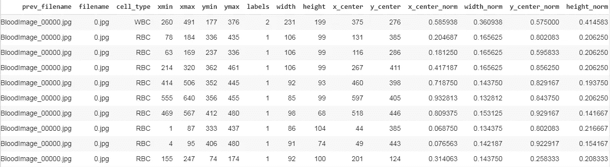

预处理的数据帧

现在，我们将数据集分为训练和验证，并保存相应的图像，然后对其进行标记。txt 文件。为此，我写了一小段代码。

运行代码后，我们应该有了预期的文件夹结构，并准备好训练模型。

```
No. of Training images 364 
No. of Training labels 364No. of valid images 270 
No. of valid labels 270&&- BCCD
  - Images
    - Train (364 .jpg files)
    - Valid (270 .jpg files)- Labels
     - Train (364 .txt files)
     - Valid (270 .txt files)
```

数据预处理结束。

# 2.模型-培训

为了开始训练过程，我们需要克隆官方的 Yolo-v5 的权重和配置文件。这里有[。](https://github.com/ultralytics/yolov5)

然后安装他们在 requirements.txt 文件中指定的所需包。

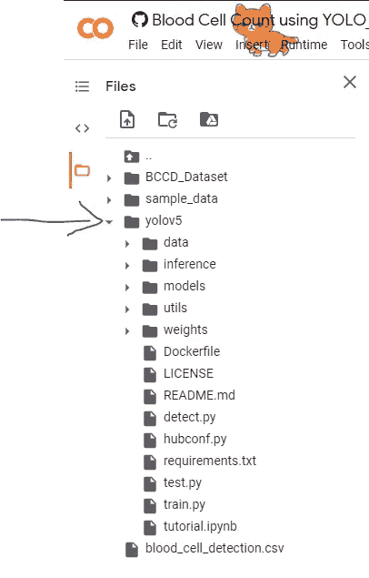

Yolov5 结构

**bcc.yaml :**

现在我们需要创建一个 Yaml 文件，其中包含训练和验证的目录、类的数量及其标签名称。稍后我们需要移动。yaml 文件复制到我们克隆的 yolov5 目录中。

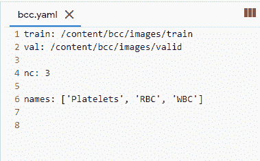

```
## Contents inside the .yaml filetrain: /content/bcc/images/train
val: /content/bcc/images/validnc: 3 
names: ['Platelets', 'RBC', 'WBC']
```

**车型— YAML** :

现在我们需要从中选择一个型号(小、中、大、xlarge)。/models 文件夹。

下图描述了各种特征，如参数数量等。，适用于可用型号。您可以根据手头任务的复杂性选择任何模型，默认情况下，它们都可以作为。来自克隆存储库的模型文件夹中的 yaml 文件

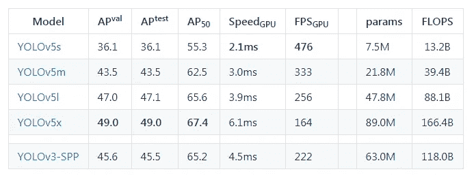

Ultralytics 的 Yolo 模型参数

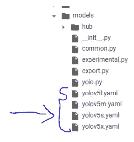

模型的 YAML 文件 x 4

现在我们需要编辑*。我们选择的模型的 yaml 文件。我们只需要替换我们案例中的类的数量，以匹配模型的 YAML 文件中的类的数量。为了简单起见，我选择 yolov5s.yaml 来加快处理速度。

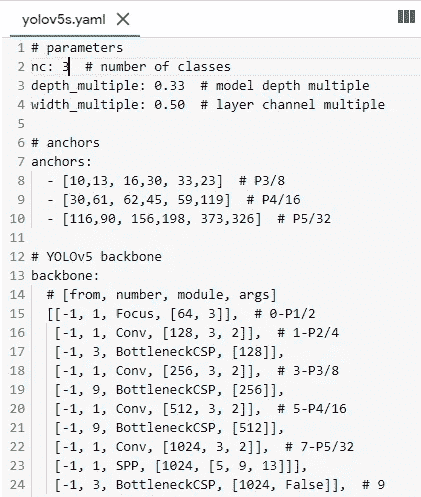

```
## parametersnc: 3 # number of classesdepth_multiple: 0.33  # model depth multiplewidth_multiple: 0.50  # layer channel multiple# anchors
anchors:
- [10,13, 16,30, 33,23]  # P3/8
- [30,61, 62,45, 59,119]  # P4/16
...............
```

**注意**:如果我们没有替换模型的 YAML 文件中的 nc(我替换了)，这一步不是强制性的，它会自动覆盖我们之前创建的 nc 值(bcc.yaml)，并且在训练模型时，您会看到这一行，它确认我们不必改变它。

**谓压倒一切。/yolov 5/models/yolov 5s . YAML NC = 80 带 nc=3"**

## 模型列车参数:

我们需要配置训练参数，如时期数、批量大小等。,

```
**Training Parameters** !python
- <'location of train.py file'>
- --img <'width of image'>
- --batch <'batch size'>
- --epochs <'no of epochs'>
- --data <'location of the .yaml file'>
- --cfg <'Which yolo configuration you want'>(yolov5s/yolov5m/yolov5l/yolov5x).yaml | (small, medium, large, xlarge)
- --name <'Name of the best model to save after training'>
```

此外，如果我们愿意，我们可以在 tensorboard 中查看日志。

这将启动培训过程，需要一段时间才能完成。

我贴出一些我训练过程的摘录，

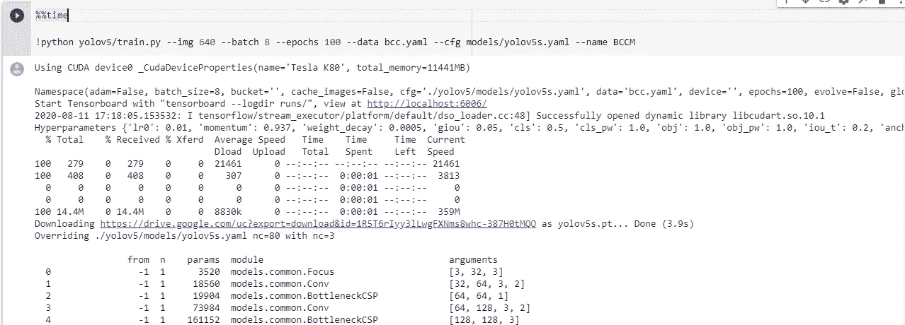

培训过程摘录

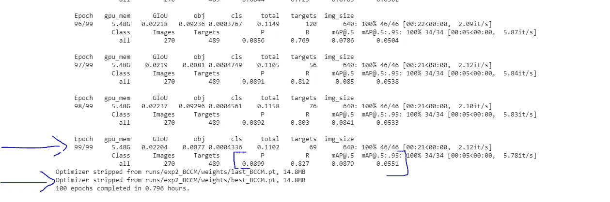

培训过程摘录

```
**METRICS FROM TRAINING PROCESS****No.of classes, No.of images, No.of targets, Precision (P), Recall (R), mean Average Precision (map)**- Class | Images | Targets | P | R | mAP@.5 | mAP@.5:.95: |- all   | 270    |     489 |    0.0899 |       0.827 |      0.0879 |      0.0551
```

因此，从 P(精度)、R(召回)和 mAP(平均精度)的值，我们可以知道我们的模型做得好不好。尽管我只训练了 100 个纪元的模型，但性能还是很好的。

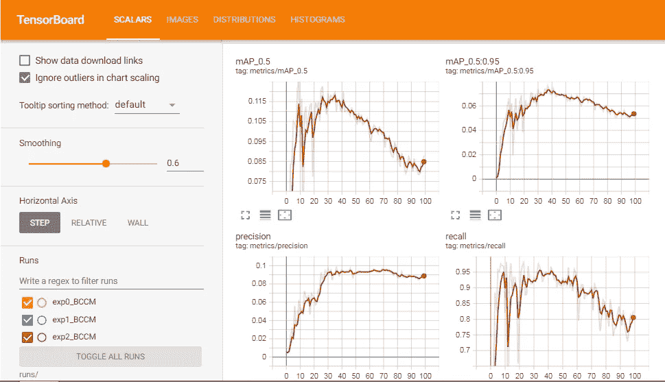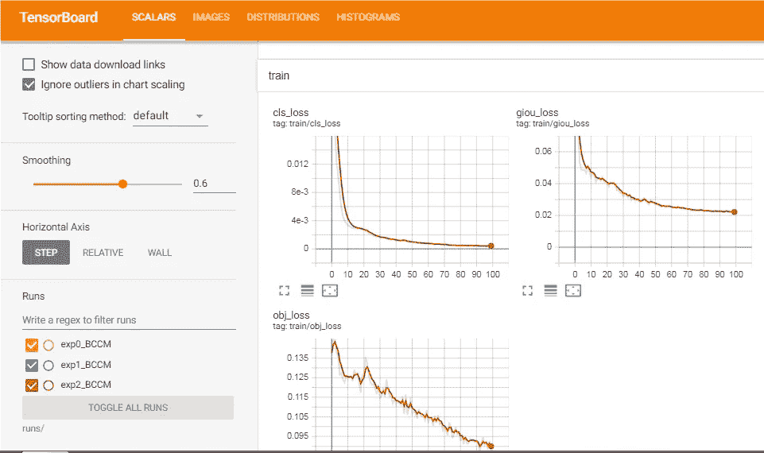

张量板可视化

模特训练结束。

# 3.推理

现在是检验我们模型的激动人心的时刻，看看它是如何做出预测的。但是我们需要遵循一些简单的步骤。

## 推断参数

```
**Inference Parameters**!python
- <'location of detect.py file'>
- --source <'location of image/ folder to predict'>
- --weight <'location of the saved best weights'>
- --output <'location to store the outputs after prediction'>
- --img-size <'Image size of the trained model'>(Optional)- --conf-thres <"default=0.4", 'object confidence threshold')>
- --iou-thres <"default=0.5" , 'threshold for NMS')>    
- --device <'cuda device or cpu')>
- --view-img <'display results')>
- --save-txt <'saves the bbox co-ordinates results to *.txt')>
- --classes <'filter by class: --class 0, or --class 0 2 3')>## And there are other more customization availble, check them in the detect.py file. ##
```

运行以下代码，对文件夹/图像进行预测。

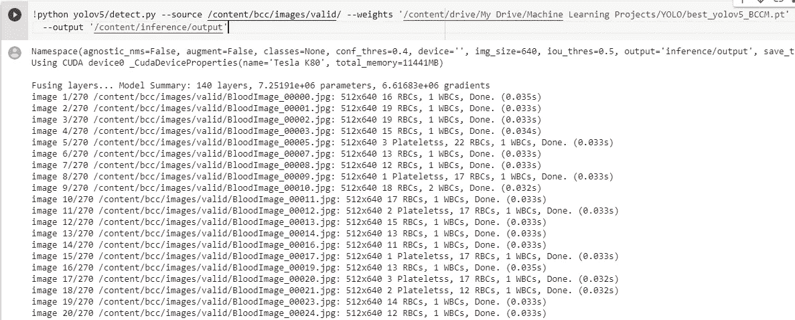

效果不错，一些摘录。

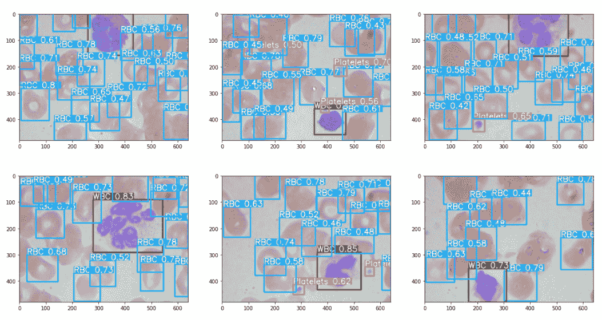

样本输出

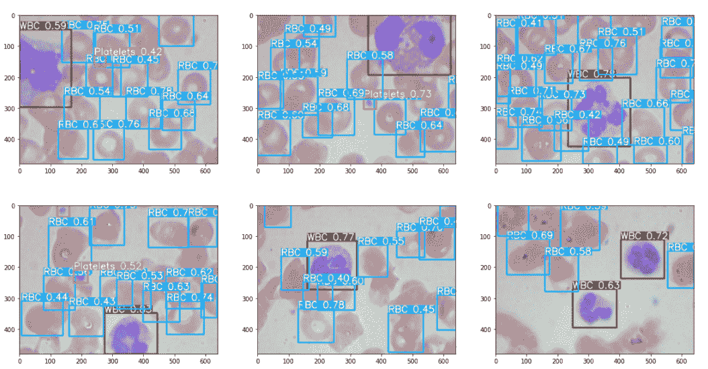

样本输出

## 解释的输出。txt 文件:(可选读取)

为了以防万一，假设您正在进行人脸检测和人脸识别，并希望将您的过程向前推进一步，假设您希望使用 opencv 使用 bbox 坐标裁剪人脸，并将它们发送到人脸识别管道中，在这种情况下，我们不仅需要如上图所示的输出，还需要每个人脸的坐标。那么有什么办法呢？答案是肯定的，跟着读。

(我只是用人脸检测和识别作为例子，Yolo-V5 也可以用来做)

此外，我们可以将输出保存到一个. txt 文件，其中包含一些输入图像的 bbox 坐标。

```
# class x_center_norm y_center_norm width_norm height_norm #
  1     0.718         0.829         0.143      0.193
  ...
```

运行下面的代码，获取输出。txt 文件，

成功运行代码后，我们可以看到输出存储在这里的推理文件夹中，

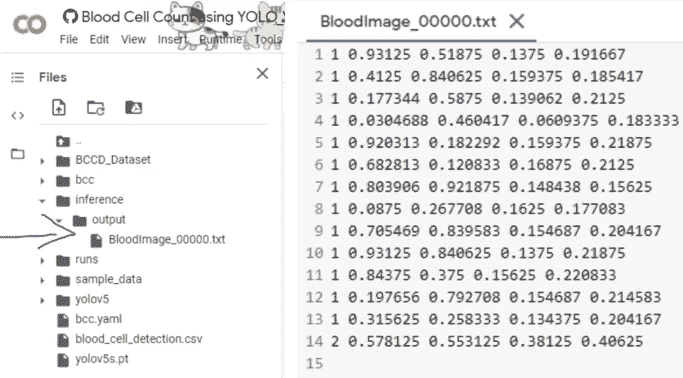

输出标签

很好，现在输出在。txt 文件的格式，

```
 **[ class x_center_norm y_center_norm width_norm height_norm ]** "we need to convert it to the form specified below" **[ class, x_min, y_min, width, height ]**
```

**【class，X_center_norm，y_center_norm，Width_norm，Height_norm】，**我们需要把这个转换成→**【class，x_min，y_min，Width，Height】，**(也是非规格化的)以便于绘图。

为此，只需运行下面执行上述转换的代码。

然后输出的打印图像看起来像这样，伟大的不是。

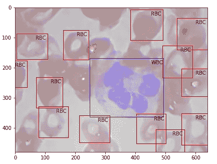

前面代码的输出

# 4.将模型投入生产

为了以防万一，如果您希望将模型转移到产品中或者部署到任何地方，您必须遵循这些步骤。

首先，安装运行 yolov5 的依赖项，我们需要 yolov5 文件夹中的一些文件，并将它们添加到 python 系统路径目录中以加载 utils。所以把它们复制到你需要的地方，然后移动到你需要的地方。

所以在下面的图-1 中，我已经把一些文件夹和文件打包了，你可以下载它们并把它们保存在一个单独的文件夹中，就像图-2 一样。

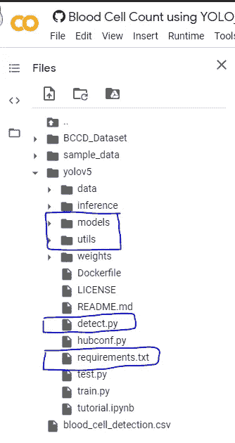

图片-1

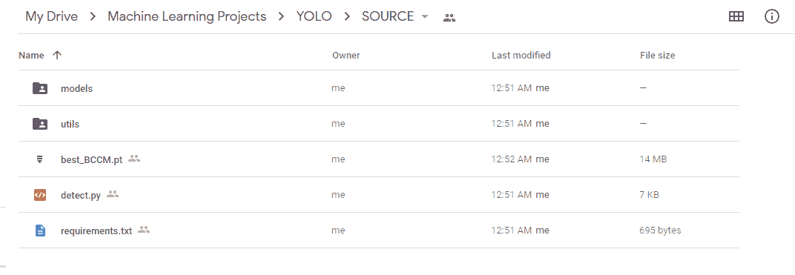

图片-2 生产中加载的必要文件。

现在我们需要告诉 python 编译器把上面的文件夹位置考虑进去，这样当我们运行我们的程序时，它将在运行时加载模型和函数。

在下面的代码片段中，在第 9 行，我添加了 sys.path…命令，在其中，我指定了我将这些文件移动到的文件夹位置，您可以用您的替换它。

然后启动这些代码开始预测。

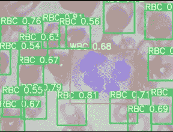

生产产量

这篇文章到此结束。我希望你对如何在其他数据集上训练 Yolo-v5 有所了解。如果你在训练和推理中遇到任何困难，请在评论中告诉我。

## 参考资料:

要详细了解 Yolo-v5，查看**官方** [Github repo。](https://github.com/ultralytics/yolov5)

我已经在 Colab 笔记本上训练了整个密件抄送模型，如果你想看一看的话，可以在下面的链接中找到。

Google Colab 笔记本—训练与验证: [**链接**](https://colab.research.google.com/github/bala-codes/Yolo-v5_Object_Detection_Blood_Cell_Count_and_Detection/blob/master/codes/1.%20Yolo-V5%20BCC%20Training%20%26%20Testing.ipynb)

Google Colab 笔记本—推理: [**链接**](https://colab.research.google.com/github/bala-codes/Yolo-v5_Object_Detection_Blood_Cell_Count/blob/master/codes/2.%20Yolo-v5%20BCC%20Inference.ipynb)

**所有其他支持文件和笔记本也可以在我的 GitHub repo** [**这里**](https://github.com/bala-codes/)**:**[**https://GitHub . com/Bala-codes/Yolo-V5 _ Object _ Detection _ Blood _ Cell _ Count _ and _ Detection**](https://github.com/bala-codes/Yolo-v5_Object_Detection_Blood_Cell_Count_and_Detection)

**还可以在这里查看 neptune.ai 的最新博客-**[**YOLO 物体探测:动手教程**](https://neptune.ai/blog/object-detection-with-yolo-hands-on-tutorial)

在那之前，下次见。

**文章作者:**

**BALAKRISHNAKUMAR V**