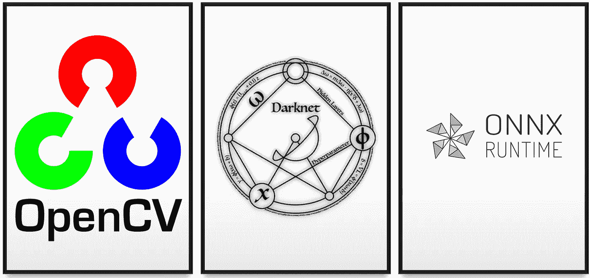
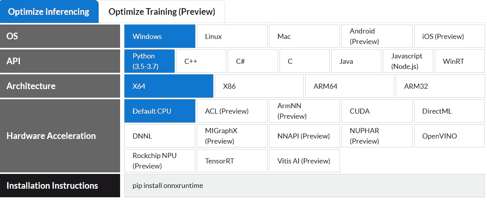
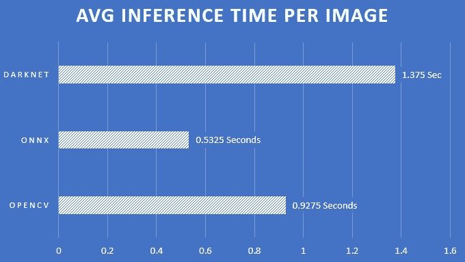
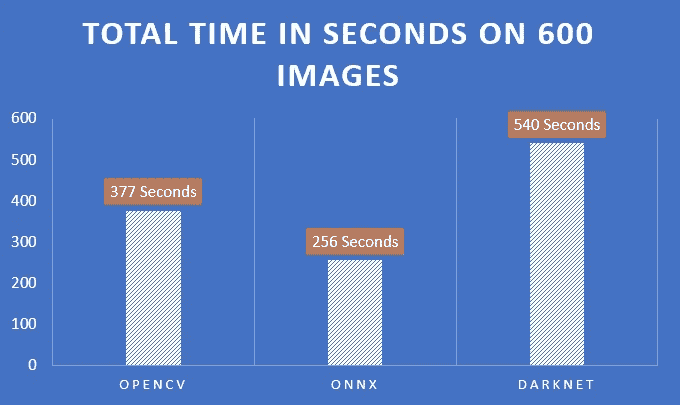
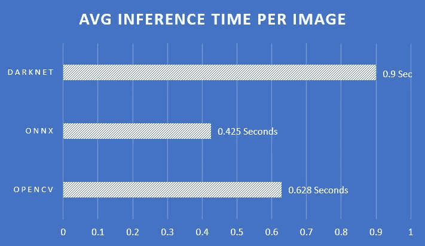

# Yolov3 CPU 推理性能比较— Onnx、OpenCV、Darknet

> 原文：<https://pub.towardsai.net/yolov3-cpu-inference-performance-comparison-onnx-opencv-darknet-6764f2bde33e?source=collection_archive---------0----------------------->

## [计算机视觉](https://towardsai.net/p/category/computer-vision)



Opencv、Darknet、Onnxruntime 对象检测框架|作者图片

为实时对象检测应用选择正确的**推理框架**变得非常具有挑战性，尤其是当模型应该在**低功率设备上运行时。**在本文中，您将了解如何根据您的需求选择最佳的推理检测器，并发现它可以给您带来的巨大性能增益**。**

通常，当我们打算在 CPU 或移动设备上部署模型时，我们倾向于关注轻量级模型架构，而忽略了对快速推理机的研究。

在我研究 CPU 设备上的快速推理的过程中，我测试了各种提供稳定 python API 的框架。今天将重点介绍[**Onnxruntime**](https://github.com/microsoft/onnxruntime)**，**[**OpenCV DNN**](https://docs.opencv.org/master/d2/d58/tutorial_table_of_content_dnn.html)**和**[**Darknet**](https://github.com/AlexeyAB/darknet)**框架，并从性能(运行时间)和准确性方面对它们进行衡量。**

**我们将使用两种常见的对象检测模型进行性能测量:**

*   ****Yolov3 —** [**架构**](https://github.com/AlexeyAB/darknet/blob/master/cfg/yolov3.cfg) **:****

```
image_size = 480*480
classes = 98
BFLOPS =87.892
```

*   ****Tiny-yolov 3 _ 3 layers—**[**架构**](https://github.com/AlexeyAB/darknet/blob/master/cfg/yolov3-tiny_3l.cfg) **:****

```
image_size= 1024*1024
classes =98
BFLOPS= 46.448
```

**这两个模型都是使用 AlexeyAB 的 Darknet 框架对定制数据进行训练的。**

**现在让我们用我们想要测试的检测器来运行推理。**

## **暗网探测器**

**Darknet 是训练 YOLO(你只需要看一次)物体检测模型的官方框架。**

**此外，它还提供了在*中的模型上运行推理的能力。权重文件格式，与训练输出的格式相同。**

**有两种推理方法:**

*   **各种数量的图像:**

```
darknet detector test cfg/coco.data cfg/yolov3.cfg yolov3.weights -thresh 0.25
```

*   **一个图像**

```
darknet detector demo cfg/coco.data cfg/yolov3.cfg yolov3.weights dog.png
```

## **OpenCV DNN 检测器**

**Opencv-DNN 是计算机视觉领域常用的著名的 [opencv](https://opencv.org/) 库的扩展。Darknet 声称 opencv-dnn 是“**yolov 4/v3 在 CPU 设备**上最快的推理实现”，因为它高效的 C & C++实现。**

**由于其方便的 Python API，将暗网权重加载到 opencv-dnn 非常简单。**

**这是 E2E 推论的一段代码:**

## **onnx 运行时检测器**

**Onnxruntime 由微软维护，并声称由于其内置的优化和独特的 ONNX 权重格式文件，可以实现显著更快的推理。**

**正如您在下图中看到的，它支持各种风格和技术。**

**在我们的比较中，我们将使用`Python\x64\CPU`风味。**

****

**[https://www.onnxruntime.ai/](https://www.onnxruntime.ai/)**

**ONNX 格式定义了一组通用的运算符——机器学习和深度学习模型的构建块——和一种通用的文件格式，使 AI 开发人员能够将模型与各种框架、工具、运行时和编译器一起使用。**

## **转换暗网权重> Onnx 权重**

**为了用 Onnxruntime 运行推理，我们必须转换*。权重格式为*。onnx fomrat。**

**我们将使用一个专门为转换 darknet *而创建的存储库。权重格式为*。pt (PyTorch)和*。onnx (ONNX 格式)。**

**[](https://github.com/matankley/Yolov3_Darknet_PyTorch_Onnx_Converter) [## matankley/yolo v3 _ Darknet _ py torch _ Onnx _ Converter

### 该存储库允许转换*。将暗网格式的文件加权为*。pt (pytorch 格式)和*。onnx (ONNX 格式)…

github.com](https://github.com/matankley/Yolov3_Darknet_PyTorch_Onnx_Converter) 

*   克隆 repo 并安装需求。
*   使用 cfg & weights & img_size 参数运行 converter.py。

```
python converter.py yolov3.cfg yolov3.weights 1024 1024
```

*   将在`yolov3.weights`目录中创建一个 yolov3.onnx 文件。

* * *请记住，由于转换过程的原因，使用 ONNX 格式进行推理时，精度会有约 0.1%的轻微下降。该转换器模仿 PyTorch 中的暗网功能，但并非完美无缺***

***请随意创建问题/PR，以便支持除 yolov3 之外的其他暗网架构的转换* * *

在我们成功地将模型转换成 ONNX 格式后，我们可以使用 Onnxruntime 运行推理。

下面你可以找到一个 E2E 推理的代码片段:

# 性能比较

恭喜你，我们已经完成了所有的技术细节，现在你应该有足够的知识来使用每一个检测器进行推理。

**现在让我们谈谈我们的主要目标——性能比较。**

性能分别针对上述各型号(Yolov3、Tiny-Yolov3)在电脑 cpu — **英特尔 i7 第 9 代处理器上进行测量**

对于 opencv 和 onnxruntime，我们只测量**正向传播**的执行时间，以便将其与前/后进程隔离开来。

对这些线进行了分析:

1.  Opencv

```
layers_result = self.net.forward(_output_layers)
```

2.Onnxruntime

```
layers_result = session.run([output_name_1, output_name_2], {input_name: image_blob})layers_result = np.concatenate([layers_result[1], layers_result[0]], axis=1)
```

3.黑暗网络

```
darknet detector test cfg/coco.data cfg/yolov3.cfg yolov3.weights -thresh 0.25
```

# 判决

# Yolov3

Yolov3 在 400 张独特的图像上进行了测试。

1.  ONNX 检测器在推理我们的 Yolov3 模型上是最快的。准确的说，**比 opencv-dnn** 快 43%，被认为是目前最快的检测器之一。


Yolov3 总推理时间—由 Matan Kleyman 创建

2.每张图像的平均时间:



Yolov3 每个图像的平均时间-由 Matan Kleyman 创建

## 小约洛夫 3

Tiny-Yolov3 在 600 幅独特的图像上进行了测试。

1.  在这里， **ONNX 检测器也比**优越，在我们的 Tiny-Yolov3 模型上，**比 opencv-dnn** 快 33%。



Tiny-Yolov3 总推理时间—由 Matan Kleyman 创建

2.每张图像的平均时间:



Tiny-Yolov3 每张图像的平均时间-由 Matan Kleyman 创建

# 结论

1.  我们已经看到 onnxruntime 运行推理的速度明显快于 opencv-dnn。
2.  我们用比 Tiny-Yolov3 更少的时间运行了 Yolov3，尽管 Yolov3 要大得多！
3.  我们有必要的工具将在 darknet 中训练的模型转换成*。onnx 格式。** 

**这都是为了这篇文章。希望你觉得有用。如果有，请鼓掌。如有任何问题和建议，请随时通过 [Linkedin](https://www.linkedin.com/in/matankleyman/) 与我联系。**

**感谢阅读！**

**~马坦**