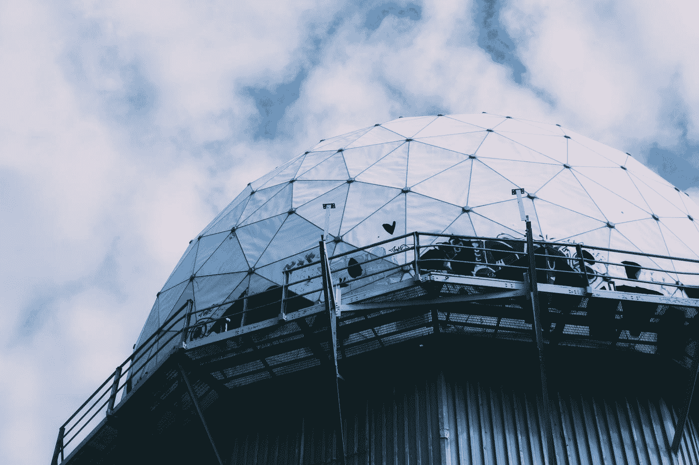

# 你现在可以参加美国政府的 Python 课程

> 原文：<https://pub.towardsai.net/you-can-now-take-a-python-course-from-the-us-government-57fcc12d487?source=collection_archive---------0----------------------->

## [教育](https://towardsai.net/p/category/education)

## 直接来自国家安全局。

由[克里斯蒂安·卢](https://unsplash.com/@christianlue?utm_source=medium&utm_medium=referral)在 [Unsplash](https://unsplash.com?utm_source=medium&utm_medium=referral) 上拍摄的照片

学习 Python 的资源几乎是无限的，从 Coursera 课程到 YouTube 教程，再到浏览 GitHub 知识库。

然而，你的时间是有限的，所以找到能有所作为的课程至关重要。现在，您可以使用美国国家安全局(美国政府的秘密机构)使用的相同 Python 培训材料。

# 背景

美国国家安全局是出了名的守口如瓶，那么我们是如何获得他们的 Python 培训材料的呢？

克里斯·斯文森(Chris Swenson)是一名软件工程师，他向美国国家安全局提交了 FOIA(信息自由法案)申请，要求访问其 Python 培训内容，并收到了一份 400 页的培训课程文件。

# 课程

你可以在[互联网档案馆](https://archive.org/details/comp3321/page/n5/mode/2up?q=device)上查阅扫描的 OCR 文档。

您可以通过“为期两周的全日制课程”完成 COMP 3321 培训课程，每个课程包含 10 个模块。

这门课程有非常丰富的目录，突出了你将要深入的内容。您将从 Python 基础开始，在第 1 周编写您的第一个程序。您将了解以下主题:

*   变量和函数
*   流控制
*   容器数据类型
*   文件输入输出
*   开发环境
*   面向对象的程序设计(Object Oriented Programming)

…更多，仅在第一周。本课程提供了大量的外部资源，使得它相当全面。在接下来的几周中，您将了解集合、命令行参数、日志、散列、正则表达式、SQL 和 Python 等主题。

## 亲自动手

课程也很动手，理论和实践相结合。你将进行一些练习，包括文件练习、日期时间练习、OOP 练习等等。你还将参与课堂项目，给出一些有趣的项目想法，例如:

*   编写货币转换脚本
*   编写 web 应用程序
*   做项目欧拉问题
*   RSA 加密

# 为什么要学 Python

Python 无疑是数据科学和人工智能领域的头号编程语言。

数据科学是一个快速发展的领域，因为许多世界上最大的公司都在日常运营中使用数据科学。例如，你在 Spotify、Tinder、亚马逊、Medium 和网飞上的推荐是由人工智能推荐引擎提供的。

因此，数据科学也非常有利可图，任何时候都有成千上万的职位空缺。

如果你想有一天获得一个技术角色，学习 Python 是一个很好的开始。这就是说，你实际上不需要知道编程来构建和实现人工智能模型，显然是给定了像[这样的无代码人工智能工具。AI](http://obviously.ai) 。

# 结论

疫情将我们对技术的使用提高到了 11 倍，这意味着我们正在创造比以往更多的数据。所有这些数据都需要进行分析和建模，以获得让公司获得竞争优势的洞察力。

分析和建模数据的一种方法是使用 Python，这使得这门 NSA 课程成为开始您的技术角色之旅的一种很好的方式。