# 您可以将 Databricks 和 AWS S3 与 MLflow FREE 一起使用

> 原文：<https://pub.towardsai.net/you-can-use-databricks-and-aws-s3-with-mlflow-free-8ef071a647a0?source=collection_archive---------0----------------------->


Aleksandr Neplokhov 拍摄的照片:[https://www . pexels . com/photo/group-of-people-gathering-near-frees-standing-flow-letters-1238965/](https://www.pexels.com/photo/group-of-people-gathering-near-frees-standing-flow-letters-1238965/)

您将在几分钟内获得带有数据块和 S3 的模型跟踪服务器。

易于遵循，一步一步的解释将是你的旅程指南。

你会喜欢的。

# **内容**

[简介](#402f)

[作为远程服务器的数据块](#78b1)

[创建数据块自由账户](#0acc)

[数据块 CLI 和认证](#bad1)

[使用数据块作为远程服务器](#ee78)

[AWS S3 作为文物商店](#1af3)

[AWS 账户的必要安排](#2041)

[利用 S3 作为文物商店](#b4b8)

[结论](#8f87)

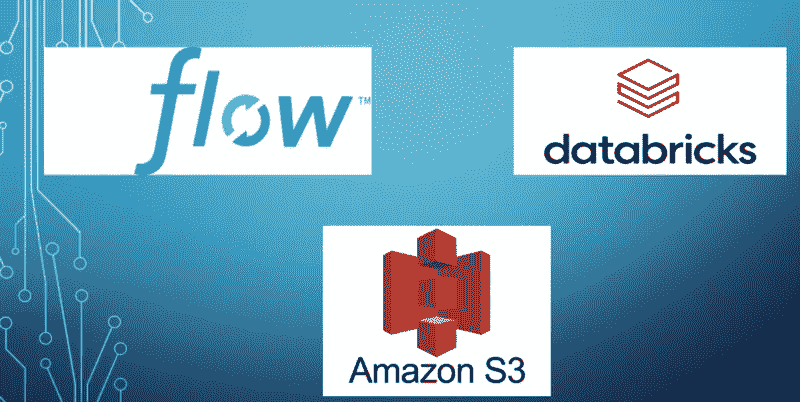

作者图片

# **简介**

> MLflow 是一个管理 ML 生命周期的开源平台，包括实验、再现性、部署和中央模型注册。(https://mlflow.org/)

在 [**上一篇文章**](https://medium.com/@kaanboke/step-by-step-mlflow-implementations-a9872dd32d9b) 中，我们讨论了在本地环境中逐步实现 MLflow。

在本文中，我们将看到:

🟢:我们如何使用数据块在远程 MLflow 跟踪服务器上记录模型参数和工件？

🟢:我们怎样才能把 AWS S3 作为一个文物商店呢？

我们开始吧。


图片来源:[https://giphy.com/](https://giphy.com/)

# 作为远程服务器的数据块

> “Databricks 是一个快速、简单、协作的基于 Apache Spark 的大数据分析服务，专为数据科学和数据工程而设计。”(www.azure.microsoft.com)

# 创建数据块自由帐户

对于这项研究，我使用 Databricks 社区版(免费版)，所以我们不需要支付任何额外的费用。

在继续之前，让我们在 Databricks 社区版上创建一个帐户。

首先，点击 [**这里的**](https://accounts.cloud.databricks.com/login) 进入主登录页面

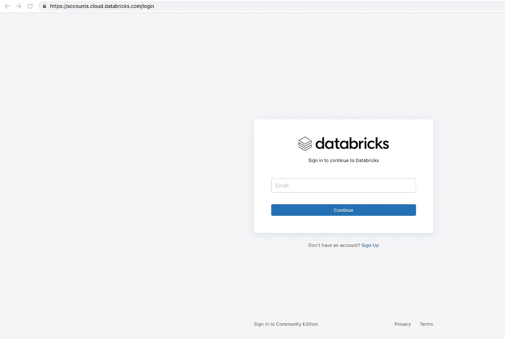

🛑小心点。

**如果你想获得一个免费账号**，不要用大盒子登录。

你必须在页面上往下一点，你会看到(希望:)我见过的最小的登录信息。

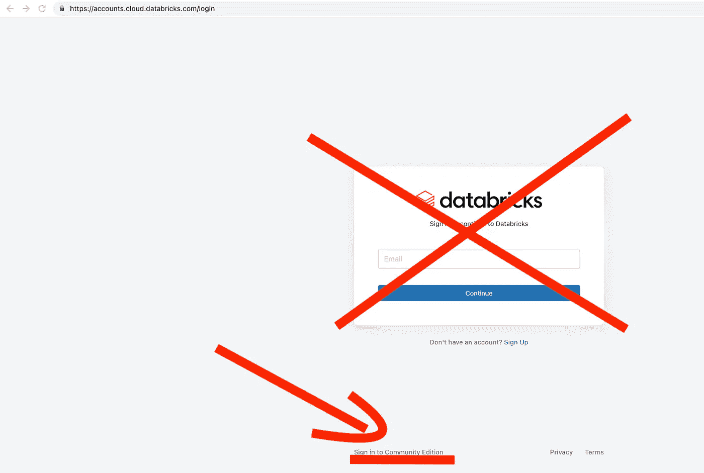

作者图片

并在此页面注册。

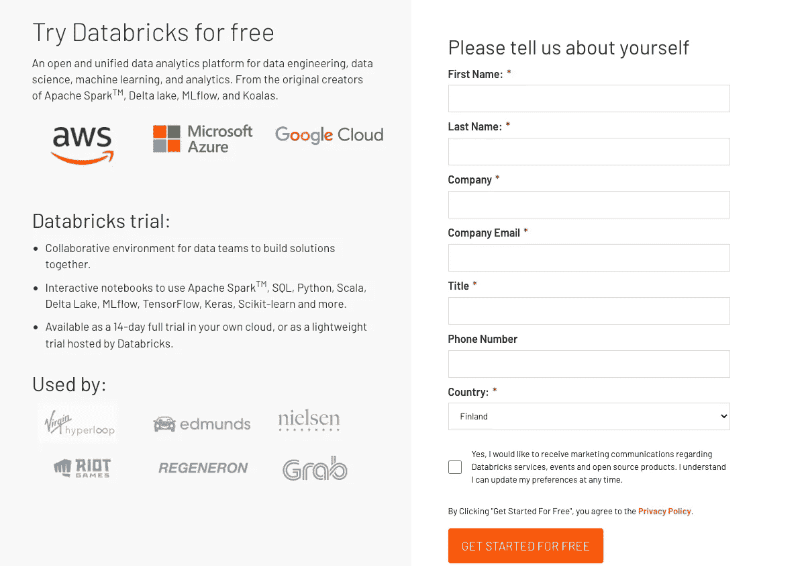

# DATABRICKS CLI 和认证

免费注册到 Databricks 后，我们需要使用 [Databricks 命令行工具](https://docs.databricks.com/dev-tools/cli)启动从本地计算机到 Databricks 的连接。

```
pip install databricks-cli
```

让我们确认一下安装

```
databricks -v
```

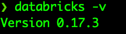

作者图片

然后，我们需要设置身份验证。

```
databricks configure
```

发出这个命令后，我们需要回答

🔵 ***Databricks 主机*** (应以 [https://)开头:](/))

写下面→[https://community.cloud.databricks.com/](https://community.cloud.databricks.com/)

🔵 ***用户名*** : <您的用户名>

🔵 ***密码*** : <您的密码>

让我们检查一下

```
databricks workspace ls /Users/<someone@example.com>
```

🔵使用您的用户名，而不是

如果此命令成功，您可以看到工作环境中的对象列表。

所以我们准备进入下一步。

# 将数据块用作远程服务器

现在，我们可以使用 Databricks 作为我们的远程服务器。

```
import mlflow

mlflow.set_tracking_uri("databricks")mlflow.set_experiment("/Users/<your username>/heart-disease-experiment")
```

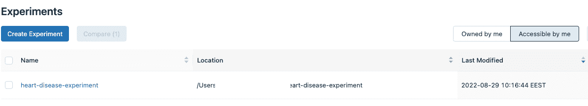

作者图片

正如我们在 [**上一篇文章**](https://medium.com/@kaanboke/step-by-step-mlflow-implementations-a9872dd32d9b) 中所做的，我们可以在 Databricks 平台中运行我们的模型并获得模型参数和工件。

让我们运行单个模型，并在 Databricks 平台中查看该模型。

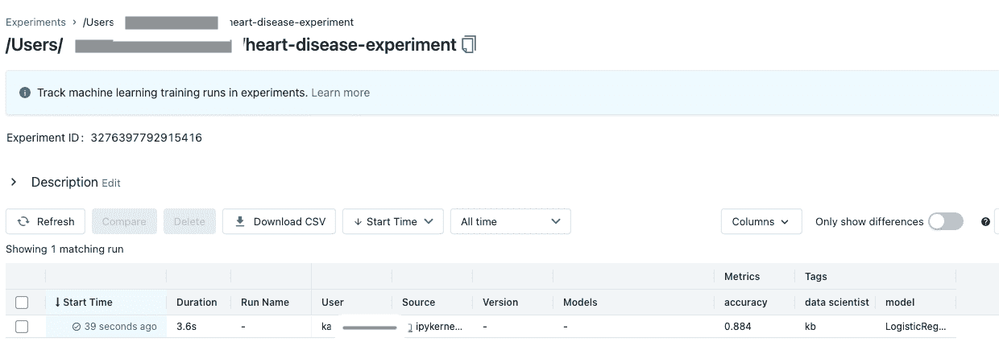

作者图片

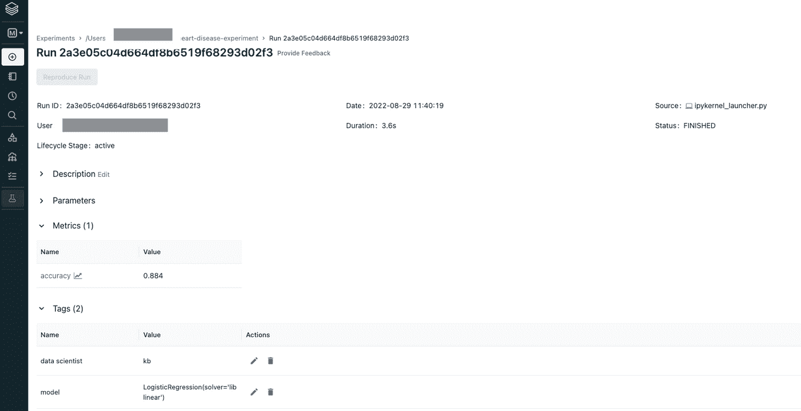

作者图片

让我们运行多个模型，并在 Databricks 平台中查看这些模型。

```
mlflow.sklearn.autolog()

lr = LogisticRegression(solver='liblinear')
lda= LinearDiscriminantAnalysis()
svm = SVC(gamma='scale')
knn = KNeighborsClassifier()
ada = AdaBoostClassifier(random_state=0)
gb = GradientBoostingClassifier(random_state=0)
rf = RandomForestClassifier(random_state=0)
et=  ExtraTreesClassifier(random_state=0)
xgbc = XGBClassifier(random_state=0)

models = [lr,lda,svm,knn,ada,gb,rf,et,xgbc]

for model in models: 
    with mlflow.start_run(run_name=f'Run {model}') as run:
        mlflow.set_tag("model", model)
        mlflow.set_tag("data scientist", "kb")
        X= df.drop('HeartDisease', axis=1)
        y= df['HeartDisease']
        X_train, X_test, y_train, y_test = train_test_split(X, y, test_size=0.3, random_state=42)
        ohe= OneHotEncoder()
        ct= make_column_transformer((ohe,categorical),remainder='passthrough') 
        pipe = make_pipeline(ct, model)
        pipe.fit(X_train, y_train)
        y_pred = pipe.predict(X_test)
        accuracy = round(accuracy_score(y_test, y_pred),4)
        mlflow.log_metric("accuracy", accuracy)
```

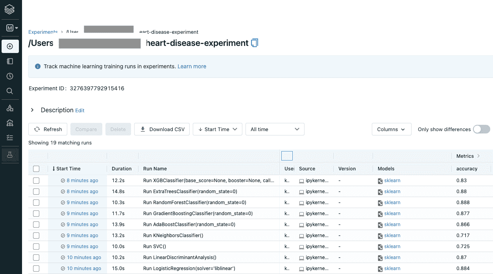

作者图片

让我们比较一下模型的准确度。

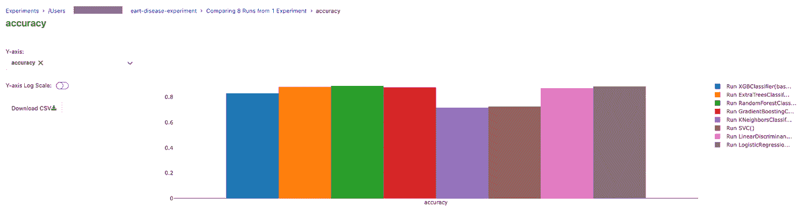

作者图片

我们已经成功地安排了 Databricks，我们的远程服务器。

我们使用 Databricks 在远程 MLflow 跟踪服务器上记录了模型参数和工件。

好的。我们已经准备好看到故事的 AWS 一面。

# AWS S3 作为一个文物商店

> **工件存储**是一个适合于大数据(例如 S3 存储桶或共享 NFS 文件系统)的位置，客户在这里记录他们的工件输出(例如模型)(www.mlflow.com)

即使 MLflow 网站没有给出如何安排 S3 桶作为神器商店的明确指导，你会发现按照下面的教程很容易。

# AWS 账户的必要安排

我假设您的计算机上已经安装了一个 AWS 帐户(对于本教程，自由层帐户就足够了)。

让我们安装最新版本的 AWS AWS 命令行界面。我们将遵循 [**AWS 网页**](https://docs.aws.amazon.com/cli/latest/userguide/getting-started-install.html) 上给出的说明。

**针对 MAC 用户**

```
curl "https://awscli.amazonaws.com/AWSCLIV2.pkg" -o "AWSCLIV2.pkg"

sudo installer -pkg AWSCLIV2.pkg -target /
```

**对于 Windows 用户**

下载并运行用于 Windows 的 AWS CLI MSI 安装程序(64 位):

https://awscli.amazonaws.com/AWSCLIV2.msi

**针对 Linux 用户**

```
curl "https://awscli.amazonaws.com/awscli-exe-linux-x86_64.zip" -o "awscliv2.zip"

unzip awscliv2.zip

sudo ./aws/install
```

让我们用下面的命令来确认安装。

```
aws --version
```

在继续之前，我们必须从本地计算机配置我们的 AWS 帐户。

首先，确保您可以从本地计算机访问 AWS S3 存储桶。

```
aws s3 ls
```

你应该得到你拥有的水桶的清单。

如果您无法获得存储桶列表；输入以下命令:

```
aws configure
```

按照屏幕上的指示，并提供您的钥匙。

```
[profile adminuser]
aws_access_key_id = adminuser access key IDaws_secret_access_key = adminuser secret access keyregion = aws-region
```

所以我们准备使用 S3 桶。

# **利用 S3 作为文物商店**

🔵首先，为 MLflow 工件存储创建一个新的 S3 存储桶。您可以使用 AWS GUI 或 AWS CLI。

🔵我将使用 AWS CLI。

```
aws s3 mb s3://mlflow-artifacts-2022
```

🔵我们指定一个 s3:// <bucket>/ <path>形式的 URI 来存储 s3 的工件。</path></bucket>

```
expr_name = "heart-disease-exp-2"  

s3_bucket = "s3://mlflow-artifacts-2022"  

mlflow.create_experiment(expr_name, s3_bucket)

mlflow.set_experiment(expr_name)
```

🔵让我们确保一切正常。

```
with mlflow.start_run()
    print(mlflow.get_artifact_uri()):
```

🔵它应该打印出一个 S3 桶路径。


作者图片

就是这样。

让我们运行多个模型，并在定义的 S3 桶中查看模型的工件。

```
mlflow.sklearn.autolog()

lr = LogisticRegression(solver='liblinear')
lda= LinearDiscriminantAnalysis()
svm = SVC(gamma='scale')
knn = KNeighborsClassifier()
ada = AdaBoostClassifier(random_state=0)
gb = GradientBoostingClassifier(random_state=0)
rf = RandomForestClassifier(random_state=0)
et=  ExtraTreesClassifier(random_state=0)
xgbc = XGBClassifier(random_state=0)

models = [lr,lda,svm,knn,ada,gb,rf,et,xgbc]

for model in models: 
    with mlflow.start_run(run_name=f'Run {model}') as run:
        mlflow.set_tag("model", model)
        mlflow.set_tag("data scientist", "kb")
        X= df.drop('HeartDisease', axis=1)
        y= df['HeartDisease']
        X_train, X_test, y_train, y_test = train_test_split(X, y, test_size=0.3, random_state=42)
        ohe= OneHotEncoder()
        ct= make_column_transformer((ohe,categorical),remainder='passthrough') 
        pipe = make_pipeline(ct, model)
        pipe.fit(X_train, y_train)
        y_pred = pipe.predict(X_test)
        accuracy = round(accuracy_score(y_test, y_pred),4)
        mlflow.log_metric("accuracy", accuracy)
```

让我们转到 AWS 帐户，看看 S3 桶。

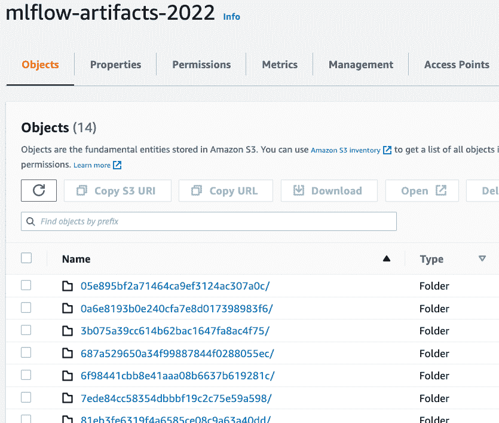

作者图片

让我们单击其中的一个并查看详细信息。

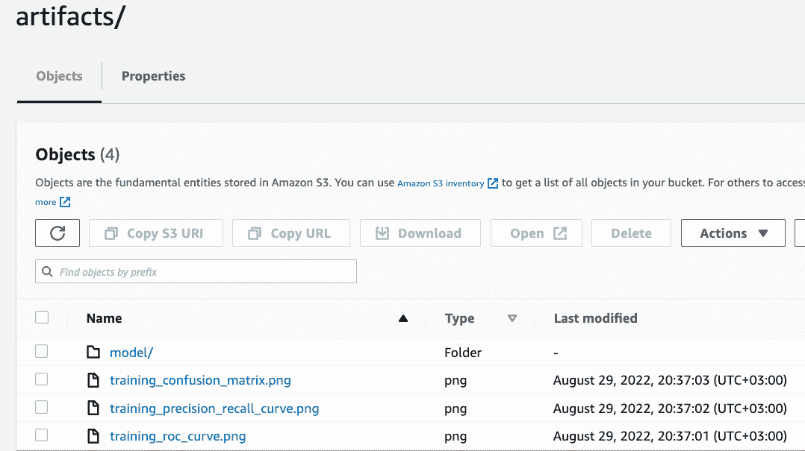

作者图片

让我们点击模型，看看里面有什么。

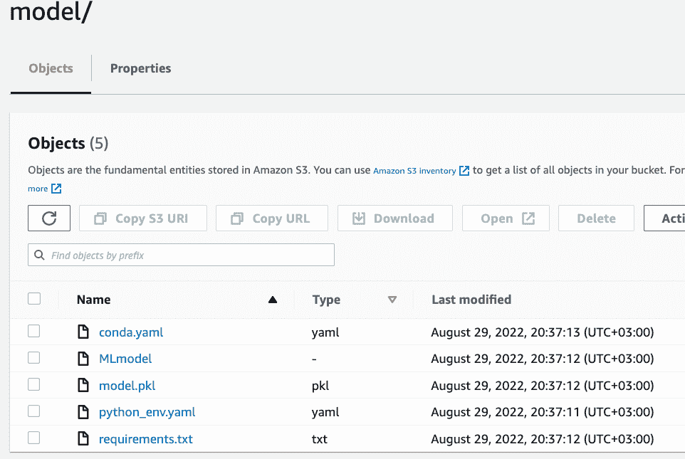

作者图片

我们已经成功地将 AWS S3 存储区定义为 MLflow 工件存储区。

# 结论

在本文中，我们已经介绍了如何使用 Databricks 在远程 MLflow 跟踪服务器上记录模型参数和工件。

除此之外，我们还将 AWS S3 存储区定义为 MLflow 跟踪服务器的工件存储区。


图片来源:[https://giphy.com/](https://giphy.com/)

本文是 [**MLOps 最佳实践列表**](https://medium.com/@kaanboke/list/mlopsbest-practices-5a8ac9cad726) 的一部分。你可以在 这里找到 [**系列的其他文章。**](https://medium.com/@kaanboke/list/mlopsbest-practices-5a8ac9cad726)

我希望它有所帮助。

对了，喜欢题目的时候可以通过支持**来展示👏**

欢迎发表评论。

# 万事如意🤘

如果你喜欢看我的内容， [*请考虑关注我*](https://medium.com/@kaanboke/membership) 。还有，你可以通过 [**订阅 Medium**](https://medium.com/@kaanboke/membership) 来支持我和其他作家。使用我的推荐链接不会额外花费你。