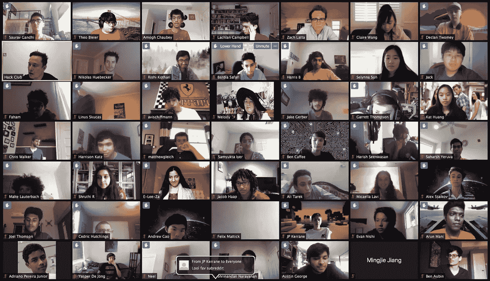
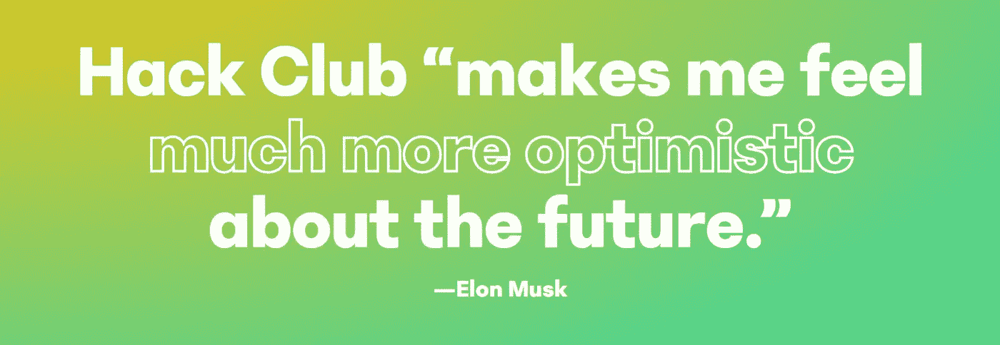

# 埃隆·马斯克:“你们问的问题比主流媒体好得多。”

> 原文：<https://pub.towardsai.net/you-guys-ask-way-better-questions-than-mainstream-media-elon-musk-on-hack-clubs-high-school-f4b5eb46e40e?source=collection_archive---------2----------------------->

## [新闻](https://towardsai.net/p/category/news)，[科技](https://towardsai.net/p/category/technology)

## 埃隆·马斯克谈黑客俱乐部的高中生成员。问我任何关于埃隆·马斯克的事情。

*特色图片鸣谢:黑客俱乐部*

esla 和 SpaceX 首席执行官埃隆·马斯克(Elon Musk)向全球编程俱乐部网络 Hack Club 捐赠了 50 万美元，该俱乐部为会员提供了通过构建项目进行编程的机会。2020 年 4 月 24 日，马斯克作为嘉宾出现在 AMA 的一个黑客俱乐部(问我任何问题)，在那里他回答了该组织一些成员的问题。点击***观看完整的直播视频。***

Hack Club 于 5 月 20 日宣布了马斯克的捐赠，称这份礼物将使该团体接触到更多潜在成员，这将有助于增加 Hack Club 在全国各地高中的存在。

黑客俱乐部是一个致力于帮助高中生通过修补和构建项目来学习编码的团体。这是一个在美国各地开展的课后计划，允许学生按照自己的节奏发展解决问题的技能，并操纵应用程序、网站、游戏等的构建。

Hack Club 的网站描述了该组织将如何通过透明和开源财务来花费这些钱。更多信息请访问 [***Hack Club 的网站***](https://hackclub.com/elon/) 。

*特色图片鸣谢:黑客俱乐部*

## 用埃隆·马斯克黑掉 AMA 俱乐部

> **以下是一些真正引起我注意的问题，事实上，马斯克富有洞察力的回答也对这些问题进行了补充:**(注意:为了便于阅读，我对对话进行了转述，同时仍然确保**不会**改变想法本身的含义)

雅各布·哈普(Jacob Haap):如果这个世界是一个模拟世界，我们有没有办法操纵这个模拟世界，或者找到作弊的方法，让一切对我们自己更好？
**埃隆马斯克**:不管是不是模拟，我们都应该努力让它变得有趣，刺激，有未来，我们都期待。乐观点！
扩大 ***意识范围，探索宇宙，试图更好地理解它，想出正确的问题来问*** (既然我们已经有了答案，也就是我们的宇宙)。

Selynna Sun :你如何利用你的影响力做好事？
**埃隆·马斯克**:向可持续能源运输和可持续能源生产的过渡宜早不宜迟——或许应该让它们弯得更快而不是更慢。走上成为 ***多星球物种和太空旅行文明的道路；尝试探索和理解宇宙的本质*** 。

萨哈尔什·耶茹瓦:你认为主流媒体的替代品是什么？
**埃隆马斯克**:解决方案应该是 ***公民新闻*** 。基本就是你！事实上，你问的问题比主流媒体要好得多。在主流媒体中，有一个围绕广告和点击的反馈机制，这是不健康的。需要修正的是制度，而不是个人。例如，特斯拉从未做过广告(即使是在 2008 年最艰难的时候)。我们只是把我们的钱/资源集中在如何让事情变得更好上。然后，就是口口相传了。

塞德里克·休金斯:你对创客运动中的创客们有什么建议来提高制造产品的公众代表性？
**埃隆马斯克**:不要自我设限。相信自己，不断尝试。制造业被严重低估了。制造业有很大的创新潜力。这不仅仅是复制一些东西。相反，它在制造一台制造机器的机器。到目前为止，根据我的经验，最难的是:建立生产系统。只是给个难度大小的概念: ***设计一个火箭就像 1x 硬，造一个是 10x，造一个生产系统至少是 100x 或者可能是 1000x*** 。

拉克伦·坎贝尔:资本主义与减缓气候变化相容吗？你如何看待营利性公司在解决气候变化中的作用？
**【埃隆马斯克】**:我们目前面临的问题是海洋和大气二氧化碳容量中的‘未定价外部性’*。根据基本定义，资本主义是对市场力量的反应，即做人们想做的事情。解决办法就是开征 ***碳税*** ！或许，我们应该建立一个系统，为最多的人带来最多的好处。政府本质上不是解决方案。政府只是一个有限的公司，它有垄断权。 ***公司越大，垄断性就越强，这导致为顾客/人群服务的反馈回路越弱*** 。
替代方案:开展有助于保持实体诚实的竞争。*

*汪思妍:神经科学在太空旅行中有作用吗？
**埃隆马斯克**:***脑机接口对于实现与 AI*** 的共生非常重要。随着时间的推移，我们可以远离机器智能，拥有高带宽的神经接口，从而实现与人工智能的共生。我们的大脑皮层和边缘系统在一起很开心。大脑皮层比边缘系统聪明得多。基本上，大脑皮层试图让边缘系统快乐。应用:帮助解决脑损伤，恢复你失去的记忆，恢复肢体功能等。*

> *[**Neuralink**](https://www.neuralink.com/) 旨在通过植入可以链接到大脑的微小芯片，在人类和人工智能之间架起一座桥梁。点击这里 观看 Neuralink 在发布会 [**上详细介绍其雄心勃勃的计划的演示。**](https://www.youtube.com/watch?v=lA77zsJ31nA)*

*Ben Aubin :你最近做了什么有趣的事，或者解决了什么问题？
**埃隆马斯克**:***SpaceX、Tesla、Neuralink、The Boring Company、personal stuff*** 之间的上下文切换。
(Elon 分享了一个基于他访问星舰生产综合体桶焊接站的轶事)——星舰过去看起来像米其林人。我们以 1/4 米/分钟的速度旋转枪管，而枪管旋转工具的最大容量为 1.5 米/分钟，我们使焊缝过热。焊枪没有设置在最大功率，最终导致过热和软化。不锈钢具有相对较高的热膨胀系数。要焊接不锈钢，你需要一个紧密的间隙，热焊接，快速移动。*

*杰克:你怎么知道科技已经走得太远了？如果 AI 接管世界，有哪些解决方案？
**埃隆马斯克**:我们在社交媒体上的应变能力相当弱。人工智能的任务是最大限度地提高广告点击量(已经出现在脸书！)会造成各种各样的危机。为点击量发动一场战争！我们应该 ***保持警惕，持续监控社交媒体 AI*** 。*

***奥斯汀·乔治**:在与团队交流想法和分享愿景方面，你学到的最重要的东西是什么？
**埃隆马斯克**:我相信 ***使用‘物理学’的工具*** (我相信他指的是‘第一原理’的方法，事实上，他非常相信) ***。假设你错了，每天努力少犯错——那将是一个不可思议的胜利。质疑权威——每个人都有犯错的时候。让基本推理成为驱动结果的推理，而不是说这种推理的人。****

> *如果你有任何意见想与我分享(或)为我提供任何关于我的写作或想法的相关反馈，我会很高兴收到你的来信。欢迎随时在 [**Twitter**](http://twitter.com/ThisIsSandeepA) ， [**LinkedIn**](https://www.linkedin.com/in/sandeep-a/) 上联系我，或者在 [**GitHub**](https://github.com/SandeepAswathnarayana) 上关注我。*