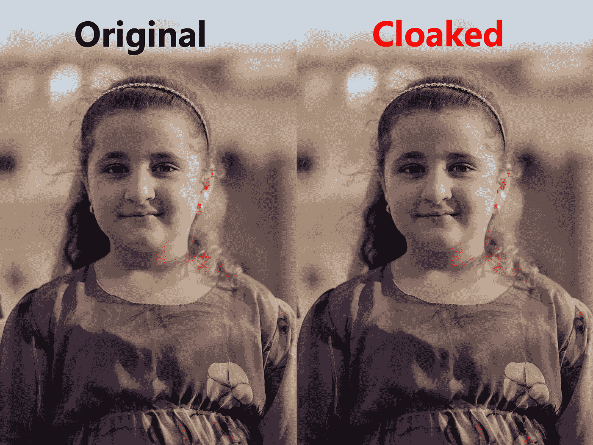
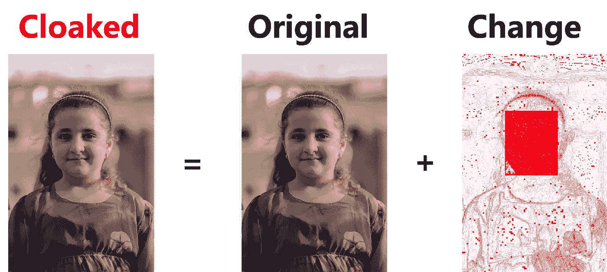
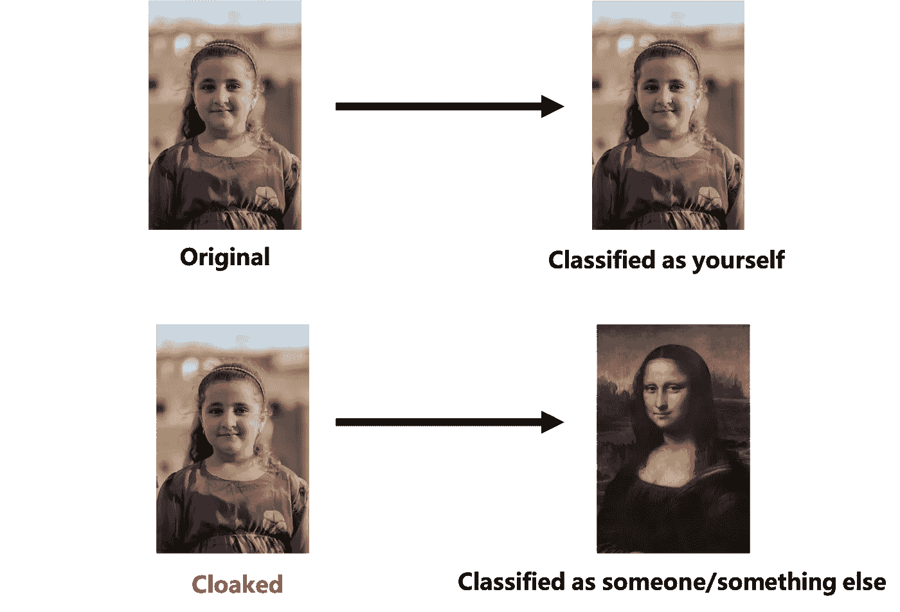
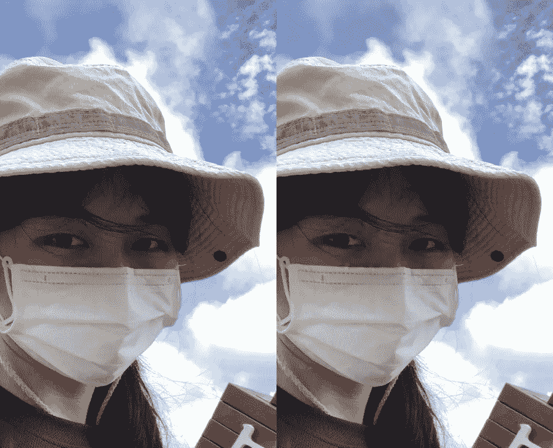
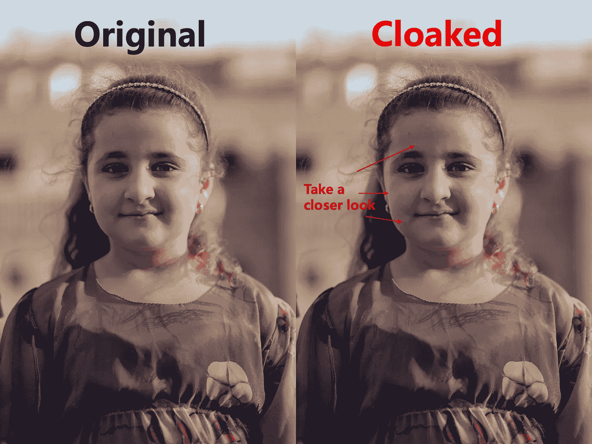

# 你的脸在网上不安全。你可以这么做。

> 原文：<https://pub.towardsai.net/your-face-is-not-safe-online-heres-what-you-can-do-5fcb01889e90?source=collection_archive---------0----------------------->

## [网络安全](https://towardsai.net/p/category/cybersecurity)

## 用这个开箱即用的对抗性机器学习工具愚弄人脸识别模型。

由[李维·梅尔·克兰西](https://unsplash.com/@levimeirclancy?utm_source=unsplash&utm_medium=referral&utm_content=creditCopyText)在 [Unsplash](https://unsplash.com/s/photos/girl?utm_source=unsplash&utm_medium=referral&utm_content=creditCopyText) 上拍摄的原始照片。披上福克斯的斗篷，加上作者的注解。

我们听说有人在网上搜集个人数据，但并无恶意。我们知道，通过我们在网上留下的足迹，老大哥们正变得越来越强大。

互联网是一片黑暗的森林，但也是霍布森的选择。个人照片是社交媒体上生活的重要组成部分，选择退出似乎只能以放弃社交生活为代价。

就我关心隐私问题的程度而言，我没有找到任何可持续的方式来选择退出，并决定为它的价值支付全价——在我开始机器学习之旅之前，我一直是这么想的。

如果我们贴上只有*人类*能*读懂*的图片会怎么样？

# 机器如何识别人脸

机器识别人脸的方式与我们人类不同。他们阅读用数字表示的图片。因此，一些人眼看不到的像素大小的位移是他们这边的剧烈变化。

简单来说，*对抗性机器学习* 就是研究如何用接近人眼完美的输入来愚弄机器的分区。

下面是我从一个在线图片比较网站上生成的图片。人眼察觉不到的微小变化被涂上鲜红色。

来自 IMGonline.com.ua 的比较

受到攻击后，虽然人类仍会正常看到图片中的人脸，但机器会将人脸识别为别人的，甚至根本不是人脸。

如果你的照片落入坏人之手，这将降低你被机器识别的几率。

蒙娜丽莎是一个假设的例子

# 愚弄机器的实用步骤

我们正在谈论的人脸识别模型基本上是一种识别人脸有效模式的功能，可以根据特征准确区分个人。

训练一个模型通常是一遍又一遍地寻找起作用的函数的过程。每一个被测试的功能的高分都被记录下来，而最好的选项被保存为最终产品。

修改图片的工作方式与此相反。我们*优化*图片，直到准确度分数非常*低*，而不是优化函数，限制只移动小的增量像素，因此人眼察觉不到变化。

芝加哥大学沙子实验室的研究人员发明了一种工具，可以把你从技术工作中解救出来。他们的现成代码可以从他们的网站[这里](http://sandlab.cs.uchicago.edu/fawkes/#code)获得。

论文介绍

简而言之，*福克斯*将处理图像，这样人脸识别模型就会将你的照片错误分类。研究人员报告说，他们甚至可以欺骗复杂的模型，如微软 Azure Face API 和亚马逊 Rekognition。

# 个人反思

2021 年初，我开始用福克斯隐藏我上传到网上的个人照片，并发现这是一次相当不错的经历。

起初，隐藏的照片看起来很容易被认出来，我在上传我自己的照片时犹豫不决。

看到面具上方右眼周围的区域了吗

但后来我意识到这也发生在其他人的脸上。在这张照片中也可以看到皮肤某些部位的粗糙:

仔细看看隐形图像

很明显，如果他们只是在社交媒体上滚动，没有人会看出区别。

## 隐身愉快！

我和福克斯的研究人员没有任何关系。我所知道的关于福克斯的一切都是基于公开信息，我已经决定完全相信他们。

对抗性机器学习是我在机器学习中最喜欢的章节之一，发现福克斯并将其融入我的日常生活只是一次激动人心的经历。