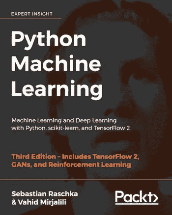

# 您的数据科学之旅独一无二

> 原文：<https://pub.towardsai.net/your-journey-to-data-science-is-unique-a298687162f3?source=collection_archive---------1----------------------->

## [数据科学](https://towardsai.net/p/category/data-science)，[教育](https://towardsai.net/p/category/education)

## 在当今的信息技术世界中，您可以设计自己的数据科学之路

照片由[凯勒·琼斯](https://unsplash.com/@gcalebjones?utm_source=medium&utm_medium=referral)在 [Unsplash](https://unsplash.com?utm_source=medium&utm_medium=referral) 拍摄

想想全球每天产生的数据量:医疗保健数据、教育数据、金融数据、商业数据等。随着世界上越来越多的地方开始使用技术和互联网，产生的数据量只会继续增加。因此，数据科学是 21 世纪需要学习的一项重要技能。将数据科学技能添加到您的技能组合中会增加您脱颖而出的机会。

在信息技术的世界里，有许多学习数据科学的资源。任何对学习数据科学基础感兴趣的人都可以以前所未有的方式学习。对于更正式的教育，你可以攻读商业分析或数据科学的硕士学位。如果你负担不起大学学位，那么你可以通过自学学习数据科学技能。

在本文中，我将与您分享我的数据科学之路。数据科学之旅对每个人来说都是独一无二的。如果你对学习数据科学感兴趣，首先要做的是评估自己，了解自己是谁，背景是什么，愿意为自己的数据科学之旅奉献多少时间，数学和编程背景是什么等等。

在讨论我在数据科学旅程中使用的资源之前，这里有一些熟悉的主题，以便建立数据科学的基础知识。

# I .数据科学初学者的基本主题

## 1.数学基础

*   功能
*   派生物
*   梯度下降法
*   基础统计和概率(均值、方差、标准差、概率分布、相关性、中心极限定理、贝叶斯定理)
*   线性代数(矩阵、转置、逆、迹、特征值、特征向量、行列式)

## 2.编程基础

*   numpy
*   熊猫
*   sci kit-学习
*   matplotlib
*   海生的

## 3.数据基础

*   数据类型
*   数据源
*   数据缺陷
*   数据清理和预处理
*   数据缩放

## 4.降维基础

*   协方差矩阵法
*   主成分分析
*   线性判别分析

## 5.数据可视化基础

*   散点图
*   曲线图
*   密度图
*   直方图
*   条形图
*   热图

## 6.线性回归基础

*   简单线性回归
*   多元线性回归

## 7.机器学习基础(逻辑、KNN、SVM、决策树)

*   交互效度分析
*   集成方法
*   不确定性量化
*   型号选择

# 二。我与科学约会的独特旅程

我真正对数据科学感兴趣是在 2017 年，当时我的一个好朋友向我介绍了这个领域。从那以后，我探索了几个资源，我一直在探索。数据科学是一个不断变化的领域，因此数据科学的学习是终身的。在接下来的内容中，我将分享一些我用来学习数据科学基础知识的课程和资源。

## **1。数据营**

*   [Python 简介](https://www.datacamp.com/courses/intro-to-python-for-data-science)
*   [R 简介](https://www.datacamp.com/courses/free-introduction-to-r)
*   [Python 中的数据科学简介](https://www.datacamp.com/courses/introduction-to-data-science-in-python)

## **2。edX**

***HarvardX***[***数据科学专业证书***](https://www.edx.org/professional-certificate/harvardx-data-science) ***。*** 包括以下课程，全部使用 R 授课(您可以免费旁听课程或购买认证证书):

*   数据科学:R 基础；
*   数据科学:可视化；
*   数据科学:概率；
*   数据科学:推理和建模；
*   数据科学:生产力工具；
*   数据科学:扯皮；
*   数据科学:线性回归；
*   数据科学:机器学习；
*   数据科学:顶点

***乔治亚理工学院***

*   [分析建模简介](https://www.edx.org/micromasters/gtx-analytics-essential-tools-and-methods)

## 3.Coursera

*   [Python 中的数据科学介绍](https://www.coursera.org/learn/python-data-analysis?specialization=data-science-python)；
*   [应用 Python](https://www.coursera.org/learn/python-plotting?specialization=data-science-python) 进行绘图、制图&数据表示；

## 4.油管（国外视频网站）

YouTube 包含几个教育视频和教程，可以教你数据科学所需的基本数学和编程技能，以及几个面向初学者的数据科学教程。一个简单的搜索就会产生几个视频教程和讲座。YouTube 上我最喜欢的三门课程是:

*   吉尔伯特·斯特朗的《线性代数》
*   [亚历山大阿米尼深度学习介绍](https://www.youtube.com/playlist?list=PLtBw6njQRU-rwp5__7C0oIVt26ZgjG9NI)
*   [约翰·古塔格和埃里克·格里姆森介绍计算思维和数据科学](https://www.youtube.com/playlist?list=PLRJdqdXieSHMtmKxr4s78F7U88l-SawAj)

## **5。从教科书中学习**

从教科书中学习提供了比你从在线课程中获得的更精炼和更深入的知识。这本书对数据科学和机器学习提供了很好的介绍，包括代码:Sebastian Raschka 的《Python 机器学习》。[https://github . com/rasbt/python-machine-learning-book-第三版](https://github.com/rasbt/python-machine-learning-book-3rd-edition)

作者以一种非常容易理解的方式解释了机器学习的基本概念。此外，代码也包括在内，因此您实际上可以使用提供的代码来练习和构建您自己的模型。我个人认为这本书在我作为数据科学家的旅程中非常有用。我会向任何数据科学爱好者推荐这本书。你所需要的是基本的线性代数和编程技能，以便能够理解这本书。

还有许多其他优秀的数据科学教科书，如 Wes McKinney 的“ [Python for Data Analysis](https://sushilapalwe.files.wordpress.com/2018/04/python-for-data-analytics-book.pdf) ”，Kuhn & Johnson 的[Applied Predictive Modeling](https://vuquangnguyen2016.files.wordpress.com/2018/03/applied-predictive-modeling-max-kuhn-kjell-johnson_1518.pdf)，以及 Ian H. Witten、Eibe Frank & Mark A. Hall 的“[Data Mining:Practical Machine Learning Tools and Techniques](https://www.wi.hs-wismar.de/~cleve/vorl/projects/dm/ss13/HierarClustern/Literatur/WittenFrank-DM-3rd.pdf)”。

## 6.网络和继续学习资源

由于数据科学领域的技术发展，它是一个不断发展的领域，因此持续的学习对数据科学至关重要。创建一个与其他数据科学家合作的网络将使你始终处于游戏的顶端。以下平台是建立关系网和继续学习的绝佳资源。

***中级:*** [中级](https://medium.com/)现在被认为是学习数据科学和网络方面发展最快的平台之一。如果您有兴趣使用该平台进行数据科学自学，第一步将是创建一个中型帐户。您可以创建一个免费帐户或会员帐户。对于免费帐户，每月可以访问的会员文章数量是有限制的。会员账户需要 5 美元或 50 美元/年的月订阅费。从这里了解更多关于成为灵媒会员的信息:[https://medium.com/membership](https://medium.com/membership)。

有了会员帐号，你将可以无限制地访问媒体文章和出版物。Medium 有几个数据科学出版物，可以帮助您了解该领域的新发展，并与其他数据科学家或有志之士建立联系。媒体上排名前两位的数据科学出版物是面向数据科学的[和面向人工智能的](https://towardsdatascience.com/)。每天都有新的文章发表在 medium 上，涵盖数据科学、机器学习、数据可视化、编程、人工智能等主题。使用 medium 网站上的搜索工具，您可以访问大量文章和教程，涵盖数据科学中的各种主题，从基本概念到高级概念。

***LinkedIn:***LinkedIn 是一个优秀的社交平台。LinkedIn 上有几个数据科学小组和组织可以加入，例如，走向 AI、DataScienceHub、走向数据科学、KDnuggets 等。你也可以在这个平台上关注该领域的顶级领导者。

***KD nuggets:***[KD nuggets](https://www.kdnuggets.com/)是人工智能、**分析、大数据、数据挖掘、数据科学和机器学习方面的领先网站。在该网站上，您可以找到数据科学方面的重要教育工具和资源以及职业发展工具。**

***GitHub:*** GitHub 包含几个关于数据科学和机器学习的教程和项目。除了作为数据科学教育的优秀资源，GitHub 还是[项目组织](https://towardsdatascience.com/how-to-organize-your-data-science-project-dd6599cf000a)和项目组合构建的优秀平台。有关在 GitHub 上创建数据科学投资组合的更多信息，请参见以下文章:[使用这些平台构建脱颖而出的投资组合](https://www.kdnuggets.com/2021/01/build-data-science-portfolio.html)。

***ka ggle:***[ka ggle](https://www.kaggle.com/)是世界上最大的数据科学社区，拥有强大的工具和资源来帮助您实现数据科学目标。Kaggle 允许用户查找和发布数据集，在基于网络的数据科学环境中探索和构建模型，与其他数据科学家和机器学习工程师合作，并参加竞赛以解决数据科学挑战。在这个平台上，你可以访问[数据集](https://www.kaggle.com/datasets)、[课程](https://www.kaggle.com/learn/overview)、[笔记本](https://www.kaggle.com/notebooks)和[比赛](https://www.kaggle.com/competitions)。随着您参与 Kaggle 项目和竞赛，您在数据科学方面的知识和经验将不断增长。Kaggle 也是一个与其他数据科学从业者和爱好者交流的伟大平台。

# 三。摘要

总之，我介绍了我在数据科学之旅中使用的一些资源。数据科学之旅对每个人来说都是独一无二的。如果你对学习数据科学感兴趣，首先要做的是评估自己，了解自己是谁，背景是什么，愿意为自己的数据科学之旅奉献多少时间，数学和编程背景是什么等等。一旦你弄清楚你想要什么，你就可以选择合适的资源来帮助你掌握数据科学的基础知识。