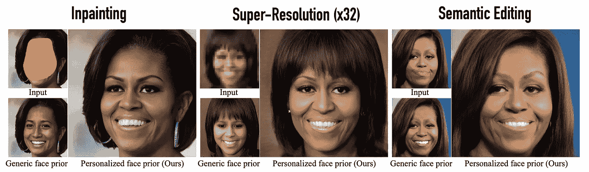
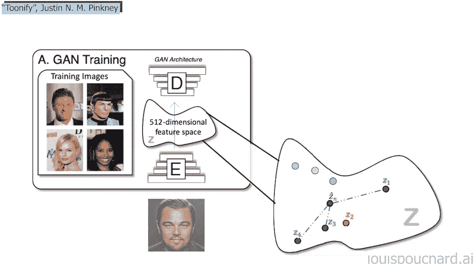
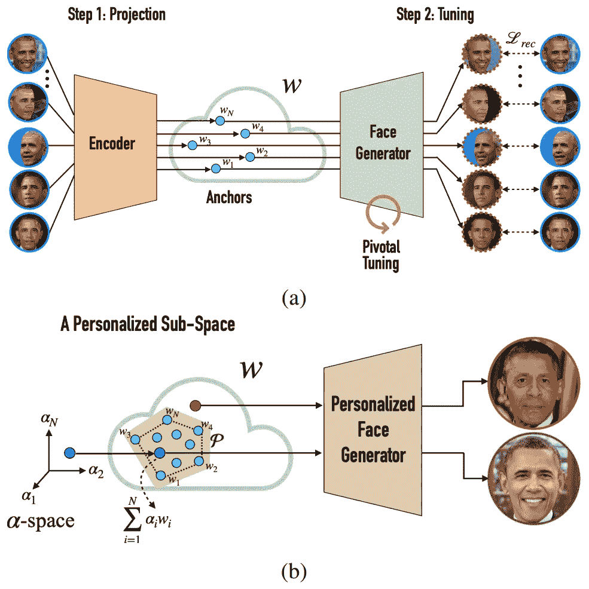
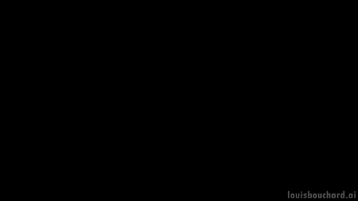
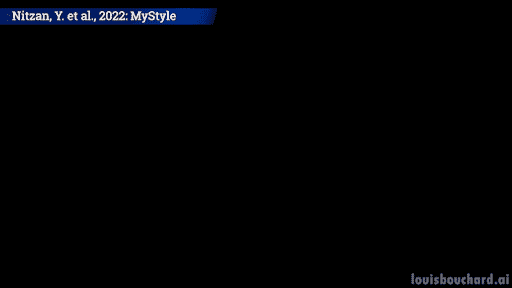
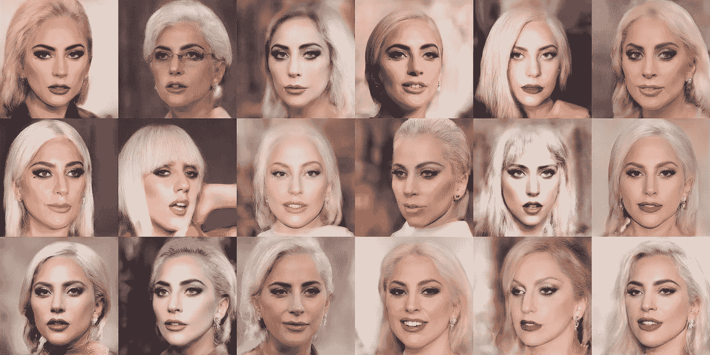

# 你的个人人工智能 Photoshop 设计师

> 原文：<https://pub.towardsai.net/your-personal-ai-powered-photoshop-designer-710adc3a5bc8?source=collection_archive---------2----------------------->

## 这个人工智能可以重建，增强和编辑你的图像！

> 最初发表于 [louisbouchard.ai](https://www.louisbouchard.ai/mystyle/) ，前两天在[我的博客](https://www.louisbouchard.ai/mystyle/)上读到的！

图片来自报纸。

## 观看视频

谷歌研究和特拉维夫大学的这个新模型令人难以置信。你可以把它看做是一个非常非常强大的深度赝品，它可以做任何事情。给任何一个人拍一百张照片，你就可以对其角色进行编码，以修复、编辑或创建任何你想要的逼真照片。如果你问我，这既令人惊讶又令人害怕，尤其是当你看到结果的时候。只需花一分钟欣赏视频中的他们…

该模型简单地使用了一个相关的 StyleGAN 架构，我在许多视频中介绍过，所以我不会进入这个网络的细节。很快，StyleGAN 拍摄了一张图像，使用卷积神经网络对其进行编码，并经过训练重新生成相同的图像。如果这对你来说听起来像是另一种语言，花两分钟来看一下[我为翻唱 StyleGAN 制作的这个视频](https://youtu.be/RAXrwPskNso)。

StyleGAN 如何编辑图像。图片由作者提供。

然后，当你用一个由许多人组成的大数据集对它进行良好训练时，你可以教它直接从编码空间转换图像，就像我在视频中解释的那样。所以你不再需要给它输入图像，你可以简单地玩我们称之为发生器的东西。

这意味着你可以教它像风格转换应用程序一样改变整个图片，例如，你可以拍摄一张逼真的图片并对其进行编码，或者从编码开始，将其转换为类似动漫的数字图像。经过适当的训练和操作，你也可以只改变一些局部特征，如头发的颜色或任何其他编辑，使你看起来最好。

这个两步模型的概述。图片来自报纸。

所以这个叫做 MyStyle 的新模型使用了这个 StyleGAN 基础模型，并对它进行了修改，以实现一个风格转换任务和任何可以与你的面部相关联的任务。正如我所说的，它真的知道你看起来怎么样，并且可以做几乎任何事情；修复、超分辨率或编辑。

图像修复是指在照片中有一些物体遮住了你的脸，你可以从照片中移除这些物体，让你的脸重新出现。就像你在电子游戏中启用透明来看穿墙壁一样。

当试图概括许多不同的面孔时，图像超分辨率是一项极具挑战性的任务，但当你专注于一个人时就容易多了。这里，我们的目标是拍摄一张清晰度非常低的图像，并将其放大到高分辨率。所以你基本上有这个，你自己的一个模糊的图像，你试着让它看起来像右边的图像。

你可以看到这两个应用程序对机器来说是多么具有挑战性，因为它需要知道这个人，以便填补大的空白或增加像素，使人脸看起来更清晰。模特基本上必须既是你的亲密朋友，同时又是一位伟大的艺术家，因为她需要知道你的脸从任何角度看起来是什么样子，并且能够逼真地绘制它。虽然我会尽我所能成为最好的朋友，但如果你想要好的结果，就别指望我会准确地画出你的脸。这只是另一个层面。

因此，利用这个由数千人组成的庞大通用数据集和 100 张你自己的照片训练的 StyleGAN 基础，MyStyle 将学习一个针对你的脸的编码空间(上面模型概述中的第一步)。它基本上会在所有人脸的编码表示中找到你，并被重新训练以推动模型专注于你的不同特征。

然后，你就可以给它提供不完整或失败的照片，并让它帮你修复(上面模型概述中的第 2 步)。多酷啊。它需要相当多的你自己的图像，但是 100 张照片仅仅意味着和朋友以及你的手机在外面度过了重要的一天，比试图推广到所有人的一般模型有更好的结果。这也比在 Photoshop 上雇佣一个专业人员，要求编辑你所有的未来图片要便宜得多。

尽管如此，你可以看到这种模式对名人或拥有大量 Instagram 图片的人来说是多么危险。有人可以用它们来训练一个模型，并基本上创建你在妥协情况下的超现实照片。这就是为什么我经常说，我们不能再相信我们所看到的，尤其是在互联网上。当它也将在现实世界中与增强现实眼镜一起使用时，我们不要考虑所有可能的问题。

Lady Gaga 的这些照片并不存在。图片来自报纸。

尽管如此，结果非常棒，比我们之前看到的要好得多，因为它只需要一百张自己的照片，而不是几个小时的视频拍摄，并且比那些只需要较少图像来执行单一任务的照片要少得多。

瞧！这就是为什么谷歌研究和特拉维夫大学的新模型 MyStyle 能够使用单个架构和训练方案来执行图像修复、图像超分辨率和图像编辑，与其他方法相比，因为它专注于人而不是任务本身，这使得它更加准确、真实和可推广。

我希望你喜欢这篇文章！如果你喜欢或者不喜欢，让我知道你对这个更短更简单的格式的看法。当然，这只是这篇新论文的一个快速概述，我强烈建议阅读下面链接的论文，以便更好地了解他们的培训计划和模型。

下周我会带着另一篇精彩的论文来看你！

路易斯（号外乐团成员）

## 参考

阅读原文：<https://www.louisbouchard.ai/mystyle/>
尼赞，y .，阿伯曼，k .，何，q .，巴丽，o .，雅罗姆，m .，甘德斯曼，y .，莫塞里，I .，普里奇，y .，科恩-奥尔，d .，2022。我的风格:个性化的生成先验。arXiv 预印本 arXiv:2203.17272。
项目链接:【https://mystyle-personalized-prior.github.io/】
[代码(即将发布):](https://mystyle-personalized-prior.github.io/)[https://mystyle-personalized-prior.github.io/](https://mystyle-personalized-prior.github.io/)
我的简讯(一个新的 AI 应用每周向您的电子邮件解释！):[https://www.louisbouchard.ai/newsletter/](https://www.louisbouchard.ai/newsletter/)