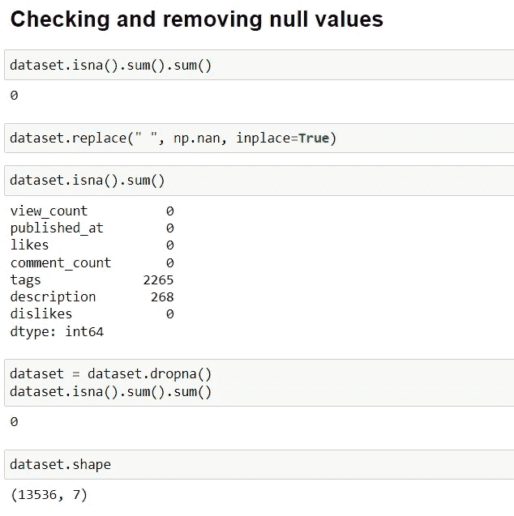
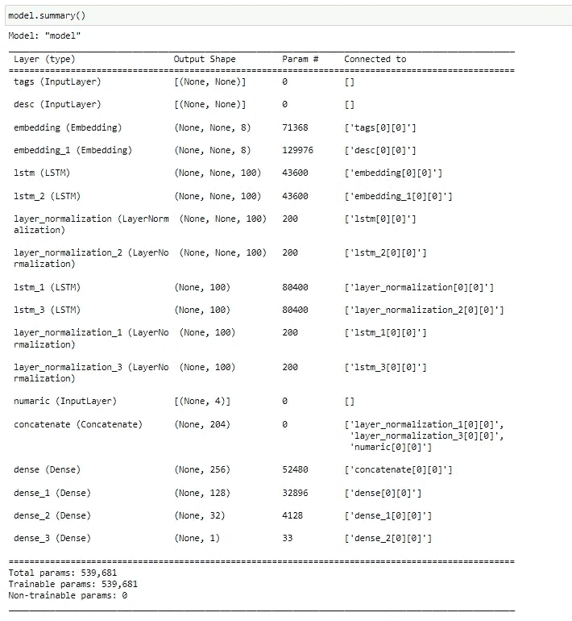
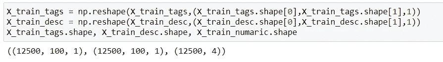
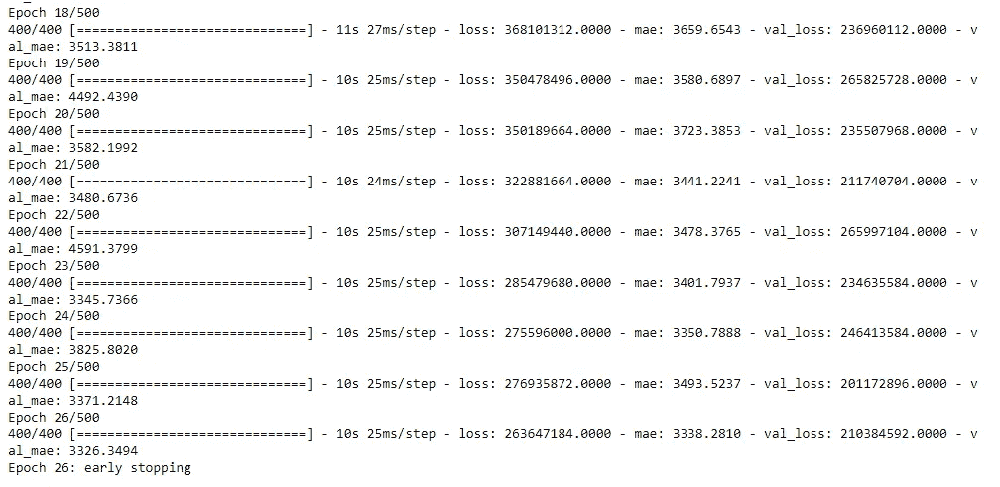
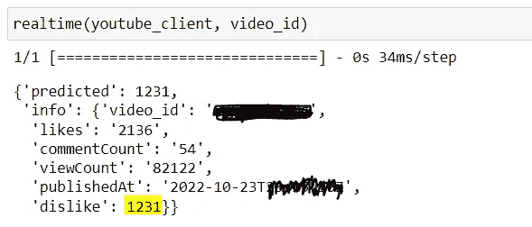

# YouTube 不喜欢实时预测——处理数据组合；实用指南

> 原文：<https://pub.towardsai.net/youtube-dislikes-prediction-in-real-time-working-with-a-combination-of-data-a-practical-guide-fb7e88b0b445?source=collection_archive---------3----------------------->

大家好，这是一个有趣话题的实用指南；今天，我们将讨论如何处理混合数据的组合。当我们浏览数据集时，我们都经历过它，并且有不同数据类型的特征，并且想知道我们如何将两种类型结合起来，并使用它们来训练单个机器学习模型。今天，你有了简单的引导式答案。此外，为了让事情变得有趣，我们将训练一个机器学习模型，实时预测 youtube 不喜欢的东西。一年前，youtube 删除了它的不喜欢计数功能，这已经不足为奇了，也许我解决这个问题有点晚了，但我们今天使用的数据集肯定会满足我们今天的学习需求。请记住，由于 youtube 不喜欢是一个数字，我们正在解决一个**回归问题**。🙂

**目录**

1.  [加载数据](#cf4c)
2.  [数据预处理](#ecae)
3.  [建模和训练](#66e8)
4.  [评估](#7647)
5.  [实时预测](#e52c)

**你将学到什么**

*   处理混合数据
*   清除文本数据
*   处理文本和数字数据
*   Keras TensorFlow 功能 API
*   LSTM (RNN)
*   创建同时处理不同类型数据的模型
*   如何检查回归模型的准确性
*   Youtube API

***现实*** *:在 youtube 中，一个视频能够获得的浏览量、喜欢和不喜欢取决于很多东西，比如创作者的受欢迎程度、视频的质量、SEO、用户份额，以及其他很多超出我们可用数据集的大腿。不管怎样，让我们尽力发挥我们所拥有的一切😁*

***注:*** *在整个教程中，如果我错过了什么，我会提到你可以做什么和如何做来改进这个模型，以及我在创建这个模型时错过的东西。说到添加库，我们将按需添加，而不是一次性导入所有库*

**我们开始吧……**

您可以在[https://www . ka ggle . com/datasets/dmitrynikolaev/YouTube-unlesses-dataset](https://www.kaggle.com/datasets/dmitrynikolaev/youtube-dislikes-dataset)获取数据集

请下载数据集并将其提取到您的工作目录中。该数据集是一个包含 37422 个唯一 raw 的混合语言数据集，我们将通过使用数据集提供的视频 id 将其缩短为只有英语，这使得我们的数据集在处理前总共有 15835 个唯一 raw。这实际上是非常少的数据量。要解决这样的问题，请尝试通过处理其他语言来增加数据量，这肯定有助于提高模型的准确性。

***注意:*** *该数据集最后一次更新是在 2021 年 13 月 12 日，因此我们将假设这是提取该数据的日期，因为我们将使用该数据来处理时间段*

## **加载数据集并收集我们需要的特征**

希望你有。csv 文件在您的工作目录中，那么让我们使用 pandas 加载它，并将其缩短到只有英文，并从数据集中获得更多可用功能的详细信息。

导入一些库来开始

```
import numpy as np
import pandas as pd
import tensorflow as tf
```

加载数据集

```
dataset = pd.read_csv('youtube_dislike_dataset.csv')
dataset.head()
```

仅收集英文数据

```
file_US_ids = open("video_IDs/unique_ids_US.txt", "r")
US_ids = file_US_ids.read().splitlines()
dataset = dataset[dataset['video_id'].isin(US_ids)]
dataset.shape 
```

检查数据集的更多详细信息，例如要素的数据类型

```
dataset.info()
```


作者图片

数据集包含 12 个要素。我们将只使用其中的 7 个功能。这些功能描述如下:

**Video_id:** 唯一视频 id
**Title:**YouTube 视频标题
**Channel_id:** 发布者频道 id
**Channel _ Title:**频道名称
**发布时间:**视频发布日期
**View_count:** 视频在一段时间内获得的浏览量
**时间
**Comment_count:** 视频有
**标签的评论数**:视频标签为字符串
**描述:**视频描述
**评论:**视频评论列表为字符串**

好了，这里有所有可用的功能，现在让我们选择一些我们将在本实用指南中使用的功能。

我们将使用以下 7 个功能:
*查看计数，发布计数，喜欢，评论计数，标签，描述，不喜欢*

```
dataset = dataset[['view_count', 'published_at','likes', 'comment_count','tags','description','dislikes']]
```

在预处理阶段，我们将再创建一个特征，并从这里删除一个特征。老实说，使用标题和频道名称对模型来说是一个很大的改进，你可以试试。🙂

## 数据预处理

让我们从处理数据开始，在这一阶段，我们对数据集做了许多重要的事情，例如处理缺失值、创建相关的时间字段，以及清理和标记文本数据。我边做边多解释一下。

**处理缺失值**

数据集是相当棘手的，如果你只是寻找丢失的值( **nan** )你不会找到任何东西，这是因为在某种程度上，数据集没有任何丢失的值，因为所有的字段都填充了一个空字符串，所以处理这种情况下，我们将检查空字符串字段，其中没有一个单词，并将其转换为一个 **nan** 值，并再次检查，我敢肯定，我们现在会得到大量的空值。你猜怎么着？我们将删除它们，这将使我们的数据集总共达到 13536 raws，这是相当小的😂



作者图片

**创建新功能—处理时间**

上面，我提到我们将假设数据是在 2021 年 13 月 12 日提取的，这是日期开始起作用的时间。

我们将创建一个名为 **timesec** 的新特性，计算视频发布日期和提取时间之间的时间，以分钟为单位。

所以基本上: *timesec =提取日期-发布日期*

首先，我们将编写一个函数来计算两点之间的时间(以分钟为单位),并使用 pandas apply 方法来创建新要素。

用于计算以下时间间隔的函数:

```
from datetime import datetime
def calTime(time):
  start = datetime.strptime(time, '%Y-%m-%d %H:%M:%S')
  end =   datetime.strptime('13/12/2021 00:00:00', '%d/%m/%Y %H:%M:%S') # assuming this is the date that this dataset was extracted
  return np.round((end - start).total_seconds() / 60, 2)
```

使用 pandas apply 方法运行函数并创建新特征

```
dataset['timesec'] = dataset['published_at'].apply(calTime)
```

**清理文本特征**

我们将创建一个函数来清理我们的文本数据，然后执行一系列步骤来从中获取正确和重要的含义。

基本上，该功能将删除任何不必要的网址，标点符号，数字，停用词，并随机词，不在字典将被删除。它还将处理缩略词，并将单词词条化，最后，将全部转换为小写并返回处理后的字符串。我们将在一些库的帮助下完成这项工作，所以让我们从导入这些库开始。

为此导入所需的库

```
import re
from string import punctuation 
from bs4 import BeautifulSoup
import nltk
nltk.download('stopwords')
nltk.download('wordnet')
nltk.download('omw-1.4')
nltk.download('words')

from nltk.corpus import stopwords
from nltk.stem import WordNetLemmatizer
```

缩略词词典将有助于将两个词的组合转换成它们单独的词根。(这不是全部，还有更多)

```
contraction_map={
    "ain't": "is not",
    "aren't": "are not",
    "can't": "cannot",
...
}
```

我们创建的清理文本的函数

```
 lemmatizer = WordNetLemmatizer()
in_words = set(nltk.corpus.words.words())
def clean_text(text):
    text = str(text)
    text = BeautifulSoup(text, "lxml").text
    text = re.sub(r'\([^)]*\)', '', text)
    text = re.sub('"','', text)
    text = ' '.join([contraction_map[t] if t in contraction_map else t for t in text.split(" ")])
    text = re.sub(r"'s\b","",text)
    text = re.sub("[^a-zA-Z]", " ", text)
    text = " ".join(w for w in nltk.wordpunct_tokenize(text) if w.lower() in in_words or not w.isalpha())

    text = [word for word in text.split( ) if word not in stopwords.words('english')]
    text = [lemmatizer.lemmatize(word) for word in text]
    text = " ".join(text)
    text = text.lower()
    return text
```

最后，在运行该函数后，创建两个新列，并清除其中的文本

```
%time dataset['clean_description'] = dataset['description'].apply(clean_text)
%time dataset['clean_tags'] = dataset['tags'].apply(clean_text)
```

**拆分数据**

因为我们使用不同的数据类型，所以使用通常的 train_test_split 函数并不理想，所以我们将首先通过训练和测试在切片的帮助下分割数据，然后我们将从训练和测试数据中分离 X 和 Y，然后将文本和数字特征分离，我们将保持标签和描述分离，但将所有数字特征保持为一个。这可能会令人困惑，让我们看看代码，这将使事情变得清晰。

***注:*** *Y 是厌恶特征，也是我们的目标变量。而 X 将是视图计数、喜欢、评论计数、时间间隔、清理标签、清理描述。我们不需要 published_at 特性。*

切片来训练和测试

```
# Slicing to train and test
dataset_train = dataset.iloc[:12500,:]
dataset_test = dataset.iloc[12501:,:]

# Creating X and Y variables of train dataset
X_train = dataset_train.loc[:, dataset.columns != 'dislikes']
Y_train = dataset_train['dislikes'].values

#Creating X and Y variables of the test dataset
X_test = dataset_test.loc[:, dataset.columns != 'dislikes']
Y_test = dataset_test['dislikes'].values

# Splitting and organizing the features of train data
X_train_numaric = X_train[['view_count', 'likes', 'comment_count', 'timesec']].values
X_train_tags = X_train['clean_tags'].values
X_train_desc = X_train['clean_description'].values

# Splitting and organizing the features of the test data
X_test_numaric = X_test[['view_count', 'likes', 'comment_count', 'timesec']].values
X_test_tags = X_test['clean_tags'].values
X_test_desc = X_test['clean_description'].values 
```

**文本标记化——处理文本**

在这里，我们将创建一个函数来标记化函数，以处理我们的文本特征。该函数将创建一个标记器并标记单词，并将向其添加 100 的填充，并将返回一组有用的信息，如已处理的测试和训练数据、最大单词数、词汇及其大小，以及我们稍后将用于进行实时预测的标记器本身。
我们将不得不在标签和描述功能上使用它。

让我们来看看代码。🙂

为此导入所需的库

```
from tensorflow.keras.preprocessing.text import Tokenizer 
from tensorflow.keras.preprocessing.sequence import pad_sequences
```

进行处理的函数

```
def Tokenizer_func(train,test, max_words_length=0, max_seq_len=100):
    tokenizer = Tokenizer()
    tokenizer.fit_on_texts(train)

    max_words = 0
    if max_words_length > 0:
        max_words = max_words_length
    else:
        max_words = len(tokenizer.word_counts.items())

    tokenizer = Tokenizer(num_words=max_words)
    tokenizer.fit_on_texts(train)

    train_sequences = tokenizer.texts_to_sequences(train)
    test_sequences = tokenizer.texts_to_sequences(test)

    train = pad_sequences(train_sequences,maxlen=max_seq_len, padding='post')
    test = pad_sequences(test_sequences,maxlen=max_seq_len, padding='post')

    voc = tokenizer.num_words +1
    return {'train': train, 'test': test, 'voc': voc, 'max_words':max_words, 'tokenizer': tokenizer}
```

为标签调用函数

```
X_tags_processed = Tokenizer_func(X_train_tags,X_test_tags)
# Extracting data from it…
X_train_tags,X_test_tags,x_tags_voc,x_tags_max_words,x_tag_tok = X_tags_processed['train'], X_tags_processed['test'],X_tags_processed['voc'],X_tags_processed['max_words'],X_tags_processed['tokenizer']
```

调用函数进行描述

```
X_desc_processed = Tokenizer_func(X_train_desc,X_test_desc)
# Extracting data from it…
X_train_desc, X_test_desc,x_desc_voc,x_desc_max_words,x_desc_tok = X_desc_processed['train'], X_desc_processed['test'],X_desc_processed['voc'],X_desc_processed['max_words'],X_desc_processed['tokenizer']
```

在结束本教程的处理步骤之前，我们还有一件事要做。

**数值数据规范化**

为此，我们将使用 StandardScaler 来标准化训练和测试数据。好吧，让我们看看代码。
导入库，创建缩放器，并使用它处理数字数据

```
from sklearn.preprocessing import StandardScaler
Sc = StandardScaler()
X_train_numaric = Sc.fit_transform(X_train_numaric)
X_test_numaric = Sc.transform(X_test_numaric)
```

**耶..**我们已经完成了一半…数据预处理到此结束。🎉🎉🎉

## 创建模型和培训

在这里，我们将使用 Keras functional API 来创建一个机器学习模型，我们将构建一种称为 LSTM 的 RNN 来处理文本数据，然后将其连接到带有数值数据的 MLP。我不打算在这里解释 LSTM，因为我已经在之前的一篇文章中介绍过了，链接在这里…

[](https://medium.com/@nafiu.dev/stock-market-prediction-using-lstm-will-the-price-go-up-tomorrow-practical-guide-d1df2d54a517) [## 用 LSTM 预测股票市场:明天价格会上涨吗？实用指南

### 本教程的目标是创建一个机器学习模型来预测股票交易的未来价值

medium.com](https://medium.com/@nafiu.dev/stock-market-prediction-using-lstm-will-the-price-go-up-tomorrow-practical-guide-d1df2d54a517) 

**请允许我在这里解释一下我们的模型:**

模型中有 3 个输入:标签输入、输入形状为 none 的描述输入和输入大小为 4 的数值输入，因为我们有 4 个数值特征。标签和描述都以嵌入层开始，然后是两个单位为 100 的 LSTM 层(记得我们添加了 100 作为填充)，随后是每个 LSTM 之后的归一化层。对于这两个要素，第一个 LSTM 图层的落差为 0.2，返回序列设置为 true，第二个图层的落差为 0.4，返回序列设置为 false。在通过这些层之后，标签和描述都与数字数据输入相结合，然后通过 4 个密集层，单位为 256、128、32 和 1，前 3 层具有 **relu** 激活函数，最后一层具有线性激活函数(因为问题是回归)。接下来，使用 **model.compile()** 方法编译整个模型，将 mean_squared_error 设置为损失函数，将 mean_absolute_error 设置为矩阵，将 adam 设置为优化器，因为 adam 函数的学习率降低到 0.001。然后最后我们可以使用 **model.summary()** 方法查看模型的概要。

让我们查看代码…

为此导入所需的库。

```
from keras.models import Model
from tensorflow.keras.layers import Input, LSTM, Embedding, Dense, concatenate,LayerNormalization
from keras.optimizers import Adam
from keras.callbacks import EarlyStopping
```

创建模型

```
tagsInput = Input(shape=(None,), name='tags')
descInput = Input(shape=(None,), name='desc')
numaricInput = Input(shape=(4,), name='numaric')

tags = Embedding(input_dim=x_tags_voc,output_dim=8,input_length=x_tags_max_words)(tagsInput)
tags = LSTM(100,dropout=0.2, return_sequences=True)(tags)
tags = LayerNormalization()(tags)
tags = LSTM(100,dropout=0.4, return_sequences=False)(tags)
tags = LayerNormalization()(tags)

desc = Embedding(input_dim=x_desc_voc,output_dim=8,input_length=x_desc_max_words)(descInput)
desc = LSTM(100,dropout=0.2, return_sequences=True)(desc)
desc = LayerNormalization()(desc)
desc = LSTM(100,dropout=0.4, return_sequences=False)(desc)
desc = LayerNormalization()(desc)

combined = concatenate([tags, desc,numaricInput])
x = Dense(256,activation='relu')(combined)
x = Dense(128,activation='relu')(x)
x = Dense(32,activation='relu')(x)
x = Dense(1,use_bias=True,activation='linear')(x)
model = Model([tagsInput, descInput,numaricInput], x)
```

编译模型

```
model.compile(loss='mean_squared_error', optimizer=Adam(learning_rate=0.001, decay=0.001 / 20), metrics=['mae'])
```

现在让我们使用 model.sumary()方法来查看模型的概要



作者图片

现在是时候训练我们的模型了。我们将在 500 个时期下训练我们的模型，批量大小为 25，验证分割为 2 %,因为我们在它接近 500 个时期之前可能已经完成了训练。

在开始训练我们的模型之前，还有一件事我们必须做。LSTM 支持三维数据，但我们的数据是二维的，所以我们必须在开始训练前将其转换成三维数据

初始化 EarlyStopping 以避免在训练模型时过度拟合

```
es = EarlyStopping(monitor='val_loss', mode='min', verbose=1, patience=20)
```

将数据整形为三维数据

```
X_train_tags = np.reshape(X_train_tags,(X_train_tags.shape[0],X_train_tags.shape[1],1))
X_train_desc = np.reshape(X_train_desc,(X_train_desc.shape[0],X_train_desc.shape[1],1))
X_train_tags.shape, X_train_desc.shape, X_train_numaric.shape
```



作者图片

训练模型

```
history = model.fit(
                    x=[X_train_tags, X_train_desc,X_train_numaric],
                    y=Y_train,
                    epochs=500, 
                    batch_size=25,
                    validation_split=0.2,
                    verbose=1,
                    callbacks=[es]
                  )
```



作者图片

在这里，我们可以看到我们的模型在达到 26 个纪元后就停止了训练。

## 评估我们的模型

现在，我们的模型已经完成了训练，是时候检查结果了，但在此之前，让我们回答一个简单的问题，并了解一些重要的事情。
**如何检查回归模型的准确性？**

**残差** —预测值与实际值之差。

**平均绝对误差** —预测值与实际值之间的残差的平均值。

*   MAE 越低，模型越好。
*   **MAE** 通过添加残差并除以数据集(测试数据)的长度来计算
*   描述平均而言预测值与实际值的接近程度。

**均方误差** —显示回归线与一组数据点的接近程度

**均方根误差**——是所有误差平方值的平均值的平方根

*   指示模型相对于给定数据的绝对拟合度
*   **RMSE** 与**梅伊**有关系
*   如果**的 RMSE** 值远远高于**的 MAE** ，则意味着数据集中一些较大误差的结果。

**R 平方** —显示数据与模型的吻合程度

*   输出 0 到 1 范围内的值
*   R2**越高，模型越好**
*   **R2** 分数值可用于通过乘以数值* 100 得到与分类模型相同的模型的精确度

**要点:**

*   **R2** 肯定高
*   MSE 越低，模型越好
*   MAE 越低，模型越好
*   RMSE 越低，模型越好
*   **MAE** 应低于 **RMSE**

现在让我们在我们的项目中实现这些，看看模型的结果。我们可以通过使用下面的代码来做到这一点

```
pprydd = model.predict([X_test_tags, X_test_desc, X_test_numaric])
from sklearn import metrics
print("Mean Absolute Error (MAE) - Test data : ", metrics.mean_absolute_error(Y_test, pprydd))
print("Mean Squared Error (MSE) - Test data : ", metrics.mean_squared_error(Y_test, pprydd))
print("Root Mean Squared Error (RMSE) - Test data : ", np.sqrt(metrics.mean_squared_error(Y_test, pprydd)))
print("Co-efficient of determination (R2 Score): ", metrics.r2_score(Y_test, pprydd))
```

我们可以看到我们的模型的 **R2** 得分为 0.82 (82%)，但是我们也可以看到我们的 **MSE** 非常高，这不是一个好的迹象😥。我们可以看到 **MAE** 和 **RMSE** 与 **MSE、**相比都非常低，这很好，但是 **RMSE** 高于 **MAE、**，这实际上表明了我们数据集中一些错误的结果🤕…不是世界上最好的模型，但在我看来，与我们现有的可用数据相比，这已经不错了。

注意:你可以通过对这个领域做更多的研究来尝试改进这个模型，比如当你对视频越来越不喜欢的时候，你需要依赖什么，并关注它。此外，尝试使用我们在本教程中没有使用的功能…无论如何，让我们继续。

## 实时预测

现在，我们都在等待实时预测 youtube 不喜欢的部分。为此，我们将使用 youtube API 按 id 获取目标视频数据，并从中收集所需的数据，对其进行处理并通过模型运行。为了使事情变得简单，我们将编写一个函数来使这一切同时发生。
让我们看看代码。:)

导入所需的库

```
import googleapiclient.discovery
```

创建 youtube 客户端

```
DEVELOPER_KEY = 'YOUR_API_KEY' 
youtube_client = googleapiclient.discovery.build('youtube', 'v3', developerKey=DEVELOPER_KEY)
```

该写函数了。让我解释一下这是如何工作的。
一旦收到数据，我们将从中提取所需的字段

对于这两个文本字段，文本将使用之前创建的清理函数进行清理，然后通过我们之前创建的标记器进行处理，最后，填充将被添加到文本中。

将使用 next 函数计算 timesec 字段。在这个函数中，它将获取目标视频发布日期和今天之间的时间段(以分钟为单位)。

接下来，所有数字特征将通过缩放器进行归一化。一旦处理完成，那么我们将通过传递模型来预测对视频的不喜欢程度，该函数将在一些其他有用的信息中返回预测的不喜欢数量。

```
def realtime(youtube,video_id):
  def calTimesss(time):
    start = datetime.strptime(time, '%Y-%m-%dT%H:%M:%S%z')
    end =   datetime.now()
    return np.round((end - start.replace(tzinfo=end.tzinfo)).total_seconds() / 60, 2)
  request = youtube.videos().list(part="snippet, statistics",id=video_id)
  response = request.execute()

  desc = response['items'][0]['snippet']['description']
  desc  =[clean_text(desc)]
  desc = x_desc_tok.texts_to_sequences(desc)
  desc = pad_sequences(desc,maxlen=100, padding='post')

  tags = response['items'][0]['snippet']['tags']
  tags=(" ".join(tags))
  tags  =[clean_text(tags)]
  tags = x_tag_tok.texts_to_sequences(tags)
  tags = pad_sequences(tags,maxlen=100, padding='post')

  publishedAt = response['items'][0]['snippet']['publishedAt']
  timesec = calTimesss(publishedAt)
  viewcount = response['items'][0]['statistics']['viewCount']
  likeCount = response['items'][0]['statistics']['likeCount']
  commentCount = response['items'][0]['statistics']['commentCount']
  numaricdata = [[viewcount, likeCount,commentCount,timesec]]
  numaricdata = Sc.transform(numaricdata)

  pryd = model.predict([tags, desc, numaricdata])

  return {"predicted": int(pryd[0][0]), "info": {
      "video_id": video_id,
      "likes": likeCount,
      "commentCount": commentCount,
      "viewCount": viewcount,
      "publishedAt": publishedAt,
      "dislike": int(pryd[0][0]),
  }}
```

现在让我们运行它，让我们看看结果…

```
video_id = "videoid"
realtime(youtube_client, video_id)
```



作者图片

**哈哈**，成功了😂 🎉。根据模型，这个视频有 *1231* 个磁盘。**哎哟**，很多讨厌的人😟

好了，这是关于使用组合数据的教程的结尾，很有趣，希望你喜欢。也希望你会尝试改善这种模式…继续学习🙂

**链接 GitHub repo**:[https://GitHub . com/na FIU-dev/YouTube _ dislike _ prediction _ practice](https://github.com/nafiu-dev/youtube_dislike_prediction_practice)

**你可以在这里和我联系:**

[https://www.instagram.com/nafiu.dev](https://www.instagram.com/nafiu.dev)

**领英**:[https://www.linkedin.com/in/nafiu-nizar-93a16720b](https://www.linkedin.com/in/nafiu-nizar-93a16720b)

我的其他帖子:

[](https://medium.com/@nafiu.dev/end-to-end-full-stack-project-from-backend-frontend-and-machine-learning-to-ethical-hacking-series-3e53779e5aff) [## 从后端、前端和机器学习到道德黑客的端到端全栈项目…

### 嗨，欢迎大家参加这个从后端开发、前端开发到构建端到端项目的系列

medium.com](https://medium.com/@nafiu.dev/end-to-end-full-stack-project-from-backend-frontend-and-machine-learning-to-ethical-hacking-series-3e53779e5aff) [](/create-a-boolean-image-classifier-fast-with-any-data-set-with-a-brief-explanation-of-the-4b1265b5b33f) [## 创建一个布尔图像分类器快速与任何数据集，并简要说明了…

### 大家好，在本帖中，我们将探讨一种叫做卷积神经网络的神经网络…

pub.towardsai.net](/create-a-boolean-image-classifier-fast-with-any-data-set-with-a-brief-explanation-of-the-4b1265b5b33f) [](https://medium.com/@nafiu.dev/highlighting-the-most-popular-machine-learning-algorithms-implementing-it-4bf18b645163) [## 突出最流行的机器学习算法；实施它

### 概述最流行的机器学习模型，使用 iris 数据集实现和比较准确性

medium.com](https://medium.com/@nafiu.dev/highlighting-the-most-popular-machine-learning-algorithms-implementing-it-4bf18b645163)