# Z-统计量，T-统计量，P-统计量还在迷惑你？

> 原文：<https://pub.towardsai.net/z-statistics-t-statistics-p-statistics-are-still-confusing-you-87557047e20a?source=collection_archive---------0----------------------->

## [统计数据](https://towardsai.net/p/category/statistics)

## 机器学习统计学中的定义和概念

由[露丝·齐默曼](https://unsplash.com/@ruthson_zimmerman?utm_source=medium&utm_medium=referral)在 [Unsplash](https://unsplash.com?utm_source=medium&utm_medium=referral) 上拍摄的照片

对于数据科学和机器学习的人来说，理解统计学就像是一条并行的道路。但是学习统计学值得从数据中做出推论和解决方案。很多人不会走的路，应该是不得不以自己的日剂量接受统计。在本文中，我们将讨论 Z、T 和 P 统计分布，并尝试了解我们为什么在数据科学中使用它们。在深入这个概念之前，我们将讨论一些基本定义和术语，如下所示:

 [## 用 Python 全面解释线性回归

### 如何用一个真实的例子解决回归问题。

medium.com](https://medium.com/towards-artificial-intelligence/fully-explained-linear-regression-with-python-fe2b313f32f3) 

## 涵盖的主题:

**第 1 部分:**数据类型、直方图和散点图

**第 2 节:**中央测量值和传播测量值

**第三节:**协方差和相关性

**第 4 节:** Z，T —分布和置信区间

**第五节:**假设和 P-分布

## **第一节:**

> ***数据类型***

获取统计知识是数据科学职业生涯中的一项需求。在跳跃之前我们应该知道我们在和谁打交道哦！那是显而易见的“数据”。这并不是说数据会来到你面前并告诉你所有的推论，我们需要找到一种方法来处理不同类型的数据。

数据由可测量或可观察形式的数字和文字组成。我们不能对所有不同类型的数据进行相同的操作，为此我们需要识别，并据此进行测试和可视化。

***数字数据:*** 这类数据处理的数字可以是离散的，也可以是连续的。

*   离散数据就像一个整数(2、10、20、15 等)，它直接说明了我们容易计算的数量。
*   连续数据就像一个范围，指的是某个特定测量范围内的值(千克、千米、厘米等)。

***分类数据:*** 这种类型处理我们可以描述的定性数据。它以两种或两种以上不同描述的形式出现。

示例:二进制值(0 和 1)，

***名义数据:*** 它们不是按顺序而是显示一些组或类别，如季节、品牌名称、花名等。

***有序数据:*** 这些类型的数据是那些我们给它们一些评级或者按照某种顺序的数据。

> ***柱状图和散点图***

如果数据非常大，那么我们不能整天坐着检查每一行数据记录来获取一些信息。这就是图表和数据的来源。

不同类型的图有条形图、折线图、饼图、直方图和散点图等。

**直方图**

直方图虽然类似于条形图，但在直方图中，条形落在某个范围内，即连续型。条形图可以在两个条之间有一个间隙，但直方图没有。

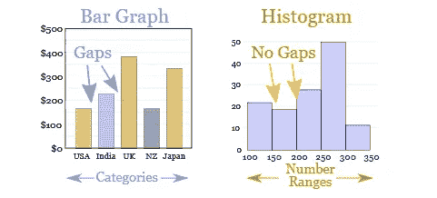

条形图和直方图的区别。来自 [mathisfun](https://www.mathsisfun.com/data/histograms.html) 的照片

**散点图**

散点图显示了记录中两个变量点之间的关系。

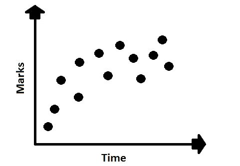

时间和标记之间的散点图。作者的照片

## **第二节:**

> ***中央措施值***

当我们想从大量的记录中了解一些东西时，我们选择一个与所有其他东西相似的东西。所以，在数字中，我们通过 ***选择一个常见的和左右的值，意思是*** 、 ***中位数*** 和 ***众数*** 。

> ***措施之差***

**范围**

当我们把数据按升序排列，从大的数到小的数做一个差，叫做 range。

**平均偏差**

这个分布告诉我们这些值离测量的中心值有多远。

*   首先，取一个平均值。
*   然后从平均值到所有值做一个差。
*   然后根据平均值计算扩散距离。

示例:

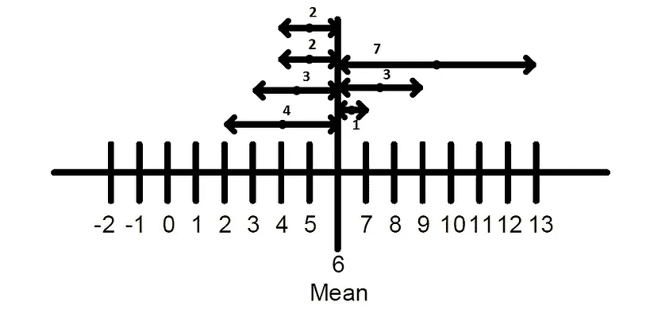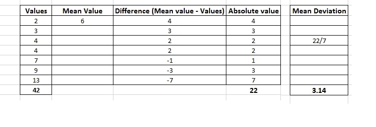

平均偏差。作者的照片

平均偏差= (4+3+2+2+1+3+7)/7 = 3.14

平均偏差表明，这些值平均距离中间值 3.14。

**方差和标准差**

方差是绝对值平方之和的平均值。它告诉我们数据是如何围绕平均值分布的。

标准差是简单平均值的分布。

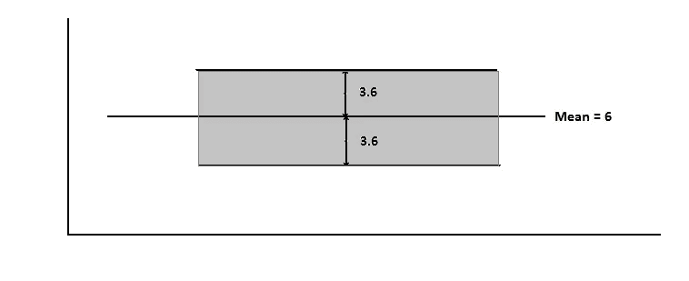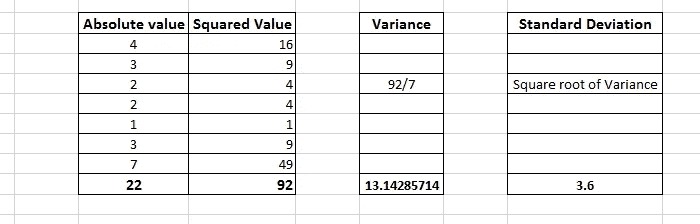

方差和标准差。作者的照片

如果我们在照片中看到 6+3.6 是 9.6，6-3.6 是 2.4，那么我们可以说从 2.4 到 9.6 的数字是标准的，但是如果我们看到值 13 在标准值范围之外。由此可以观察到哪些数字很小，哪些数字很大。

## **第三节:**

> ***协方差***

协方差用于计算两个变量的移动。结果，我们可以说两个变量一起运动，彼此相反或独立。正值表示一起移动，负值表示相反移动，等于零表示两者相互独立。

协方差> 0 →一起移动

协方差< 0 → moving opposite

Covariance = 0 → independent to each other

The formula to calculate covariance is

***协方差(样本)=总和((x-x 均值)* ( y-y 均值))/n-1***

该值可以是从 0.000824 到 23，434，000 的任何范围。为了解释这些类型的值，我们做了相关系数。

> ***相关***

相关性用于了解两个变量之间的关系。

以下类型是下图所示的相关性:

不同类型数据的相关关系。来自 [mathisfun](https://www.mathsisfun.com/data/correlation.html\) 的照片

## **第四节:**

分布是我们测量的概率，并通过图表看到概率分布，这就是我们看到推理统计的方式。

**正态分布**

在统计学术语中，正态分布有时被称为高斯分布。许多人也说这种分布是钟形曲线，因为均值、中值和众数是相等的，对称的，没有偏斜。

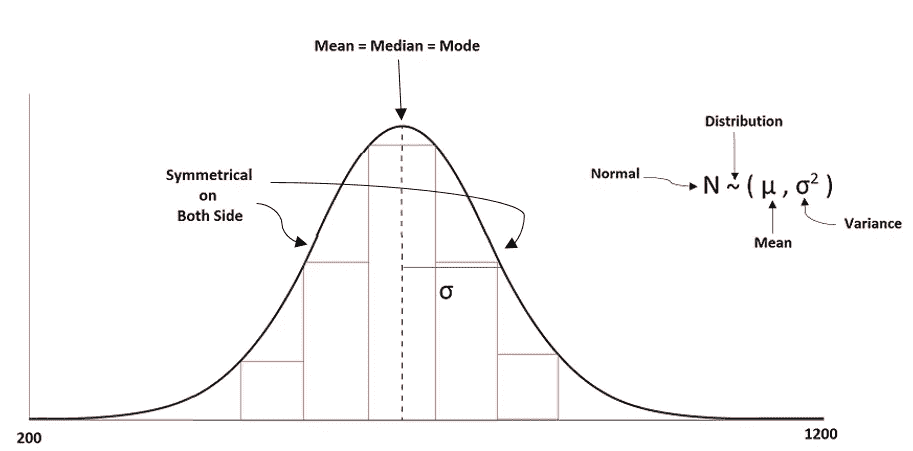

正态分布曲线。作者的照片

曲线的展宽由标准差定义。我们可以观察到，更多的观察值或数值是在平均值附近的中间值。如果我们将平均值改为一个更小和更大的值，那么我们会看到分布将向右和向左移动。如果我们改变标准差，那么分布会变宽或变窄。越窄意味着大部分观察围绕中心。

> ***Z—分布***

我们在分布中看到的均值和标准差的变化是不稳定的。所以，我们需要将其标准化，以便我们可以计算和做出推论。为了使其标准化，我们必须使平均值为“0”，标准偏差为“1”，即(0，1)。为了标准化，我们计算 z 分数，如下所示:

**z =(值—平均值)/标准差**

当我们计算所有 z 值的平均值和标准偏差时，它出现在 0 和 1 附近，仅获得标准正态分布。

> ***T —分布***

一般称之为学生 t 分布，用于对方差未知的小样本进行推断。正态分布和 t 分布的区别在于，t 分布在分布的左侧和右侧具有更高的离差。

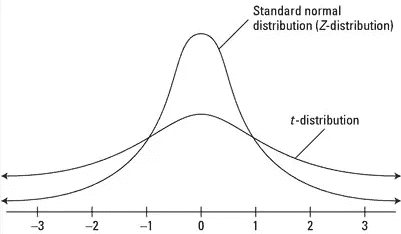

n 分布和 t 分布。作者的照片

t 分布的公式是

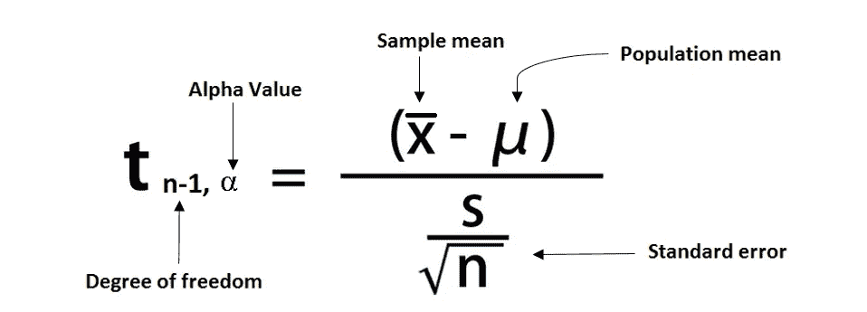

t 分布公式。作者的照片

在一个常见的 thumb 表中，我们使用一个 t-分布表来表示多达 50 个样本，如果样本量超过 50 则使用一个 z-分布表。

自由度是样本总数的减一。Alpha 是置信度百分比之后剩余的百分比。

> ***置信区间***

当我们用一种实用的方法对一个群体做一些精确的估计值时，它会出错。因此，我们寻求特定值的置信区间，在这个范围内。

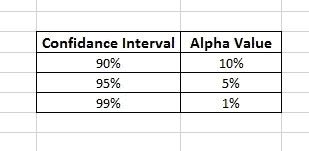

我们在照片中看到，我们可以用这些公共值和它们的 alpha 值来选择一个置信区间。

## **第五节:**

> ***假设***

当我们估计正确的置信区间时，我们试图在那个区间内找到值，这需要做出决定。假设检验是基于某些点进行的。

*   阐明一个假设
*   需要进行正确的测试
*   执行测试
*   决定

假设只是我们用来测试的想法或观念。有两种类型的假设。

1.  零假设
2.  替代假设

零假设是我们认为是一个参数的假设，其余的是另一个假设。当我们计算假设的 Z 值时，我们也基于α计算显著性值。分布的置信区间，并除以左右两侧的 alpha 值。

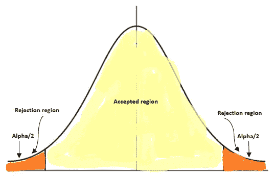

假设的区域。作者的照片

> ***P —分布***

p 值给出了较小的显著性水平，在此水平上我们可以拒绝样本数据的零假设。

## 结论:

对统计学的基本理解可以在数据科学中提供有价值的信息。相信我，统计学并不无聊。当你试图用实际例子来学习时，它会给你带来奇迹。由于统计学是一个非常庞大的学科，所以我试图给出一些基本的想法。希望这篇文章能给读者带来一点趣味。

我希望你喜欢这篇文章。通过我的 [LinkedIn](https://www.linkedin.com/in/data-scientist-95040a1ab/) 和 [twitter](https://twitter.com/amitprius) 联系我。

# 推荐文章

1.  [NLP —用 Python 从零到英雄](https://medium.com/towards-artificial-intelligence/nlp-zero-to-hero-with-python-2df6fcebff6e?sk=2231d868766e96b13d1e9d7db6064df1)

2. [Python 数据结构数据类型和对象](https://medium.com/towards-artificial-intelligence/python-data-structures-data-types-and-objects-244d0a86c3cf?sk=42f4b462499f3fc3a160b21e2c94dba6)

3. [MySQL:零到英雄](https://medium.com/towards-artificial-intelligence/mysql-zero-to-hero-with-syntax-of-all-topics-92e700762c7b?source=friends_link&sk=35a3f8dc1cf1ebd1c4d5008a5d12d6a3)