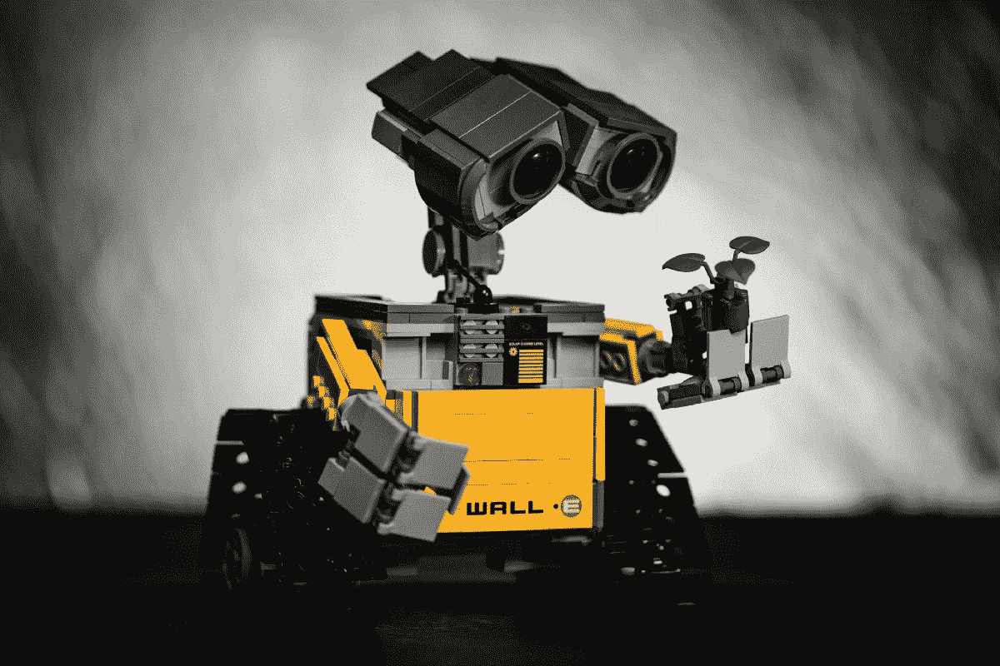
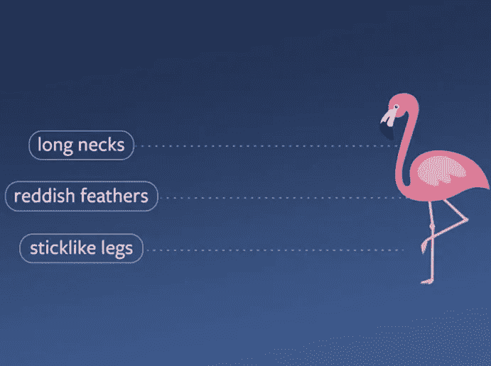
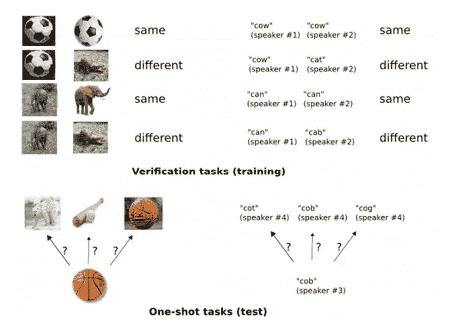

# 零投、一投、少投学习

> 原文：<https://pub.towardsai.net/zero-shot-one-shot-few-shot-learning-c3a0df9d4b27?source=collection_archive---------0----------------------->

## 理解不同类型的 N-Short 学习规则。

[梁杰森](https://unsplash.com/@ninjason?utm_source=medium&utm_medium=referral)在 [Unsplash](https://unsplash.com/?utm_source=medium&utm_medium=referral) 上的照片

> 我最近创办了一份专注于人工智能的教育时事通讯，已经有超过 125，000 名订户。《序列》是一份无废话(意思是没有炒作，没有新闻等)的 ML 导向时事通讯，需要 5 分钟阅读。目标是让你与机器学习项目、研究论文和概念保持同步。请通过订阅以下内容来尝试一下:

 [## 序列

### 与机器学习、人工智能和数据发展保持同步的最佳资源…

thesequence.substack.com](https://thesequence.substack.com/) 

机器学习市场的当前状态由监督学习算法主导，该算法需要大型标记数据集以实现任何形式的泛化。标记训练数据集中的依赖性代表了在许多情况下应用监督学习的限制。当我们惊讶于 DeepMind 的 AlphaGo 或 OpenAI 的 GPT-3 等模型的成就时，我们忘记了它们分别是用相当于数千年的人类围棋比赛或整个维基百科语料库训练的。有多少场景可以包含如此丰富的数据集？近年来，出现了新一代的深度学习方法，试图通过基于少数训练示例开发知识来消除大型训练数据集中的依赖性。从广义上讲，这些方法被称为 N-shot 学习。

N-shot 学习的灵感来自于人类从几个例子中归纳知识并在不同任务中重用它的认知能力。如果我们给婴儿看一个人的不同照片，他/她将能够在大量照片中认出同一个人。对这种能力的模仿已经在两个主要方向上占据了深度学习空间:

**可以在最小监督下学习的模型:**在这个组中，我们有自我监督或半监督学习之类的技术。

**可以用小训练数据集学习的模型:**这是 N-shot 学习技术代表的群体。

术语 N-shot 学习可以与不同的机器学习概念互换使用，这有时会导致混淆。尽管定义不严格，但大多数 N-shot 学习方法可以归入以下类别之一:

# 1)零射击学习

零射击学习(ZSL)解决了一类问题，其中学习者代理能够从训练期间没有看到的类中分类数据实例。值得注意的是，ZSL 不是一种无监督的学习形式。ZSL 模型是经过有效训练的监督方法，但是它们能够推断基本训练数据集之外的知识。

为了将 ZSL 放在上下文中，让我们使用在包含动物图像和文本描述的数据集上训练的图像分类器的例子。例如，数据集可以包含鸟类的图像和火烈鸟的文本描述。使用这两个数据向量，ZSL 模型能够有效地对火烈鸟的图像进行分类，即使它们不包括在训练数据集中。显然，这个例子需要一点多模态学习，因为代理必须理解图像和文本，但它清楚地说明了 ZSL 与无监督方法之间的区别。

图片来源:Meta AI

# 2)一次性学习

一次性学习(OSL)方法是使用每个目标类的一个或几个例子来训练的。这似乎有点未来派。深度学习模型如何在单个记录中训练，并归纳出一个分类模型？答案与这样一个事实有关，即 OSL 技术是在大型数据集中预先训练的，并学习关键特征，这些特征将使对以前只见过一次的新数据实例进行分类成为可能。

深入细节，OSL 训练分两个基本阶段完成。在第一阶段，训练 OSL 模型来确定一对实例是属于“相同”还是“不同”类。在该步骤之后，使用在第一步骤中产生的最大相似性概率，使用“相同/不同”预测来分类新实例。从本质上讲，OSL 模型从一个大的知识语料库开始，该语料库包含不同类别之间的相似性和差异性，并通过使用特定对象的单个实例进行训练来对其进行提炼。下图说明了这一过程:

图片鸣谢:[https://Connor short en 300 . medium . com/one-shot-learning-70bd 78 da 4120](https://connorshorten300.medium.com/one-shot-learning-70bd78da4120)

# 3)少投学习

顾名思义，少量多次学习(FSL)指的是监督学习模型，能够使用小的训练数据集来掌握一项任务。使用更正式的定义，FSL 可以被定义为一种 ML 问题，其中环境包含有限数量的具有给定任务的监督信息的例子。乍一看，FSL 与大规模标注数据集不可用的场景直接相关。再深入一点，有三种应用 FSL 方法的基本场景:

1) **模仿人类认知的模型:**人类擅长使用少量样本来掌握任务。从这个意义上说，FSL 是试图模仿人类认知的人工智能模型的重要组成部分。

2) **为罕见情况学习的模型:在**许多 ML 场景中，存在偏离规范的特定场景，这些场景不够规则，无法用传统的监督模型捕捉。这是 FSL 方法的经典场景。

3) **可以跨类似任务通用化的模型:**由于 FSL 模型不需要大量的训练数据，因此可以快速适应类似的场景。这已经成为 FSL 最务实的优势之一。

N-Shot 学习已经迅速成为现代深度学习方法中最重要的学科之一。如果没有别的，N-Shot 学习是最好的方法之一，类似于人类获取知识和掌握任务的方式。